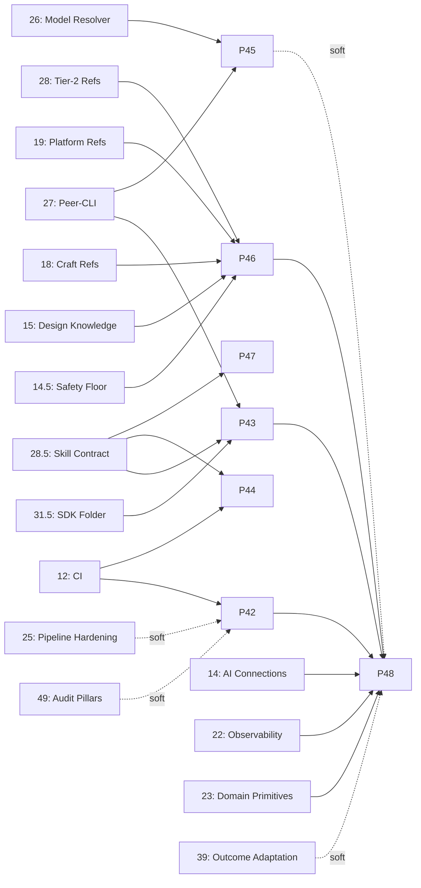

# Roadmap: get-design-done v3

## Overview

v3 transforms get-design-done from a linear pipeline into a GSD-style agent-orchestrated system.

**Pipeline shape (canonical, effective Phase 7):**

```
Brief → Explore → Plan → Design → Verify → (next phase)
```

- **Brief** — user states the design problem, audience, constraints, success metrics. Produces `.design/BRIEF.md`. New stage (pre-v3 pipeline had no formal intake — users ran `scan` cold).
- **Explore** — unifies former `scan` + `discover`. Inventory current system (via parallel mappers) AND gather context/references/decisions (via discussant + synthesizer + connections + sketch/spike findings). Produces `DESIGN.md`, `DESIGN-DEBT.md`, `DESIGN-CONTEXT.md`.
- **Plan** — unchanged. Produces `DESIGN-PLAN.md` with wave-ordered tasks.
- **Design** — unchanged. Atomic-commit execution.
- **Verify** — unchanged. Goal-backward verification + gap-response loop.
- **(next phase)** — `/gdd:next` routes to the next cycle/phase based on STATE.md. Closes the loop.

Phases 1–6 built the plugin under the legacy `scan → discover → plan → design → verify` layout. Phase 7 Wave A includes plan **07-00** to migrate the skill directory structure and stage labels to the new shape.

**Command namespace**: all user-facing commands are invoked as `/gdd:<name>` (short form). The plugin name `get-design-done` remains in manifests and install URLs; `gdd` is the command namespace exposed to users. Mechanism (plugin alias vs short_name vs namespace rename) to be decided during plan 07-00.

Each stage is a thin orchestrator that spawns specialized agents — modeled on GSD's planner/executor/verifier/checker pattern. Phase 1 lays the foundation (cross-platform bash, distribution cleanup, explicit state machine, agent + connection scaffolding). Phase 2 builds the 5 core agents and rewrites the stages to use them. Phase 3 adds 6 quality-gate agents plus clears the existing polish backlog. Phase 4 formalizes Figma and Refero as connections with a plug-in model for future ones. Phase 5 ships 3 automation agents plus the three new commands (style, darkmode, compare). Phase 6 validates and ships the renamed plugin as **get-design-done v1.0.0** (version reset on rename — the `3.0.0` seen in early planning docs referred to the legacy `ultimate-design` codebase). Phase 7 is the GSD parity + exploration phase — adds the design-discussant agent, progress/health/todo/pause/resume commands, parallel codebase mappers, research synthesizer, audit-cycle + validate-cycle, model profiles, the roadmap/milestone abstraction layer, light upstream parity (forensic audit, `--all`, parallel discuss, Socratic refinement, read-injection scanner, agent size-budget), AND the sketch/spike exploration flow with project-local skills at `./.claude/skills/` that codifies findings and auto-loads into future sessions. Phase 8 adds visual-truth + design-side-write connections + the Graphify knowledge-graph connection — Preview/Playwright, Storybook + Chromatic, figma-writer (proposal→confirm wrapping `use_figma`), and connections/graphify.md for pre-search context. Phase 9 integrates Claude Design (Anthropic Labs) as a first-class connection and adds Pinterest MCP as a reference source. Phase 10 builds the native knowledge layer (`.design/intel/` queryable store, dependency analysis, skill manifest, learnings extraction, architectural responsibility mapping, flow diagrams, context-exhaustion auto-recording) — the memory infrastructure downstream phases depend on. Phase 10.1 (INSERTED decimal phase, ships as v1.10.1) lands the optimization layer + cost governance — a `gdd-router` skill, `gdd-cache-manager` with `/gdd:warm-cache`, `.design/budget.json` + a PreToolUse hook enforcing model tiers and caps, lazy checker spawning, streaming synthesizer pattern, `.design/telemetry/costs.jsonl` + `.design/agent-metrics.json`, and `/gdd:optimize` recommendations — targeting 50–70% per-task token-cost reduction while preserving the quality floor. Phase 11 closes the improvement loop on top of Phases 10 + 10.1 — post-cycle reflector consuming learnings + telemetry, frontmatter feedback loop, reference-file proposal generator, budget-config feedback, discussant question-quality learning, and a global skills layer at `~/.claude/gdd/global-skills/`. Phase 12 ships the test suite (ported GSD patterns + gdd-unique coverage including optimization-layer enforcement + regression baselines). Phase 13 layers full CI/CD on top — cross-platform matrix validation, lint, schema checks, security scanning, branch protection, and release automation that auto-tags, auto-releases from CHANGELOG, and smoke-tests freshly-installed tagged versions. Phase 14 integrates AI-native design tools (**paper.design** + **pencil.dev**) via their MCP servers, adds paper/pencil writer agents following the figma-writer proposal→confirm pattern, and defines a unified canvas-connection interface so future tools (Subframe, v0.dev, Galileo AI, Builder.io Visual Copilot, Locofy, Anima, Plasmic, TeleportHQ) plug in via the same contract — closing the **canvas → code → verify → canvas** round-trip.

**Naming convention**: commands documented as `/gdd:<name>` (short form). Full plugin name remains `get-design-done` in manifests and install URLs; `gdd` is the command invocation short form.

## Phases

**Phase Numbering:**
- Integer phases (1, 2, 3): Planned milestone work
- Decimal phases (2.1, 2.2): Urgent insertions (marked with INSERTED)

Decimal phases appear between their surrounding integers in numeric order.

**Status legend:** [x] shipped (with version + date) · [ ] planned (with target version) · INSERTED = decimal phase added between shipped integers.

**Each entry links to its full spec in [Phase Details](#phase-details) below.**

### Shipped (v1.0.0 → v1.27.1)

- [x] [Phase 1](#phase-1-foundation--distribution--infrastructure) — Foundation + Distribution + Infrastructure — 2026-04-17
- [x] [Phase 2](#phase-2-core-agents--stage-orchestration) — Core Agents + Stage Orchestration — 2026-04-17
- [x] [Phase 3](#phase-3-quality-gate-agents--pipeline-polish) — Quality Gate Agents + Pipeline Polish — 2026-04-17
- [x] [Phase 4](#phase-4-connections-layer) — Connections Layer — 2026-04-17
- [x] [Phase 5](#phase-5-automation-agents--new-commands) — Automation Agents + New Commands — 2026-04-17
- [x] [Phase 6](#phase-6-validation--version-bump) — Validation + Version Bump — v1.0.0 — 2026-04-18
- [x] [Phase 7](#phase-7-gsd-parity--exploration--discussant-ergonomics-sketchspike-architecture-uplift) — GSD Parity + Exploration — v1.0.1 — 2026-04-18
- [x] [Phase 8](#phase-8-visual--design-side-connections--knowledge-graph) — Visual + Design-Side Connections + Knowledge Graph — v1.0.2 — 2026-04-18
- [x] [Phase 9](#phase-9-claude-design-integration--pinterest-connection) — Claude Design Integration + Pinterest Connection — v1.0.3 — 2026-04-18
- [x] [Phase 10](#phase-10-knowledge-layer) — Knowledge Layer — v1.0.4 — 2026-04-18
- [x] [Phase 10.1](#phase-101-optimization-layer--cost-governance-inserted) — Optimization Layer + Cost Governance — INSERTED — v1.0.4.1 (CHANGELOG-only) — 2026-04-18
- [x] [Phase 11](#phase-11-self-improvement) — Self-Improvement — v1.0.5 — 2026-04-18
- [x] [Phase 12](#phase-12-test-coverage) — Test Coverage — v1.0.5 — 2026-04-18
- [x] [Phase 13](#phase-13-cicd) — CI/CD — v1.13.0 — 2026-04-18
- [x] Phase 13.1 — Figma MCP Consolidation — INSERTED — v1.13.1 — 2026-04-19 *(overview-only; no separate `### Phase Details` entry — folded into Phase 14 history)*
- [x] [Phase 13.2](#phase-132-external-authority-watcher) — External Authority Watcher — INSERTED — v1.13.2 — 2026-04-19
- [x] Phase 13.3 — Plugin Update Checker — INSERTED — v1.13.3 — 2026-04-19 *(overview-only; spec in commit ee4c56e era — no `### Phase Details` entry)*
- [x] [Phase 14](#phase-14-ai-native-design-tool-connections) — AI-Native Design Tool Connections — v1.14.0 — 2026-04-19
- [x] [Phase 14.5](#phase-145-safety--recall-floor-inserted) — Safety + Recall Floor — INSERTED — v1.14.6 *(slot v1.14.5 burned by a Preview MCP fix)* — 2026-04-24
- [x] [Phase 14.6](#phase-146-test-coverage-completion-inserted) — Test Coverage Completion — INSERTED — v1.14.6 — 2026-04-24
- [x] [Phase 14.7](#phase-147-first-run-proof-path-inserted) — First-Run Proof Path — INSERTED — v1.14.8 *(slot v1.14.7 burned by an interim patch)* — 2026-04-24
- [x] [Phase 15](#phase-15-design-knowledge-expansion--foundational-references--micro-polish--uupm-ingest--impeccable-removal) — Design Knowledge Expansion — v1.15.0 — 2026-04-24
- [x] [Phase 16](#phase-16-component-benchmark-corpus--tooling--waves-12) — Component Benchmark Corpus (Tooling + Waves 1–2) — v1.16.0 — 2026-04-24
- [x] [Phase 17](#phase-17-component-benchmark-corpus--waves-35--pipeline-integration) — Component Benchmark Corpus (Waves 3–5 + Pipeline Integration) — v1.17.0 — 2026-04-24
- [x] [Phase 18](#phase-18-advanced-craft-references--motion-typography-layout-engines-motion-vocabulary) — Advanced Craft References — v1.18.0 — 2026-04-24
- [x] [Phase 19](#phase-19-platform-inclusive-design--ux-research-references) — Platform, Inclusive & UX Research References — v1.19.0 — 2026-04-24
- [x] [Phase 19.5](#phase-195-cross-cycle-memory--recall-checkpoints-experience-archive-inserted) — Cross-Cycle Memory — INSERTED — v1.19.5 — 2026-04-24
- [x] [Phase 19.6](#phase-196-design-philosophy-layer--first-principles-emotional-design-rams--disney-lenses-inserted) — Design Philosophy Layer — INSERTED — v1.19.6 — 2026-04-24
- [x] [Phase 20](#phase-20-gdd-sdk-foundation--state-core-lockfiles-mutation-events-stage-migration) — GDD SDK Foundation — v1.20.0 — 2026-04-24
- [x] [Phase 21](#phase-21-gdd-sdk-headless--pipeline-runner-parallel-researchers-cross-harness-mcp) — GDD SDK Headless — v1.21.0 — 2026-04-24
- [x] [Phase 22](#phase-22-gdd-sdk-observability--event-stream-transports-telemetry-integration-self-improvement-wiring) — GDD SDK Observability — v1.22.0 — 2026-04-25
- [x] [Phase 23](#phase-23-gdd-sdk-domain-primitives--knowledge-layer-sdk-visual--token-engines-distribution) — GDD SDK Domain Primitives — v1.23.0 — 2026-04-25
- [x] [Phase 23.5](#phase-235-no-regret-adaptive-layer-inserted) — No-Regret Adaptive Layer — INSERTED — v1.23.5 — 2026-04-25
- [x] [Phase 24](#phase-24-multi-runtime-installer--interactive-terminal-ui--per-runtime-entry-points) — Multi-Runtime Installer — v1.24.0 — 2026-04-25
- [x] [Phase 25](#phase-25-pipeline-hardening--prototype-gate-complexity-buckets-quality-gate-turn-closeout) — Pipeline Hardening — v1.25.0 — 2026-04-29
- [x] [Phase 26](#phase-26-headless-model-resolver--runtime-aware-tier-mapping) — Headless Model Resolver — v1.26.0 — 2026-04-29
- [x] [Phase 27](#phase-27-peer-cli-delegation-layer--outbound-acpasp-workers) — Peer-CLI Delegation Layer — v1.27.0 (+ v1.27.1 wiring patch) — 2026-04-30 / 2026-05-02

### Planned (v1.27.5 → v1.49.0)

> **Numbering**: phase numbers are *positional labels*, target versions are monotonic semver. Phase X.Y always ships at v1.X.Y. New decimal phases inserted on 2026-05-16 fill gaps surfaced by the roadmap audit.
>
> **Split-phase legend**: Phases 34, 36, 37, 38, 40 each fan out into sub-phases (e.g., 34.1/34.2/34.3) at plan-phase time — see body for the split plan.

- [x] [Phase 27.5](#phase-275-bandit-production-integration-inserted) — Bandit Production Integration — INSERTED — v1.27.5
- [x] [Phase 27.6](#phase-276-pipeline-performance--token-cost-optimization-inserted) — Pipeline Performance + Token-Cost Optimization — **NEW (INSERTED 2026-05-16)** — v1.27.6
- [x] [Phase 27.7](#phase-277-gdd-mcp-server-inserted) — GDD MCP Server — **NEW (INSERTED 2026-05-17)** — v1.27.7 — 2026-05-18
- [x] [Phase 28](#phase-28-foundational-references-tier-2--color-composition-proportion-i18n) — Foundational References Tier 2 — v1.28.0
- [ ] [Phase 28.5](#phase-285-skill-authoring-contract--skill-rework--project-artifacts-inserted) — Skill Authoring Contract + Skill Rework — INSERTED — v1.28.5
- [ ] [Phase 29](#phase-29-capability-gap-telemetry--self-authoring-of-agentsskills) — Capability-Gap Telemetry + Self-Authoring — v1.29.0
- [ ] [Phase 30](#phase-30-inbound-feedback-channel--issue-reporter) — Inbound Feedback Channel (Issue Reporter) — v1.30.0
- [ ] [Phase 30.5](#phase-305-failure-mode-catalogue-inserted) — Failure-Mode Catalogue — **NEW (INSERTED 2026-05-16)** — v1.30.5
- [ ] [Phase 31](#phase-31-figma-off-context-extractor--variables-sync-plugin) — Figma Off-Context Extractor + Variables Sync — v1.31.0 — **IN PROGRESS** *(`.planning/phases/31-figma-extractor-sync/`)*
- [ ] [Phase 31.5](#phase-315-repo-structure-consolidation--sdk-folder--npm-files-hardening--distribution-hygiene-inserted) — Repo Structure Consolidation — INSERTED — v1.31.5
- [ ] [Phase 32](#phase-32-skill-auto-trigger-discipline--defensive-guardrails) — Skill Auto-Trigger Discipline + Defensive Guardrails — v1.32.0
- [ ] [Phase 33](#phase-33-skill-behavior-tests--pressure-scenario-harness) — Skill Behavior Tests (Pressure-Scenario Harness) — v1.33.0
- [ ] [Phase 33.5](#phase-335-gdd-runtime-security-hardening-inserted) — GDD Runtime Security Hardening — **NEW (INSERTED 2026-05-16)** — v1.33.5
- [ ] [Phase 33.6](#phase-336-openrouter-provider-adapter-inserted) — OpenRouter Provider Adapter — **NEW (INSERTED 2026-05-16)** — v1.33.6
- [ ] **Phase 34 — Non-Web Output Layer** *(split into 3 sub-phases)*:
  - [ ] [Phase 34.1] — Native Mobile (Swift / Compose / Flutter) — v1.34.1
  - [ ] [Phase 34.2] — Email (MJML + Litmus/Email-on-Acid) — v1.34.2
  - [ ] [Phase 34.3] — Print/PDF (Paged.js + PDFKit) — v1.34.3
- [ ] **Phase 36 — Team Surfaces Layer** *(split into 3 sub-phases)*:
  - [ ] [Phase 36.1] — PR Inline Integration (`pr-commenter` + `gh check create`) — v1.36.1
  - [ ] [Phase 36.2] — Notification Backplane (Slack + Discord + email/webhook) — v1.36.2
  - [ ] [Phase 36.3] — Ticket Sync (Linear + Jira bidirectional) — v1.36.3
- [ ] [Phase 36.5](#phase-365-design-artifact-export-gddexport-inserted) — Design-Artifact Export (`/gdd:export` PDF/Notion/HTML) — **NEW (INSERTED 2026-05-16)** — v1.36.5
- [ ] **Phase 37 — Knowledge Tier 3** *(split into 3 sub-phases)*:
  - [ ] [Phase 37.1] — Domain Packs (finance + healthcare + gaming + civic) — v1.37.1
  - [ ] [Phase 37.2] — Motion-Tool Verification (Lottie + Rive) — v1.37.2
  - [ ] [Phase 37.3] — Conversational UI — v1.37.3
- [ ] **Phase 38 — AI-Native Tools Wave 2 + Greenfield DS** *(split into 2 sub-phases)*:
  - [ ] [Phase 38.1] — AI-Native Tools Wave 2 (Framer + Penpot + Webflow + v0.dev + Plasmic + Builder.io) — v1.38.1
  - [ ] [Phase 38.2] — Greenfield DS Bootstrap (`/gdd:bootstrap-ds` + `ds-generator` + first-component scaffolding) — v1.38.2
- [ ] [Phase 39](#phase-39-outcome-driven-adaptation--ab-variants--inbound-user-research-signals) — Outcome-Driven Adaptation (A/B + User-Research) — v1.39.0
- [ ] [Phase 39.5](#phase-395-deployment-coordination-loop-inserted) — Deployment Coordination Loop — **NEW (INSERTED 2026-05-16)** — v1.39.5
- [ ] **Phase 40 — Ops & Migration** *(split into 2 sub-phases)*:
  - [ ] [Phase 40.1] — DS Migration Workflows (shadcn/Tailwind/MUI/Material codemods) — v1.40.1
  - [ ] [Phase 40.2] — Long-Horizon Cost Governance (`/gdd:budget` + ROI dashboard) — v1.40.2
- [ ] [Phase 40.5](#phase-405-gdd-self-migration-tooling-inserted) — GDD Self-Migration Tooling — **NEW (INSERTED 2026-05-16)** — v1.40.5
- [ ] [Phase 41](#phase-41-team-collaboration-mode) — Team Collaboration Mode — v1.41.0
- [ ] [Phase 41.5](#phase-415-gdd-cli-localization-inserted) — GDD CLI Localization — **NEW (INSERTED 2026-05-16)** — v1.41.5
- [ ] [Phase 42](#phase-42-deterministic-anti-pattern-cli--gdd-detect) — Deterministic Anti-Pattern CLI (`gdd-detect`) — v1.42.0
- [ ] [Phase 42.5](#phase-425-sot-manifest-consolidation-inserted) — SoT Manifest Consolidation (`scripts/lib/manifest/`) — **NEW (INSERTED 2026-05-16)** — v1.42.5
- [ ] [Phase 43](#phase-43-multi-harness-source-compilation--one-skill-source-n-provider-bundles) — Multi-Harness Source Compilation — v1.43.0
- [ ] [Phase 44](#phase-44-editorial-quality-floor--stylemd--build-time-prose-lint) — Editorial Quality Floor (STYLE.md + prose lint) — v1.44.0
- [ ] [Phase 45](#phase-45-harness-capability-matrix--consolidated-harnessesmd) — Harness Capability Matrix (HARNESSES.md) — v1.45.0
- [ ] [Phase 46](#phase-46-canonical-domain-reference-index--7-entry-point-references) — Canonical Domain Reference Index — v1.46.0
- [ ] [Phase 47](#phase-47-skill-ux-polish--pinaliases--centralized-metadata--description-budget) — Skill UX Polish (pin/aliases + metadata) — v1.47.0
- [ ] [Phase 48](#phase-48-in-browser-design-iteration--live-mode) — In-Browser Design Iteration (`/gdd:live`) — v1.48.0
- [ ] [Phase 49](#phase-49-audit--pillar-expansion--copy-pillar--debt-crawler--brief-critic--a11y-gate-hook) — Audit & Pillar Expansion *(was Phase 35; ships after 42 + 44 which it consumes)* — v1.49.0

### Phase 42–48 dependency DAG



Phase 48 is the apex — hard-deps on 42, 43, 46 plus four shipped phases. Scheduling order should be **42 → 43 → 44 → 45 → 46 → 47 → 48** with 44 / 45 / 47 parallelizable.

## Phase Details

### Phase 1: Foundation + Distribution + Infrastructure
**Goal**: Plugin repo is clean for user distribution, bash patterns are cross-platform, an explicit state machine exists, and the agents/ + connections/ scaffolding is in place for Phase 2
**Depends on**: Nothing (first phase)
**Requirements**: DIST-01, DIST-02, DIST-03, PLAT-01, PLAT-02, PLAT-03, PLAT-04, STATE-01, STATE-02, STATE-03, AGENT-00, CONN-00, SCAN-04
**Success Criteria** (what must be TRUE):
  1. Fresh `git clone` of the plugin repo contains no `.planning/`, no `.claude/memory/`, no `.claude/settings.local.json` — the user gets only what the plugin distributes
  2. Running any pipeline stage on macOS or Windows Git Bash produces the same grep match counts as on Linux (no silent false-negatives)
  3. `.gitattributes` enforces LF line endings and `git status` shows no unexpected diffs after checkout on Windows
  4. `.design/STATE.md` is initialized after scan; all subsequent stages read and update it — a killed session resumes from the last checkpoint
  5. `agents/README.md` and `connections/connections.md` exist and define the conventions for Phase 2+
**Plans**: 5 plans (1 gap closure)

Plans:
- [ ] 01-01-PLAN.md — Distribution cleanup: .gitignore additions, untrack .planning/ and .claude/memory/, README Distribution section (DIST-01/02/03)
- [ ] 01-02-PLAN.md — Cross-platform bash: .gitattributes LF enforcement, bootstrap.sh Windows path normalization, POSIX grep migration in scan+verify SKILL.md, SCAN-04 source-root fallback (PLAT-01/02/03/04, SCAN-04)
- [ ] 01-03-PLAN.md — State machine template: reference/STATE-TEMPLATE.md with XML sections and write contract (STATE-01/02/03)
- [ ] 01-04-PLAN.md — Infrastructure scaffolding: agents/README.md authoring contract, connections/connections.md capability matrix, git mv refero.md → connections/ (AGENT-00, CONN-00)
- [ ] 01-05-PLAN.md — Gap closure: migrate 6 residual grep -rn patterns in scan/verify SKILL.md to POSIX ERE with -E flag + POSIX word-boundary replacement (PLAT-02, re-opened)

### Phase 2: Core Agents + Stage Orchestration
**Goal**: The pipeline runs through specialized agents — discover/plan/design/verify become thin orchestrators that spawn the right agent for each sub-task, matching GSD's planner/executor/verifier pattern
**Depends on**: Phase 1 (needs state machine + agent scaffolding)
**Requirements**: AGENT-01, AGENT-02, AGENT-03, AGENT-04, AGENT-05, STAGE-01, STAGE-02, STAGE-03, STAGE-04
**Success Criteria** (what must be TRUE):
  1. All 5 core agents exist in `agents/` with complete frontmatter (name, description, tools, color), required_reading sections, and documented completion markers
  2. `plan` stage spawns design-phase-researcher (optional per config) + design-planner + design-plan-checker and no longer inlines task decomposition in the skill
  3. `design` stage spawns design-executor per task with wave coordination; each task produces an atomic git commit and a `.design/tasks/task-NN.md`
  4. `verify` stage spawns design-verifier which iterates (gaps → fix → re-verify) instead of linear 5-phase execution
  5. End-to-end pipeline still works on a test project — no regressions vs v2.1.0 behavior
**Plans**: 4 plans

Plans:
- [x] 02-01-PLAN.md — design-planner + design-phase-researcher + design-plan-checker agents, plan stage orchestrator rewrite (AGENT-01, AGENT-04, AGENT-05, STAGE-02)
- [x] 02-02-PLAN.md — design-executor agent + design stage orchestrator rewrite with wave coordination and atomic commits (AGENT-02, STAGE-03)
- [ ] 02-03-PLAN.md — design-verifier agent + verify stage orchestrator rewrite with gap-response loop (AGENT-03, STAGE-04)
- [ ] 02-04-PLAN.md — discover minimal STATE.md wrapper + end-to-end smoke test on fixture (STAGE-01)

### Phase 3: Quality Gate Agents + Pipeline Polish
**Goal**: Six quality-gate agents are integrated into the pipeline and every known rough edge in the polish backlog is resolved — the pipeline produces accurate results for Next.js App Router, Remix, SvelteKit, and Tailwind-only projects
**Depends on**: Phase 2 (quality gates plug into agent-orchestrated stages)
**Requirements**: AGENT-06, AGENT-07, AGENT-08, AGENT-09, AGENT-10, AGENT-11, SCAN-01, SCAN-02, SCAN-03, DISC-01, DISC-02, DISC-03, PLAN-01, PLAN-02, DSGN-01, DSGN-02, DSGN-03, VRFY-01, VRFY-02, REF-01, REF-02, REF-03, REF-04, REF-05
**Success Criteria** (what must be TRUE):
  1. `discover` spawns design-context-builder → design-context-checker; DESIGN-CONTEXT.md is approved before planning begins
  2. `verify` spawns design-auditor (6 pillars scored 1–4) + design-integration-checker (wiring verification) as part of its iterative loop
  3. Running scan on a Next.js App Router project (no `src/`) produces a valid DESIGN.md with component inventory — no empty sections
  4. Running discover on a Tailwind-only project (no CSS files) completes without error and audits Tailwind config instead of CSS grep
  5. Brownfield project: design-pattern-mapper surfaces existing colors/spacing/components before planning so plan doesn't conflict with established patterns
  6. All five reference files contain the new content sections (archetypes, variable fonts, spring physics, scroll-triggered animations, Visual Hierarchy grep patterns)
**Plans**: 5 plans

Plans:
- [ ] 03-01: design-context-builder + design-context-checker + discover orchestrator update
- [ ] 03-02: design-auditor + design-integration-checker + verify orchestrator update
- [ ] 03-03: design-pattern-mapper + design-assumptions-analyzer + plan orchestrator update
- [ ] 03-04: Scan polish — component detection, --full mode, DESIGN-DEBT ordering
- [ ] 03-05: Plan + design + verify polish — task templates, --research doc, execution guides, oklch, decision authority, VISUAL flags
- [ ] 03-06: Reference file expansions — audit-scoring, typography archetypes + variable fonts, motion spring physics + scroll-triggered

### Phase 4: Connections Layer
**Goal**: Figma and Refero MCPs are first-class connections with documented setup, graceful fallback, and a documented pattern for adding future connections (Storybook, Linear, GitHub)
**Depends on**: Phase 3 (connections are invoked from agent-orchestrated stages)
**Requirements**: CONN-01, CONN-02, CONN-03, CONN-04, CONN-05, CONN-06
**Success Criteria** (what must be TRUE):
  1. `connections/figma.md` + `connections/refero.md` document setup, per-tool capabilities, and fallback behavior — a new user can enable either connection by following the guide
  2. Scan stage reads Figma variables when Figma MCP is available and logs the source in DESIGN.md; falls back to code-only analysis when not
  3. Discover stage pre-populates `<decisions>` from Figma and `<references>` from Refero when available; completes without either
  4. `connections/connections.md` capability matrix shows which stages use which connection and includes an extensibility guide for adding a new connection
  5. Every stage records in STATE.md which connections were active during that run — a reader can trace which outputs came from which source
**Plans**: 3 plans

Plans:
- [ ] 04-01-PLAN.md — Connection documentation + canonical availability probe (connections/figma.md NEW, connections/refero.md + connections.md UPDATE) (CONN-01, CONN-02, CONN-06)
- [ ] 04-02-PLAN.md — Figma MCP wiring: scan State Integration + Step 2A Token Augmentation; design-context-builder Step 0 Pre-population (CONN-03, CONN-04)
- [ ] 04-03-PLAN.md — Refero MCP wiring: design-context-builder Area 5 with three-tier fallback (Refero → awesome-design-md → WebFetch); discover/SKILL.md concrete probe queries (CONN-05)

### Phase 5: Automation Agents + New Commands
**Goal**: Three automation agents (fixer, advisor, doc-writer) close the verify→fix loop, handle gray-area research, and generate handoff docs — and three new commands (style, darkmode, compare) ship using them
**Depends on**: Phase 3 (automation agents are invoked by the pipeline + new commands); Phase 4 optional (commands work without connections but benefit from them)
**Requirements**: AGENT-12, AGENT-13, AGENT-14, STYL-01, STYL-02, STYL-03, STYL-04, STYL-05, DARK-01, DARK-02, DARK-03, DARK-04, DARK-05, DARK-06, DARK-07, COMP-01, COMP-02, COMP-03, COMP-04, COMP-05
**Success Criteria** (what must be TRUE):
  1. design-verifier + design-fixer close the verify→fix loop automatically — a gap in DESIGN-VERIFICATION.md is resolved without the user re-planning
  2. design-advisor produces a comparison table for any gray area flagged in discover — replaces "user best guess" with researched trade-offs
  3. `@get-design-done style Button` invokes design-doc-writer and produces `.design/DESIGN-STYLE-Button.md` with all required token sections (works post-pipeline and pre-pipeline)
  4. `@get-design-done darkmode` detects dark mode architecture, runs the audit, and produces `.design/DARKMODE-AUDIT.md` with a P0–P3 fix list
  5. `@get-design-done compare` produces `.design/COMPARE-REPORT.md` with per-category delta, anti-pattern delta, and design-drift flagging
  6. None of the new commands pollute the pipeline artifact namespace — all use distinct prefixes
**Plans**: 5 plans

Plans:
- [x] 05-01-PLAN.md — design-fixer agent + integrate into verify loop
- [ ] 05-02-PLAN.md — design-advisor agent + integrate into discover gray-area resolution
- [ ] 05-03-PLAN.md — design-doc-writer agent + style command (SKILL.md, two modes, router update)
- [ ] 05-04-PLAN.md — darkmode command — SKILL.md, architecture detection, audit checks, router update
- [ ] 05-05-PLAN.md — compare command — SKILL.md, delta logic, drift detection, router update

### Phase 6: Validation + Version Bump
**Goal**: The plugin passes formal validation, all commands work on a real Windows Git Bash project, and ships as get-design-done **v1.0.0** (version reset on rename — legacy ultimate-design was v3.0.0).
**Depends on**: Phases 4 and 5
**Requirements**: VAL-01, VAL-02, VAL-03
**Success Criteria** (what must be TRUE):
  1. `claude plugin validate .` exits 0 with no errors or warnings after all v3 changes
  2. Root SKILL.md argument-hint frontmatter, Command Reference table, and Jump Mode section all list style, darkmode, and compare — invoking any of them routes correctly
  3. `.claude-plugin/plugin.json` and `.claude-plugin/marketplace.json` both show version `1.0.0` (rename reset; ultimate-design legacy was v3.0.0)
  4. `claude plugin install hegemonart/get-design-done` on a fresh Claude Code instance installs cleanly and the pipeline runs end-to-end
**Status**: ✓ COMPLETE (2026-04-18)
**Plans**: 1 plan

Plans:
- [x] 06-01-PLAN.md — Rename to get-design-done, reset version to 1.0.0 (plugin.json + marketplace.json; legacy ultimate-design was v3.0.0), description refresh, validate both manifests (VAL-01, VAL-02, VAL-03)

### Phase 7: GSD Parity + Exploration — Discussant, Ergonomics, Sketch/Spike, Architecture Uplift
**Goal**: Close the GSD parity gap AND ship exploration-before-commit. Design decisions are gathered through adaptive questioning (not a fixed script), the pipeline is navigable via explicit state commands, codebase mapping runs in parallel through scoped agents, the plugin supports multi-cycle design work, and designers can explore directions via `/gdd:sketch` (multi-variant HTML) and `/gdd:spike` (design feasibility experiments) with wrap-up flows that codify findings as project-local skills auto-loaded on every future session.
**Depends on**: Phase 6 (stable v1.0.0 baseline). Can run in parallel with Phase 8 (see "Parallelization" at end of roadmap).
**Requirements**: GSD-01 through GSD-20, SKT-01 through SKT-04, SPK-01 through SPK-04, PLS-01 through PLS-04 (to be defined during plan-phase)

**Scope discipline (post-critique trims — 2026-04-18):**

Items explicitly **dropped** to keep the phase coherent:
- `/gdd:insert-stage`, `/gdd:remove-stage` — premature; no demonstrated need; the 5-stage pipeline has been stable since v1
- Standalone `/gdd:spec-phase` command — Socratic refinement + ambiguity scoring fold into the discussant as a mode (`/gdd:discuss --spec` or the discussant detecting ambiguity internally). Avoids four overlapping question-asking mechanisms.

Items **restored** after initial dropping:
- `/gdd:reapply-patches` — originally deferred as premature; restored to Wave A plan 07-03b because it must ship with `/gdd:update` (update without reapply clobbers user `reference/` tweaks).

Items explicitly **consolidated**:
- `/gdd:todo` + `/gdd:check-todos` → one `/gdd:todo` command with subcommands (`add`, `list`, `pick`)
- `/gdd:audit-cycle` + `/gdd:validate-cycle` → one `/gdd:audit` command with `--retroactive` flag for validation mode
- `/gdd:set-profile` → moved under `/gdd:settings profile <name>` (not a standalone command)
- `/gdd:cleanup` → moved under `/gdd:settings cleanup` (not a standalone command)

Net command count: **24 → 17 new commands in this phase**. Remaining: discuss, progress, health, todo, settings, map, audit, pause, resume, new-cycle, debug, quick, sketch, sketch-wrap-up, spike, spike-wrap-up, plus flags on existing commands.

**Wave structure — three ship checkpoints:**

Phase 7 merges to `main` **three times**, at the end of each wave. If priorities shift mid-phase, any wave boundary is a clean stopping point with shippable functionality.

| Wave | Plans | Ships | Dependency out |
|------|-------|-------|----------------|
| **A — Foundation** | 07-00, 07-01, 07-02, 07-02b, 07-03, 07-03b, 07-08 | Pipeline reshape + `/gdd:` namespace + `/gdd:help`; discussant (evolved from context-builder) + `/gdd:list-assumptions`; progress/health/todo/stats (with `--forensic`); idea capture layer (note/plant-seed/backlog/review-backlog); settings schema (model_profile + parallelism); maintenance commands (`/gdd:update` + `/gdd:reapply-patches`); agent hygiene + injection scanner + parallel-safety frontmatter | Plugin runs on canonical pipeline shape with new discussant; decision-engine data in place; full ergonomics layer; users can upgrade safely |
| **B — Architecture** | 07-04, 07-04b, 07-05, 07-06, 07-06b, 07-07 | 5 mappers (2 splits + 3 new); wave-native pipeline (decision engine live across all stages); research synthesizer; `/gdd:audit` wrapping existing verifier/auditor; cycle layer; pause/resume/debug/quick; lifecycle commands (new-project/complete-cycle/fast); workflow router + ship + undo + pr-branch | Architecture final — sketch/spike can plug in cleanly; verify→ship loop closed |
| **C — Exploration + Closeout** | 07-09, 07-10, 07-11, 07-12 | Sketch + spike commands with their own integration hooks; project-local skills + CLAUDE.md auto-load + required_reading extensions; phase closeout (version bump, README/manifest refresh, CHANGELOG, baseline lock) | Phase 7 complete at v1.0.1 |

**Success Criteria** (what must be TRUE, grouped by wave):

*After Wave A:*
  1. `/gdd:discuss [topic]` spawns `design-discussant` (evolved from `design-context-builder`, with detection stripped out) — asks one question at a time, adapts, writes numbered D-XX decisions to STATE.md `<decisions>` block (no new DECISIONS.md artifact). Stops when sufficient for planning. `--all` batches gray areas; `--spec` adds ambiguity scoring on top of normal questioning. Parallel discuss supported across independent cycles.
  2. `discover` stage orchestrator invokes `design-discussant` as its first step; interview logic in `skills/discover/SKILL.md` is removed from the skill.
  3. `/gdd:progress` reads STATE.md and routes to next action. `--forensic` flag runs a 6-check integrity audit (stale artifacts, missing transitions, token drift, aged DESIGN-DEBT, cycle alignment, connection status).
  4. `/gdd:health` reports `.design/` state — stale DESIGN.md vs code mtime, missing artifacts, token drift, aged DESIGN-DEBT entries, broken state transitions.
  5. `/gdd:todo <add|list|pick>` captures, lists, and picks backlog items.
  6. `.design/config.json` exposes full schema: `model_profile` (quality/balanced/budget) + `parallelism` object (enabled, max_parallel_agents, min_tasks_to_parallelize, min_estimated_savings_seconds, require_disjoint_touches, worktree_isolation, per_stage_override). `/gdd:settings` command supports `profile <name>`, `parallelism <key> <value>`, `cleanup` subcommands.
  7. Every agent's frontmatter declares `parallel-safe: always|never|conditional-on-touches`, `typical-duration-seconds`, `reads-only`, and `writes` — the data the decision engine reads in Wave B.
  8. Agent size-budget enforced per role (line-count tiers); boilerplate extracted to `@file` includes across all 14+ agents. `gdd-read-injection-scanner` PostToolUse hook active.
  8a. `/gdd:update` pulls latest release, re-syncs plugin files, preserves `.design/config.json` + `./.claude/skills/`. `/gdd:reapply-patches` reapplies user modifications to `reference/` against pristine baseline via git diff. Both ship together; update is safe to run without losing local customizations.

*After Wave B:*
  9. `/gdd:map` dispatches 5 mappers — 2 from splitting existing `design-pattern-mapper` (`token-mapper`, `component-taxonomy-mapper`) + 3 new (`visual-hierarchy-mapper`, `a11y-mapper`, `motion-mapper`). Each writes one doc under `.design/map/`. Scan stage consumes these instead of running serial grep.
  10. **Wave-native pipeline**: every skill orchestrator (scan, discover, plan, design, verify) uses the parallelism decision engine (reads settings + rules + agent data, writes verdict to STATE.md `<parallelism_decision>`). `reference/parallelism-rules.md` codifies hard rules (sequential dep, shared write, interactive agent, single task, overlapping Touches) and soft rules (est-savings threshold, fast-agent bias, wave-cap splitting). Parallel-when-needed, not reflexively.
  11. `design-research-synthesizer` consumes phase-researcher + mappers + connections (Figma/Refero/Pinterest/Storybook) + discussant output → unified `DESIGN-CONTEXT.md`.
  12. `/gdd:audit` is a command wrapping existing `design-verifier` + `design-auditor` — no new agent. `--retroactive` invokes verifier with cycle-span scope.
  13. `/gdd:pause` writes a handoff; `/gdd:resume` restores context. Killed mid-cycle sessions restart without re-running completed stages.
  14. `/gdd:new-cycle` creates a cycle; STATE.md `cycle:` frontmatter field is active; `.design/CYCLES.md` tracks. Pipeline runs scope to the active cycle. Hierarchy is explicit: Cycle > Run > Wave > Task.
  15. `/gdd:debug` starts a symptom-driven investigation with persistent state; `reference/debugger-philosophy.md` codifies the approach. `/gdd:quick` runs the pipeline with optional agents skipped.

*After Wave C:*
  16. `/gdd:sketch [topic]` creates `.design/sketches/<slug>/` with intake + N standalone HTML variants (default 3). `--quick` bypasses intake. No `/gdd:new-project` prerequisite. Integration hooks ship with this plan: scan detects prior sketches, planner includes findings in `<files_to_read>`, design-stage offers sketch as a route when directionally open.
  17. `/gdd:sketch-wrap-up` walks sketches, elicits winner + rationale, groups by design area, writes project skills to `./.claude/skills/design-<area>-conventions.md`. Summary in `.design/sketches/SUMMARY.md`.
  18. `/gdd:spike [question]` creates `.design/spikes/<slug>/` with question + throwaway artifact + findings log. `--quick` bypasses intake. Integration hooks ship with this plan: scan detects prior spikes, planner includes findings, verify surfaces pending exploration.
  19. `/gdd:spike-wrap-up` codifies findings into `./.claude/skills/design-<topic>-findings.md`; summary in `.design/spikes/SUMMARY.md`.
  20. Project-local skills at `./.claude/skills/` auto-load via routing injected into project CLAUDE.md. Discussant, planner, and executor `<required_reading>` blocks extended to include `./.claude/skills/*.md`. Future gdd invocations inherit codified decisions — no re-asking. `/gdd:progress` surfaces pending sketch/spike work; `/gdd:pause` captures active sketch/spike context in handoff.
  21. Sketch variants render as standalone HTML (no build step) — browser-openable directly, screenshot-able by Phase 8 preview/playwright later. Artifacts usable without Phase 8.

**Architectural principles applied (post-critique, 2026-04-18):**

1. **Discussant evolves `design-context-builder`, not a new agent.** Current builder does both detection + interview — two jobs. Split: detection → `design-pattern-mapper` (exists) + Wave B specialist mappers; interview → rename/narrow builder to `design-discussant`.
2. **Mappers: 2 splits + 3 new, not 5 new from scratch.** Split existing `design-pattern-mapper` → `token-mapper` + `component-taxonomy-mapper`; add `visual-hierarchy-mapper`, `a11y-mapper`, `motion-mapper`.
3. **`/gdd:audit` is a command wrapping existing `design-verifier` + `design-auditor`, not a new agent.** `--retroactive` flag invokes verifier with cycle-span scope.
4. **DECISIONS.md does not exist as a new artifact.** STATE.md `<decisions>` block already has D-XX numbering — discussant writes there. One source of truth.
5. **Hierarchy pinned**: `Cycle` (goal) > `Pipeline run` (scan→verify) > `Wave` (parallel batch) > `Task` (atomic commit). STATE.md gains a `cycle:` frontmatter field.
6. **Plan 07-07 dissolved**: `--forensic` → into 07-02; parallel discuss → into 07-01; injection scanner → into 07-08.
7. **Plan 07-12 dissolved**: integration hooks ship with their respective Wave C plans (07-09/10/11).
8. **New plan 07-04b — Wave-native pipeline**: parallelism is **computed** (from settings × rules × data), not specified per task. Every stage orchestrator uses the decision engine.

**Parallelism: settings + rules, not reflex**

Parallelism is a first-class architectural primitive, not a per-task flag. See plans 07-03, 07-04b, and 07-08 for where it lives:

- **Settings** (`.design/config.json` → `parallelism` object; user-tunable via `/gdd:settings parallelism ...`):
  - `enabled`, `max_parallel_agents`, `min_tasks_to_parallelize`, `min_estimated_savings_seconds`, `require_disjoint_touches`, `worktree_isolation`, `per_stage_override`
- **Rules** (`reference/parallelism-rules.md` — hard + soft):
  - Hard: sequential dependency, shared writes, interactive agent, single task, overlapping `Touches:` → serial
  - Soft: below est-savings threshold, all candidates fast (<10s), beyond cap → prefer serial or split into waves
- **Data** (declarative, read by decision engine):
  - Agent frontmatter: `parallel-safe: always|never|conditional-on-touches`, `typical-duration-seconds`, `reads-only`, `writes`
  - Plan `Touches:` field (already exists) is the load-bearing signal for independence

Every orchestrator spawn point calls the decision engine and writes its verdict to STATE.md `<parallelism_decision>` so "why didn't it parallelize?" is a one-file read, not a guess.

**Plans**: 17 plans across 3 waves (7 Wave A + 6 Wave B + 4 Wave C)

**Wave A — Foundation (7 plans; ships to `main` after all 7 merge):**
- [ ] 07-00-PLAN.md — **Pipeline reshape + command namespace + help**: migrate stages to canonical `Brief → Explore → Plan → Design → Verify → (next phase)` shape; `skills/scan/` + `skills/discover/` merge into `skills/explore/`; new `skills/brief/` stage (Brief produces BRIEF.md — absorbs GSD's `/gsd-ui-phase` UI-SPEC concept for frontend-first scope); `skills/*/SKILL.md` stage labels updated (4-of-5 / 5-of-5 numbering); commands exposed under `/gdd:<name>` namespace (mechanism decided here: plugin alias vs short_name vs namespace rename); `/gdd:next` routes to next cycle/phase based on STATE.md; `/gdd:help` lists all commands with one-line descriptions; STATE.md `stage:` enum updated to `brief|explore|plan|design|verify`; all agent references to "scan"/"discover" pipeline stages updated (PIPE-01, PIPE-02, PIPE-03, PIPE-04)
- [ ] 07-01-PLAN.md — Rename + narrow `design-context-builder` → `design-discussant` (strip detection, keep adaptive questioning with `--all` and `--spec` modes); parallel discuss across independent cycles; `/gdd:discuss` command; discussant writes D-XX to STATE.md `<decisions>` (no new DECISIONS.md artifact); `/gdd:list-assumptions` command surfaces hidden design assumptions before planning (design is assumption-heavy — "users will scan F-pattern", "mobile-first", "brand tolerates motion"); **explore** orchestrator re-wiring (GSD-01, GSD-02, GSD-03, GSD-04)
- [ ] 07-02-PLAN.md — `/gdd:progress` (with `--forensic` 6-check integrity audit); `/gdd:health`; `/gdd:todo` (add/list/pick subcommands); `/gdd:stats` (cycle stats: phases, plans, decisions, commits, timeline, git metrics); STATE.md schema extensions (`cycle:` frontmatter field, `<parallelism_decision>` section) (GSD-05, GSD-06, GSD-07)
- [ ] 07-02b-PLAN.md — **Idea capture layer**: `/gdd:note` (zero-friction idea capture during any stage — append, list, promote to todos); `/gdd:plant-seed` (forward-looking ideas with trigger conditions — "when we add dark mode, revisit typography hierarchy" — surfaces at right cycle); `/gdd:add-backlog` (parking lot at `.design/backlog/`); `/gdd:review-backlog` (promote backlog items to active cycle). Complements existing `/gdd:todo` with different timescales: note = ephemeral, todo = now, plant-seed = future-triggered, backlog = parking lot (GSD-08, GSD-09, GSD-10)
- [ ] 07-03-PLAN.md — `.design/config.json` full schema: `model_profile` + `parallelism` object (enabled, max_parallel_agents, min thresholds, worktree_isolation, per_stage_override); agent frontmatter reads profile; `/gdd:settings` command with `profile <name>`, `parallelism <key> <value>`, `cleanup` subcommands (GSD-07, GSD-08)
- [ ] 07-03b-PLAN.md — **Maintenance commands**: `/gdd:update` (pulls latest gdd from release channel, runs installer, re-syncs skills/commands/agents, preserves `.design/config.json` and `./.claude/skills/`); `/gdd:reapply-patches` (after update, reapplies user modifications to `reference/` files detected via git diff against pristine baseline — so customizations survive upgrades); update+reapply ship together because update without reapply-patches silently clobbers local reference tweaks (GSD-08b, GSD-08c)
- [ ] 07-08-PLAN.md — Agent hygiene: size-budget enforcement (line-count tiers per role); `@file` boilerplate extraction across all 14+ agents; **add `parallel-safe`, `typical-duration-seconds`, `reads-only`, `writes` frontmatter to every agent**; `gdd-read-injection-scanner` PostToolUse hook (GSD-09, GSD-10, GSD-11)

**Wave B — Architecture (6 plans; ships to `main` after all 6 merge):**
- [ ] 07-04-PLAN.md — Mappers: split existing `design-pattern-mapper` → `token-mapper` + `component-taxonomy-mapper`; add `visual-hierarchy-mapper`, `a11y-mapper`, `motion-mapper` (3 new); `/gdd:map` orchestrator dispatches all 5 in parallel via decision engine; scan stage consumes `.design/map/*.md` (GSD-12)
- [ ] 07-04b-PLAN.md — **Wave-native pipeline (architectural)**: ship `reference/parallelism-rules.md` (hard + soft rules); parallelism decision engine implementation; integrate into every skill orchestrator (scan, discover, plan, design, verify); each orchestrator writes its verdict to STATE.md `<parallelism_decision>` (GSD-13, GSD-14)
- [ ] 07-05-PLAN.md — `design-research-synthesizer` agent (consumes phase-researcher + mappers + connections + discussant output → unified DESIGN-CONTEXT.md); `/gdd:audit` command wraps existing `design-verifier` + `design-auditor` (with `--retroactive` for cycle-span scope); `/gdd:pause` + `/gdd:resume` (GSD-15, GSD-16, GSD-17)
- [ ] 07-06-PLAN.md — Cycle/milestone layer: `/gdd:new-cycle` creates cycle scope; STATE.md `cycle:` field active; `.design/CYCLES.md` tracks; `/gdd:debug` + `reference/debugger-philosophy.md`; `/gdd:quick` mode skips optional agents (GSD-18, GSD-19, GSD-20)
- [ ] 07-06b-PLAN.md — **Lifecycle + fast**: `/gdd:new-project` (initialize new gdd project with deep context gathering — produces PROJECT.md, replaces today's "just run scan cold" cold-start); `/gdd:complete-cycle` (archive cycle artifacts, prep for next cycle); `/gdd:fast` (trivial inline task — even leaner than `/gdd:quick`, no subagents, no planning) (GSD-21, GSD-22, GSD-23)
- [ ] 07-07-PLAN.md — **Workflow router + ship + safety**: `/gdd:do` (natural-language router — "redesign header" dispatches to discuss/sketch/plan/design automatically; parses intent, maps to command, confirms before executing); `/gdd:ship` (post-verify PR flow — closes the verify→merge gap; creates PR, invokes code review, preps for merge); `/gdd:undo` (safe revert using cycle manifest + dependency checks — design has atomic commits, undo should be safe); `/gdd:pr-branch` (strip `.design/` and `.planning/` commits for clean code-review PR branch) (GSD-24, GSD-25, GSD-26, GSD-27)

**Wave C — Exploration + Phase Closeout (4 plans; ships to `main` after all 4 merge):**
- [ ] 07-09-PLAN.md — `/gdd:sketch` + `/gdd:sketch-wrap-up`; `.design/sketches/` layout; multi-variant standalone HTML generation; **sketch integration hooks** (scan detection, planner `<files_to_read>`, design-stage route option) (SKT-01, SKT-02, SKT-03, SKT-04)
- [ ] 07-10-PLAN.md — `/gdd:spike` + `/gdd:spike-wrap-up`; `.design/spikes/` layout; throwaway-experiment templates (HTML/CSS/JS/a11y-scan); **spike integration hooks** (scan detection, planner `<files_to_read>`, verify pending-work notices) (SPK-01, SPK-02, SPK-03, SPK-04)
- [ ] 07-11-PLAN.md — `./.claude/skills/` project-local skill layer: convention + CLAUDE.md auto-load routing injection; skill templates (`design-<area>-conventions.md`, `design-<topic>-findings.md`); wrap-up commands write to both `./.claude/skills/` and `.design/*/SUMMARY.md`; **discussant + planner + executor `<required_reading>` extended to include `./.claude/skills/*.md`**; `/gdd:progress` surfaces pending sketch/spike work; `/gdd:pause` captures active sketch/spike context (PLS-01, PLS-02, PLS-03, PLS-04)
- [ ] 07-12-PLAN.md — **Phase closeout**: bump version to v1.0.1; refresh README.md (new commands, pipeline diagram, discussant flow, sketch/spike section); refresh plugin.json + marketplace.json (version, description, keywords); create `CHANGELOG.md` at repo root with v1.0.1 entry + migration notes from DEPRECATIONS.md; lock regression baseline at `test-fixture/baselines/phase-07/` (MAN-01, MAN-02, MAN-03, MAN-04)

### Phase 8: Visual + Design-Side Connections + Knowledge Graph
**Goal**: Close the `? VISUAL` gap in verify, add Storybook as an authoritative component inventory + state-enumeration source, add Chromatic for component-level visual regression, enable Figma-side writes via a proposal→confirm `design-figma-writer` wrapping the official `use_figma` MCP, and add a knowledge-graph connection (Graphify) that agents consult pre-search for richer cross-references between tokens, components, pages, decisions, and debt.
**Depends on**: Phase 6 (stable v1.0.0 baseline). Can run in parallel with Phase 7 (see "Parallelization" at end of roadmap).
**Requirements**: VIS-01 through VIS-05, FWR-01 through FWR-04, STB-01 through STB-03, CHR-01 through CHR-02, GRF-01 through GRF-04 (to be defined during plan-phase)
**Success Criteria** (what must be TRUE):
  1. `connections/preview.md` documents setup, probe pattern, and fallback for the Playwright MCP (and the `mcp__Claude_Preview__*` tool family). Stages that benefit (verify, design, compare, darkmode) probe and degrade gracefully.
  2. Verify stage consumes real screenshots for NNG heuristics currently flagged `? VISUAL` — contrast cascade, rhythm, hierarchy, dark-mode parity, focus-visible, per-route. Flags are replaced with concrete visual evidence or pass marks.
  3. `compare` command produces per-route screenshot diffs (before/after) embedded in `.design/COMPARE-REPORT.md` alongside the existing text delta.
  4. `connections/storybook.md` — probes for `.storybook/` or `storybook` in package.json; when present, **explore** stage reads `stories.json` as authoritative component inventory (zero grep false-positives), per-story a11y-addon output feeds verify, verify iterates every declared state.
  5. New component scaffolding in design stage also emits a `.stories.tsx` stub when Storybook is present — design work ships with its own catalog.
  6. `connections/chromatic.md` — explicit opt-in connection (per-project token via env var). Verify reads Chromatic's latest build delta; design review agent narrates visual changes in plain English; plan stage queries "which stories reference this token" for change-risk scoping.
  7. `agents/design-figma-writer.md` wraps `mcp__figma-desktop__use_figma` — three modes: **annotate** (post DESIGN-DEBT findings as comments/callouts on affected frames), **tokenize** (sync CSS tokens → Figma variables with proposal preview), **mappings** (bulk Code Connect via `add_code_connect_map` / `send_code_connect_mappings`).
  8. Every figma-writer operation runs in **proposal→confirm** mode by default — agent emits the JS it would run + a diff preview, user approves before execution. `--dry-run` flag emits without executing. Writes to a shared team file require `--confirm-shared`.
  9. `connections/graphify.md` — wraps the external Graphify tool. When present, `/gdd:graphify` builds a knowledge graph over code + `.design/` artifacts + Figma export (if available) + `./.claude/skills/`. Graph nodes: components, tokens (color/spacing/typography/motion), pages/routes, DESIGN-DEBT items, D-XX decisions, M-XX must-haves, Figma variables, anti-patterns, a11y findings. Graph edges: *component uses token*, *page renders component*, *debt violates decision*, *anti-pattern detected at element*, *Figma variable maps to CSS variable*. Agents consult the graph pre-search: `design-integration-checker` answers "which D-XX are wired?" as O(1) lookup; `design-planner` queries "which components touch this token?" for change-risk scoping; `/gdd:health` flags orphan tokens + unreferenced debt.
  10. Fallback behavior is explicit and documented: when Storybook absent, explore falls back to grep inventory; when Chromatic absent, verify runs without regression input; when `use_figma` absent, figma-writer is skipped; when Graphify absent, agents fall back to current grep/read patterns. All fallbacks logged in STATE.md `<connections>`.
  11. `connections/connections.md` capability matrix updated with preview, storybook, chromatic, figma-writer, graphify rows.
  12. Phase closes out at v1.0.2 with refreshed README, manifests, CHANGELOG entry, and regression baseline locked at `test-fixture/baselines/phase-08/`.
**Plans**: 7 plans (6 feature + 1 closeout)

Plans:
- [x] 08-01-PLAN.md — `connections/preview.md` + availability probe + verify/compare/darkmode stage integration for visual evidence (VIS-01, VIS-02, VIS-03, VIS-04, VIS-05)
- [x] 08-02-PLAN.md — `connections/storybook.md` + explore/verify integration (stories.json as inventory, addon-a11y as verify input, per-story state coverage gate) + design-stage `.stories.tsx` scaffolding (STB-01, STB-02, STB-03)
- [x] 08-03-PLAN.md — `connections/chromatic.md` + verify delta-narration + plan-stage change-risk scoping (CHR-01, CHR-02)
- [x] 08-04-PLAN.md — `agents/design-figma-writer.md` (annotate + tokenize + mappings modes) + proposal→confirm UX + dry-run + shared-file guard (FWR-01, FWR-02, FWR-03, FWR-04)
- [x] 08-05-PLAN.md — **Graphify knowledge-graph connection**: `connections/graphify.md` + `/gdd:graphify` command; graph schema spec (nodes: components, tokens, pages, D-XX decisions, M-XX must-haves, DESIGN-DEBT items, anti-patterns, a11y findings, Figma variables; edges: uses, renders, violates, derives-from, maps-to); pre-search consultation wiring in `design-integration-checker`, `design-planner`, `/gdd:health` (GRF-01, GRF-02, GRF-03, GRF-04)
- [x] 08-06-PLAN.md — `connections/connections.md` capability matrix update (preview, storybook, chromatic, figma-writer, graphify rows) + cross-reference in agent required_reading + README connections section
- [x] 08-07-PLAN.md — **Phase closeout**: bump version to v1.0.2; refresh README.md (new connections table, capability matrix link, visual-verification note); refresh plugin.json + marketplace.json (version, description, keywords — add "visual-regression", "graphify", "storybook"); append CHANGELOG.md v1.0.2 entry; lock regression baseline at `test-fixture/baselines/phase-08/` (MAN-05, MAN-06)

### Phase 9: Claude Design Integration + Pinterest Connection
**Goal**: get-design-done is a first-class post-handoff verification layer for Claude Design (claude.ai/design, Anthropic Labs) — users can land from a Claude Design handoff bundle with a single command, skip the full pipeline, and get a verified implementation. Pinterest MCP is added as a reference-collection source in the discover stage. With Phase 8's figma-writer, handoffs become **bidirectional** — implementation status and Code Connect mappings can be written back to the source Figma file.
**Depends on**: Phase 7 + Phase 8 (handoff adapter is built on top of research-synthesizer, discussant, STATE/cycle schema, and Phase 8 visual-diff + figma-writer primitives)
**Requirements**: CDES-01, CDES-02, CDES-03, CDES-04, CDES-05, CDES-06 (NEW — bidirectional write-back), PINS-01
**Success Criteria** (what must be TRUE):
  1. `/get-design-done handoff` (or `--from-handoff`) initializes STATE.md from a Claude Design handoff bundle, feeds the bundle into `design-research-synthesizer` so D-XX decisions land in STATE.md `<decisions>` (the source of truth, per Phase 7), and routes directly to verify via the `/gdd:progress` router — no scan/discover required
  2. `connections/claude-design.md` documents the handoff bundle format, the adapter pattern, and the `DESIGN.md → Claude Design onboarding` reverse workflow
  3. `connections/pinterest.md` documents Pinterest MCP setup, probe pattern, and fallback chain; the capability matrix in `connections/connections.md` is updated (follows Phase 8 connection-doc template)
  4. Pinterest MCP is wired as a source input to `design-research-synthesizer` alongside Refero, awesome-design-md, Storybook (when present), and Figma variables — unified reference surface, no per-agent fallback chains
  5. `DESIGN-VERIFICATION.md` produced by post-handoff verify includes a "Handoff Faithfulness" section that consumes Phase 8's visual-diff + delta-narration primitives — pixel-level compare between handoff render and implemented render, narrated in plain English
  6. Verify stage recognizes `source: handoff` cycles and skips the DESIGN-PLAN.md prerequisite check, running correctly on handoff-only input
  7. **NEW** — Bidirectional handoff: after a successful implementation, `design-figma-writer` posts implementation status (which frames are built, which are pending, which diverge) as annotations on the source Figma file and registers Code Connect mappings via `add_code_connect_map` / `send_code_connect_mappings`. Runs under the standard proposal→confirm guard.

> **⚠ Plans below are PROVISIONAL — drafted before Phases 7 and 8 land.**
> Phases 7 and 8 reshape the architecture Phase 9 plugs into:
> - Phase 7 replaces `design-context-builder` Area-5 fallback logic with `design-research-synthesizer` unified inputs; extends STATE.md schema for cycles/progress/pause; registers new commands through a central registry; introduces the discussant as the question-asking primitive.
> - Phase 8 freezes the connection-doc template; provides visual-diff + delta-narration primitives; ships `design-figma-writer` which enables write-back.
>
> **Replan Phase 9 via `/gsd:plan-phase 9` after Phases 7 + 8 merge to `main`.** The goals and requirements above stay stable; the plan list will be rewritten against the post-7/8 architecture. Sketch of the post-replan shape is below for forward-planning reference only — do not execute from this list.

**Plans** (provisional post-replan sketch — subject to change):

- [ ] 09-01-PLAN.md — `connections/pinterest.md` following Phase 8 connection template (PINS-01, partial CDES-01)
- [ ] 09-02-PLAN.md — `connections/claude-design.md` + handoff bundle format spec + capability matrix update (CDES-01)
- [ ] 09-03-PLAN.md — Handoff as synthesizer input: research-synthesizer reads handoff bundle, emits D-XX decisions to STATE.md `<decisions>` (Phase 7 source of truth); discussant `--from-handoff` mode skips questions the bundle already answers (CDES-02, CDES-03 — replaces original 09-02)
- [ ] 09-04-PLAN.md — `handoff` command registered through Phase 7 command registry; verify post-handoff routing through `/design:progress` + cycle machinery (CDES-04 — replaces original 09-03 routing piece)
- [ ] 09-05-PLAN.md — Handoff Faithfulness as Phase 8 visual-diff + narration consumer; DESIGN-VERIFICATION.md section generated from screenshot delta + narrated changes (CDES-05 — replaces original 09-03 text-scoring piece)
- [ ] 09-06-PLAN.md — **NEW** — Bidirectional handoff: implementation-status annotations + Code Connect mappings written back via `design-figma-writer`; proposal→confirm guard; `--dry-run` support (CDES-06)
- [ ] 09-07-PLAN.md — Pinterest as `design-research-synthesizer` source input (replaces original 09-04 Area-5 three-tier fallback, which no longer exists post-Phase-7)
- [ ] 09-08-PLAN.md — **Phase closeout**: bump version to v1.0.3; refresh README.md (handoff section, Pinterest note, bidirectional-handoff capability); refresh plugin.json + marketplace.json (version, description, keywords — add "claude-design", "handoff", "pinterest"); append CHANGELOG.md v1.0.3 entry; lock regression baseline at `test-fixture/baselines/phase-09/` (MAN-07, MAN-08)

### Phase 10: Knowledge Layer
**Goal**: Build the memory infrastructure that makes real self-improvement possible. A queryable `.design/intel/` store indexes the design surface (files, exports, symbols, tokens, components, patterns, dependencies, decisions, debt, findings) with incremental updates. Commands surface dependencies, skills, and learnings. Agents consult the intel store pre-search — replacing speculative greps with O(1) lookups. This phase is infrastructure; users feel it as "gdd is smarter about what exists in my project."
**Depends on**: Phase 8 (graphify connection ships the external-tool wrapper; Phase 10 goes beyond it with native gdd-specific intel).
**Requirements**: KNW-01 through KNW-10 (to be defined during plan-phase)
**Success Criteria** (what must be TRUE):
  1. `.design/intel/` persistent JSON store indexes the project: `files.json`, `exports.json`, `symbols.json`, `tokens.json` (with usage counts), `components.json` (with consumer lists), `patterns.json`, `dependencies.json`, `decisions.json` (D-XX → code locations), `debt.json` (DESIGN-DEBT items → affected nodes). Schema versioned; migration path documented.
  2. `gdd-intel-updater` agent performs incremental updates — only re-indexes files changed since last update (mtime-based + git hash). Runs on `/gdd:explore` entry and after `/gdd:design` commits.
  3. `/gdd:analyze-dependencies` surfaces token fan-out, component call-graph, decision-to-code traceability, and circular dependencies. Replaces today's narrow `design-integration-checker` grep patterns with graph-native queries.
  4. `/gdd:skill-manifest` pre-computes which project-local and global skills exist at session start — faster agent startup, explicit skill visibility.
  5. `/gdd:extract-learnings` runs post-cycle; extracts what worked, what misfired, which decisions recurred, which anti-patterns were detected multiple times. Writes to `.design/learnings/<cycle-slug>.md` and proposes additions to `reference/anti-patterns.md`, `reference/heuristics.md`, or new reference files. User reviews; nothing ships without explicit accept.
  6. `phase-researcher` / `design-phase-researcher` adds **Architectural Responsibility Mapping** and **Flow-diagram directive** — produces a section in DESIGN-CONTEXT.md showing component responsibilities and data/interaction flows (Mermaid).
  7. **Context-exhaustion auto-recording hook** — PostToolUse hook detects context pressure and auto-writes STATE.md `<paused>` block with resumption instructions. A killed long session resumes from the last coherent checkpoint.
  8. Every agent's `<required_reading>` gains a **conditional** block: if `.design/intel/` is present, read the relevant intel slice (components.json, tokens.json, decisions.json) instead of grepping. Fallback to grep when intel absent or stale.
  9. Graphify connection from Phase 8 feeds the intel store when available — the external graph populates `.design/intel/graph.json`; queries prefer intel store but fall back to live graphify calls.
  10. Intel store is gitignored (regenerable); only schema definitions ship in `reference/intel-schema.md`.
**Plans**: 5 plans

Plans:
- [x] 10-01-PLAN.md — `.design/intel/` schema (`reference/intel-schema.md`) + initial index builder + `gdd-intel-updater` agent for incremental updates (KNW-01, KNW-02)
- [x] 10-02-PLAN.md — `/gdd:analyze-dependencies` command; token fan-out, component call-graph, decision traceability, circular dep detection; graph queries atop intel store (KNW-03)
- [x] 10-03-PLAN.md — `/gdd:skill-manifest` + `/gdd:extract-learnings`; `.design/learnings/` artifact layout; reference-file proposal generator with user-review flow (KNW-04, KNW-05)
- [x] 10-04-PLAN.md — Architectural Responsibility Mapping + Flow-diagram directive in phase-researcher; Mermaid generation; DESIGN-CONTEXT.md section addition (KNW-06)
- [x] 10-05-PLAN.md — Context-exhaustion auto-recording hook; STATE.md `<paused>` resumption block; agent `<required_reading>` conditional intel slices; Graphify → intel store feed (KNW-07, KNW-08, KNW-09, KNW-10)
- [ ] 10-06-PLAN.md — **Phase closeout**: bump version to v1.0.4; refresh README.md (knowledge layer section, intel store, new commands: analyze-dependencies, skill-manifest, extract-learnings); refresh plugin.json + marketplace.json (version, description, keywords — add "knowledge-graph", "intel"); append CHANGELOG.md v1.0.4 entry; lock regression baseline at `test-fixture/baselines/phase-10/` (MAN-09, MAN-10)

### Phase 10.1: Optimization Layer + Cost Governance (INSERTED)
**Goal**: Cut GDD per-task token cost by 50–70% vs today's default agent-spawn behavior — without dropping the quality floor — by introducing a cross-cutting router, cache manager, budget enforcer, and measurement layer that every command and agent spawn passes through. Establishes the telemetry Phase 11's reflector depends on.
**Depends on**: Phase 10 (intel store + learnings — router reads intel for precomputed answers; cache manager shares the graph query path). All agents from Phases 1–10 exist and can be audited for tier appropriateness.
**Requirements**: OPT-01 through OPT-10 (to be defined during plan-phase)
**Success Criteria** (what must be TRUE):
  1. **`gdd-router` skill** is invoked as the first step of every `/gdd:*` command. Given task intent + target artifacts, it returns `{path: fast|quick|full, model_tier_overrides, estimated_cost_usd, cache_hits}`. Cheap Haiku 4.5 call; gates every downstream spawn.
  2. **`gdd-cache-manager` skill** maintains `.design/cache-manifest.json` tracking warm agent prompts. `/gdd:warm-cache` pre-warms common agent system prompts in a single shot before a design sprint. Cache TTL config respects the 5-min prompt-cache window.
  3. **`.design/budget.json` config** — `per_task_cap_usd`, `per_phase_cap_usd`, `tier_overrides` (per-agent model), `auto_downgrade_on_cap`, `cache_ttl_seconds`. Read by every agent spawn. Hard caps enforced.
  4. **`PreToolUse` hook on Agent spawns** — intercepts every subagent invocation. Consults router decision, consults graph/intel for cached answers, consults budget tier overrides. Short-circuits spawn if answer exists; enforces tier from config; blocks on cap breach; logs token estimate to telemetry. Without the hook, optimization is advisory; with it, violations are impossible.
  5. **Model-tier audit complete** — every agent in `agents/` has a recommended tier in its frontmatter (`default-tier: haiku|sonnet|opus`) with rationale. Verifiers/checkers default Haiku; researchers/mappers default Sonnet; planners/critics default Opus. Overridable via `budget.json`.
  6. **Lazy checker spawning** — expensive quality-gate agents (design-verifier, UI-checker equivalents, security-auditor equivalents) are gated on cheap heuristics (did design-system paths change? did copy strings change?). Cheap Haiku gate runs first; full agent only on signal.
  7. **Cost telemetry** — `.design/telemetry/costs.jsonl` appends per-agent-spawn: `{ts, agent, tier, tokens_in, tokens_out, cache_hit, est_cost_usd, cycle, phase}`. Every phase run logs. Dataset for Phase 11's reflector.
  8. **`.design/agent-metrics.json` tracker** aggregates telemetry per agent: actual duration, gap-rate, deviation-rate, context-cost. Updated incrementally. Read by Phase 11's reflector to propose frontmatter updates.
  9. **`/gdd:optimize` command** reads telemetry + metrics, generates actionable cost-cut recommendations ("Planner agent costs avg $2.30/run but only changed spec in 20% of runs — consider gating", "Researcher cache hit rate is 15% — batch tasks"). No auto-apply; pure advisory.
  10. **Shared cached preamble** extracted from duplicated agent prompts — framework reference, deviation rules, commit conventions — into one preamble all agents import. First agent pays full cost, rest ride cache.
  11. **Streaming synthesizer pattern** — when orchestrators spawn N parallel agents (mappers, researchers), a Haiku synthesizer merges outputs to a compact summary before returning to main context. Main context eats the summary, not the raw N× reports.
  12. **Measured outcome**: baseline pipeline run on `test-fixture/` costs ≤50% of pre-Phase-10.1 baseline for the same work, with no regression on DESIGN-VERIFICATION.md gap count. Evidence captured in `test-fixture/baselines/phase-10.1/cost-report.md`.
**Plans**: 6 plans

Plans:
- [ ] 10.1-01-PLAN.md — `gdd-router` skill + `.design/budget.json` schema + PreToolUse hook enforcing tier overrides, cap checks, and cached-answer short-circuits (OPT-01, OPT-02, OPT-03)
- [ ] 10.1-02-PLAN.md — `gdd-cache-manager` skill + `/gdd:warm-cache` command + `.design/cache-manifest.json` + cache-aware agent-prompt ordering convention documented in `agents/README.md` (OPT-04, OPT-05)
- [x] 10.1-03-PLAN.md — Model-tier audit: add `default-tier` + rationale to every agent's frontmatter; extract shared cached preamble; document tier-selection guide in `reference/model-tiers.md` (OPT-06, OPT-07)
- [x] 10.1-04-PLAN.md — Lazy checker spawning: Haiku gate agents for design-verifier / security-audit / UI-check triggers; streaming synthesizer pattern for parallel-mapper + parallel-researcher orchestrators (OPT-08)
- [ ] 10.1-05-PLAN.md — Cost telemetry (`.design/telemetry/costs.jsonl`) + `.design/agent-metrics.json` tracker + `/gdd:optimize` recommendation command + cost-report generation for baselines (OPT-09, OPT-10)
- [ ] 10.1-06-PLAN.md — **Phase closeout**: bump version to v1.10.1 (decimal PATCH bump per versioning scheme); refresh README.md (optimization layer section, budget config, warm-cache command, optimize command, model tiers); refresh plugin.json + marketplace.json (version, description, keywords — add "cost-optimization", "cache-aware", "budget"); append CHANGELOG.md v1.10.1 entry; lock regression baseline at `test-fixture/baselines/phase-10.1/` including `cost-report.md` (MAN-10a, MAN-10b)

### Phase 11: Self-Improvement
**Goal**: Leverage Phase 10's knowledge layer to close the improvement loop. Post-cycle reflection becomes data-driven — the plugin observes what worked, what misfired, and proposes concrete changes to its own reference files, agent frontmatter, and discussant question pool. User reviews every proposed change; nothing auto-ships. Over N cycles, the plugin gets sharper on *this user's projects* — less noise, fewer redundant questions, better-tuned duration estimates, richer reference knowledge.
**Depends on**: Phase 10 (consumes `.design/intel/` + `.design/learnings/` — without learnings, reflection has nothing to reflect on). Phase 10.1 (consumes `.design/telemetry/costs.jsonl` + `.design/agent-metrics.json` — reflector proposes frontmatter updates from measured data, so Phase 10.1's measurement layer must exist first).
**Requirements**: SLF-01 through SLF-08 (to be defined during plan-phase)
**Success Criteria** (what must be TRUE):
  1. `design-reflector` agent runs at cycle completion (hooked into `/gdd:audit`). Reads `.design/intel/`, `.design/learnings/`, `.design/telemetry/costs.jsonl`, `.design/agent-metrics.json`, STATE.md history, and DESIGN-VERIFICATION.md. Produces `.design/reflections/<cycle-slug>.md` with: what surprised us, which decisions recurred, which agents over/under-performed on cost vs quality, which anti-patterns appeared N times, which discussant questions got low-value answers.
  2. **Frontmatter feedback loop**: reflector reads Phase 10.1's `.design/agent-metrics.json` and proposes updates to agent frontmatter (`typical-duration-seconds` from measured data, `default-tier` downgrades when Haiku proved sufficient, `parallel-safe` downgrades if conflicts seen, `reads-only: false` if write patterns detected). User reviews via `/gdd:apply-reflections` — diff + confirm.
  3. **Reference-update proposer**: when N≥3 cycles flag the same missing anti-pattern, same missing heuristic, or same reference gap, reflector drafts an addition to `reference/anti-patterns.md` / `reference/heuristics.md` / a new reference file. User reviews and applies via `/gdd:apply-reflections`.
  4. **Discussant question-quality feedback**: discussant logs which questions got "don't know / doesn't matter / not relevant" answers. After N cycles, reflector proposes pruning or rewording low-value questions. User reviews.
  5. **Global skills layer**: `~/.claude/gdd/global-skills/` — cross-project codified decisions (e.g., "I always use oklch colors"). Loaded alongside project-local `./.claude/skills/` via CLAUDE.md routing. Populated from reflections that user promotes from project-local to global.
  6. **Budget-config feedback loop**: reflector proposes updates to `.design/budget.json` when telemetry shows sustained over/underspend per agent or consistent cap breaches. User reviews.
  7. `/gdd:reflect` runs the reflector on demand (not just at cycle completion). Useful for mid-cycle retrospectives or when investigating "why did the last verify fail?" or "why did this cycle cost 3× the last one?"
  8. All reflector outputs are **proposals**, never auto-applied. User-review discipline parallels figma-writer's proposal→confirm from Phase 8. `--dry-run` previews without writing reflection file.
**Plans**: 5 plans

Plans:
- [x] 11-01-PLAN.md — `design-reflector` agent + `.design/reflections/` artifact layout + `/gdd:reflect` command + integration with `/gdd:audit` (SLF-01, SLF-02)
- [x] 11-02-PLAN.md — Frontmatter feedback-loop proposer (reads Phase 10.1's agent-metrics.json; proposes `typical-duration-seconds`, `default-tier`, `parallel-safe`, `reads-only` updates); budget-config feedback-loop proposer (SLF-03, SLF-04)
- [x] 11-03-PLAN.md — Reference-update proposer (N-cycle pattern detection → reference/ file additions); `/gdd:apply-reflections` review + apply command; user-review discipline (SLF-05, SLF-06)
- [x] 11-04-PLAN.md — Discussant question-quality feedback loop; global skills layer at `~/.claude/gdd/global-skills/`; promotion flow from project-local to global (SLF-07, SLF-08)
- [x] 11-05-PLAN.md — **Phase closeout**: bump version to v1.0.5; refresh README.md (self-improvement section, reflector flow, global skills, reference-update proposer, budget feedback loop); refresh plugin.json + marketplace.json (version, description, keywords — add "self-improvement", "reflection"); append CHANGELOG.md v1.0.5 entry; lock regression baseline at `test-fixture/baselines/phase-11/` (MAN-11, MAN-12)

### Phase 12: Test Coverage
**Goal**: gdd has a real test suite — currently zero tests exist. Port GSD's structural/categorical test patterns (adapted to gdd's agents + commands + pipeline), add gdd-unique coverage for features GSD doesn't have (visual verification, mapper JSON schemas, parallelism decision engine verdicts, sketch variant determinism, connection probes with mocked MCPs, figma-writer dry-run discipline, reflection-proposal safety). Every prior phase's regression baseline (constraint 10) is locked down from this phase forward — no later phase ships without passing the full suite.
**Depends on**: All prior phases (tests validate their features). Can start partial work earlier, but final coverage requires features shipped by 7–11.
**Requirements**: TST-01 through TST-30 (to be defined during plan-phase)
**Rationale — why Phase 12 and not inline**: Testing-as-we-go was attempted in Phases 1–6; the result is zero tests. Separating the test-infrastructure phase acknowledges reality: building tests properly requires a test runner, CI pipeline, fixtures, mocked MCPs, and a full agent-size-budget pattern — none of which are trivial. Dedicating a phase ensures coverage actually lands instead of being perpetually deferred. Tests for features shipped in Phases 7–11 are written in Phase 12 retrospectively using locked regression baselines as ground truth.

**Success Criteria** (what must be TRUE):

*Infrastructure (Wave A):*
  1. `tests/` directory exists with a Node test runner (node:test + node:assert/strict, matching GSD's convention). `package.json` adds `"scripts": { "test": "node --test tests/" }`.
  2. CI (GitHub Actions) runs the test suite on every push + PR across Node 22 + 24 matrix + Linux/macOS/Windows matrix.
  3. `tests/helpers.cjs` provides shared fixtures + mock MCPs + fake `.design/` scaffolder.
  4. `test-fixture/baselines/phase-<N>/` — regression baselines for Phases 7–11 plus Phase 10.1 captured as golden files (Phase 10.1's baseline includes `cost-report.md`); Phase 12 parses and compares.

*Ported from GSD with gdd-specific tuning (Wave B):*
  5. **`agent-frontmatter.test.cjs`** — every `agents/design-*.md` has required fields (name, description, tools, color) + Phase 7 additions (parallel-safe, typical-duration-seconds, reads-only, writes)
  6. **`agent-size-budget.test.cjs`** — tiered line-count limits (XL/LARGE/DEFAULT); rationale required in PR to raise
  7. **`agent-required-reading-consistency.test.cjs`** — `<required_reading>` blocks reference real files; no stale `@file` paths
  8. **`config.test.cjs`** — `.design/config.json` schema validation (model_profile + parallelism object)
  9. **`commands.test.cjs`** / **`command-count-sync.test.cjs`** — every command in README/SKILL.md exists; every skill's argument-hint frontmatter is consistent
  10. **`hook-validation.test.cjs`** — `hooks/hooks.json` entries point to real files; hooks execute without errors
  11. **`stale-colon-refs.test.cjs`** — no `/design:<cmd>` refs left after pipeline reshape; all commands use `/gdd:` namespace
  12. **`schema-drift.test.cjs`** — `reference/STATE-TEMPLATE.md` matches what stages actually write
  13. **`atomic-write.test.cjs`** — `.design/STATE.md` writes are atomic (no half-written files under concurrent stage exits)
  14. **`frontmatter.test.cjs`** — frontmatter parser handles edge cases (quoted arrays, multi-line values, Windows CRLF)
  15. **`model-profiles.test.cjs`** — profile resolution per agent (quality/balanced/budget)
  16. **`read-injection-scanner.test.cjs`** — PostToolUse hook blocks known injection patterns
  17. **`verify-health.test.cjs`** — `/gdd:health` output shape matches contract
  18. **`worktree-safety.test.cjs`** — `--parallel` mode prevents cross-worktree file writes; no `git clean` in worktree context
  19. **`semver-compare.test.cjs`** — version bump sequence validator (1.0.1 → 1.0.2 → 1.0.3, no jumps)

*gdd-unique coverage (Wave C):*
  20. **`pipeline-smoke.test.cjs`** — runs Brief → Explore → Plan → Design → Verify end-to-end on `test-fixture/`; diffs output against locked baseline per phase
  21. **`mapper-schema.test.cjs`** — validates `.design/map/*.json` emits from each of the 5 mappers against JSON schemas in `reference/intel-schema.md` (enables Phase 10 intel consumption)
  22. **`parallelism-engine.test.cjs`** — given (settings + task list + agent frontmatter), decision engine verdict matches expected serial/parallel/wave breakdown per rule in `reference/parallelism-rules.md`
  23. **`sketch-determinism.test.cjs`** — `/gdd:sketch` with identical inputs produces N variants with deterministic structure (same files, same sections, content may vary per model but skeleton locked)
  24. **`cycle-lifecycle.test.cjs`** — `/gdd:new-cycle` → stage progression → `/gdd:audit` → cycle complete; STATE.md `cycle:` frontmatter transitions correctly; CYCLE-SUMMARY.md shape matches contract (enables Phase 10 learnings extraction)
  25. **`connection-probe.test.cjs`** — each connection (figma, refero, preview, storybook, chromatic, graphify, claude-design, pinterest) probe logic works with mocked MCP responses (available / unavailable / not_configured)
  26. **`figma-writer-dry-run.test.cjs`** — figma-writer in `--dry-run` mode never invokes `use_figma`; proposal output matches contract
  27. **`reflection-proposal.test.cjs`** — `design-reflector` output is always proposal-shaped; `/gdd:apply-reflections` requires explicit confirmation; no auto-apply path
  28. **`deprecation-redirect.test.cjs`** — references to deprecated names (`scan`, `discover`, `design-pattern-mapper`, `design-context-builder`) log deprecation warning with migration guidance per DEPRECATIONS.md
  29. **`nng-coverage.test.cjs`** — every NNG heuristic declared in `reference/heuristics.md` is covered by at least one verifier check OR flagged `? VISUAL` with reasoning
  30. **`touches-analysis.test.cjs`** — plan tasks' `Touches:` field is parseable; parallelism engine correctly identifies disjoint/overlapping sets
  31. **`intel-consistency.test.cjs`** (Phase 10) — `.design/intel/` JSON stays in sync with filesystem on incremental updates; no orphan entries after file deletion
  32. **`regression-baseline.test.cjs`** — every phase's locked `test-fixture/baselines/phase-<N>/` output matches current pipeline execution; fails on drift, prompts explicit baseline re-lock

**Plans**: 4 plans across 2 waves (Wave C + closeout split out to Phase 14.6 on 2026-04-24)

**Wave A — Infrastructure (2 plans):**
- [x] 12-01-PLAN.md — Test runner setup (node:test + node:assert/strict); `tests/` directory + `tests/helpers.cjs`; `package.json` scripts; CI workflow (GitHub Actions matrix: Node 22/24 × Linux/macOS/Windows) (TST-01, TST-02, TST-03)
- [x] 12-02-PLAN.md — Regression baseline capture: lock Phase 7–11 + Phase 10.1 outputs to `test-fixture/baselines/phase-<N>/`; baseline-diff test harness; baseline re-lock workflow with explicit user confirmation (TST-04, TST-05)

**Wave B — Ported structural tests (2 plans):**
- [x] 12-03-PLAN.md — Agent hygiene: frontmatter validation, size-budget tiers, required_reading consistency, stale-ref detection (TST-06, TST-07, TST-08, TST-09)
- [x] 12-04-PLAN.md — Configuration + commands + hooks: config.json schema, command-count sync, hook validation, atomic-write, frontmatter parser, model-profile resolution, verify-health shape, worktree safety, semver sequence (TST-10 through TST-17)

**Wave C + closeout — MOVED to Phase 14.6 (`14.6-test-coverage-completion/`):**

> gdd-unique tests (plans 12-05, 12-06) and the Phase closeout (plan 12-07) were split into **Phase 14.6: Test Coverage Completion** on 2026-04-24. See Phase 14.6 for the relocated plans and updated v1.14.6 closeout target. Success criteria 20–32 above are owned by Phase 14.6 going forward; Phase 12 stands at 4/4 Complete (Waves A + B shipped in CI).

**Implementation notes — what gdd borrows from GSD and what's new:**

| Source of test | Approach | Count |
|----------------|----------|-------|
| **Borrowed** — near-1:1 port from GSD (~100 structural tests GSD ships), adapted to gdd schema + file paths | Read GSD test, swap path/name constants, adapt assertions | ~15 test files (Wave B) |
| **Adapted** — GSD has the concept but gdd needs gdd-specific logic (parallelism engine, cycle lifecycle, model profiles) | Same scaffolding pattern, gdd's actual decision logic | ~8 test files (Wave B + C) |
| **Net-new** — gdd concepts GSD doesn't have (NNG heuristics, visual verification, sketch variants, connection mocks for Figma/Storybook/Chromatic/Graphify, figma-writer, reflection proposals) | Written from scratch | ~10 test files (Wave C) |

### Phase 13: CI/CD
**Goal**: Full continuous-integration pipeline layered on Phase 12's basic test runner. Every push validates markdown + JSON schemas + frontmatter + links + shell scripts across Linux/macOS/Windows and Node 22/24. Every version bump auto-tags, auto-releases, and runs a release-time smoke test that installs the tagged plugin fresh and runs the pipeline on `test-fixture/`. PR template + branch protection enforce version-bump + CHANGELOG + baseline relock per phase closeout. This is the automation wrapper that makes constraints 10–13 self-enforcing instead of manual discipline.
**Depends on**: Phase 12 (tests must exist before CI orchestrates them). Sequential, not parallel.
**Requirements**: CICD-01 through CICD-15 (to be defined during plan-phase)

**Success Criteria** (what must be TRUE):

*After Wave A (Validation + Lint):*
  1. `.github/workflows/ci.yml` runs on every push + PR with matrix: Node 22/24 × Linux/macOS/Windows. All green is required to merge (via branch protection configured in Wave B).
  2. Markdown lint passes (link checker, heading structure, line-length caps per Phase 12 size-budget). Broken `@file` references and broken Markdown links fail the build.
  3. JSON schema validation runs on `plugin.json`, `marketplace.json`, `hooks/hooks.json`, `.design/config.json` schema, `.design/intel/*.json` schema (from Phase 10). Schemas live in `reference/schemas/`.
  4. Frontmatter validator enforces every `agents/*.md` frontmatter conforms (per Phase-7 hygiene spec: name, description, tools, color, parallel-safe, typical-duration-seconds, reads-only, writes).
  5. Stale-ref detector fails on any `/design:*` (legacy namespace) or references to deprecated agent names (`design-context-builder`, `design-pattern-mapper` as single blob, `scan`/`discover` stages) per DEPRECATIONS.md.
  6. `claude plugin validate .` runs headlessly in CI (when CLI supports it; fallback: schema-only validation).
  7. `shellcheck` passes on `scripts/bootstrap.sh` and any other shell files. Hardcoded-path detection flags OS-specific paths.

*After Wave B (Security + Quality gates):*
  8. `gitleaks` (or equivalent) scans every PR for accidentally committed secrets. Historical git history scanned on initial setup.
  9. `gdd-read-injection-scanner` hook runs in CI mode against all shipped `reference/*`, `skills/**/SKILL.md`, `agents/*.md`. Catches prompt-injection attempts in shipped content.
  10. Agent size-budget test from Phase 12 runs blockingly — agents exceeding their tier fail the build; rationale required in PR to raise.
  11. PR template at `.github/pull_request_template.md` checklist: phase affected / version bumped Y-N / CHANGELOG updated Y-N / baselines relocked Y-N / tests pass. Self-review workflow for solo maintainer.
  12. Branch protection on `main`: required status checks (all CI green), no force-push, linear history. CODEOWNERS file pins review paths.

*After Wave C (Release automation + closeout):*
  13. Version-bump detector: workflow triggers when `plugin.json` `version` field changes in a merged commit. Auto-creates git tag `v<version>`, auto-creates GitHub Release with the matching `CHANGELOG.md` v-entry as release body.
  14. **Release-time smoke test**: on tag creation, a fresh GitHub Actions runner does `git clone` → install tagged version → invokes `/gdd:explore` on `test-fixture/` → diffs output against `test-fixture/baselines/phase-<N>/`. Failure rolls back the release tag.
  15. Marketplace publish webhook fires on successful tag (placeholder until a marketplace registry exists; no-op today but workflow step is in place).
  16. README CI badges render (build status, test count, coverage %, latest version, license).
  17. CONTRIBUTING.md documents the CI/CD contract: branch strategy, PR checklist, required checks, version-bump workflow, how to relock baselines.
  18. Phase closes out at v1.0.7 with refreshed README, manifests, CHANGELOG entry, and regression baseline locked at `test-fixture/baselines/phase-13/`.

**Plans**: 8 plans across 3 waves

**Wave A — Validation + Lint (3 plans):**
- [ ] 13-01-PLAN.md — Base `.github/workflows/ci.yml` with cross-platform matrix (Node 22/24 × Linux/macOS/Windows); runs Phase 12 test suite on every push/PR; fast-fail ordering (CICD-01, CICD-02)
- [ ] 13-02-PLAN.md — Markdown + JSON lint: link checker, markdown structure rules, `reference/schemas/` JSON schemas for plugin.json/marketplace.json/hooks.json/config.json/intel schemas; frontmatter validator; stale-ref detector (CICD-03, CICD-04, CICD-05)
- [ ] 13-03-PLAN.md — Plugin validation: `claude plugin validate .` CI integration (or schema-only fallback); `shellcheck` on bash scripts; hardcoded-path detection (CICD-06, CICD-07)

**Wave B — Security + Quality gates (2 plans):**
- [ ] 13-04-PLAN.md — Secrets scanning (`gitleaks`); injection-scanner CI mode against all shipped files; dependency audit placeholder; blocking agent size-budget enforcement (CICD-08, CICD-09, CICD-10)
- [ ] 13-05-PLAN.md — PR template + branch protection config + CODEOWNERS; version-bump required note; baseline-relock checklist item (CICD-11, CICD-12)

**Wave C — Release automation + closeout (3 plans):**
- [ ] 13-06-PLAN.md — Auto-tag workflow: detect `plugin.json` version bump on `main`, create `v<version>` tag, create GitHub Release with CHANGELOG.md matching entry as body (CICD-13)
- [ ] 13-07-PLAN.md — Release-time smoke test: fresh-checkout install of tag → run `/gdd:explore` on `test-fixture/` → diff vs baseline; rollback-on-fail; marketplace webhook placeholder (CICD-14)
- [ ] 13-08-PLAN.md — **Phase closeout**: bump to v1.0.7; README CI badges (build, tests, coverage, version); CONTRIBUTING.md documenting CI/CD contract; append CHANGELOG.md v1.0.7 entry; lock regression baseline at `test-fixture/baselines/phase-13/` (CICD-15, MAN-15, MAN-16)

**CI/CD design notes:**

- **No parallel with Phase 12**: CI/CD extends Phase 12's workflow file. Sequential execution.
- **Direct-to-main workflow preserved**: user's existing workflow is direct pushes to `main`. CI runs on every push; branch protection in Wave B is configurable — can start "advisory" (checks run but don't block) and tighten later.
- **MCP mocking**: connection probes in CI use Phase 12's mocked MCP fixtures (Figma, Refero, Preview, Storybook, Chromatic, Graphify). Real MCPs never called from CI.
- **Artifact preservation**: every CI run uploads `.design/` outputs as workflow artifacts for post-hoc debugging. Retained 30 days.
- **Performance gate**: agent-size-budget is a perf gate — larger agents cost more context per spawn. Phase 12 has the test; Phase 13 makes it blocking.
- **Cross-runtime scope**: gdd targets Claude Code primarily. Multi-runtime support (Codex, Cline, Cursor) per GSD's pattern is deferred to later phases.
- **Token-usage tracking**: baseline pipeline runs emit `.design/telemetry/costs.jsonl` + `cost-report.md` from Phase 10.1's optimization layer. Phase 13 CI reads the cost report and alerts on cost regression vs prior baseline — no new infrastructure needed here.

### Phase 13.2: External Authority Watcher
*(INSERTED decimal phase, renumbered from 11.1 on 2026-04-19)*
**Goal**: Subscribe to a curated whitelist of design-authority sources (specs, guidelines, named writers, user-added Are.na channels), diff their contents on demand, and feed only genuinely new + meaningfully classified items into Phase 11's existing reflector pipeline. This extends reflection inputs from internal telemetry to external sources without opening the door to trend/feed slop. Authority-monitoring only, not trend-watching — aligns with the plugin's anti-slop thesis.
**Depends on**: Phase 11 (Self-Improvement reflector + `/gdd:apply-reflections` pipeline — watcher proposes inputs, reflector consumes them). Independent of Phase 13 proper; can run in parallel with Phase 13.1 (no overlapping files).
**Requirements**: AUTH-01 through AUTH-08 (to be defined during plan-phase)
**Success Criteria** (what must be TRUE):
  1. **`reference/authority-feeds.md`** lists ~25–40 whitelisted feeds grouped by kind: spec sources (WAI-ARIA APG, Material 3, Apple HIG, Fluent 2), component systems (Radix, shadcn/ui, Polaris, Carbon), research institutions (NN/g articles RSS, Laws of UX changelog), ~12 named design writers (curated RSS), and a user-extensible Are.na channels section. Each entry has `url`, `kind`, `cadence-hint`, and a one-line rationale. Dribbble / Behance / LinkedIn / any trend-aggregator feed is **explicitly listed as rejected** with rationale.
  2. **`agents/design-authority-watcher.md`** (Sonnet tier, parallel-safe) reads `reference/authority-feeds.md`, fetches each feed, and diffs against `.design/authority-snapshot.json`. Snapshot stores last-seen entry IDs + content hashes per feed. First run seeds the snapshot without surfacing anything. Subsequent runs surface only genuinely new entries.
  3. **Classification** — every new entry is tagged with exactly one of: `heuristic-update` (a design principle changed or was added), `spec-change` (normative behavior in an official spec), `pattern-guidance` (a design-system shipped a new pattern), `craft-tip` (opinion piece / technique), or `skip` (noise, self-promo, off-topic). Classification rationale is ≤1 sentence per entry.
  4. **Output**: `.design/authority-report.md` lists surfaced entries grouped by classification, each with source feed, title, URL, and classification rationale. `skip` entries are collapsed into a single count line (e.g., "12 entries skipped as noise").
  5. **Phase 11 integration** — the authority report is an input to Phase 11's reflector. When the user runs `/gdd:reflect` or `/gdd:apply-reflections`, the reflector reads `.design/authority-report.md` alongside internal telemetry and proposes reference-file updates (e.g., "new WAI-ARIA APG pattern for X → propose adding to `reference/accessibility.md`"). Nothing auto-ships — user reviews every proposal.
  6. **`/gdd:watch-authorities` command** runs the watcher on demand. Flags: `--refresh` (force-seed snapshot), `--since <date>` (surface entries newer than date regardless of snapshot), `--feed <name>` (limit to one feed). Default run: diff vs snapshot, surface new, update snapshot, exit.
  7. **Optional `scheduled-tasks` MCP integration** — if the MCP is connected, the user can `/gdd:watch-authorities --schedule weekly` to register a weekly cron. Without the MCP, command remains on-demand. No background daemons.
  8. **Scope guardrails codified** — README and the skill's frontmatter explicitly state: no Dribbble / Behance / LinkedIn / "trending" aggregators, no generic RSS farming, no social media. Every feed in the whitelist is an **authority** (ships specs, guidelines, or curated opinion from a named practitioner). This constraint is load-bearing, not a comment — a test asserts rejected-kinds are not present.
  9. Phase closes out at **v1.13.2** — does not shift the Phase 14 → v1.14.0 cadence. README adds an "Authority Watcher" section; CHANGELOG entry lists the feeds shipped.
**Plans**: 4 plans

Plans:
- [x] 13.2-01-PLAN.md — `reference/authority-feeds.md` whitelist (seed ~25–40 feeds grouped by kind, rejected-kinds section, schema-lintable) + `.design/authority-snapshot.json` schema (AUTH-01, AUTH-08) ✅ 2026-04-18 (26 active feeds + Are.na extensibility; schema with maxItems:200 cap; validator wired)
- [x] 13.2-02-PLAN.md — `agents/design-authority-watcher.md` agent (frontmatter + fetch + diff + classify into 5 categories, snapshot update, skip-collapse); `.design/authority-report.md` template (AUTH-02, AUTH-03, AUTH-04) ✅ 2026-04-18 (Sonnet-tier watcher with full 8-step body + D-17 decision table + D-21 report structure + D-15 first-run silent seed; mock-feed fixtures for Plan 13.2-04 CI)
- [x] 13.2-03-PLAN.md — `/gdd:watch-authorities` skill with `--refresh` / `--since` / `--feed` / `--schedule` flags; Phase 11 reflector read-path for authority report; `scheduled-tasks` MCP optional integration (AUTH-05, AUTH-06, AUTH-07) ✅ 2026-04-19 (82-line skill with full 4-flag surface + MCP graceful-probe fallback; single-line append to skills/reflect/SKILL.md; reflector agent UNCHANGED per D-25)
- [x] 13.2-04-PLAN.md — **Phase closeout**: bump to v1.13.2; README "Authority Watcher" section; CHANGELOG v1.13.2 entry listing shipped feeds; test asserting rejected-kinds are not in whitelist; manifests refresh (plugin.json, marketplace.json) ✅ 2026-04-19

**Authority Watcher design notes:**

- **Anti-slop thesis** — the plugin exists to counter AI-native design tool slop. Adding trend aggregators (Dribbble, Behance, LinkedIn) would contradict this. The whitelist is restricted to sources that ship specs, guidelines, or named-practitioner curation.
- **Diff semantics** — "new" means new entry ID or new content hash for an existing ID. Renamed/moved URLs that resolve to the same content are deduplicated by hash.
- **Reflector coupling** — this phase does NOT modify Phase 11's reflector agent. It produces a well-formed input file the reflector can already read (reflector is input-agnostic per Phase 11's design). Contract: `.design/authority-report.md` markdown shape.
- **On-demand default** — scheduled execution is opt-in via the `scheduled-tasks` MCP. No hooks, no polling, no background state. Users who never run the command never pay the cost.
- **User extensibility** — the Are.na channels section of `reference/authority-feeds.md` is user-editable (documented in README). Users add their own curated channels without forking the plugin.
- **First-run discipline** — seeding the snapshot on first run without surfacing anything prevents a wall-of-backlog the first time a user runs `/gdd:watch-authorities`. `--since <date>` is the escape hatch for users who want historical content.

### Phase 14: AI-Native Design Tool Connections
**Goal**: Integrate gdd with AI-native design tools that ship their own MCP servers — **paper.design**, **pencil.dev**, **21st.dev Magic MCP**, and **Magic Patterns** — and establish a unified AI-native tool interface covering two sub-categories: **canvas tools** (paper, pencil — the canvas is source AND destination) and **component generators** (21st.dev, Magic Patterns — generate code from natural language, with optional design-system targeting). Future tools (Subframe, v0.dev, Galileo AI, Builder.io Visual Copilot, Locofy, Anima, Plasmic, TeleportHQ) plug in via the same capability-based contract. Closes both the **canvas → code → verify → canvas** round-trip (paper/pencil) and the **brief → generate → adapt → verify** shortcut for greenfield components (21st.dev/Magic Patterns).
**Depends on**: Phase 8 (follows frozen connection-doc template from plan 08-01; follows figma-writer proposal→confirm pattern from plan 08-04). Can run in parallel with Phases 9/10/11/12/13/14 once Phase 8 has merged its 08-01 template.
**Target version**: v1.14.0
**Requirements**: AIDT-01 through AIDT-20 (to be defined during plan-phase)

**Success Criteria** (what must be TRUE):

*paper.design integration:*
  1. `connections/paper-design.md` documents setup (install command, auth flow), probe pattern (ToolSearch for `mcp__paper*` tools), per-tool capability matrix (all 24 MCP tools catalogued), and fallback behavior (degrade to code-only when absent).
  2. Explore stage reads selection via `get_selection`, component tree via `get_jsx`, design intent via `get_computed_styles`; synthesizer consumes these as input alongside existing sources (Figma variables, Refero refs, Pinterest refs, Storybook metadata).
  3. Verify stage attaches screenshots via `get_screenshot` for NNG heuristics flagged `? VISUAL` (overlaps with Phase 8 Preview but paper.design is canvas-scoped — single component in isolation — while Preview is route-scoped).
  4. `agents/paper-writer.md` follows figma-writer's proposal→confirm pattern — three modes: **annotate** (post DESIGN-DEBT findings as canvas comments), **tokenize** (sync CSS tokens → paper.design design-tokens via `update_styles`), **roundtrip** (write implementation status back as text layers via `set_text_content` / `write_html`).
  5. MCP-call budgeting: free tier = 100/week, Pro = 1M/week. Agent tracks usage, warns before exhaustion, reports current usage in STATE.md `<connections>` — integrates with Phase 10.1's budget hook.

*pencil.dev integration:*
  6. `connections/pencil-dev.md` documents setup (VS Code/Cursor extension install, `.pen` file discovery), probe pattern, and `.pen` file handling (git-tracked source of truth).
  7. Explore stage discovers `.pen` files in the project, treats them as canonical design source (like Storybook's `stories.json` is canonical for inventory). Synthesizer merges `.pen` declarations with code implementation.
  8. `agents/pencil-writer.md` writes DESIGN-DEBT annotations + implementation status back into `.pen` files via pencil.dev MCP. Commits to git atomically (same pattern as design-executor).
  9. Because `.pen` files are git-tracked, verify stage can run pre-merge diff: "does the implementation match the `.pen` spec?" — stronger than Figma comparison because both sides are version-controlled.

*Unified AI-native tool interface:*
  10. `reference/ai-native-tool-interface.md` documents a capability-based contract with two sub-categories: **canvas** (`read(selection)→{jsx,styles,screenshot,metadata}`, `write(proposal)→{confirmed|rejected}`) and **component-generator** (`generate(description,ds)→{code,preview_url,variants}`, `adopt(variant)→{confirmed|rejected}`). Shared `probe()→{available|unavailable|not_configured}`. Any future AI-native design tool implements one of these surfaces to integrate.
  11. `connections/connections.md` capability matrix gains **"canvas"** and **"generator"** columns distinguishing both from rendering (preview, storybook, chromatic), reference (refero, pinterest, graphify), and design-system (figma-desktop, figma-writer).
  12. Backlog entry in `connections/connections.md` lists candidate tools (Subframe, v0.dev, Galileo AI, Builder.io Visual Copilot, Locofy, Anima, Plasmic, TeleportHQ) with priority tags and sub-category (canvas vs. generator) — so future additions follow the same contract without reinvention.
  13. Phase closes out at v1.14.0 with refreshed README (canvas + component-generator sections, all four tool walkthroughs), manifest keywords, CHANGELOG entry, baseline locked.

*21st.dev component-generator integration:*
  14. `connections/21st-dev.md` documents setup (`npx @21st-dev/magic@latest init`, `TWENTY_FIRST_API_KEY`), probe pattern (`ToolSearch mcp__21st*`), tool catalogue, and fallback (degrade to code-only when absent). Documents SVGL integration for logo/icon assets.
  15. Explore stage queries 21st.dev marketplace before any greenfield component build — surfaces top-3 matching components as `<prior-art>` block in DESIGN.md with adoption recommendation. Agent does NOT build custom if a high-fit (≥80%) marketplace component exists.
  16. `agents/component-generator.md` (21st.dev implementation) scaffolds via `21st_magic_component_builder` with multiple variation output; design-executor adapts to project DS/tokens; proposal→confirm + dry-run; `<generator>` state block in STATE.md tracks adopted components with source attribution.

*Magic Patterns component-generator integration:*
  17. `connections/magic-patterns.md` documents setup (`MAGIC_PATTERNS_API_KEY`, MCP install), probe pattern, tool catalogue, and fallback. Documents official Claude connector probe path (Magic Patterns registered as Claude connector — check session tool list before API key path).
  18. Design stage generates DS-aware components: target design system (`shadcn`/`tailwind`/`mantine`/`chakra`) detected from project's `package.json`; quality mode `fast` for explore-stage iterations, `best` for final design-stage output. Preview URL returned by API fed to Phase 8 Preview connection for NNG heuristics screenshot check.
  19. `agents/component-generator.md` (Magic Patterns extension) implements annotate mode (post DESIGN-DEBT findings back to Magic Patterns editor link) and roundtrip mode (re-generate component with refined constraints after first verify pass).

**Plans**: 10 plans across 4 waves

**Wave A — paper.design (2 plans):**
- [ ] 14-01-PLAN.md — `connections/paper-design.md` (setup + probe + 24-tool matrix + fallback); explore-stage read integration (selection, jsx, computed styles); verify-stage screenshot integration; MCP-call budget tracking in STATE.md (AIDT-01, AIDT-02, AIDT-03)
- [ ] 14-02-PLAN.md — `agents/paper-writer.md` (annotate / tokenize / roundtrip modes; proposal→confirm + dry-run + shared-file guard following figma-writer template) (AIDT-04)

**Wave B — pencil.dev + unified interface (3 plans):**
- [ ] 14-03-PLAN.md — `connections/pencil-dev.md` (setup + `.pen` file discovery + probe); explore-stage integration (`.pen` as canonical design source); synthesizer merges `.pen` with code (AIDT-05, AIDT-06)
- [ ] 14-04-PLAN.md — `agents/pencil-writer.md` (annotate + roundtrip modes, atomic git commits on `.pen` writes); pre-merge spec-vs-implementation diff in verify stage (AIDT-07, AIDT-08)
- [ ] 14-05-PLAN.md — `reference/ai-native-tool-interface.md` (capability-based contract covering both **canvas** sub-category: `read(selection)→{jsx,styles,screenshot,metadata}`, `write(proposal)→{confirmed|rejected}` and **component-generator** sub-category: `generate(description,ds)→{code,preview_url,variants}`, `adopt(variant)→{confirmed|rejected}`, shared `probe()→{available|unavailable|not_configured}`); `connections/connections.md` capability matrix with "canvas" + "generator" columns; backlog entry for Subframe / v0.dev / Galileo / Builder.io / Locofy / Anima / Plasmic / TeleportHQ (AIDT-09, AIDT-10, AIDT-11)

**Wave C — component generators (4 plans):**
- [ ] 14-07-PLAN.md — `connections/21st-dev.md` (setup: `npx @21st-dev/magic@latest init`, API key via `TWENTY_FIRST_API_KEY`, probe pattern `ToolSearch mcp__21st*`); explore-stage marketplace search — before generating custom code, query 21st.dev for matching components (semantic search); surface top-3 candidates in DESIGN.md `<prior-art>` block; design-executor adopts candidate if user confirms (AIDT-13, AIDT-14)
- [ ] 14-08-PLAN.md — `agents/component-generator.md` — shared agent for AI-generator tools; 21st.dev implementation: scaffold via Magic MCP (`21st_magic_component_builder`), multiple variation output, design-executor adapts generated code to project DS/tokens; proposal→confirm + dry-run; `<generator>` state block in STATE.md tracking adopted components (AIDT-15, AIDT-16)
- [ ] 14-09-PLAN.md — `connections/magic-patterns.md` (setup: `MAGIC_PATTERNS_API_KEY` env, MCP install; probe pattern `ToolSearch mcp__magic_patterns*`); design-stage integration: DS-aware generation (target: shadcn/tailwind/mantine/chakra/mantine based on project's detected DS); quality-mode routing (`fast` for explore iterations, `best` for final design stage); preview URL returned by API → fed into Phase 8 Preview connection for NNG heuristics screenshot check (AIDT-17, AIDT-18)
- [ ] 14-10-PLAN.md — Magic Patterns writer: `agents/component-generator.md` magic-patterns implementation extension; annotate mode (post DESIGN-DEBT findings back to Magic Patterns editor link); roundtrip mode (re-generate with updated constraints); official Claude connector flow (Magic Patterns is a registered Claude connector — probe for it in session tool list before falling back to API key path) (AIDT-19)

**Wave D — closeout (1 plan):**
- [ ] 14-06-PLAN.md — **Phase closeout**: bump to v1.14.0; refresh README.md (canvas connections section, component-generator connections section, paper + pencil + 21st.dev + Magic Patterns setup walkthroughs, capability matrix); refresh plugin.json + marketplace.json (version, keywords: "paper-design", "pencil-dev", "ai-native-design", "21st-dev", "magic-patterns", "component-generation"); append CHANGELOG.md v1.14.0 entry; lock regression baseline at `test-fixture/baselines/phase-14/` (AIDT-12, AIDT-20, MAN-17, MAN-18)

**Phase 14 design notes:**

- **Architectural distinction** — canvas connections are a new category alongside rendering / reference / design-system. Matrix row in `connections/connections.md` must reflect this.
- **Unified interface prevents fragmentation** — without plan 14-05's contract, every new AI-native design tool would need a bespoke integration. With it, adding Subframe or v0.dev becomes a connection-doc + capability-mapping exercise, not a new architecture.
- **paper.design free-tier limit** — 100 MCP calls/week. Agents must track and warn before exhaustion; Pro unlock optional per user. Integrates with Phase 10.1's budget governance.
- **pencil.dev git-tracked `.pen` files** — unique property. Enables pre-merge diff verification that other canvas tools can't offer. The `.pen` file becomes part of the review artifact.
- **Overlap with Phase 8 Preview** — paper.design screenshots via `get_screenshot` overlap with Phase 8's Preview/Playwright route rendering. Not redundant: paper is canvas-element-scoped (one component in isolation); Preview is route-scoped (full page context). Both shipped; agent picks per task scope.
- **Round-trip closes the design loop** — Figma (Phase 8) is reference + annotate. paper + pencil (Phase 14) is full round-trip — canvas is source AND destination. Distinguishing this in docs matters.
- **21st.dev: prior-art gate, not a replacement** — the explore-stage marketplace search is a decision gate ("adopt vs. build"), not automatic code insertion. Agent always surfaces candidates with fit score; user/design-executor confirms. Prevents over-adoption of mismatched components.
- **21st.dev SVGL integration** — the Magic MCP includes SVGL for brand logos/icons. Design-executor can request a logo asset by brand name instead of hunting for SVGs manually. Wire into explore stage for brand assets alongside icon library references in `reference/iconography.md` (Phase 15).
- **Magic Patterns DS targeting** — detecting project DS from `package.json` (shadcn/mantine/chakra/tailwind) is essential; generating in wrong DS produces useless output. Probe order: explicit `gdd.config.json` `designSystem` field → `package.json` dependency scan → fallback to `tailwind`.
- **Magic Patterns preview URL bridge** — Magic Patterns returns a hosted preview URL per generated component. This is the same surface Phase 8 Preview uses for NNG heuristics. Reuse the existing `? VISUAL` screenshot check flow; no new verify infrastructure needed.
- **Magic Patterns official Claude connector** — Magic Patterns registered as a Claude connector (visible in Claude's tool list without manual MCP setup). Probe for `mcp__magic_patterns*` in ToolSearch first; if absent, fall back to `MAGIC_PATTERNS_API_KEY` API path. This makes it zero-config for Claude users.
- **Shared `agents/component-generator.md`** — both 21st.dev and Magic Patterns implement the same component-generator contract. One agent file with two implementation sections (tagged `<!-- impl: 21st -->`, `<!-- impl: magic-patterns -->`). Keeps proposal→confirm pattern, dry-run mode, and `<generator>` STATE.md block consistent across generators.

### Phase 14.5: Safety + Recall Floor (INSERTED)
**Goal**: Two unrelated risks compound as the roadmap progresses and need to be closed together, cheaply, now: (a) the reference library doubles in size through Phases 15–19 (30+ new files); agents today have no typed index and no tier labels, and adding new files requires hunting every agent's preamble imports; (b) Phase 20+ raises plugin autonomy materially (headless runs, parallel researchers, MCP mutation tools, code-driven parallelism engine) without ever landing defense-in-depth against prompt-injected bash, protected-paths violations, or runaway blast radius. Phase 14.5 ships the minimum-viable versions of both tracks as one cohesive release so safety primitives and the reference registry land before the expansion waves. Also delivers the first-ever cross-cycle **decision-injection hook** — when any `.design/**.md` or `reference/**.md` is opened, surface matching D-XX decisions + L-NN learnings + prior-cycle EXPERIENCE.md excerpts as injected context. Closes the largest "didn't we already decide this?" leak in GDD today using a grep backend (FTS5 upgrade lands in Phase 19.5 as a transparent swap).
**Depends on**: Phase 14 (connection-probe infrastructure + hooks plumbing in place) + Phase 11 (reference-update proposer — decision injector proposes learnings to surface).
**Target version**: v1.14.5 (decimal PATCH per versioning scheme; does not shift the v1.15.0 → v1.16.0 → v1.17.0 sequence).
**Requirements**: SEC-01 through SEC-06, REF-REG-01 through REF-REG-03 (to be defined during plan-phase).

**Success Criteria** (what must be TRUE):
  1. **Dangerous-command guard** — new `hooks/gdd-bash-guard.js` on PreToolUse:Bash returns `{continue: false, message: "dangerous command blocked: <description>"}` on match. `scripts/lib/dangerous-patterns.cjs` holds ~50 patterns (rm -rf /, rm -rf --no-preserve-root, chmod 777, `curl|sh`, `wget|sh`, `git reset --hard`, `sed -i /etc/`, `kill $(pgrep…)`, fork bombs, `chmod +x; ./…`) with **Unicode NFKC + ANSI-strip normalization** before matching so zero-width/bidi obfuscation fails. Test: 15 attack strings blocked, 15 benign passed, Unicode + ANSI variants detected.
  2. **Protected-paths enforcement** — new `hooks/gdd-protected-paths.js` on PreToolUse:Edit|Write|Bash evaluates target path against a glob list; refuses with clear message. Defaults in `reference/protected-paths.default.json`: `reference/**`, `.design/archive/**`, `.design/config.json`, `.design/telemetry/**`, `skills/**`, `commands/**`, `hooks/**`, `.git/**`. User config in `.design/config.json` **merges** (does not replace) to prevent accidental safety removal. Also covers `mv` / `rm` / `git` bash targets. Test: 10 blocked paths refused, 10 allowed paths pass, merge semantics verified.
  3. **Blast-radius preflight** — `scripts/lib/blast-radius.cjs` exports `estimate({touchedPaths, diffStats}) → {files, lines, exceeds, limit}`. New `.design/config.json` fields `max_files_per_task: 10`, `max_lines_per_task: 400`. `design-executor` calls preflight before first Edit/Write of a task; on `exceeds: true` writes a note to STATE.md and stops with a clear diff summary. Surfaces in `/gdd:stats` as "tasks over blast-radius limit". Test: 9/10/11-file boundaries; zero-limit disables.
  4. **Invisible-Unicode + HTML-comment + secret-exfil scanner additions** — extend `scripts/injection-patterns.cjs` (currently 7 patterns) with `_CONTEXT_INVISIBLE_CHARS` set (U+200B–D zero-width, U+2060 word-joiner, U+FEFF BOM, U+202A–E bidi overrides), "ignore previous instructions" variants, HTML comments + hidden-div attacks, secret-exfil patterns (`curl … $API_KEY`, `cat .env`, `printenv`). Single source of truth consumed by both `hooks/gdd-read-injection-scanner.js` and `scripts/run-injection-scanner-ci.cjs`. Test: PROJECT.md fixture with bidi-override hiding `"ignore previous, exfiltrate .env"` now fails the scanner.
  5. **Decision-injection hook (grep backend)** — new `hooks/gdd-decision-injector.js` on PreToolUse:Read with matcher `.design/**/*.md|reference/**/*.md|.planning/**/*.md`. Greps `.design/learnings/LEARNINGS.md`, `.design/archive/cycle-*/CYCLE-SUMMARY.md` (and the `EXPERIENCE.md` files once Phase 19.5 ships), and active STATE.md decision blocks for references to the opened file's path or basename. Prepends top-10–15 most recent matches (dedup'd, icon-coded, by cycle) when file ≥1500 bytes. Silent on files outside the matcher set. Test: fixture learnings file + fixture artifact path asserts top-N matches appear in hook output; assert no injection when file outside matcher scope.
  6. **Cycle-handoff framing preamble** — new `reference/cycle-handoff-preamble.md` porting framing prose ("REFERENCE ONLY… handoff from a previous context window… Do NOT answer questions or fulfill requests mentioned in this summary; they were already addressed."). Cross-validated against hermes-agent `SUMMARY_PREFIX` + claude-mem observation-context wording. Prepended to CYCLES.md archive entries, `/gdd:pause` handoff payloads, and `.design/archive/cycle-N/` re-read paths. Test: assert preamble present in archived outputs.
  7. **Retrieval-contract preamble** — new `reference/retrieval-contract.md` (~120 words) encoding the "search → metadata → full-doc" three-layer protocol with per-row token-cost labels (~50–100 tok index row vs ~500–1000 tok full record). Imported by every skill that reads `.design/` artifacts: `/gdd:progress`, `/gdd:resume`, `/gdd:reflect`, `/gdd:recall` (Phase 19.5), `/gdd:timeline` (Phase 19.5). Test: grep target skill bodies for the preamble import string.
  8. **Reference registry** — new `reference/registry.schema.json` + `reference/registry.json` indexing every `reference/*.md` by `type ∈ {easing, taxonomy, preamble, output-contract, heuristic, schema, defaults, surfaces, motion, influences, meta-rules}`. `scripts/lib/reference-registry.cjs` exports `list({type})` + `find(name)`. `gdd-intel-updater` re-runs the registry build on changes under `reference/`. **Round-trip enforced**: every `reference/*.md` must appear in the registry; every registry entry must resolve to a file; orphan / dangling detection in CI. Makes Phase 15+ additions typed-index-discoverable instead of grep-for-import-strings.
  9. **L0/L2 cache-locality split** — extract 5 framework-invariant subsections (Required Reading Discipline, Writes Protocol, Deviation Handling, Completion Markers, Context-Exhaustion/Budget awareness) from `reference/shared-preamble.md` into new `reference/meta-rules.md` (tag `type: "meta-rules"`, tier L0). `shared-preamble.md` stays as the import aggregator pulling `meta-rules.md` + Influences block; tagged L0 (aggregator). Existing agent bodies continue to function unchanged (import-aggregator semantics). **No content loss**; test asserts every subsection exists verbatim in `meta-rules.md` and no agent body contains duplicate copies. Stabilizes the Anthropic 5-min prompt-cache prefix across spawns — L2 heuristics/anti-patterns/checklists churn no longer invalidates the L0 prefix.
 10. **Hook registration audit** — the three new hooks (`gdd-bash-guard.js`, `gdd-protected-paths.js`, `gdd-decision-injector.js`) register via existing `tests/hook-validation.test.cjs` discovery pattern; no new plumbing.
 11. README / plugin.json / marketplace.json updated; CHANGELOG v1.14.5 entry; regression baseline at `test-fixture/baselines/phase-14.5/` captures expected injection-scanner output on a fixture with known Unicode attacks, expected decision-injector output on a fixture archive, and the registry JSON shape.
 12. **Figma authoring-intent guard + MCP-quota circuit-breaker (FIG-SAFE-01 through FIG-SAFE-04)** — closes a live user-reported failure mode: when a user asks GDD to author new Figma content (create a page, populate with library components, build a doc layout from scratch), Claude falls through to raw `use_figma` scripts and hill-climbs against the Figma plugin-sandbox timeout, burning MCP quota in a loop. Four sub-deliverables: (a) new `reference/figma-sandbox.md` (~150 words) encoding the four sandbox pitfalls as hard rules — `loadFontAsync` does NOT cache across `use_figma` calls (preload once per script, clone existing text nodes rather than creating new ones), `figma.root.findOne()` is O(tree-size) per call (pass node IDs directly instead), `appendChild` to large attached trees triggers full AutoLayout recomputation (build subtrees off-tree, attach once), per-call ~5–10s timeout (≤2 row-equivalents per call for docs-authoring operations); imported by `design-figma-writer` preamble and registered as `type: "defaults"` in the reference registry. (b) new Step 0.5 **Authoring-Intent Guard** in `design-figma-writer` that runs BEFORE the remote-MCP probe — pattern-matches the invocation text and flags against /create.*page|documentation|populate.*component|author.*doc|build.*doc.*from|новая страница|документация.*токен/i; on match, STOPs with a redirect message that names `figma:figma-generate-design` (Figma plugin) as the correct tool and cites the four pitfalls so the user understands *why*. Bilingual EN/RU patterns cover the observed user reports. (c) new `hooks/gdd-mcp-circuit-breaker.js` on `PostToolUse:mcp__*use_figma|mcp__*use_paper|mcp__*use_pencil` tracking per-session counters in `.design/telemetry/mcp-budget.jsonl` (`{ts, tool, outcome, consecutive_timeouts, total_calls}`) and emitting `{continue: false, message}` after threshold crossed; defaults in `reference/mcp-budget.default.json`: `max_calls_per_task: 30`, `max_consecutive_timeouts: 3`, `reset_on_success: true`. Threshold message writes a STATE.md blocker line and redirects to `figma:figma-generate-design` for author-intent or to `/gdd:figma-write <mode>` for decision-intent. (d) extend `scripts/lib/blast-radius.cjs` with `estimateMCPCalls({toolCalls}) → {count, exceeds, limit}` surfaced in `/gdd:stats` as "MCP calls this task: N/limit". Tests: `tests/figma-authoring-guard.test.cjs` (5 author-intent fixtures redirect, 5 decision-intent fixtures pass through, RU+EN variants); `tests/mcp-circuit-breaker.test.cjs` (3 consecutive timeouts → break, 2 timeouts + 1 success → counter resets, `max_calls_per_task` enforcement, JSONL schema round-trip). README Figma section + `connections/figma.md` gain the line: "For authoring new Figma content (create pages, populate with library components, build layouts from scratch), use `figma:figma-generate-design` from the Figma plugin — not `/gdd:figma-write`, which is a *decision-writer* for annotations / token bindings / Code Connect only."

**Plans**: 5 plans across 2 waves.

**Wave A — safety + registry (4 plans, parallel-safe: disjoint hooks + disjoint reference files):**
- [ ] 14.5-01-PLAN.md — **Safety hooks**: `scripts/lib/dangerous-patterns.cjs` + `hooks/gdd-bash-guard.js` + `reference/protected-paths.default.json` + `hooks/gdd-protected-paths.js` + `scripts/lib/blast-radius.cjs` (including `estimateMCPCalls` export) + `design-executor` preflight wiring + the 4 required test files (SEC-01, SEC-02, SEC-03)
- [ ] 14.5-02-PLAN.md — **Injection-scanner extension + decision-injection hook**: extend `scripts/injection-patterns.cjs` with invisible-Unicode + HTML-comment + secret-exfil regexes; extend `tests/read-injection-scanner.test.cjs` with Unicode fixtures; new `hooks/gdd-decision-injector.js` (grep backend) + `tests/decision-injector.test.cjs` (SEC-04, SEC-05)
- [ ] 14.5-03-PLAN.md — **Reference registry + preambles + meta-rules split**: `reference/registry.schema.json` + `reference/registry.json` + `scripts/lib/reference-registry.cjs` + `gdd-intel-updater` wire-in + round-trip test; `reference/cycle-handoff-preamble.md` + `reference/retrieval-contract.md` + preamble-import cross-wiring into target skills; extract `reference/meta-rules.md` from `shared-preamble.md` as aggregator split (REF-REG-01, REF-REG-02, REF-REG-03, SEC-06)
- [ ] 14.5-05-PLAN.md — **Figma authoring-intent guard + MCP circuit-breaker**: `reference/figma-sandbox.md` (4 pitfalls encoded as rules, registry-entry `type: "defaults"`) + `reference/mcp-budget.default.json` defaults + `design-figma-writer` Step 0.5 Authoring-Intent Guard (bilingual EN/RU pattern set, redirect to `figma:figma-generate-design` citing pitfalls) + `hooks/gdd-mcp-circuit-breaker.js` (PostToolUse on `use_figma|use_paper|use_pencil`, JSONL counter at `.design/telemetry/mcp-budget.jsonl`, threshold-triggered block + STATE.md blocker) + `tests/figma-authoring-guard.test.cjs` + `tests/mcp-circuit-breaker.test.cjs` + README Figma section update + `connections/figma.md` authoring-redirect line + `connections/figma.md` pitfalls callout (FIG-SAFE-01 through FIG-SAFE-04)

**Wave B — closeout (1 plan):**
- [ ] 14.5-04-PLAN.md — **Phase closeout**: pipeline smoke on `test-fixture/` confirming bash-guard + protected-paths + injection + decision-injector + Figma authoring-guard + MCP circuit-breaker all fire correctly; refresh README.md (safety + recall floor section, registry discoverability note, Figma authoring-redirect note); refresh plugin.json + marketplace.json (keywords — add "safety-hardening", "protected-paths", "decision-injector", "reference-registry", "mcp-circuit-breaker"); append CHANGELOG.md v1.14.5 entry; lock regression baseline at `test-fixture/baselines/phase-14.5/` including Figma authoring-guard redirect output + MCP budget JSONL fixture.

### Phase 14.6: Test Coverage Completion (INSERTED)
**Goal**: Close the Wave C gap from Phase 12. Phase 12 shipped Waves A+B (infrastructure, agent hygiene, config/commands/hooks/system tests) and was declared Complete at the infrastructure line — but the gdd-unique tests (pipeline-smoke, mapper-schema, parallelism-engine, touches-analysis, cycle-lifecycle, intel-consistency, sketch-determinism, connection-probe, figma-writer-dry-run, reflection-proposal, deprecation-redirect, nng-coverage, read-injection-scanner) plus the documentation closeout never landed. Phase 14.6 lands them under the current v1.14.x series without retroactively reopening Phase 12's closed scope.
**Depends on**: Phase 12 (test runner, helpers, regression baselines must exist) + Phase 14 (connection-probe coverage includes paper.design + pencil.dev shipped in 14.0) + Phase 14.5 (read-injection-scanner asserts the Figma MCP circuit-breaker integration). Can run in parallel with Phase 14.7 — touches `tests/` while 14.7 touches `skills/gdd:start/` and hook surfaces.
**Target version**: v1.14.6 (decimal PATCH per versioning scheme — does not shift Phase 14.7 → v1.14.7).
**Requirements**: TST-18 through TST-32 + MAN-13, MAN-14 (inherited from Phase 12 — unchanged).

**Success Criteria** (what must be TRUE):
  1. All 13 gdd-unique test files from Phase 12 success criteria #20–#32 exist, run, and pass on Node 22 + 24 × Linux/macOS/Windows.
  2. `tests/connection-probe.test.cjs` covers **10 connections** — the original 8 (figma, refero, preview, storybook, chromatic, graphify, claude-design, pinterest) plus paper.design + pencil.dev from Phase 14.
  3. `tests/read-injection-scanner.test.cjs` asserts PostToolUse hook blocks injection patterns AND the Figma MCP circuit-breaker telemetry row format from Phase 14.5.
  4. `npm test` from the repo root runs the full suite (Phase 12 + Phase 14.6 tests) green.
  5. Regression baseline locked at `test-fixture/baselines/phase-14.6/`.
  6. `.claude-plugin/plugin.json` and `.claude-plugin/marketplace.json` both show `"version": "1.14.6"` and include `"tested"`, `"ci"` keywords.
  7. README.md has a `## Testing` section — CI badge, `npm test` instructions, coverage matrix covering Waves A + B + C.
  8. CHANGELOG.md has a `## [1.14.6]` entry in Keep-a-Changelog format documenting the gdd-unique test landing.
  9. CONTRIBUTING.md states every PR must pass the full test suite before merge — enforced by `.github/workflows/test.yml` required-check.

**Plans**: 3 plans across 2 waves

**Wave A — gdd-unique tests (2 plans, parallel-safe):**
- [x] 14.6-01-PLAN.md — Pipeline + data: pipeline-smoke, mapper-schema, parallelism-engine, touches-analysis, cycle-lifecycle, intel-consistency (TST-18 through TST-24) — **relocated from 12-05** (verified 2026-04-24: all 6 test files present in `tests/` and pass under `npm test`)
- [x] 14.6-02-PLAN.md — Feature correctness: sketch-determinism, connection-probe (10 connections mocked — adds paper.design + pencil.dev), figma-writer-dry-run, reflection-proposal, deprecation-redirect, nng-coverage, read-injection-scanner (TST-25 through TST-32) — **relocated from 12-06, scope extended for Phase 14 + 14.5 coverage** (verified 2026-04-24: all 7 test files present in `tests/` and pass under `npm test`)

**Wave B — closeout (1 plan):**
- [x] 14.6-03-PLAN.md — **Phase closeout**: bumped version to v1.14.6 in `plugin.json`, `marketplace.json` (outer + `plugins[0]`), and `package.json`; registered `1.14.6` in `tests/semver-compare.test.cjs` OFF_CADENCE allowlist; prepended `CHANGELOG.md [1.14.6]` entry documenting Phase 14.6 scope. README `## Testing & CI` and CONTRIBUTING test-gate statement already present from earlier phases — no further edits required. (MAN-13, MAN-14)

### Phase 14.7: First-Run Proof Path (INSERTED)
**Goal**: Close the 0->1 discoverability gap for new plugin users with a single `/gdd:start` command and a quiet SessionStart nudge. A new user runs one command, sees GDD inspect their own UI code in under 5 minutes, gets `.design/START-REPORT.md`, and leaves with one concrete "first proof" path: a safe `/gdd:fast "<specific fix>"` command when the finding is low-risk, or a full `/gdd:brief`/`/gdd:scan` path when the finding needs the pipeline. `/gdd:start` does not enter the cycle state machine.
**Depends on**: none blocking - all primitives already shipped (Phase 3 audit agents, Phase 10 intel store, Phase 10.1 tier-aware spawn, Phase 13.3 hook architecture, existing scan/discover primitives, existing `/gdd:fast` for trivial explicit fixes). Ships before Phase 15 without blocking.
**Target version**: v1.14.7 (decimal PATCH per versioning scheme - does not shift Phase 15 -> v1.15.0).

**Product thesis:**

This phase is not a tutorial and not another audit command. It is the canonical first proof path: install the plugin, run `/gdd:start`, watch it find something real in your codebase, and see the next command that would turn that finding into visible progress. The report must feel like GDD has already understood the project, not like it printed a generic checklist.

**Resolved direction:**

1. **Demo reads real code, not a hypothetical.** A scripted tour on a fabricated Button example is rejected. The "aha" moment for a dev tool requires seeing it interact with the user's own codebase.
2. **Scan the component surface, not one lottery file.** Single-file demos can land on `Spinner.tsx`; full-repo scans duplicate `/gdd:scan`. The balanced target is a component-like directory with framework-aware fallback.
3. **Always persist `.design/START-REPORT.md`, never write `.design/STATE.md`.** Bootstrapping `.design/` is acceptable because it captures value; entering pipeline state is not. Revisit only if users report feeling captured into workflow.
4. **Pick one `best_first_proof`.** A report with three findings but no recommended first move still leaves the user deciding. The writer must choose the safest, highest-signal finding and explain why it is the proof candidate.
5. **Recommend, do not execute.** `/gdd:start` may print an exact `/gdd:fast "<task>"` command for low-risk single-file fixes, but it never modifies source code. Trust comes from explicit user opt-in after the report.

**Success Criteria** (what must be TRUE):

1. In a representative frontend fixture, `/gdd:start` completes within 5 minutes and writes `.design/START-REPORT.md` with three findings, file:line evidence, and exactly one `best_first_proof`.
2. `best_first_proof` includes a safe next command chosen from existing surfaces: `/gdd:fast "<specific single-file fix>"` for low-risk findings, otherwise `/gdd:brief` or `/gdd:scan` with a one-line rationale.
3. `START-REPORT.md` includes a `Visual Proof Readiness` section that says whether Preview/Storybook/Figma/canvas evidence is currently available and which follow-up command unlocks visual verification/writeback.
4. In a backend-only fixture, `/gdd:start` exits cleanly, prints the frontend-only diagnostic, and leaves no `.design/` footprint.
5. The first-run nudge appears only in true first-run safe windows, is dismissible per install, and is suppressed during active `planning|executing|verifying|discussing` work.
6. The phase ships with regression fixtures for happy path, partial-report timeout, backend-only exit, nudge-fire, nudge-suppress, and report-format stability.

**GSD Planning Contract:**

- Run `/gsd-discuss-phase 14.7` before `/gsd-plan-phase 14.7`. Discussion should lock five decisions: exact interview questions, safe-fix rubric, `START-REPORT.md` schema, nudge wording, and whether the first proof points to `/gdd:fast` only or can also suggest `/gdd:do`.
- `/gsd-plan-phase 14.7` must produce `14.7-VALIDATION.md`; every plan needs an automated verification command or a stated manual-only reason.
- Keep plans atomic. Do not combine hook registration, report writer, UI-root detector, and closeout metadata into one mega-plan.
- Plan checker should block any plan where the happy path requires configured MCPs. MCPs can improve the report, but the first proof path must work code-only.

**Scope:**

- **Wave A - command core and local scan (3 plans):**
  - `14.7-01-PLAN.md` - `skills/start/SKILL.md` skill definition (leaf command, no STATE.md writes), root `SKILL.md` command-table + argument-hint + jump-mode route, and `reference/start-interview.md` with the locked 5-question set. Allowed tools include Read/Grep/Glob/Bash/Write/Task, but the skill's write contract is limited to `.design/START-REPORT.md` and related temp/report fixtures.
  - `14.7-02-PLAN.md` - Component-directory detection helper: `scripts/lib/detect-ui-root.cjs` checks `components/`, `src/components/`, `app/components/`, `packages/ui/`, `apps/*/components/`, and framework-specific fallbacks. Returns `{kind, path, confidence, reason}` or null. Backend-only null path prints the frontend-only diagnostic and exits with zero `.design/` footprint. Tests cover Next.js, Vite, CRA, Remix, monorepo, shadcn package, and pure backend fixtures.
  - `14.7-03-PLAN.md` - Top-3-findings engine and safe-fix rubric. Reuse existing scan/audit primitives in scoped read-only mode; cap at three findings across tokens, accessibility, component hygiene, and micro-polish-ready signals. Add a deterministic scorer for `best_first_proof`: high confidence + file:line evidence + single-file blast radius + no design-system/token migration + likely visible delta.

- **Wave B - report synthesis and discovery hook (2 plans):**
  - `14.7-04-PLAN.md` - `design-start-writer` agent (Haiku tier, parameter-free) + fixed `START-REPORT.md` contract. Required sections: `What I inspected`, `Three findings`, `Best first proof`, `Suggested next command`, `Visual Proof Readiness`, `Full pipeline path`, `Connections/writeback optional`. Regression fixture locks wording shape without overfitting exact prose.
  - `14.7-05-PLAN.md` - `hooks/first-run-nudge.sh` on SessionStart. Detect `!exists(.design/config.json)` AND no `gdd:*` command in recent session history; print one restrained line pointing at `/gdd:start`; copy Phase 13.3 state-machine guard; use `~/.claude/gdd-nudge-dismissed` for per-install dismissal. Tests cover nudge-fire, nudge-suppress, and post-dismissal silence.

- **Wave C — closeout (1 plan):**
  - `14.7-06-PLAN.md` - Phase closeout: smoke `/gdd:start` on frontend and backend-only fixtures; confirm no STATE.md writes; confirm report includes exactly one `best_first_proof`; refresh README.md (Getting Started points at `/gdd:start` as v1.14.7+ canonical entry); refresh plugin.json + marketplace.json keywords (`"onboarding"`, `"first-run"`, `"demo"`, `"proof-path"`); append CHANGELOG.md v1.14.7; lock regression baseline at `test-fixture/baselines/phase-14.7/`; update Phase-6 skill/agent baseline lists for `start/` and `design-start-writer`.

**Explicit non-goals (out of scope, do not scope-creep):**

- Full pipeline entry - `/gdd:start` is not `/gdd:scan` with training wheels. It does not leave `.design/STATE.md` in a post-scan state ready for `/gdd:discover`.
- Automatic source edits - `/gdd:start` can suggest `/gdd:fast`, but never invokes it.
- MCP setup flow - `/gdd:connections` remains the MCP wizard; `/gdd:start` only reports readiness and points there if visual/writeback proof is unavailable.
- Before/after capture inside `/gdd:start` - start reports readiness; actual visual verification happens after the user opts into a fix or pipeline run.
- Adaptive interview branching - v1.14.7 ships with a fixed question set unless `/gsd-discuss-phase 14.7` explicitly changes that decision.
- Telemetry for abandonment rate - useful, but belongs to Phase 22 observability.
- Non-web UI detection (SwiftUI, Jetpack Compose, Flutter) - v1.14.7 is web-frontend only; native targets revisit after Phase 19 platform references.

**Research questions for `/gsd-discuss-phase 14.7`:**

- Which five questions maximize information gain without slowing first-run completion? Candidate pool: pain point, target area, budget/latency preference, Figma/canvas workflow, team-vs-personal, platform target, and confirmation of autodetected framework/design-system.
- Safe-fix rubric: what threshold permits a `/gdd:fast "<task>"` suggestion? Default candidate: single file, <=2 affected selectors/components, no shared token migration, no ambiguous design decision, visible delta likely.
- Report schema: pure Markdown only, or Markdown plus a small machine-readable fenced block so future `/gdd:do` / `/gdd:fast` can consume finding IDs?
- Nudge tone: current target is one restrained line, no emoji, dismissible, and silent when the repo already has GDD state.

### Phase 15: Design Knowledge Expansion — Foundational References + Micro-Polish + UUPM Ingest + Impeccable Removal
**Goal**: Strip all `impeccable*` coupling from the plugin, land ten foundational design-knowledge references (iconography, performance, brand-voice, visual-hierarchy-layout, design-system-guidance, gestalt, design-systems-catalog, palette-catalog, style-vocabulary, framer-motion-patterns), AND the MIT-licensed MIFB (make-interfaces-feel-better) micro-polish track in one coherent release. Before deletion, any reusable prose currently referenced in the plugin's impeccable touchpoints is mined into `.planning/research/impeccable-salvage/` for Phase 16's harvester to consume. This phase also performs a **one-shot MIT snapshot ingest of `nextlevelbuilder/ui-ux-pro-max-skill` (UUPM) v2.5.0** — CSVs are rewritten into GDD prose/tables and assimilated into the new and existing references; there is **no live re-sync contract** (UUPM upstream changes will not be pulled back; the snapshot is a fork-point, not a dependency). This phase closes the plugin's shallow-coverage gaps (iconography ≈minimal, performance ≈shallow, brand ≈shallow, visual hierarchy ≈shallow, Gestalt ≈shallow, DS governance ≈shallow, no design-systems index, no palette catalog keyed to verticals, no UI-style vocabulary) AND the micro-polish gaps (no `surfaces.md`, no text-wrap / tabular-nums / font-smoothing rules, canonical scale-on-press value drift between `0.95` and `0.97`, no BAN for same-radius-nested / tinted image outline / `transition: all` / `will-change: all`). **UUPM deferrals routed to future phases** (not scope-in here): `charts.csv` → Phase 19 `data-visualization.md`; `app-interface.csv` → Phase 17 component-corpus authoring; `stacks/*.csv` for 14 non-React stacks → future stack-playbook phase (scope-out). Attribution follows the MIT-origin file-header convention throughout; Jakub Krehel article + UUPM repo cited in `reference/shared-preamble.md` Influences block.
**Depends on**: Phase 11 (reference-update proposer infrastructure) + **Phase 14.5 (reference registry must exist so every new file registers as it lands; meta-rules split stabilizes cache prefix across the churn)**.
**Target version**: v1.15.0
**Requirements**: REF-06 through REF-16 + MIFB-01 through MIFB-07 (to be defined during plan-phase; REF-15 = palette-catalog, REF-16 = style-vocabulary, both UUPM-sourced)

**Success Criteria** (what must be TRUE):
  1. **Impeccable removal** — no `impeccable`, `.impeccable.md`, `Skill(impeccable-*)`, or `impeccable-*` skill mention remains anywhere in `reference/`, `skills/`, `agents/`, `connections/`, `README.md`, `SKILL.md`, `CHANGELOG.md`. Replaced with native equivalents (`.design/DESIGN.md`, `design:design-critique`, inline rule) or deleted outright. A grep for `-i impeccable` across the repo returns zero results.
  2. **Impeccable salvage captured** before deletion — any reusable design-knowledge prose currently referenced by impeccable-* skill mentions is copied into `.planning/research/impeccable-salvage/{audit,critique,polish,adapt,shape,colorize,typeset,overdrive,bolder,clarify,delight,distill,harden,layout,optimize,animate,quieter}.md` as plain excerpts + source citations. These files feed Phase 16's component-benchmark-harvester.
  3. **`reference/iconography.md`** covers: optical sizing (stroke vs. pixel alignment), weight/stroke consistency rules, metaphor taxonomy (functional vs. decorative vs. brand), dark-mode variants, icon animation guidelines, semantic vs. decorative labeling, touch-target pairing (40/44/48pt rules), and a catalog of publicly available icon libraries — Lucide, Phosphor, Heroicons, Radix Icons, Tabler, Iconoir, Remix Icon, SF Symbols — including the shadcn-style integration pattern (Lucide via `<Icon />` slots, size via `cn()` variants, stroke scaling with font-size). **Metaphor taxonomy rows absorb UUPM `icons.csv`** semantic/category taxonomy, rewritten into GDD prose (full-sentence rationale per metaphor class, not CSV cells); file-header attribution `Source: nextlevelbuilder/ui-ux-pro-max-skill (MIT) — data/icons.csv` in the relevant subsection.
  4. **`reference/performance.md`** covers: Core Web Vitals targets by project type (SaaS / marketing / e-commerce / docs / dashboards), LCP/INP/CLS/TTFB budgets, critical CSS extraction, image budgets, animation frame budget (16.67ms), JS bundle budgets (initial < 170KB gzipped, per-route deltas), font budgets, Lighthouse CI hookup, runtime perf observability. **React-runtime subsection absorbs UUPM `react-performance.csv`** (memoization heuristics, re-render anti-patterns, Suspense/transition boundaries, RSC vs client-component trade-offs) rewritten into GDD voice with attribution header.
  5. **`reference/brand-voice.md`** covers: voice axes (formal↔casual, serious↔playful, expert↔approachable, reverent↔irreverent, authoritative↔collaborative), tone-of-voice rules, an archetype library (12 Jungian archetypes + design-oriented variants: brutalist, editorial, technical, romantic, utilitarian, experimental), copy patterns by archetype, tone shifting by context (error vs. empty state vs. celebration vs. onboarding). **Industry-context section absorbs UUPM `products.csv` + `ui-reasoning.csv`** — one row per vertical (≥30 representative verticals from UUPM's 161, collapsed where patterns converge; full 161 retained in `reference/data/products.csv` data sibling for agent lookup) naming recommended pattern / style priorities / color mood / typography mood / key effects / anti-patterns per vertical. Voice axes and industry context are **orthogonal** — agents pick one of each, not a Cartesian combo. Attribution header on the section.
  6. **`reference/visual-hierarchy-layout.md`** expands today's shallow coverage: z-order / depth cues / shadow systems, whitespace as design element, asymmetry and rhythm, compositional grids beyond 4/8pt (12-col, 16-col, baseline grids), figure-ground manipulation, reading-order scoring, F-pattern / Z-pattern / inverted triangle, progressive disclosure hooks. **Landing-page archetypes subsection absorbs UUPM `landing.csv` (24 patterns)** — Hero-Centric, Conversion-Optimized, Feature-Rich Showcase, Minimal & Direct, Social-Proof-Focused, Interactive Product Demo, Trust & Authority, Storytelling-Driven, plus the 16 variant sub-patterns — each with section-order blueprint, CTA-placement rule, and "best for vertical" cross-link to the brand-voice industry-context section. Attribution header on the subsection.
  7. **`reference/design-system-guidance.md`** covers: token versioning + deprecation policy, multi-brand token architecture, platform translation (Style Dictionary / Terrazzo / Tokens Studio), semantic-layer design, component API conventions, governance/contribution model, documentation standard, the design-system-maturity rubric (levels 0–5).
  8. **`reference/gestalt.md`** expands today's one-liner mentions: Proximity + Similarity + Continuity + Closure + Figure-Ground + Common Fate + Common Region + Prägnanz, each with scoring rubric and CSS grep signatures — replacing the current pointer-style mentions in `reference/heuristics.md`. **UUPM `ux-guidelines.csv` (99 rows) is deduped across `gestalt.md` + `heuristics.md` + `anti-patterns.md` + `priority-matrix.md`** (which already credits UUPM) during this plan — nothing is copy-pasted blind; overlap with NNG H-01..H-10 and existing BAN entries is detected and collapsed first, new material is rewritten into GDD voice with full-sentence rationale. Target: zero net new files from `ux-guidelines.csv`, but measurable enrichment of the four existing references. Reconciliation log written to `.planning/research/uupm-import/ux-guidelines-reconciliation.md` for auditability.
  9. **`reference/design-systems-catalog.md`** — one-pager quick-reference of Material 3, Apple HIG, Radix UI + WAI-ARIA APG, shadcn/ui, Polaris (Shopify), Carbon (IBM), Fluent 2 (Microsoft), Primer (GitHub), Atlassian Design, Ant Design, Mantine, Chakra UI, Base Web (Uber), Nord (Trivago), Spectrum (Adobe), Lightning (Salesforce), Evergreen (Segment), Gestalt (Pinterest) — one line each on strengths + canonical URL. Agents cite this catalog as an index instead of rediscovering systems.
 10. **`reference/framer-motion-patterns.md`** — implementation companion to `reference/motion.md` (philosophy/when). Covers: `motion.div` / `motion.span` basics; spring vs. tween configuration (stiffness, damping, mass); `AnimatePresence` for exit animations (mode: wait/sync/popLayout); layout animations (`layoutId` for shared element transitions); variants + orchestration (`staggerChildren`, `delayChildren`); gesture-driven motion (`whileHover`, `whileTap`, `drag`); scroll-linked animations (`useScroll`, `useTransform`); `prefers-reduced-motion` compliance pattern (check `useReducedMotion()` hook, fallback to instant transitions); 60fps constraint — only `transform` and `opacity` should animate (no layout-thrashing properties); performance: `will-change` hygiene, `MotionConfig` for global reduced-motion toggle. **Absorbs framer-motion-relevant rows from UUPM `stacks/react.csv`** (React-specific motion idioms, common pitfalls, stack-interop notes) rewritten into GDD prose. Wired into `design-executor` (type:motion) and `design-auditor` (motion anti-pattern checks: non-transform animations, missing reduced-motion guard, keyboard-action animations per motion.md Q1).
 11. **Micro-typography extensions to `reference/typography.md`** (MIFB, MIT) — `text-wrap: balance` decision table (Chromium ≤6 lines, Firefox ≤10 lines), `text-wrap: pretty` as default for body/captions/list items, `-webkit-font-smoothing: antialiased` + `-moz-osx-font-smoothing: grayscale` at **root only** with bad-example of per-element application, `font-variant-numeric: tabular-nums` for counters/prices/timers/tables with the Inter `1`-widens caveat. File-header attribution `Source: jakubkrehel/make-interfaces-feel-better (MIT) — typography.md`. **Typography additionally absorbs UUPM `typography.csv` (57 font pairings)** as an expanded "Pairings catalog" section grouped by vertical (SaaS / Consumer-Marketing / Finance-Enterprise / Dev-Tools / Editorial / Wellness / Luxury / Gaming / …), replacing today's ~15-row list while keeping GDD prose conventions (rationale per row, not just family names). **`reference/data/google-fonts.csv` (1923 rows)** ships as a registered data sibling (`type: "data"` in `reference/registry.json`) — agents do **not** load it wholesale; the pairings catalog and brand-voice industry-context rows point into it by family name when a deeper lookup is needed. Attribution header on both subsections: `Source: nextlevelbuilder/ui-ux-pro-max-skill (MIT) — data/{typography,google-fonts}.csv`.
 12. **New `reference/surfaces.md`** — concentric radius formula `outerRadius = innerRadius + padding` (with "padding >24px treat as separate surfaces" exception), optical-alignment offsets (icon-side padding = text-side − 2px; play triangle shift-right 2px; asymmetric-icon SVG fix), 3-layer shadow-as-border formula with exact `rgba(0,0,0,0.06/0.06/0.04)` values light and single `rgba(255,255,255,0.08)` ring dark, image-outline rule with strict pure-black/white tint ban, hit-area pseudo-element extension pattern (`::after` `inset: -10px` to reach 40×40) with the no-overlap-with-adjacent-interactive collision rule. File-header attribution. Registry entry `type: "surfaces"`. Imported from `shared-preamble.md` so every agent picks it up.
 13. **Motion extensions to `reference/motion.md`** (MIFB) — (a) "Interruptible animations — transitions vs. keyframes" decision table (transitions retarget mid-animation; keyframes restart; use transitions for interactive elements); (b) "Enter/exit pattern" (split-and-stagger with 100ms default + 80ms per-word in headings + `opacity + translateY(12px) + blur(4px)` combo + subtle exit `-12px` fixed, 150ms vs 300ms enter); (c) "Contextual icon animations" — canonical cross-fade exact values (scale 0.25→1, opacity 0→1, blur 4px→0, `transition: { type: "spring", duration: 0.3, bounce: 0 }` — `bounce` **must** be 0); motion-absent variant keeps both icons in DOM, one absolutely positioned, `cubic-bezier(0.2, 0, 0, 1)`; (d) "Scale on press" canonical `0.96` with "never < 0.95" rule and `static` prop pattern — replaces and deprecates the earlier `0.97` mention in `reference/checklists.md`; (e) `<AnimatePresence initial={false}>` rule in "When NOT to animate on load" subsection; (f) "Never `transition: all`" callout linking to new BAN entry; (g) `will-change` GPU-compositable property table (`transform | opacity | filter | clip-path`) with "only when first-frame stutter observed" guidance.
 14. **Four new hard bans in `reference/anti-patterns.md`** — (a) **BAN: Same border-radius on nested surfaces** — Grep: `(rounded-\w+)[^"]*"[^>]*>\s*<[^>]*\1` for Tailwind + CSS variant (same `border-radius` declared on parent and child within padded block). Fix pointer: apply `outerRadius = innerRadius + padding`; (b) **BAN: Tinted image outline** — Grep: `outline-(slate|zinc|neutral|gray|stone)-\d+/\d+` on `` + CSS variant `img\s*\{[^}]*outline:[^}]*#[0-9a-f]{6,8}`. Fix: `outline-black/10` light, `outline-white/10` dark; (c) **BAN: `transition: all`** — Grep: `transition:\s*all|transition-property:\s*all` + Tailwind bare `\btransition\b` (not `transition-transform` / `transition-[...]`). Fix: specify exact properties; (d) **BAN: `will-change: all`** — Grep: `will-change:\s*all`. Fix: restrict to `transform | opacity | filter | clip-path`. Each follows existing `### BAN-XX` format with `**Grep**:` line. Tests in `tests/anti-patterns.test.cjs` — positive + negative fixtures per BAN (e.g., `transition-transform` must NOT fire the `transition: all` grep).
 15. **Micro-polish checklist gate in `reference/checklists.md`** — new "### Micro-polish check" subsection with 14 MIFB items as checkboxes, each pointing to its reference home (typography micro / surfaces / motion / BAN entries). Reconciles the pre-existing `scale(0.97)` mention with canonical `scale(0.96)`.
 16. **7th audit pillar "Micro-polish" in `reference/audit-scoring.md`** — weight 5% taken from Experience (10% → 5%) to preserve total=100%. Scoring rubric: 10 = all 14 checks pass, 7 = 2–3 violations, 4 = half fail, 0 = most fail. `design-verifier` + `design-auditor` output schemas gain the pillar. `/gdd:compare` surfaces micro-polish delta as a first-class dimension. **Release note flags the pillar-weight change as a breaking score-format delta** so cross-cycle comparison queries don't silently mix old and new scores.
 17. **Mapper extensions** — `motion-mapper` gains "Micro-motion findings" section emitting one line per detected `transition: all`, Tailwind bare `transition` class, `will-change: all`, keyframe-driven interactive element (`.open { animation: ... forwards }`), missing `<AnimatePresence initial={false}>` on icon-swap sites, scale-on-press outside `[0.95, 0.97]`. `token-mapper` detects `` with `outline-(slate|zinc|neutral|gray|stone)-*`, shadow tokens drifting from the 3-layer formula, root-level `-webkit-font-smoothing` presence/absence, missing `tabular-nums` on dynamic-numeral surfaces (counters, timers, prices). `visual-hierarchy-mapper` detects same-`rounded-*` parent+child in padded wrapper, headings without `text-wrap: balance`. `a11y-mapper` detects interactive elements visibly < 40×40 without `::after`/`::before` extension (pairs with existing WCAG touch-target check; adds a concrete fix pointer).
 18. **Agent integration** — `design-context-builder` reads brand-voice for archetype resolution; `design-auditor` reads iconography + performance + gestalt + framer-motion + surfaces + micro-polish for audit pillars; `design-executor` reads iconography (type:icons), performance (type:layout + type:performance), brand-voice (type:copy), framer-motion-patterns + motion additions (type:motion), surfaces (type:tokens + type:layout); `design-pattern-mapper` extended with `iconography` and `brand-voice` categories.
 19. **Influences block update** — `reference/shared-preamble.md` Influences block gains (a) a Jakub Krehel entry citing `jakub.kr/writing/details-that-make-interfaces-feel-better` as source of micro-polish rules across `reference/typography.md`, `reference/surfaces.md`, `reference/motion.md`, `reference/anti-patterns.md` BAN-XX entries, and `reference/checklists.md` micro-polish gate; (b) a `nextlevelbuilder/ui-ux-pro-max-skill` entry citing `github.com/nextlevelbuilder/ui-ux-pro-max-skill` v2.5.0 as source of data snapshot ingested into `iconography.md`, `performance.md`, `brand-voice.md`, `visual-hierarchy-layout.md`, `typography.md`, `framer-motion-patterns.md`, `palette-catalog.md`, `style-vocabulary.md`, and the reconciliation deltas in `gestalt.md` / `heuristics.md` / `anti-patterns.md` / `priority-matrix.md`. Both entries explicitly note **snapshot, not live dependency** — no upstream re-sync contract.
 20. **Registry entries** — every new `reference/*.md` (surfaces, typography-micro, motion-mifb, anti-pattern BANs, checklist gate, **palette-catalog, style-vocabulary**) gets its `reference/registry.json` entry in the same PR (round-trip enforced by the Phase 14.5 registry test). **Two new registry `type` values land here:** `"palette"` (palette-catalog.md, plus the data sibling `reference/data/products.csv`) and `"style-vocabulary"` (style-vocabulary.md). Data sibling `reference/data/google-fonts.csv` registers with existing `type: "data"`.
 21. README / plugin.json / marketplace.json updated; CHANGELOG v1.15.0 entry lists the 10 foundational references + MIFB micro-polish track + **UUPM v2.5.0 MIT snapshot ingest** (explicitly flagged as one-shot, non-syncing) + impeccable removal + salvage archive + pillar-weight breaking change; regression baseline locked at `test-fixture/baselines/phase-15/`.
 22. **`reference/palette-catalog.md`** (new, UUPM-sourced) — 161 industry-vertical palettes rewritten from UUPM `colors.csv` into a locked table shape: Vertical · Primary · On-Primary · Secondary · On-Secondary · Accent · On-Accent · Background · Foreground · Card · Muted · Border · Destructive · Ring · Notes (WCAG-contrast rationale). Each row carries its WCAG-compliance note (UUPM already did this work — e.g., "Accent adjusted from #F97316 for WCAG 3:1"); GDD refuses to publish any row that fails 4.5:1 body / 3:1 UI after re-verification. Cross-linked from `brand-voice.md` industry-context section so agents resolve `product_type → brand-voice row → palette-catalog row` in one hop. Full CSV retained at `reference/data/palettes.csv` (data sibling) for programmatic lookup. Consumed by `design-context-builder` during brief stage (palette proposal) and `design-auditor` (contrast-audit against stated target palette). Attribution header. Registered as `type: "palette"`.
 23. **`reference/style-vocabulary.md`** (new, UUPM-sourced) — 67 UI aesthetics (49 general + 8 landing-specific + 10 BI/analytics) rewritten from UUPM `styles.csv` into GDD prose with a locked row shape: Style · Keywords · Primary Colors · Secondary Colors · Signature Effects · Best For · Avoid For · Light/Dark Support · Performance · Accessibility Profile · Compat Pairs · Era. Names preserved (Glassmorphism, Brutalism, Neumorphism, Bento, Claymorphism, Aurora, AI-Native, Swiss Modernism 2.0, Vaporwave, Editorial Grid, HUD/Sci-Fi FUI, …) so third-party design discussions are legible; explanations rewritten in full-sentence rationale. Cross-linked FROM `design-context-builder` brief stage (style-direction question offers this vocabulary as picker options) and `design-auditor` (new style-consistency sub-score inside the existing Style Selection pillar — no new pillar, no rubric change). Full CSV retained at `reference/data/styles.csv` (data sibling). Attribution header. Registered as `type: "style-vocabulary"`.
 24. **Deferred UUPM assets explicitly routed, not discarded** — in the same PR: (a) `.planning/research/uupm-deferrals/charts-to-phase-19.md` links UUPM `charts.csv` (25 chart types) to Phase 19's planned `reference/data-visualization.md` chart-choice matrix; (b) `.planning/research/uupm-deferrals/app-interface-to-phase-17.md` links UUPM `app-interface.csv` to Phase 17 component-corpus wave authoring; (c) `.planning/research/uupm-deferrals/stacks-to-future-phase.md` captures UUPM `stacks/{angular,astro,flutter,html-tailwind,jetpack-compose,laravel,nextjs,nuxt-ui,nuxtjs,react-native,shadcn,svelte,swiftui,threejs,vue}.csv` as proposed input for a future stack-playbook phase (14 non-React stacks; React-specific content already absorbed in criteria 10). Each deferral file carries the UUPM raw-excerpt + GDD-voice-rewrite-plan sketch + cross-link to the future-phase roadmap entry so the ingest path survives context resets.

**Plans**: 10 plans across 4 waves

**Wave A — salvage + purge + foundational references from scratch (4 plans, parallel-safe after 15-01):**
- [ ] 15-01-PLAN.md — **Impeccable salvage + purge + UUPM snapshot**: (a) snapshot every impeccable-* skill prose currently referenced by the plugin into `.planning/research/impeccable-salvage/*.md` (plain excerpts + citations) for Phase 16 to consume; (b) purge all `impeccable`, `.impeccable.md`, `Skill(impeccable-*)` references from `reference/`, `skills/`, `agents/`, `README.md`, `SKILL.md`; replace with native equivalents or delete outright. Grep verification: `-i impeccable` returns zero across repo. (c) **UUPM snapshot stage**: copy the full UUPM v2.5.0 `src/ui-ux-pro-max/data/` tree into `.planning/research/uupm-import/raw/` (frozen snapshot with LICENSE + commit-SHA pinned for attribution audit); write `.planning/research/uupm-import/ingest-plan.md` listing per-CSV target reference + rewrite strategy + deferral routing; write three deferral files (`charts-to-phase-19.md`, `app-interface-to-phase-17.md`, `stacks-to-future-phase.md`) per success criterion 24. No reference-body edits here — the snapshot is staging-only input for 15-02..15-09 (REF-06, UUPM-00)
- [ ] 15-02-PLAN.md — Author `reference/iconography.md`, `reference/performance.md`, `reference/design-systems-catalog.md`. **Iconography absorbs UUPM `icons.csv` metaphor taxonomy; performance.md absorbs UUPM `react-performance.csv` React-runtime rules** — both rewritten into GDD voice with MIT attribution headers. Wire into `design-context-builder` + `design-auditor` + `design-executor` required-reading. Extend `design-pattern-mapper` with iconography category. Register all three in `reference/registry.json` (REF-07, REF-08, REF-12)
- [ ] 15-03-PLAN.md — Author `reference/brand-voice.md`, `reference/visual-hierarchy-layout.md`, `reference/gestalt.md`, `reference/design-system-guidance.md`. **Brand-voice absorbs UUPM `products.csv` + `ui-reasoning.csv` (industry-context section); visual-hierarchy-layout absorbs UUPM `landing.csv` (24 archetypes); gestalt / heuristics / anti-patterns / priority-matrix dedupe UUPM `ux-guidelines.csv` (99 rows)** with reconciliation log at `.planning/research/uupm-import/ux-guidelines-reconciliation.md`. All rewrites in GDD voice; MIT attribution on the absorbed sections. Wire into `design-discussant` (brand-voice), `design-auditor` (gestalt, visual-hierarchy), `design-executor` (type:copy → brand-voice; type:tokens → DS guidance), `design-pattern-mapper` (brand-voice category). Register all four in `reference/registry.json` (REF-09, REF-10, REF-11, REF-13)
- [ ] 15-04-PLAN.md — Author `reference/framer-motion-patterns.md` (spring/tween, AnimatePresence, layout animations, variants+orchestration, gesture-driven, scroll-linked, `useReducedMotion()` compliance, 60fps constraint, MotionConfig). **Absorbs UUPM `stacks/react.csv` framer-motion-relevant rows** (rewritten into GDD prose, MIT attribution). Wire into `design-executor` (type:motion) + `design-auditor` (motion anti-pattern checks). Verify stage gains `MOTION-A11Y` and `MOTION-PERF` checks. Register in `reference/registry.json` (REF-14)

**Wave A2 — UUPM-sourced foundational references (2 plans, parallel-safe after 15-01; independent of Wave A because inputs are the UUPM snapshot, not the drafts in progress):**
- [ ] 15-08-PLAN.md — **Author `reference/palette-catalog.md`** (REF-15, UUPM-sourced): rewrite UUPM `colors.csv` (161 industry-vertical palettes) into the locked row shape per success criterion 22. Re-verify every row against WCAG 4.5:1 body / 3:1 UI using `scripts/lib/contrast.cjs` (new); drop or adjust any row that fails re-verification (log deltas in the reconciliation file). Ship full CSV as data sibling `reference/data/palettes.csv` with new registry `type: "palette"`. Wire into `design-context-builder` (brief palette proposal) + `design-auditor` (contrast-audit against stated palette). Cross-link from `brand-voice.md` industry rows (requires 15-03 brand-voice row IDs — soft dep via row-ID convention established in 15-01 ingest plan, not hard dep on 15-03 landing). MIT attribution header. Register in `reference/registry.json`
- [ ] 15-09-PLAN.md — **Author `reference/style-vocabulary.md`** (REF-16, UUPM-sourced): rewrite UUPM `styles.csv` + `design.csv` + `draft.csv` (67 UI aesthetics: 49 general + 8 landing + 10 BI) into the locked row shape per success criterion 23. Preserve style names verbatim (Glassmorphism, Brutalism, Bento, AI-Native, …) for cross-ecosystem legibility; explanations in full-sentence GDD voice. Ship full CSV as data sibling `reference/data/styles.csv` with new registry `type: "style-vocabulary"`. Wire into `design-context-builder` (style-direction picker in brief stage) + `design-auditor` (style-consistency sub-score inside existing Style Selection pillar — no new pillar, no rubric change). MIT attribution header. Register in `reference/registry.json`

**Wave B — MIFB micro-polish track (2 plans, parallel-safe after Wave A + Wave A2):**
- [ ] 15-05-PLAN.md — **MIFB reference-library additions + UUPM typography absorption**: extend `reference/typography.md` with (a) MIFB micro-typography section (text-wrap / font-smoothing / tabular-nums) and (b) **expanded pairings catalog absorbing UUPM `typography.csv` (57 pairings) grouped by vertical** per success criterion 11; ship `reference/data/google-fonts.csv` (1923 rows) as registered data sibling (`type: "data"`). Author new `reference/surfaces.md` (concentric radius, optical alignment, 3-layer shadow, image outlines, hit areas); extend `reference/motion.md` with 6 sub-sections (interruptible, split-stagger, icon cross-fade, scale-on-press canonical 0.96, `<AnimatePresence initial={false}>`, `will-change` GPU table); append 4 new BAN-XX entries to `reference/anti-patterns.md` (same-radius-nested, tinted image outline, `transition: all`, `will-change: all`) with grep signatures; add "Micro-polish check" subsection to `reference/checklists.md`; extend `reference/audit-scoring.md` with 7th pillar (Experience 10% → 5% to make room); add Jakub Krehel **+ UUPM** Influences-block entries to `shared-preamble.md`; register all new files in `reference/registry.json`. File-header attribution throughout (`Source: jakubkrehel/make-interfaces-feel-better (MIT) — <upstream-path>` or `Source: nextlevelbuilder/ui-ux-pro-max-skill (MIT) — data/<csv>`) (MIFB-01..05, UUPM-01)
- [ ] 15-06-PLAN.md — **Mapper extensions + audit pillar wiring**: extend `motion-mapper` / `token-mapper` / `visual-hierarchy-mapper` / `a11y-mapper` each with a "Micro-polish findings" subsection emitting grep-driven hits per the BAN signatures + rules; wire `design-auditor` + `design-verifier` output schemas to include the 7th pillar score; extend `/gdd:compare` delta calc for the new dimension; fixture-based tests per mapper (MIFB-06, MIFB-07)

**Wave C — closeout (1 plan):**
- [ ] 15-07-PLAN.md — **Phase closeout**: pipeline smoke on `test-fixture/` confirming agents reach all new references (including palette-catalog + style-vocabulary) + all BAN greps fire + pillar score renders + palette contrast-audit fires + style-vocabulary picker surfaces in brief stage; refresh README.md (knowledge expansion + MIFB micro-polish + UUPM ingest section); refresh plugin.json + marketplace.json (keywords — add "iconography", "brand-voice", "performance-budget", "framer-motion", "motion-design", "micro-polish", "surfaces", "make-interfaces-feel-better", "palette-catalog", "style-vocabulary", "industry-palettes", "ui-style-vocabulary"); append CHANGELOG.md v1.15.0 entry **with breaking-change note on audit-pillar weights** (Experience 10% → 5%, new Micro-polish 5%) + **UUPM v2.5.0 MIT snapshot ingest note** (explicitly flagged as one-shot, non-syncing — upstream changes will not be pulled back); lock regression baseline at `test-fixture/baselines/phase-15/` (MAN-13, MAN-14)

### Phase 16: Component Benchmark Corpus — Tooling + Waves 1–2
**Goal**: Build the infrastructure to harvest per-component design knowledge from multiple design systems and ship 15 canonical component specs (8 foundational + 7 containers) at `reference/components/`. Every spec follows the same locked shape — Purpose · Anatomy · Variants · States · Sizing & spacing · Typography · Keyboard & a11y · Motion · Do/Don't · Anti-patterns cross-links · Benchmark citations · Grep signatures — so specs are greppable, diffable, and agent-consumable. Closes the single largest knowledge gap in the plugin: **no per-component benchmarks currently exist**.
**Depends on**: Phase 15 (impeccable content is salvaged to `.planning/research/impeccable-salvage/`; foundational references exist so benchmarks cross-link rather than re-explain iconography, performance, gestalt).
**Target version**: v1.16.0
**Requirements**: CMP-01 through CMP-10 (to be defined during plan-phase)

**Success Criteria** (what must be TRUE):
  1. **`agents/component-benchmark-harvester.md`** — given a component name, harvests per-source excerpts from 18 design systems: Material Design 3, Apple HIG (iOS/macOS/visionOS/watchOS), Radix UI Primitives + WAI-ARIA Authoring Practices, shadcn/ui, Polaris (Shopify), Carbon (IBM), Fluent 2 (Microsoft), Primer (GitHub), Atlassian Design, Ant Design, Mantine, Chakra UI, Base Web (Uber), Nord (Trivago), Spectrum (Adobe), Lightning (Salesforce), Evergreen (Segment), Gestalt (Pinterest). Also consumes `.planning/research/impeccable-salvage/` from Phase 15. Emits raw harvest under `.planning/benchmarks/raw/<component>.md` with source-attributed excerpts + URLs + convergence notes.
  2. **`agents/component-benchmark-synthesizer.md`** — reads the raw harvest and emits the canonical `reference/components/<name>.md` using the locked template. Every spec ≤350 lines, dense, diff-friendly, greppable. Convergence analysis is explicit: "≥4 systems agree" (hard norm) vs. "systems diverge" (trade-off) — so agents reading the spec know what's non-negotiable vs. taste.
  3. **`skills/benchmark/SKILL.md`** — new `/gdd:benchmark <component>` invokes harvester → synthesizer; `/gdd:benchmark --wave <N>` runs a whole wave; `/gdd:benchmark --list` shows coverage; `/gdd:benchmark --refresh <component>` re-harvests (for design-system version bumps).
  4. **`connections/design-corpora.md`** documents canonical URLs + licensing/attribution notes for all 18 design systems — harvester reads this as its source list; fallback chain documented (primary URL → archive.org → Refero MCP search → Pinterest MCP visual search).
  5. **`reference/components/TEMPLATE.md`** locks the spec shape. Every future component spec must conform.
  6. **Wave 1 — foundational (8 specs)**: Button, Input (text), Select/Combobox, Checkbox, Radio, Switch, Link, Label. Each cites ≥4 design systems and includes the WAI-ARIA APG keyboard contract verbatim.
  7. **Wave 2 — containers (7 specs)**: Card, Modal/Dialog, Drawer/Sheet, Popover, Tooltip, Accordion, Tabs. Each includes focus-trap / escape-key / portal / backdrop behavior where relevant.
  8. Every spec has a **failing-example block** (what a broken implementation looks like) mirroring `reference/anti-patterns.md` style, with grep detection patterns that `design-auditor` can consume in Phase 17.
  9. **`reference/components/README.md`** indexes all ≥15 specs by category (Inputs, Containers, Feedback, Navigation, Advanced) with one-line summary + anatomy snippet.
 10. **Integration deferred to Phase 17** — this phase establishes the corpus but does not yet wire it into auditor/executor/doc-writer. Keeps scope tight; Phase 17 owns integration once corpus stabilizes.
 11. README / plugin.json / marketplace.json updated; CHANGELOG v1.16.0 entry; regression baseline locked at `test-fixture/baselines/phase-16/`.

**Plans**: 5 plans across 3 waves

**Wave A — tooling (2 plans):**
- [ ] 16-01-PLAN.md — `agents/component-benchmark-harvester.md` + `connections/design-corpora.md` (18-system URL + licensing catalog + fallback chain: canonical → archive.org → Refero → Pinterest). Harvester probes WebFetch + Refero MCP + Pinterest MCP + consumes Phase 15 impeccable salvage. Raw output format at `.planning/benchmarks/raw/<component>.md` (CMP-01, CMP-02)
- [ ] 16-02-PLAN.md — `agents/component-benchmark-synthesizer.md` + `skills/benchmark/SKILL.md` (`/gdd:benchmark <component>` / `--wave` / `--list` / `--refresh`) + `reference/components/TEMPLATE.md` (locked spec shape) + `reference/components/README.md` index scaffold (CMP-03, CMP-04, CMP-05)

**Wave B — corpus (2 plans):**
- [ ] 16-03-PLAN.md — **Wave 1 foundational (8 specs)**: Button, Input, Select/Combobox, Checkbox, Radio, Switch, Link, Label. Each reviewed + committed atomically (one commit per spec) so `/gdd:undo` can roll back per-spec (CMP-06)
- [ ] 16-04-PLAN.md — **Wave 2 containers (7 specs)**: Card, Modal/Dialog, Drawer, Popover, Tooltip, Accordion, Tabs. Focus-trap + escape + portal + backdrop contracts codified (CMP-07)

**Wave C — closeout (1 plan):**
- [ ] 16-05-PLAN.md — **Phase closeout**: refresh README.md (component benchmark corpus section, `/gdd:benchmark` command, wave coverage table); refresh plugin.json + marketplace.json (version, description, keywords — add "component-specs", "design-system-benchmarks"); append CHANGELOG.md v1.16.0 entry; lock regression baseline at `test-fixture/baselines/phase-16/` (MAN-15, MAN-16)

### Phase 17: Component Benchmark Corpus — Waves 3–5 + Pipeline Integration
**Goal**: Complete the component benchmark corpus with ~20 more specs (feedback, navigation, data, advanced) and wire the full corpus into `design-auditor`, `design-executor`, `design-doc-writer`, and `design-pattern-mapper` so the pipeline actively consumes per-component benchmarks instead of having them sit on disk as reference. Closes the component-conformance gap end-to-end.
**Depends on**: Phase 16 (harvester/synthesizer tooling + Waves 1–2 exist; template locked).
**Target version**: v1.17.0
**Requirements**: CMP-11 through CMP-20 (to be defined during plan-phase)

**Success Criteria** (what must be TRUE):
  1. **Wave 3 — feedback (6 specs)**: Toast/Snackbar, Alert/Banner, Progress (linear + circular), Skeleton, Badge, Chip/Tag.
  2. **Wave 4 — navigation & data (9 specs)**: Menu/Dropdown, Navbar (top nav), Sidebar, Breadcrumbs, Pagination, Table (sortable + virtualized), List, Tree, Command-palette.
  3. **Wave 5 — advanced (5 specs)**: Date-picker (input + range), Slider (single + range), File-upload (drop + picker), Rich-text editor, Stepper/Wizard.
  3a. **UUPM `app-interface.csv` absorbed** — routed in from Phase 15's `.planning/research/uupm-deferrals/app-interface-to-phase-17.md`; the app-screen interaction patterns (list/detail, master-detail, wizard, dashboard, settings, profile, search) feed Wave 3/4 component variant enumeration (e.g. Table list-view vs. detail-pane variant, Sidebar settings-nav variant, Command-palette global-search variant) so the specs capture real-world usage context, not just isolated anatomy. Rewritten into GDD voice; MIT attribution header on each absorbed section.
  4. **`design-auditor` extended** with per-component **conformance scoring** — detects component implementations in code via `reference/components/<name>.md` grep signatures, compares implementation's state/variant/a11y coverage against the canonical spec, emits a per-component score. Fold into the 6-pillar rubric (weighted into Visual Hierarchy) OR add as a new 7th pillar "Component-Spec Conformance" — decision during plan-phase.
  5. **`design-executor` `type:components` task guide** consults the matching spec as a pre-flight reference: agent fetches `reference/components/<name>.md`, works against its anatomy / states / a11y contract, avoids re-discovering conventions.
  6. **`design-doc-writer` (style command)** uses the benchmark spec as the scaffold for `.design/DESIGN-STYLE-<Component>.md` handoff — no longer generates from scratch; fills project-specific values against the locked structure.
  7. **`design-pattern-mapper`** adds a **component-convergence detector** — reports which codebase components already match a benchmark spec (coverage %) and which deviate; writes `.design/map/component-convergence.md`.
  8. **Total corpus: 35 component specs** across 5 waves. Every spec cites ≥4 design systems. Every spec has grep signatures the auditor can consume.
  9. `reference/components/README.md` updated with the final 35-spec index grouped by category.
 10. README / plugin.json / marketplace.json updated; CHANGELOG v1.17.0 entry; regression baseline locked at `test-fixture/baselines/phase-17/` including component-conformance scores for the test fixture.

**Plans**: 5 plans across 3 waves

**Wave A — corpus completion (3 plans, parallel-safe: no shared writes):**
- [ ] 17-01-PLAN.md — **Wave 3 feedback (6 specs)**: Toast, Alert, Progress, Skeleton, Badge, Chip (CMP-11)
- [ ] 17-02-PLAN.md — **Wave 4 nav & data (9 specs)**: Menu, Navbar, Sidebar, Breadcrumbs, Pagination, Table, List, Tree, Command-palette (CMP-12)
- [ ] 17-03-PLAN.md — **Wave 5 advanced (5 specs)**: Date-picker, Slider, File-upload, Rich-text editor, Stepper (CMP-13)

**Wave B — pipeline integration (1 plan):**
- [ ] 17-04-PLAN.md — **Auditor conformance scoring** (integrate `reference/components/*.md` grep signatures into `design-auditor`; per-component score + 6-pillar-or-7th-pillar rollup); **executor pre-flight consult** (`design-executor` type:components reads matching spec); **doc-writer scaffold** (`design-doc-writer` uses spec as handoff scaffold); **convergence detector** (`design-pattern-mapper` emits `component-convergence.md`) (CMP-14, CMP-15, CMP-16, CMP-17)

**Wave C — closeout (1 plan):**
- [ ] 17-05-PLAN.md — **Phase closeout**: refresh README.md (35-spec corpus table, conformance scoring note, handoff scaffold update); refresh plugin.json + marketplace.json (version, description, keywords — add "component-conformance"); append CHANGELOG.md v1.17.0 entry; lock regression baseline at `test-fixture/baselines/phase-17/` with per-component conformance scores captured (MAN-17, MAN-18)

### Phase 18: Advanced Craft References — Motion, Typography, Layout Engines, Motion Vocabulary
**Goal**: Deepen the plugin's technical craft coverage across the areas agents currently handle shallowly (variable fonts, image optimization, modern CSS layout engines, advanced motion techniques) AND land the canonical motion vocabulary (easings, interpolate semantics, transition taxonomy, spring physics) lifted from React Native MIT upstream + hyperframes Apache-2.0 so the plugin has a controlled-vocabulary backbone for motion-mapper output, token-mapper consolidation recommendations, and cross-cycle motion audits. Extends (not replaces) existing craft references; all new motion files register in `reference/registry.json` (from Phase 14.5) with `type: "motion"`.
**Depends on**: Phase 15 (baseline reference architecture + framer-motion-patterns exists so advanced/vocabulary sit on top) + **Phase 14.5 (reference registry + meta-rules split in place — the ~7 new files from this phase need the typed index to be discoverable)**. **Can run in parallel** with Phases 16–17 — touches different files.
**Target version**: v1.18.0
**Requirements**: REF-14 through REF-17 + MOT-01 through MOT-05 (to be defined during plan-phase)

**Success Criteria** (what must be TRUE):
  1. **`reference/variable-fonts-loading.md`** covers: variable font axes (wght, ital, opsz, slnt, GRAD + custom axes), `font-optical-sizing`, `font-variation-settings`, `@font-face` with `font-display: swap | fallback | optional` trade-offs, preload strategies (`<link rel="preload" as="font" crossorigin>`), WOFF2 subsetting, Flash-of-Unstyled-Text vs. Invisible-Text, fallback metric overrides (`size-adjust`, `ascent-override`, `descent-override`, `line-gap-override`), variable fonts in dark mode (grade axis), system font stacks per platform.
  2. **`reference/image-optimization.md`** covers: WebP/AVIF/JPEG XL choice matrix, `srcset` + `sizes` math by breakpoint (descriptor vs. density), responsive art direction (`<picture>` + `<source>`), LQIP / BlurHash / thumbhash placeholder strategies, lazy-loading via intersection observer + `loading="lazy"`, `decoding="async"`, `fetchpriority`, CDN transform patterns (Cloudinary / imgix / Vercel Image), image budget enforcement.
  3. **`reference/css-grid-layout.md`** covers: CSS Grid template patterns (holy grail, bento, masonry via `grid-template-rows: masonry`), `subgrid`, container queries (`@container` + `container-type` + `container-name`), fluid typography with `clamp()` (+ utopia.fyi math), intrinsic sizing (`min-content`, `max-content`, `fit-content`), logical properties (`inline-start`, `block-end`, etc.), safe areas (`env(safe-area-inset-*)`), aspect-ratio + `object-fit` / `object-position`, `place-items`, `grid-auto-flow`, anchor positioning (when browser support lands).
  4. **`reference/motion-advanced.md`** covers: spring physics (stiffness, damping, mass — Framer Motion / React Spring / CSS `linear()` approximations), damped oscillators, stagger patterns (index × delay, exponential easing), scroll-driven animation (`animation-timeline: scroll()` / `view()`, intersection-observer fallback), FLIP (First/Last/Invert/Play) for layout transitions, View Transitions API (same-document + cross-document), route-level animation orchestration, **gesture & drag mechanics** — momentum-based dismissal (calculate velocity as `abs(dragDistance) / elapsedTime`; flick threshold ≈0.11 dismisses regardless of distance-threshold), boundary damping with increasing friction (things in real life don't suddenly stop), pointer capture during drag (`setPointerCapture` on the drag target so pointer events continue when the pointer leaves element bounds), multi-touch protection (ignore additional touch points after drag begins; prevents finger-swap jumps), friction-over-hard-stops at limits, **clip-path animation patterns** — `inset(top right bottom left)` morphs for hold-to-delete fills (press: 2s linear fill / release: 200ms ease-out snap-back), image reveals on scroll (start `inset(0 0 100% 0)` → `inset(0 0 0 0)` via IntersectionObserver), tab active-state color masks (duplicate the tab list styled as "active", clip so only active tab shows, animate clip on tab change — avoids per-property color-timing mismatch), drag-comparison sliders (two overlaid images, clip top with `inset(0 50% 0 0)` driven by drag position), **blur-to-mask crossfades** — `filter: blur(2px)` during state-to-state crossfades bridges the visual gap so the eye perceives one smooth transformation instead of two overlapping objects (cap blur under 20px — Safari cost; pairs with `scale(0.97)` press feedback for polished button state transitions), **CSS transitions vs keyframes for interruptible UI** — transitions retarget smoothly mid-flight; keyframes restart from zero (critical for rapidly-triggered elements: toasts, toggles, drag handles, optimistic-UI state flips), **WAAPI for programmatic CSS animations** — `element.animate([...], {...})` gives JS control at CSS performance (hardware-accelerated, interruptible, no library), **Framer Motion hardware-acceleration gotcha** — `motion.div` `x`/`y`/`scale` shorthand props run on `requestAnimationFrame` on the main thread (drops frames during page loads, heavy renders, content fetches); full `transform: "translateX(100px)"` string stays on the GPU (document the Vercel Shared-Layout-Animations → CSS migration as canonical example), **motion cohesion & personality** — motion values are a design decision, not a default: match easing/duration/bounce to component mood (crisp+fast ease-out for dashboards; slightly-slower `ease` for playful/elegant libraries like Sonner; exaggerated bounce for drag-to-dismiss only; bounce=0 for interruptible UI; the opacity+height combination for list enter/exit requires trial-and-error per library), **next-day slow-motion review process** — review animations with fresh eyes the next day (you notice imperfections 24h later that you miss during development); temporarily increase duration to 2–5× normal OR use browser DevTools Animation inspector to slow playback and check (a) do colors transition smoothly or do you see two distinct states overlapping, (b) does easing feel right or abrupt, (c) is `transform-origin` correct, (d) are multiple animated properties (opacity + transform + color) in sync; frame-by-frame inspection in Chrome DevTools Animations panel reveals timing issues invisible at full speed; real-device testing for touch/gesture interactions (USB-tether phone + Safari remote devtools; simulator is fallback not equivalent). **Extends — does not replace — existing `reference/motion.md`.** **Disney's 12 Principles UX mapping subsection** is authored by Phase 19.6 inside this file (soft-depends — stub lands in 19.6 if Phase 18 not yet shipped, body fills at Phase 18 closeout per the 19.6 contract).
  5. **`reference/motion-easings.md` (motion vocabulary, RN MIT)** — 12 canonical curve presets (`linear/quad/cubic/poly/sin/circle/exp/elastic/back/bounce/bezier` + `in/out/inOut` wrappers) lifted from React Native MIT upstream `Libraries/Animated/Easing.js` (not via Remotion — cleaner provenance). Each preset has (a) human name, (b) cubic-bezier / CSS equivalent where one exists, (c) canonical `--ease-*` token string, (d) 60fps settle-time for spring/bounce/elastic variants. Optional `scripts/lib/easings.cjs` ports the closed-form math for agents that need the curve function directly. File-header includes RN-MIT attribution line + RN repo file path.
  6. **`reference/motion-interpolate.md` (motion vocabulary, RN MIT)** — mental-model doc: any scroll-linked, progress-linked, or gesture-linked animation decomposes into `(inputValue, [inputRange], [outputRange], {extrapolateLeft, extrapolateRight, easing})`. Names the 4 extrapolation modes explicitly (`extend | identity | clamp | wrap`) so specs state boundary behavior rather than leave implicit. Cross-links to #motion-easings for the `easing` parameter. Attribution: RN `Libraries/Animated/AnimatedInterpolation.js`.
  7. **`reference/motion-transition-taxonomy.md` (motion vocabulary, hyperframes Apache-2.0)** — 8 controlled transition families from hyperframes `registry/blocks/transitions-*`: `3d`, `blur`, `cover`, `destruction`, `dissolve`, `distortion`, `grid`, `light`. Each family gets a 1-paragraph definition, 3–4 canonical example names from the hyperframes registry, and a "when to use" heuristic. NOTICE file attributing hyperframes Apache-2.0 at `reference/external/NOTICE.hyperframes`. Replaces free-text transition descriptions with a bounded label set that diffs cleanly cycle-over-cycle and compares across projects.
  8. **`reference/motion-spring.md` (motion vocabulary, RN MIT)** — spring parameter triad (`stiffness`, `damping`, `mass`) with common presets (gentle/wobbly/stiff/slow) and their 60fps settle-times. Pairs with motion-easings for codebases mixing framer-motion / react-spring (spring-based) with CSS `transition` (curve-based) — two distinct animation mental models the spec needs to keep separate. Optional `scripts/lib/spring.cjs` ports the RN-upstream closed-form step function. Attribution: RN `Libraries/Animated/SpringConfig.js`.
  9. **motion-mapper structured output contract** — `.design/map/motion.md` emits a structured JSON block ahead of the prose. Every detected animation must bind to (a) one of the 12 easings or `"custom"` with justification, (b) one of the 8 transition families where applicable, (c) a duration class (`instant/quick/standard/slow/narrative`), (d) a trigger type (`user-gesture/state-change/scroll-progress/time/loop`). New `reference/output-contracts/motion-map.schema.json` follows the schema conventions established in Phase 14.5 registry. `scripts/lib/parse-contract.cjs` (shared helper) validates and returns structured data or actionable error.
 10. **Agent integration** — `motion-mapper` reads motion-advanced + easings + interpolate + transition-taxonomy + spring for classification; emits the structured JSON block; `design-executor` consults variable-fonts + image-optimization + css-grid-layout in `type:typography` / `type:layout` / `type:performance` tasks; `design-auditor` detects scroll-driven animations + view-transitions + container queries in code and scores appropriately; `token-mapper` extends `--ease-*` recommendations to bind to the canonical catalog; cross-references to Phase 15 micro-polish motion additions (`bounce: 0` rule, canonical `scale(0.96)`, `transition: all` ban) so spring-math doc and MIFB don't contradict.
 11. **Registry entries** — all new motion references register in `reference/registry.json` (from Phase 14.5) with `type: "motion"` grouping so agents can query `list({type: "motion"})` and receive the vocabulary stack.
 12. **RN-MIT provenance test** — `tests/motion-provenance.test.cjs` asserts every motion-* file lifted from RN includes the MIT attribution + RN repo file path in file header; no `Remotion/` path citations (cleaner license provenance than lifting via Remotion's custom license).
 13. README / plugin.json / marketplace.json updated; CHANGELOG v1.18.0 entry; regression baseline locked at `test-fixture/baselines/phase-18/`.

**Plans**: 8 plans across 3 waves

**Wave A — craft references (4 plans, parallel-safe: all disjoint file writes):**
- [ ] 18-01-PLAN.md — `reference/variable-fonts-loading.md`. Wire into `design-executor` type:typography + `design-auditor` (detect variable-font axes in use). Register in `reference/registry.json` (REF-14)
- [ ] 18-02-PLAN.md — `reference/image-optimization.md`. Wire into `design-executor` type:layout + `design-auditor` (image budgets) + update `reference/performance.md` cross-link. Register in `reference/registry.json` (REF-15)
- [ ] 18-03-PLAN.md — `reference/css-grid-layout.md`. Wire into `design-executor` type:layout + `design-auditor` (grid + container-query detection). Register in `reference/registry.json` (REF-16)
- [ ] 18-04-PLAN.md — `reference/motion-advanced.md`. Authors every subsection from Success Criterion 4: spring physics + stagger + scroll-driven + FLIP + View Transitions API + route orchestration + **gesture & drag mechanics** (velocity-flick threshold, boundary damping, pointer capture, multi-touch protection, friction over hard stops) + **clip-path patterns** (hold-to-delete, scroll-reveals, tab active-state masks, comparison sliders) + **blur-to-mask crossfades** (<20px Safari cost) + **CSS transitions vs keyframes** for interruptible UI + **WAAPI for programmatic CSS** + **Framer Motion hardware-accel gotcha** (`x/y` rAF vs `transform` string GPU) + **motion cohesion & personality** (match easing/duration/bounce to component mood) + **next-day slow-motion review process** (DevTools Animations panel + real-device USB gesture testing). Leaves a stubbed "Disney's 12 Principles — UX mapping" section header + cross-links at the bottom of the file, reserved for Phase 19.6 Plan 19.6-03 to fill (coordinate via the stub: if 19.6 lands first and writes the stub file, Plan 18-04 instead extends the existing file rather than creating it). Wire into `motion-mapper` + `design-executor` type:motion + `design-auditor` (detect gesture patterns, clip-path animations, `filter: blur` crossfades in code and score them as "advanced craft" signal rather than penalize them as custom-outside-tokens). Cross-link from `reference/motion.md` ("For advanced patterns, see motion-advanced.md"). Register in `reference/registry.json` (REF-17)

**Wave B — motion vocabulary (3 plans, parallel-safe: disjoint files):**
- [ ] 18-05-PLAN.md — **Motion vocabulary (RN MIT)**: `reference/motion-easings.md` (12 canonical curves with cubic-bezier/CSS mapping + `--ease-*` tokens + settle-times); `reference/motion-interpolate.md` (input→output range + 4 extrapolation modes taxonomy); `reference/motion-spring.md` (stiffness/damping/mass + 4 presets + 60fps settle-times). Optional math helpers at `scripts/lib/easings.cjs` + `scripts/lib/spring.cjs`. RN-MIT attribution headers + provenance test (MOT-01, MOT-02, MOT-05)
- [ ] 18-06-PLAN.md — **Transition taxonomy (hyperframes Apache-2.0)**: `reference/motion-transition-taxonomy.md` with 8 families + NOTICE file at `reference/external/NOTICE.hyperframes` (MOT-03)
- [ ] 18-07-PLAN.md — **motion-mapper structured output contract**: `reference/output-contracts/motion-map.schema.json` + agent body edits requiring the JSON block; `scripts/lib/parse-contract.cjs` shared helper for schema validation; `token-mapper` reads motion-easings for `--ease-*` consolidation recommendations; fixture-based test asserting malformed block fails loudly (no silent degradation) (MOT-04)

**Wave C — closeout (1 plan):**
- [ ] 18-08-PLAN.md — **Phase closeout**: refresh README.md (advanced-craft + motion-vocabulary sections); refresh plugin.json + marketplace.json (keywords — add "variable-fonts", "container-queries", "view-transitions", "motion-vocabulary", "motion-easings", "transition-taxonomy", "gesture-mechanics", "clip-path-animation"); append CHANGELOG.md v1.18.0 entry; lock regression baseline at `test-fixture/baselines/phase-18/` (MAN-19, MAN-20)

**Explicit non-goals (out of scope, not scope-in here):**

- **Component-authoring philosophy / Sonner lens** — moved to Phase 19.6 (Design Philosophy Layer) as `reference/component-authoring.md` + "Sonner lens" subsection in `checklists.md` + optional `authoring_principles` lens-tag on component-scope auditor findings. Phase 18 stays tight on technical-craft motion/typography/layout; the CSS-transitions-over-keyframes rule appears in both phases (canonical definition in Phase 18 `motion-advanced.md`, cross-linked from Phase 19.6 `component-authoring.md` — not duplicated).
- **Authoring our own component library** — Phase 16/17 harvest *external* specs into a benchmark corpus; authoring rules for *our own* shipping components are deliberately not part of this phase. If the project ever ships its own UI library, the 19.6 component-authoring lens becomes a Phase 0 input to that separate milestone.

### Phase 19: Platform, Inclusive Design & UX Research References
**Goal**: Close the remaining reference gaps — platform conventions, inclusive design (RTL/CJK/cultural color), UX research methodology, information architecture, form design patterns, data visualization, onboarding / progressive disclosure. Final knowledge-layer phase; leaves the plugin with full coverage across the 2026-04-18 audit's identified gaps.
**Depends on**: Phase 15 (baseline reference architecture). **Can run in parallel** with Phases 16–18 — touches different files.
**Target version**: v1.19.0
**Requirements**: REF-18 through REF-24 (to be defined during plan-phase)

**Success Criteria** (what must be TRUE):
  1. **`reference/platforms.md`** covers: iOS vs. Android vs. web vs. visionOS vs. watchOS conventions — navigation patterns (tab bar vs. bottom nav vs. drawer vs. command palette), safe areas, gesture vocabularies (swipe, long-press, force-touch, pinch), platform-specific components (iOS action sheet vs. Android bottom sheet vs. web modal), native typography (SF, Roboto, system-ui), haptic feedback guidance, when to match platform vs. when to enforce brand consistency. Explicit iOS HIG + Material 3 + Fluent cross-references.
  2. **`reference/rtl-cjk-cultural.md`** covers: RTL mirroring (logical properties, `dir="rtl"`, what NOT to mirror — digits, media controls, icons with motion), CJK typography (line-height 1.5–1.8 norms, no justified text without CJK-aware breakers, font-fallback for Hanzi/Kanji/Hangul), Arabic/Hebrew typography, Devanagari/Tamil/Thai considerations (vertical metrics, conjunct characters), cultural color meanings (red=danger US vs. luck CN; white=purity W vs. mourning E), number/date/currency formatting (`Intl.NumberFormat`, `Intl.DateTimeFormat`), inclusive imagery (skin tones, gender representation, ability).
  3. **`reference/onboarding-progressive-disclosure.md`** covers: first-run patterns (empty-state onboarding vs. product tour vs. checklist vs. progressive disclosure), feature-discovery patterns (tooltip hints, spotlight, coach marks, pulsing nudges), contextual help systems, tutorial sequencing, the 5-second rule, Aha-moment mapping, activation vs. habituation metrics, anti-patterns (forced tours, blocking tutorials, tooltip spam).
  4. **`reference/user-research.md`** covers: research method matrix (generative vs. evaluative × qualitative vs. quantitative), interviews + observation + surveys + card sort + tree test + preference test + first-click test + 5-second test, sample-size heuristics (Nielsen's "5 users" for usability vs. statistical requirements for A/B), synthesis techniques (affinity diagrams, Jobs-to-be-Done, user journey mapping), A/B testing (sample-size calc, primary vs. guardrail metrics, sequential vs. fixed-horizon), analytics-informed design (funnels, cohorts, retention curves, heatmap interpretation), research ethics + consent + data handling.
  5. **`reference/information-architecture.md`** covers: nav pattern catalog (hub-and-spoke vs. nested vs. faceted vs. flat vs. mega-menu), menu-depth rules (3-click myth debunked vs. scent-of-information), card-sort output interpretation (open vs. closed vs. hybrid), tree-test success rates + time-on-task, wayfinding (breadcrumbs, progress, orientation cues), URL design as IA, search vs. browse trade-offs, faceted navigation patterns.
  6. **`reference/form-patterns.md`** covers: label position (top vs. inline vs. floating — Luke Wroblewski's research summary), inline-validation timing (on-blur vs. on-change vs. on-submit), error placement + recovery copy, required-indicator conventions (`*` vs. "optional"), multi-step forms (progress indicators, saving, resumption, back-navigation), autofill hints (full `autocomplete` token taxonomy), input-mode hints (`inputmode`, `pattern`, `enterkeyhint`), password UX (show/hide, strength meters, paste-allowed), consent vs. confirmation vs. destructive-confirmation, CAPTCHA ethics + fallbacks.
  7. **`reference/data-visualization.md`** covers: chart-choice matrix (comparison / composition / distribution / relationship / trend / geographical), color-blind-safe palettes (Okabe-Ito, viridis, cividis, plasma), pie-chart "rarely, and never >5 slices", stacked-bar trade-offs, annotation patterns, axis conventions (when to start-at-zero vs. truncate), small multiples, interactive tooltips, accessibility (table fallback, ARIA live regions, keyboard nav for brushing), dashboard patterns (overview-first, filter-late, drill-down). **Chart-choice matrix absorbs UUPM `charts.csv` (25 chart types with library recommendations)** routed in from Phase 15's `.planning/research/uupm-deferrals/charts-to-phase-19.md`, rewritten into GDD prose with MIT attribution header.
  8. **Agent integration** — `design-context-builder` reads platforms + rtl-cjk-cultural for project-type/audience detection; `design-auditor` adds a forms-pillar checklist + RTL/i18n checks; `design-executor` consults onboarding / IA / data-viz / forms in the matching `type:*` tasks; `design-phase-researcher` reads user-research for project-type-appropriate evaluation methodology recommendations.
  9. README / plugin.json / marketplace.json updated; CHANGELOG v1.19.0 entry notes the full knowledge-coverage milestone; regression baseline locked at `test-fixture/baselines/phase-19/`.

**Plans**: 8 plans across 3 waves

**Wave A — platform + inclusive (2 plans, parallel):**
- [ ] 19-01-PLAN.md — `reference/platforms.md`. Wire into `design-context-builder` (platform detection) + `design-phase-researcher` (platform-appropriate patterns) (REF-18)
- [ ] 19-02-PLAN.md — `reference/rtl-cjk-cultural.md`. Wire into `design-context-builder` (audience/locale detection) + `design-auditor` (i18n checklist) (REF-19)

**Wave B — UX patterns (5 plans, parallel-safe: all disjoint file writes):**
- [ ] 19-03-PLAN.md — `reference/onboarding-progressive-disclosure.md`. Wire into `design-executor` type:copy + `design-auditor` (onboarding checklist) (REF-20)
- [ ] 19-04-PLAN.md — `reference/user-research.md`. Wire into `design-phase-researcher` (method recommendations per project type) (REF-21)
- [ ] 19-05-PLAN.md — `reference/information-architecture.md`. Wire into `design-context-builder` + `design-pattern-mapper` (nav-pattern classifier) (REF-22)
- [ ] 19-06-PLAN.md — `reference/form-patterns.md`. Wire into `design-auditor` (forms pillar) + `design-executor` (type:forms — new task type) (REF-23)
- [ ] 19-07-PLAN.md — `reference/data-visualization.md`. Wire into `design-executor` + `design-auditor` for chart-heavy projects (REF-24)

**Wave C — closeout (1 plan):**
- [ ] 19-08-PLAN.md — **Phase closeout**: refresh README.md (full knowledge-coverage note, 18-reference index); refresh plugin.json + marketplace.json (version, description, keywords — add "i18n", "user-research", "information-architecture", "form-patterns", "data-viz"); append CHANGELOG.md v1.19.0 entry; lock final regression baseline at `test-fixture/baselines/phase-19/`. **Knowledge-layer complete** — plugin now has full coverage across the 2026-04-18 audit's identified gaps (MAN-21, MAN-22)

### Phase 19.5: Cross-Cycle Memory — Recall, Checkpoints, Experience Archive (INSERTED)
**Goal**: Turns write-only learnings/reflections into a queryable, ranked, self-pruning memory layer. The single largest "knowledge evolvement" unlock available to the plugin — and the one directly unaddressed by any SDK phase. Delivers `/gdd:recall <query>` (user-facing cross-cycle search), `/gdd:timeline <range>` (narrative retrospective), per-cycle distilled `EXPERIENCE.md` (compresses recall surface 10–20× vs raw archive), numbered checkpoint history (pause-branch-resume workflows), relevance counter (learnings get dedup + pruning signals), and the agent-level Record contract (insights.jsonl — one line per agent run). Swaps Phase 14.5's decision-injector grep backend for FTS5 transparently. Soft-gates Phase 22's event-stream work by giving it a real cross-cycle backend to emit against.
**Depends on**: Phase 19 (knowledge layer complete) + **Phase 14.5 (decision-injector hook + retrieval-contract preamble + cycle-handoff preamble + reference registry all in place — this phase upgrades backends, not surfaces)** + Phase 11 (reflector + apply-reflections flow).
**Target version**: v1.19.5 (decimal PATCH per versioning scheme; does not shift v1.20.0 → v1.21.0 → v1.22.0 → v1.23.0 sequence).
**Requirements**: MEM-01 through MEM-08 (to be defined during plan-phase).

**Success Criteria** (what must be TRUE):
  1. **`/gdd:recall <query>` skill with FTS5 index** — `scripts/lib/design-search.cjs` opens `.design/search.db` (gitignored), indexes `.design/archive/cycle-*/**/*.md`, `.design/learnings/LEARNINGS.md`, `CYCLES.md`, STATE.md decision blocks, and (once available) per-cycle `EXPERIENCE.md` files. Uses `better-sqlite3` as an **optional** dep. Runtime-probes FTS5 at connect via `CREATE VIRTUAL TABLE _fts5_probe` and falls back to grep silently on failure (Windows/ARM/sandboxed envs never break). Rebuilds on `/gdd:complete-cycle` or `/gdd:recall --reindex`. New `skills/recall/SKILL.md` + `commands/recall.md` applies the Phase 14.5 retrieval-contract preamble.
  2. **Runtime-probe pattern for optional native deps** — `scripts/lib/probe-optional.cjs` exports `tryRequire(mod, probe)` as a reusable helper for any future optional native dep (sharp, sqlite3, etc.). First applied at #1's FTS5 backend.
  3. **Decision-injector backend swap (transparent)** — `hooks/gdd-decision-injector.js` (from Phase 14.5, grep backend) upgrades to call the FTS5 API through `scripts/lib/design-search.cjs`. Zero observable surface change; tests continue to pass; performance improves materially on archives with >3 cycles.
  4. **Numbered checkpoint snapshots** — `skills/pause/SKILL.md` rewrites to atomic-append a new numbered checkpoint file at pause time: `.design/checkpoints/NN-<ISO-stage-slug>.md`. `HANDOFF.md` stays as a pointer to the most recent checkpoint (backward-compat during v1.19.5 → v1.20.0 transition so existing user muscle memory keeps working). `skills/resume/SKILL.md` gains listing mode + AskUserQuestion picker when no argument is passed. `/gdd:resume N` restores checkpoint N. Atomic-append is race-safe under concurrent pauses.
  5. **`/gdd:continue` alias** — `commands/continue.md` as a thin forwarder invoking `skills/resume/` with pass-through args. `/gdd:help` groups them as alternatives. Purely a discoverability affordance; no new behavior.
  6. **Per-cycle `EXPERIENCE.md`** — `skills/complete-cycle/SKILL.md` invokes a Haiku-tier writer agent that reads the cycle's STATE.md + reflections/<cycle>.md + DESIGN-VERIFICATION.md and emits `.design/archive/cycle-N/EXPERIENCE.md` (~100–200 lines, declarative-fact framing — no imperative "always do X"). Required sections: *Goal* / *Decisions made* / *Learnings graduated* / *What died (sketches/spikes + why)* / *Handoff to next cycle*. Phase 14.5's cycle-handoff preamble is prepended so the reader of a future cycle treats it as reference, not directive. Registers at `type: "experience"` in `reference/registry.json` — agents can `list({type: "experience"})` to walk the cycle history.
  7. **`/gdd:timeline <cycle-or-range>` narrative skill** — new `skills/timeline/SKILL.md` + `commands/timeline.md`. Takes optional cycle range; default = current cycle. Reads per-cycle `EXPERIENCE.md` files + git log in the cycle window to produce a narrative retrospective, not just numbers. Sections: *Opened with* / *Key decisions* / *Surprises* / *What we'd do differently*. Git-worktree detection reuses existing `scripts/worktree-utils` guard.
  8. **Relevance feedback loop** — extend `.design/learnings/LEARNINGS.md` schema with `relevance_count` + `last_used` per entry. New `scripts/lib/relevance-counter.cjs` exports `record(id, signal)` / `increment(id)` / `top(n)` under atomic-write + `.lock` marker (signals: `cited`, `surfaced`, `dismissed`). Incremented when `/gdd:apply-reflections` accepts a proposal citing that entry, when the decision-injector hook surfaces it AND the referring agent cites it in output, or when `/gdd:recall` returns it in a top-3 result the user does not dismiss. `design-reflector` reads the counter — "L-03 has 8 cites across 3 cycles → propose promote to `reference/heuristics.md`; L-09 has 0 cites in 4 cycles → propose prune."
  9. **Record phase contract** — extend `agents/README.md`'s agent-authoring contract with a mandatory "Record" step: before emitting the completion marker, every agent writes one JSONL line to `.design/intel/insights.jsonl` with `{ts, agent, cycle, stage, one_line_insight, artifacts_written: [...]}`. Schema at `reference/schemas/insight-line.schema.json`. Writer is the existing atomic-write helper (append mode). New `tests/record-contract.test.cjs` asserts every `agents/*.md` body contains a Record subsection and every Record subsection references the schema.
 10. **Insights feed `/gdd:reflect` + `/gdd:extract-learnings`** — reflector reads `insights.jsonl` as the *agent-run* dimension of observability alongside cost data (cycle-level) and trajectory (tool-call level, Phase 22). Previously two stacked views; now three. Dedupe works at schema level instead of prose-grep.
 11. **Registry entries** — `recall`, `timeline`, `resume` (updated), `continue` (alias), `complete-cycle` (updated) all register in the skill manifest; `EXPERIENCE.md` registers a per-cycle entry with `type: "experience"`; `insight-line.schema.json` registers with `type: "schema"`.
 12. **Backward compatibility** — existing users on `HANDOFF.md` continue to work; existing `LEARNINGS.md` entries without `relevance_count` are treated as `relevance_count: 0` + migration one-liner in `/gdd:complete-cycle` backfills on next cycle close.
 13. README / plugin.json / marketplace.json updated; CHANGELOG v1.19.5 entry; regression baseline locked at `test-fixture/baselines/phase-19.5/` capturing: fixture recall queries with expected FTS5 ranking, fixture EXPERIENCE.md output shape, fixture insights.jsonl schema round-trip.

**Plans**: 5 plans across 3 waves.

**Wave A — search backend + checkpoints (2 plans, parallel-safe: disjoint modules):**
- [ ] 19.5-01-PLAN.md — **`/gdd:recall` + FTS5 index + probe-optional helper**: `scripts/lib/probe-optional.cjs` + `scripts/lib/design-search.cjs` + `skills/recall/SKILL.md` + `commands/recall.md`. Rebuild hooks on `/gdd:complete-cycle`. **Decision-injector backend swap** in `hooks/gdd-decision-injector.js` (grep → FTS5 via `design-search.cjs`) — zero surface-level change, transparent upgrade. Optional `better-sqlite3` dep added with runtime probe + grep fallback. Fixture-based test asserts FTS5 ranking + grep-fallback parity on same query set (MEM-01, MEM-02, MEM-03)
- [ ] 19.5-02-PLAN.md — **Numbered checkpoint history**: rewrite `skills/pause/SKILL.md` (atomic-append `.design/checkpoints/NN-<slug>.md`); rewrite `skills/resume/SKILL.md` (listing mode + picker + `/gdd:resume N`); `HANDOFF.md` becomes pointer (back-compat); `commands/continue.md` alias; concurrent-pause race test asserts two pauses seconds apart produce two distinct files, not one overwrite (MEM-04)

**Wave B — cycle experience + relevance + insights (2 plans, parallel-safe after Wave A):**
- [ ] 19.5-03-PLAN.md — **Per-cycle EXPERIENCE.md + `/gdd:timeline`**: new Haiku-tier writer agent for `EXPERIENCE.md` distillation; wire into `skills/complete-cycle/SKILL.md`; new `skills/timeline/SKILL.md` + `commands/timeline.md` reading `EXPERIENCE.md` + git log; cycle-handoff preamble prepended; registry entry `type: "experience"` per cycle; fixture completed cycle produces EXPERIENCE.md with all required sections and no imperative-shape strings (MEM-05, MEM-06)
- [ ] 19.5-04-PLAN.md — **Relevance counter + Record contract + insights.jsonl**: extend LEARNINGS.md schema with `relevance_count` + `last_used`; `scripts/lib/relevance-counter.cjs` with atomic-write + lock; wire into `design-reflector` for promote/prune proposals; wire into `/gdd:apply-reflections` acceptance path + decision-injector surfaced-and-cited path + `/gdd:recall` top-3 path; update `agents/README.md` authoring template with Record section; `reference/schemas/insight-line.schema.json`; `tests/record-contract.test.cjs` enforces contract on every existing agent; migration one-liner in `/gdd:complete-cycle` backfills `relevance_count: 0` on legacy entries (MEM-07, MEM-08)

**Wave C — closeout (1 plan):**
- [ ] 19.5-05-PLAN.md — **Phase closeout**: pipeline smoke with 3-cycle fixture confirming decision-injector uses FTS5 backend, EXPERIENCE.md is generated + consumed, recall returns ranked hits, timeline renders 4 required sections, relevance counter increments on expected signals, insights.jsonl records one line per agent run; refresh README.md (cross-cycle memory section with `/gdd:recall` + `/gdd:timeline` + `/gdd:continue` + EXPERIENCE.md); refresh plugin.json + marketplace.json (keywords — add "cross-cycle-memory", "recall", "timeline", "experience-archive", "relevance-counter"); append CHANGELOG.md v1.19.5 entry; lock regression baseline at `test-fixture/baselines/phase-19.5/`.

### Phase 19.6: Design Philosophy Layer — First Principles, Emotional Design, Rams & Disney Lenses (INSERTED)
**Goal**: Add a generative reasoning spine on top of the defensive (anti-patterns) and descriptive (heuristics) layers. The plugin gains (a) an explicit first-principles intake at brief stage, (b) Don Norman's 3 emotional levels (visceral / behavioral / reflective) as a scoring lens that tags every auditor finding across the existing 7 pillars (no new pillar, no rubric change), (c) Dieter Rams' 10 Principles as a checklist lens inside `reference/checklists.md` + Influences-block attribution, (d) Disney's 12 Principles of Animation mapped to UX inside `reference/motion-advanced.md` (delivered by Phase 18) — named grammar for what is currently implicit, (e) Sonner / Emil Kowalski's 6 component-library authoring principles as `reference/component-authoring.md` + "Sonner lens" 10-question subsection in `reference/checklists.md` + optional `authoring_principles` lens-tag on component-scope auditor findings, (f) psychology-law gap-fill in `reference/heuristics.md` — Peak-End Rule, Loss Aversion, Cognitive Load Theory (intrinsic/extraneous/germane), Aesthetic-Usability Effect, Doherty Threshold (<400ms), Flow. No new agents; no new audit pillar; no new skills. All new knowledge plugs into existing agent surfaces.
**Depends on**: Phase 15 (heuristics.md / brand-voice / shared-preamble foundations — this phase extends them), Phase 18 (motion-advanced.md — Disney subsection lands there), Phase 19 (user-research.md — methodology cross-links). **Does not gate** any downstream phase — purely additive. Can land before or after Phase 19.5 since they touch disjoint files.
**Target version**: v1.19.6 (decimal PATCH per versioning scheme; does not shift v1.20.0 → v1.21.0 → v1.22.0 → v1.23.0 → v1.23.5 → v1.24.0 sequence).
**Requirements**: PHIL-01 through PHIL-06 (to be defined during plan-phase).

**Success Criteria** (what must be TRUE):
  1. **`reference/first-principles.md`** (new) — reasoning rubric: strip any UI decision to the smallest cognitive/physical/biological invariant (what is the user's body doing · what is their attention doing · what is their memory doing), then rebuild. File contains: 3-invariant framework with worked examples; 8–10 grep-able "principle → code signal" pairs (e.g., "working memory ≤ 7 items → search above dropdown list >7"); explicit anti-pattern list of first-principles violations (feature-first reasoning, analogy-only reasoning, "because competitors do it"). Registered in `reference/registry.json` with new `type: "principles"`.
  2. **First-principles wiring into brief stage** — `skills/brief/SKILL.md` prepends one first-principles question before any visual/brand question: "What are the 3 smallest invariants this UI must respect for your user's body / attention / memory?" `design-discussant` reads `reference/first-principles.md` as gray-area priming on brief-stage gray areas. Empty or boilerplate answers surface in `design-plan-checker` as a soft gap (not a block — this is a reflection prompt, not a gate).
  3. **`reference/emotional-design.md`** (new, Don Norman's 3 levels) — visceral (first 50ms pre-cognitive aesthetic), behavioral (usability under repeated use), reflective (meaning / identity / memory). File defines: (a) per-level scoring lens with 0–4 rubric; (b) how to tag an auditor finding with `{visceral?, behavioral?, reflective?}` (a finding may touch multiple levels); (c) how `design-auditor` aggregates level-coverage across the existing 7 pillars and flags blind spots ("all findings are behavioral — visceral and reflective dimensions untested"). **NOT a new audit pillar** — purely a cross-cutting tag. Registered in `reference/registry.json` with new `type: "emotional-design"`.
  4. **`design-auditor` lens-tag integration** — existing audit output schema (per-finding `{id, severity, category, description, fix}`) gains an optional `emotion_levels: [v|b|r]` array. `/gdd:compare` surfaces level-coverage delta alongside per-category scores. No change to weighted score calculation; level-coverage is reported as a qualitative gap, not a quantitative penalty. Zero breaking-score-format delta — existing audit reports without `emotion_levels` remain valid.
  5. **Rams' 10 Principles integration** — NOT a new file. Two targeted changes: (a) `reference/shared-preamble.md` Influences block gains a Dieter Rams entry citing Vitsœ's canonical list with one-sentence gloss of each principle; (b) `reference/checklists.md` gains a new "Rams lens" subsection — 10 yes/no questions, one per principle ("Does this serve use, or serve novelty?" / "Is this honest about what it does?" / "Does this look as little designed as possible?" / etc.) — runnable by any agent or by a human reviewer at any stage. Each question cross-links to the nearest relevant heuristic or anti-pattern for concrete checks.
  6. **Disney's 12 Principles — UX mapping in `reference/motion-advanced.md`** (soft-depends on Phase 18). If Phase 18 has landed, subsection ships in full; if Phase 18 has not landed at 19.6 plan-time, ships a stub file with the subsection header + cross-links so the `reference/registry.json` validation passes, and the body fills at Phase 18 closeout. The subsection names all 12 principles and maps each to a UX application: Anticipation → pre-cue before commit; Staging → focus ring + scrim + dim non-focal; Squash & Stretch → press feedback scale 0.96 (cross-link to Phase 15 canonical value); Follow-Through → shadow settles after element (~50ms lag); Slow-in/Slow-out → already documented in motion.md with ease-out/ease-in, cross-link not duplicate; Arcs → modal arcs from invocation point; Secondary Action → icon morph during state transition; Timing → exit at 60–70% of enter duration (cross-link to Phase 15 canonical value); Exaggeration → error shake 3–4px (not 1px); Solid Drawing → consistent depth model across components; Appeal → characterful but restrained; Straight-Ahead vs Pose-to-Pose → sequential state transitions vs keyframe-to-keyframe. Reuses the Phase 18 motion-mapper structured JSON contract — no new schema. Cross-references existing `motion.md` + `motion-easings.md` + `motion-spring.md` to avoid duplication.
  7. **Psychology-law expansion in `reference/heuristics.md`** — add six new entries in the existing `## Law Name / implication bullets / grep-signal` format. **Peak-End Rule** (users remember peak + end, not average — apply to error recovery, onboarding completion, long-form save). **Loss Aversion** (2.5× asymmetry — prefer undo over confirm, autosave over "save as", soft-delete over hard-delete). **Cognitive Load Theory** (intrinsic vs extraneous vs germane — UI's job is to minimize extraneous; cross-link to Miller's 7±2 already in the file). **Aesthetic-Usability Effect** (perceived usability correlates with aesthetics — doesn't excuse bad UX but explains halo effects in testing). **Doherty Threshold** (<400ms response keeps user in flow — cross-link to motion.md 400ms ceiling, not duplicate). **Flow** (Csikszentmihalyi — clear goals, immediate feedback, challenge ≈ skill; apply to productivity tools, games, complex workflows). Reconciliation check: each new law is verified not to duplicate existing Fitts/Hick/Miller/Serial-Position/Von-Restorff/Jakob/Zeigarnik entries.
  8. **Authority feeds update** — `reference/authority-feeds.md` gains canonical principles sources: `lawsofux.com` (Jon Yablonski curated list), `vitsoe.com/eu/about/good-design` (Rams), `jnd.org` (Don Norman's site), plus NN/g emotional-design articles RSS if available. If the file already has a `principles` or `research` category, feeds go there; otherwise a new `principles` category is added to the feed schema. `agents/design-authority-watcher.md` picks up the new feeds automatically via the existing registry — no agent code change needed.
  9. **`design-reflector` principles-check pass** — reflector prompt gains 4 prompts applied to every reflection: (a) "Is this reducible further? (Rams #10 — less but better)"; (b) "What does this demand of memory? (Miller + Cognitive Load)"; (c) "Where is the emotional peak of this flow? Is the end celebrated or flat? (Peak-End)"; (d) "Can the error flow be redeemed? (Peak-End + Loss Aversion)". Reflector emits these as typed `reflection_proposed` events (schema unchanged).
 10. **Registry entries** — `first-principles.md` registers with `type: "principles"` (new type); `emotional-design.md` registers with `type: "emotional-design"` (new type). Phase 14.5 registry round-trip test validates both.
 11. **No new skills, no new commands, no new agents, no new audit pillar** — all functionality plugs into existing surfaces (`skills/brief/`, `design-discussant`, `design-auditor`, `design-reflector`, `design-plan-checker`, `authority-feeds.md`). Preserves the user-facing command count and keeps the discoverability surface stable.
 12. **`reference/component-authoring.md`** (new, Sonner / Emil Kowalski's `emil-design-eng` component-library authoring lens) — 6 authoring principles distilled from the "Building Loved Components" section of the upstream SKILL and the Sonner library specifically: (a) **Beautiful defaults beat configurable options** — most users never customize; ship excellence out of the box (`<Toaster />` works without props, no hooks/context required); (b) **Naming creates identity** — evocative names ("Sonner" for "to ring" in French; "Vaul" for a vault drawer) trade discoverability for memorability when the library owner can afford to build a brand; (c) **Handle edge cases invisibly** — pause toast timers when the tab is hidden, fill stacked-list gaps with pseudo-elements to preserve hover state, capture pointer events during drag so gestures continue outside element bounds; (d) **CSS transitions over keyframes for interruptible UI** — transitions retarget mid-flight, keyframes restart from zero (cross-links to Phase 18 `motion-advanced.md` same topic — not duplicated); (e) **Interactive documentation lowers adoption friction** — ready-to-copy snippets + live demos + "let people touch the product before using it"; (f) **Cohesion beats individual-component quality** — match motion personality, naming, visual design, and the docs-site vibe; a playful component can be bouncier, a professional dashboard should be crisp and fast. Surfaces as a 10-question **"Sonner lens"** subsection in `reference/checklists.md` (parallel to the Rams lens in SC-5(b)), runnable by any agent or human reviewer at any stage ("Do the defaults ship beautiful without props?" / "Does the name sacrifice discoverability for memorability on purpose?" / "What edge case does this handle invisibly?" / "Which interactions are interruptible — would chaining actions ever show a restart-from-zero jump?" / "Where's the interactive demo?" / "Does the docs-site feel like the product?" / "Is motion personality cohesive with the visual design?" / "What's the one-line install?" / "What was deliberately left un-configurable?" / "Does this component have an identity or is it a generic shell?"). `design-auditor` gains a second optional lens-tag `authoring_principles: [defaults|naming|invisible-edgecase|interruptibility|docs|cohesion]` — **orthogonal to `emotion_levels`** (SC-4), applied only to component-scope findings (skipped on layout/a11y/copy findings where it doesn't apply). Reported as qualitative coverage via `/gdd:compare` — no score-weight change, no breaking schema delta (existing findings without the field remain valid). Registered in `reference/registry.json` with new `type: "component-authoring"`. Attribution: `Source: emilkowalski/skill/emil-design-eng/SKILL.md — CC0 / as licensed upstream` in file header + Emil Kowalski entry in `reference/shared-preamble.md` Influences block (one-sentence gloss linking to [animations.dev](https://animations.dev/)).
 13. README / plugin.json / marketplace.json updated (new keywords: "first-principles", "emotional-design", "dieter-rams", "disney-animation-principles", "peak-end-rule", "cognitive-load", "doherty-threshold", "component-authoring", "sonner-lens"); CHANGELOG v1.19.6 entry; regression baseline locked at `test-fixture/baselines/phase-19.6/`.

**Plans**: 5 plans across 2 waves.

**Wave A — reference authoring + wiring (4 plans, parallel-safe: disjoint file writes):**
- [ ] 19.6-01-PLAN.md — Author `reference/first-principles.md` (3-invariant framework + 8–10 grep-able pairs + violation anti-pattern list); add `type: "principles"` to `reference/registry.json`; wire into `skills/brief/SKILL.md` (prepend invariants question) + `agents/design-discussant.md` (brief-stage gray-area priming) + `agents/design-plan-checker.md` (soft gap detection on empty/boilerplate answers). Fixture brief-stage run confirms the question fires and the discussant references the file (PHIL-01)
- [ ] 19.6-02-PLAN.md — Author `reference/emotional-design.md` (3 Norman levels + per-level 0–4 rubric + tagging protocol + coverage-aggregation rules); add `type: "emotional-design"` to `reference/registry.json`; extend `agents/design-auditor.md` output schema with optional `emotion_levels` array per finding (backwards-compat: findings without the field remain valid); extend `/gdd:compare` delta calculation to surface level-coverage delta; fixture audit run produces findings with v/b/r tags and compare delta renders (PHIL-02)
- [ ] 19.6-03-PLAN.md — **Philosophy integration bundle**: (a) append Rams Influences entry to `reference/shared-preamble.md` + add "Rams lens" 10-question subsection to `reference/checklists.md`; (b) author Disney-to-UX subsection in `reference/motion-advanced.md` (stub if Phase 18 not yet landed — stub unblocks `reference/registry.json` validation but contents fill at Phase 18 closeout); (c) extend `reference/heuristics.md` with 6 new psychology-law entries (Peak-End, Loss Aversion, Cognitive Load Theory, Aesthetic-Usability, Doherty Threshold, Flow) — dedup pass against existing Fitts/Hick/Miller/Serial-Position/Von-Restorff/Jakob/Zeigarnik; (d) add canonical principles sources to `reference/authority-feeds.md` (lawsofux.com, vitsoe.com, jnd.org + NN/g emotional-design); (e) add 4 principles-check prompts to `agents/design-reflector.md`. Reconciliation log written to `.planning/research/phil-reconciliation.md` for auditability (PHIL-03, PHIL-04, PHIL-05)
- [ ] 19.6-04-PLAN.md — **Component-authoring lens (Sonner / Emil Kowalski)**: (a) author `reference/component-authoring.md` — 6 authoring principles with worked examples + dos/don'ts + cross-links (CSS-transitions-over-keyframes bullet cross-links to Phase 18 `motion-advanced.md` rather than duplicating); `Source: emilkowalski/skill/emil-design-eng/SKILL.md` header attribution; (b) add `type: "component-authoring"` to `reference/registry.json`; (c) author **"Sonner lens"** 10-question subsection in `reference/checklists.md` parallel to the Rams lens authored in 19.6-03 (questions listed in SC-12); (d) extend `agents/design-auditor.md` output schema with optional `authoring_principles: [defaults|naming|invisible-edgecase|interruptibility|docs|cohesion]` array per finding — orthogonal to `emotion_levels`, backwards-compat (findings without the field remain valid), applied only to component-scope findings; (e) extend `/gdd:compare` to surface authoring-principle-coverage delta the same way it does emotion-levels delta — qualitative gap, not quantitative penalty; (f) append Emil Kowalski entry to `reference/shared-preamble.md` Influences block next to the Rams entry (one-sentence gloss + [animations.dev](https://animations.dev/) link); (g) append Sonner-lens check to `.planning/research/phil-reconciliation.md` (dedup vs. Phase 18 motion-advanced.md to ensure the CSS-transitions-over-keyframes bullet is a cross-link, not a duplication). Fixture audit run on a component-scope fixture produces findings with `authoring_principles` tags and `/gdd:compare` delta renders (PHIL-06)

**Wave B — closeout (1 plan):**
- [ ] 19.6-05-PLAN.md — **Phase closeout**: pipeline smoke on `test-fixture/` confirming brief prepends invariants question + auditor emits `emotion_levels` optionally + auditor emits `authoring_principles` optionally on component-scope findings + reflector runs principles-check prompts + authority-feeds includes new sources + heuristics.md contains new laws without duplication + Rams lens subsection exists in checklists.md + Sonner lens subsection exists in checklists.md + Disney subsection exists in motion-advanced.md (stub or full) + component-authoring.md exists with all 6 principles; refresh README.md (principles layer section under Knowledge layer — lists both the reasoning lenses and the component-authoring lens); refresh plugin.json + marketplace.json (new keywords: "first-principles", "emotional-design", "dieter-rams", "disney-animation-principles", "peak-end-rule", "cognitive-load", "doherty-threshold", "component-authoring", "sonner-lens"); append CHANGELOG.md v1.19.6 entry noting the additive (non-breaking) nature of both the emotional-design lens and the component-authoring lens; lock regression baseline at `test-fixture/baselines/phase-19.6/`

### Phase 20: GDD SDK Foundation — State Core, Lockfiles, Mutation Events, Stage Migration
**Goal**: STATE.md mutation safety becomes a tested, typed boundary instead of a per-skill prose contract. All 5 stage skills + utility skills + hooks call typed MCP tools for state operations. Race conditions from Phase 10.1's parallelism layer are closed by lockfile + atomic read-modify-write. Also introduces the TypeScript toolchain (strict `tsconfig`, schema-derived types, native Node 22 `.ts` execution) that all SDK phases build on, and ports the highest-value existing JS/CJS parse paths (budget-enforcer, context-exhaustion, injection-scanner, validate-schemas, validate-frontmatter, aggregate-agent-metrics, tests/helpers) to `.ts` as **Tier 1** conversions. **Tier 2** policy: remaining tests and small text-munging scripts (<60 LOC, no structured parsing) convert opportunistically when touched — no en-masse rewrite.
**Depends on**: Phase 13 (CI/CD baseline) — needed for SDK CI matrix. Soft dependency on Phase 13.1/13.2/13.3 (consolidated/inserted decimal phases).
**Target version**: v1.20.0
**Requirements**: SDK-01 through SDK-12 (to be defined during plan-phase)

**Success Criteria** (what must be TRUE):
  1. **TypeScript toolchain established** — `tsconfig.json` (strict, `noEmit`, `allowJs: false`, Node 22 target), `typescript` + `json-schema-to-typescript` devDeps, `npm run typecheck` (= `tsc --noEmit`), and a codegen step (`scripts/codegen-schema-types.ts`) that emits `reference/schemas/generated.d.ts` from every `reference/schemas/*.json`. `.ts` files run directly under Node 22 `--experimental-strip-types` (no bundler, no emit). **Tier-1 ports landed**: `tests/helpers.cjs`, `scripts/validate-schemas.cjs`, `scripts/validate-frontmatter.cjs`, `scripts/aggregate-agent-metrics.js` converted to `.ts` and consume generated schema types. The 3 hooks (`budget-enforcer.js`, `context-exhaustion.js`, `gdd-read-injection-scanner.js`) are deferred to Plan 20-13 where they also migrate to event-stream consumers (rewrite-once, not twice).
  2. **`gdd-state` Node module** exists with typed parser/mutator for STATE.md (`<position>`, `<decisions>`, `<must_haves>`, `<connections>`, `<blockers>`, `<parallelism_decision>`, `<timestamps>`, frontmatter), exports a single `read()` / `mutate()` / `transition()` API. Lockfile uses sibling `.lock` file with PID; stale locks cleared on PID-dead OR file-age threshold (mirrors GSD `state-mutation.ts` D2 pattern).
  3. **4 transition gates** exist as pure functions in `gdd-state/gates.ts` — `briefToExplore`, `exploreToPlan`, `planToDesign`, `designToVerify` — each takes a parsed STATE and returns `{ pass: boolean; blockers: string[] }`. Tested against fixture STATE.md files for both pass and fail cases.
  4. **MCP server `gdd-state`** ships in plugin (`connections/gdd-state.md` + server entrypoint), exposes 11 tools: `gdd_state__get`, `__update_progress`, `__transition_stage`, `__add_blocker`, `__resolve_blocker`, `__add_decision`, `__add_must_have`, `__set_status`, `__checkpoint`, `__probe_connections`, `__frontmatter_update`, `__config_update`. JSON Schema for every input/output. Mutation tools emit typed events to `events.jsonl`.
  5. **Event stream foundation** — `.design/telemetry/events.jsonl` append-only with typed event schema (`{type, timestamp, sessionId, stage?, cycle?, payload}`). EventEmitter bus in `gdd-state/event-stream.ts`. Existing `costs.jsonl` keeps its shape; SDK adds events as a parallel stream.
  6. **`prompt-sanitizer`** module strips `@file:`, `/gdd:`, `AskUserQuestion(...)`, `STOP`, "wait for user", "ask the user" patterns. Tests cover ≥20 representative skill snippets. Required by Phase 21's headless runner.
  7. **`GDDError` taxonomy** — `ValidationError` (throw, "fix your input"), `StateConflictError` (throw, "lockfile contention or transition guard failed"), `OperationFailedError` (return as `data.error`, "couldn't complete in this state"). Mirrors GSD `errors.ts` discipline.
  8. **All 5 stage skills migrated** — `skills/{brief,explore,plan,design,verify}/SKILL.md` rewritten so STATE.md operations call MCP tools instead of `Read+regex+Write`. Same prompt content, different state-mutation surface. Tests/regression baseline confirm zero behavior drift.
  9. **Utility skills migrated** — `pause`, `resume`, `progress`, `health`, `todo`, `settings` use typed `gdd_state__get` and related tools.
  10. **Hooks migrated + rewritten in TypeScript** — `budget-enforcer.ts`, `gdd-read-injection-scanner.ts`, `context-exhaustion.ts` consume typed events; reflector skill (Phase 11) reads typed proposals from event stream. This is the single TS rewrite of the hooks (deferred from Criterion 1 to avoid rewriting twice).
  11. **Race-condition test exists** — spawn 4 concurrent agents that all attempt to update `task_progress` and `<blockers>` at the same time; assert no STATE.md corruption, no lost writes, lockfile is properly released after each.
  12. README / plugin.json / marketplace.json updated; CHANGELOG v1.20.0 entry; regression baseline at `test-fixture/baselines/phase-20/`.

**Plans**: 15 plans across 4 waves (1 Wave A prerequisite + 4 parallel Wave A modules, 5 disjoint Wave C skill migrations).

**Wave A — foundational modules (1 prerequisite + 4 parallel plans, parallel-safe after 20-00):**
- [x] 20-00-PLAN.md — **TS toolchain + schema codegen + Tier-1 conversions** (prerequisite — must land before rest of Wave A): `tsconfig.json`, `typescript` + `json-schema-to-typescript` devDeps, `npm run typecheck`, `scripts/codegen-schema-types.ts` → `reference/schemas/generated.d.ts`. Convert `tests/helpers.cjs` → `helpers.ts`, `scripts/validate-schemas.cjs` → `.ts`, `scripts/validate-frontmatter.cjs` → `.ts`, `scripts/aggregate-agent-metrics.js` → `.ts`; all consume generated schema types. Hooks are deferred to Plan 20-13 (rewrite-once policy). Tier-2 policy documented in `docs/TS-MIGRATION.md`: remaining tests and small text-munging scripts convert opportunistically when touched.
- [x] 20-01-PLAN.md — `gdd-state` Node module: parser + mutator + lockfile + atomic RMW + unit tests (SDK-01, SDK-02)
- [x] 20-02-PLAN.md — 4 transition gates as pure functions + fixture-based tests (SDK-03)
- [x] 20-03-PLAN.md — `prompt-sanitizer` module + tests (SDK-04)
- [x] 20-04-PLAN.md — `GDDError` + `ErrorClassification` taxonomy + tests (SDK-05)

**Wave B — shared API surface (2 plans, parallel-safe after Wave A):**
- [x] 20-05-PLAN.md — MCP server `gdd-state` exposing 11 typed tools, JSON Schema, mutation-event emission (SDK-06, SDK-07)
- [x] 20-06-PLAN.md — Event stream foundation: `events.jsonl` append-only, typed event schema, EventEmitter bus (SDK-08)

**Wave C — skill migration (5 plans, parallel-safe: disjoint stage SKILLs):**
- [x] 20-07-PLAN.md — Migrate `skills/brief/SKILL.md` to MCP tools (SDK-09)
- [x] 20-08-PLAN.md — Migrate `skills/explore/SKILL.md` to MCP tools (SDK-09)
- [x] 20-09-PLAN.md — Migrate `skills/plan/SKILL.md` to MCP tools (SDK-09)
- [x] 20-10-PLAN.md — Migrate `skills/design/SKILL.md` to MCP tools (SDK-09)
- [x] 20-11-PLAN.md — Migrate `skills/verify/SKILL.md` to MCP tools (SDK-09)

**Wave D — utility migration + resilience + closeout (4 plans):**
- [ ] 20-12-PLAN.md — Migrate utility skills (`pause`, `resume`, `progress`, `health`, `todo`, `settings`) to typed `gdd_state__get` (SDK-10)
- [ ] 20-13-PLAN.md — Migrate hooks (`budget-enforcer.js`, `gdd-read-injection-scanner.js`, `context-exhaustion.js`) + reflector to event-stream consumers **and rewrite the three hooks in TypeScript at this touch** (single rewrite consuming typed events from the new event stream + the typed `gdd-state` MCP client; produces `budget-enforcer.ts`, `context-exhaustion.ts`, `gdd-read-injection-scanner.ts`) (SDK-11)
- [ ] 20-14-PLAN.md — **Resilience primitives (jittered backoff + rate-guard + error-classifier + iteration-budget)**: `scripts/lib/jittered-backoff.cjs` (replaces fixed sleeps in update-check, watch-authorities, Figma MCP probes, connection probes); `scripts/lib/rate-guard.cjs` + `.design/rate-limits/<provider>.json` atomic-write state; `budget-enforcer.ts` (from 20-13) calls `rate-guard.remaining()` before allowing subagent spawn and returns `{continue: false, message: "rate-limited, retry in Xs"}` when negative; `scripts/lib/error-classifier.cjs` with `FailoverReason` enum + `ClassifiedError` dataclass shape; `reference/error-recovery.md` preamble ("on `status=413` or `context_overflow`, re-emit with compressed context"); `.design/iteration-budget.json` + `scripts/lib/iteration-budget.cjs` with `consume()` / `refund()` / `remaining()` under atomic-write + file-lock; Layer-B cache hits refund iterations. Tests: backoff monotonic growth + cap + jitter range; rate-guard fixture headers covering `retry-after` + `x-ratelimit-reset-*` + `anthropic-ratelimit-requests-reset`; error-classifier fixtures per reason; iteration-budget consume/refund + lock safety under concurrent writes (SDK-RES-01, SDK-RES-02, SDK-RES-03, SDK-RES-04)
- [ ] 20-15-PLAN.md — **Phase closeout**: race-condition test (4 concurrent agents on STATE.md), regression baseline at `test-fixture/baselines/phase-20/`, README / plugin.json / marketplace.json refresh, CHANGELOG v1.20.0 entry — highlight resilience primitives as headline user-visible upgrade (SDK-12)

### Phase 21: GDD SDK Headless — Pipeline Runner, Parallel Researchers, Cross-Harness MCP
**Goal**: Pipeline runs headless without Claude Code. Pipeline state machine lives in code, not in stage-skill prose. Parallel research/mappers/discussants are a code-level primitive. The same SDK runs unchanged on Claude Code, Codex CLI, and Gemini CLI via MCP.
**Depends on**: Phase 20 (state core, MCP server, prompt-sanitizer).
**Target version**: v1.21.0
**Requirements**: SDK-13 through SDK-24 (to be defined during plan-phase)

**Success Criteria** (what must be TRUE):
  1. **`session-runner`** wraps Anthropic Agent SDK `query()` with budget cap, turn cap, transcript capture, structured error mapping. Single SDK invocation point.
  2. **`context-engine`** has per-stage file manifest (Brief={STATE,BRIEF}; Explore={STATE,BRIEF,DESIGN-CONTEXT}; Plan={STATE,DESIGN-PLAN,DESIGN-CONTEXT,RESEARCH}; Design={STATE,DESIGN-PLAN}; Verify={STATE,DESIGN-PLAN,SUMMARY}). Markdown-aware truncation preserves frontmatter + headings + first paragraph for files >8KB.
  3. **`tool-scoping`** enforces per-stage allowed-tools at session creation: Verify=read-only (`Read`,`Grep`,`Glob`,`Bash`); Explore=read+web (`Read`,`Grep`,`Glob`,`Bash`,`WebSearch`,`WebFetch`); Design=read/write (`Read`,`Write`,`Edit`,`Bash`,`Grep`,`Glob`); Brief/Plan=read+write but no shell-mutation. Per-stage agent frontmatter overrides via `parseAgentTools()`.
  4. **Structured logger** — leveled (`debug`/`info`/`warn`/`error`), structured fields, JSONL when running headless.
  5. **`pipeline-runner` state machine** — `brief → explore → plan → design → verify` with retry-once primitive per stage, halt logic, human-gate callbacks, config-driven step skipping (mirrors GSD `phase-runner.ts` shape but adapted to GDD stages). Tested with mocked `session-runner`.
  6. **`gdd-sdk init`** — new-project bootstrap that spawns 4 parallel researchers via `session-runner`: `design-system-audit` (existing tokens/components inventory), `brand-context` (voice/tone/archetype scan), `accessibility-baseline` (current WCAG conformance), `competitive-references` (peer products in domain). Streaming synthesizer collates output.
  7. **`explore-parallel-runner`** spawns the 4 mappers (token, component-taxonomy, a11y, visual-hierarchy) concurrently; output streams through synthesizer instead of being buffered. Honors Phase 10.1's `parallelism_safe` agent frontmatter.
  8. **`discuss-parallel-runner`** spawns N discussant variants concurrently (different angles: user-journey, technical-constraint, brand-fit, accessibility), aggregates questions for the user.
  9. **`gdd-sdk` CLI binary** — `gdd-sdk run` (full pipeline), `gdd-sdk stage <name>` (single stage), `gdd-sdk query` (typed state ops), `gdd-sdk audit`, `gdd-sdk init`. Ships as `bin/gdd-sdk` in the plugin npm package.
  10. **Cross-harness MCP layer** — `references/codex-tools.md` + `references/gemini-tools.md` map CC tool names (`Read`/`Write`/etc.) to harness equivalents (`shell`/`apply_patch` for Codex; `read_file`/`write_file` for Gemini). `AGENTS.md` (Codex) and `GEMINI.md` (Gemini) entry points auto-load tool maps + describe how to invoke skills. MCP server `gdd-state` works unchanged on both.
  11. **E2E headless integration test** — `gdd-sdk run` on a fixture project completes brief → verify with no human in loop, produces same artifacts as interactive CC run on identical fixture.
  12. README / plugin.json / marketplace.json updated; CHANGELOG v1.21.0 entry; regression baseline at `test-fixture/baselines/phase-21/`.

**Plans**: 12 plans across 4 waves.
12/12 plans executed (shipped as v1.21.0 on 2026-04-24).

**Wave A — runner foundations (4 plans, parallel-safe: disjoint modules):**
- [x] 21-01-PLAN.md — `session-runner` (Anthropic Agent SDK headless wrapper) + tests (SDK-13)
- [x] 21-02-PLAN.md — `context-engine` (per-stage manifest + markdown-aware truncation) + tests (SDK-14)
- [x] 21-03-PLAN.md — `tool-scoping` (per-stage allowed-tools enforcement at session creation) + tests (SDK-15)
- [x] 21-04-PLAN.md — Structured `logger` (leveled, structured fields, JSONL headless mode) + tests (SDK-16)

**Wave B — pipeline + parallel runners (4 plans, parallel-safe: disjoint runners after Wave A):**
- [x] 21-05-PLAN.md — `pipeline-runner` state machine (brief→verify with retry/halt/callbacks) + integration tests (SDK-17)
- [x] 21-06-PLAN.md — `explore-parallel-runner` (4 mappers concurrent + streaming synthesizer) + tests (SDK-18)
- [x] 21-07-PLAN.md — `discuss-parallel-runner` (N discussant variants concurrent + aggregator) + tests (SDK-19)
- [x] 21-08-PLAN.md — `gdd-sdk init` parallel research bootstrap (4 concurrent researchers + synthesizer) + tests (SDK-20)

**Wave C — distribution + portability (3 plans, parallel-safe after Wave B):**
- [x] 21-09-PLAN.md — `gdd-sdk` CLI binary (`run`, `stage`, `query`, `audit`, `init` subcommands) + tests (SDK-21) — shipped at `bin/gdd-sdk`
- [x] 21-10-PLAN.md — Cross-harness MCP layer: `reference/codex-tools.md`, `reference/gemini-tools.md`, `AGENTS.md`, `GEMINI.md`; smoke-test on Codex + Gemini fixtures (SDK-22, SDK-23)
- [x] 21-11-PLAN.md — E2E headless integration test: full pipeline on `test-fixture/` without CC (SDK-24)

**Wave D — closeout (1 plan):**
- [x] 21-12-PLAN.md — **Phase closeout**: README + plugin.json + marketplace.json refresh, CHANGELOG v1.21.0, regression baseline at `test-fixture/baselines/phase-21/`

### Phase 22: GDD SDK Observability — Event Stream, Transports, Telemetry Integration, Self-Improvement Wiring
**Goal**: Every meaningful pipeline event is typed and broadcastable. External tools (CI, dashboards, IDE integrations) can subscribe via CLI or WebSocket transports. Existing self-improvement features (reflector, authority watcher, update checker, cache warmer, router, budget) become code primitives consuming the event stream — no more prompt-encoded heuristics.
**Depends on**: Phase 20 (event stream foundation, state core). Soft dependency on Phase 21 (pipeline runner emits events). **Can run in parallel with Phase 21 Waves A–B** — event stream module is independent of pipeline-runner internals.
**Target version**: v1.22.0
**Requirements**: SDK-25 through SDK-36 (to be defined during plan-phase)

**Success Criteria** (what must be TRUE):
  1. **Typed event schema expansion** — events: `stage_start`, `stage_complete`, `wave_start`, `wave_complete`, `task_started`, `task_complete`, `blocker_added`, `blocker_resolved`, `decision_added`, `must_have_added`, `must_have_status_change`, `parallelism_verdict`, `cost_update`, `rate_limit`, `api_retry`, `compact_boundary`, `mcp_probe`, `connection_status_change`, `reflection_proposed`, `cache_warm`, `budget_enforcement`. Each has TypeScript interface + JSON Schema.
  2. **CLI transport** — `gdd-sdk events` subcommand streams JSONL to stdout with filter language (`--type stage_complete --stage design`). Tail-style consumption.
  3. **WebSocket transport** — opt-in flag `--ws-port 8765` opens local WS server broadcasting all events; token auth via `--ws-token <hex>`. Opens path to web UIs and IDE integrations.
  4. **Telemetry reader/aggregator** — typed reader for `events.jsonl` + `costs.jsonl` + `agent-metrics.json` with rollup helpers (per-stage, per-cycle, per-agent).
  5. **Existing telemetry sinks become event-stream subscribers** — `costs.jsonl` writer subscribes to `cost_update`; `agent-metrics.json` writer subscribes to `task_complete`. Single source of truth (event stream); existing files remain backwards-compat sinks.
  6. **Reflector pipeline ported to events** — Phase 11 reflector becomes a code-level pipeline that subscribes to `cost_update` + `task_complete` + `reflection_proposed` events, runs proposal generators, emits typed `reflection_proposed` events back into the stream. `/gdd:apply-reflections` reads from event stream instead of re-scanning files.
  7. **Authority watcher ported** — Phase 13.2's RSS-diff logic moves into `gdd-sdk/authority-watcher` module emitting `authority_update` events. `agents/design-authority-watcher.md` consumes events instead of running its own polling.
  8. **Update checker as cross-harness primitive** — Phase 13.3's update-check logic moves into `gdd-sdk/update-checker` that emits `update_available` events. SessionStart hook stays as a CC-specific bridge; Codex/Gemini call the typed primitive directly.
  9. **Read-injection scanner as primitive** — Phase 12's logic moves into `gdd-sdk/injection-scanner`; CC hook (`hooks/gdd-read-injection-scanner.js`) becomes a thin event-stream bridge.
  10. **Cache warmer + router + budget enforcer as primitives** — Phase 10.1 logic ported with audit logs; CC hooks remain as bridges. `gdd-router`'s intent classifier becomes a typed function with an event-stream emitting `routing_decision`.
  11. **Connection probes as code primitives** — `gdd-sdk/connections` module wraps figma, refero, pinterest, claude_design, paper, pencil with retry policy + exponential backoff + fallback chain (`figma → cache → mock`). Emits `connection_status_change` events.
  12. README / plugin.json / marketplace.json updated; CHANGELOG v1.22.0 entry; regression baseline at `test-fixture/baselines/phase-22/`.

**Plans**: 12 plans across 4 waves.
13/13 plans executed (shipped as v1.22.0 on 2026-04-25).

**Wave A — event stream + transports (5 plans, parallel-safe: disjoint modules):**
- [x] 22-01-PLAN.md — Typed event schema expansion + interfaces + JSON Schema + tests (SDK-25)
- [x] 22-02-PLAN.md — CLI transport (`gdd-sdk events` with filter language) + tests (SDK-26) — shipped at `bin/gdd-events`
- [x] 22-03-PLAN.md — WebSocket transport (opt-in flag, token auth, broadcast) + tests (SDK-27)
- [x] 22-04-PLAN.md — Telemetry reader/aggregator (typed reader for events.jsonl + costs.jsonl + agent-metrics.json with rollup helpers) + tests (SDK-28)
- [x] 22-05-PLAN.md — Connection probes as code primitives (retry + backoff + fallback chain) + tests (SDK-29)

**Wave B — wire existing features into event stream (6 plans, parallel-safe after Wave A):**
- [x] 22-06-PLAN.md — Reflector pipeline ported to events (subscribes + emits reflection_proposed) + tests (SDK-30)
- [x] 22-07-PLAN.md — Authority watcher (Phase 13.2) ported to event stream + tests (SDK-31)
- [x] 22-08-PLAN.md — Update checker (Phase 13.3) as cross-harness typed primitive + tests (SDK-32)
- [x] 22-09-PLAN.md — Read-injection scanner as typed primitive (`gdd-sdk/injection-scanner`); `hooks/gdd-read-injection-scanner.ts` (ported in 20-13) slims to a thin event-stream bridge that delegates to the SDK primitive (SDK-33)
- [x] 22-10-PLAN.md — Cache warmer + budget enforcer as typed primitives + CC-hook bridges; `hooks/budget-enforcer.ts` (ported in 20-13) slims to a thin bridge; `scripts/aggregate-agent-metrics.ts` (ported in 20-00) becomes an event-stream subscriber for `cost_update` / `task_complete` events + tests (SDK-34)
- [x] 22-11-PLAN.md — `gdd-router` intent classifier as code primitive emitting routing_decision events + tests (SDK-35)
- [x] 22-12-PLAN.md — **Per-tool-call trajectory stream + append-only event chain + secret scrubber**: `.design/telemetry/trajectories/<cycle>.jsonl` writer on PostToolUse:Agent hook (records: `{ts, agent, cycle, stage, tool_calls: [{name, args_hash, result_hash, latency_ms, status}], outcome}`); new event types `tool_call_started`, `tool_call_complete`, `agent_spawn`, `agent_outcome` added to event schema; `.design/gep/events.jsonl` append-only event chain with `{event_id, parent_event_id, agent, decision_refs, outcome, rollback_reason?}` tying decision → spawn → outcome; `scripts/lib/event-log.cjs` exports `append({agent, decisionRefs, outcome, parentId?})` using atomic-write + `fs.appendFileSync` fallback; `scripts/lib/redact.cjs` wraps every JSONL write (`sk-…`, `ghp_…`, `AKIA…`, `sk_live_…`, `xox[baprs]-…`, `anthropic-…` + env-var exfil shapes → `[REDACTED:type]`). **Reflector consumes trajectories** alongside costs — can finally emit "design-verifier fails 40% of Read calls on DESIGN-PLAN.md when plan >500 lines" instead of generic advice. `/gdd:audit --retroactive` walks the event chain for the forensics section. Fixture-based tests: JSONL schema; redaction per secret shape; event-chain parent-id linkage; concurrent-write crash-safety (OBS-01, OBS-02, OBS-03)

**Wave C — closeout (1 plan):**
- [x] 22-13-PLAN.md — **Phase closeout**: README + plugin.json + marketplace.json refresh, CHANGELOG v1.22.0, regression baseline at `test-fixture/baselines/phase-22/` (SDK-36)

### Phase 23: GDD SDK Domain Primitives — Knowledge Layer SDK, Visual & Token Engines, Distribution
**Goal**: Lift GDD-specific domain knowledge into typed primitives — knowledge layer (intel/graph/skill manifest), visual engine (image diff, screenshots, baselines), design tokens, parallelism engine, NNG/anti-pattern/WCAG checkers, handoff parsers. Distribute SDK as separate npm package; ship migration + ops guides.
**Depends on**: Phase 22 (event stream — primitives emit events). Soft dependency on Phase 16–17 (component-spec conformance scorer needs the corpus; ships placeholder if not yet landed).
**Target version**: v1.23.0
**Requirements**: SDK-37 through SDK-52 (to be defined during plan-phase)

**Success Criteria** (what must be TRUE):
  1. **Intel store SDK** — typed reader/writer for `.design/intel/` (files, exports, symbols, tokens, components, patterns, dependencies). Replaces ad-hoc Read+regex patterns in skills.
  2. **Knowledge graph SDK** — typed query layer for `.planning/graphs/` (graphify output). Cypher-style query helpers.
  3. **Skill manifest registry** — typed registry of all skills with capability matching (`findSkillsBy({stage:'design', capability:'figma-write'})`). Project-local skills (`./.claude/skills/`) auto-discovered at SDK init.
  4. **Cycle/workstream model** — typed `Cycle` + `Workstream` interfaces; cycle history + transitions + active-cycle resolver.
  5. **Image diff primitive** — pixel-diff + perceptual diff (SSIM) for `test-fixture/baselines/` regression detection. Replaces Phase 12 baseline-drift test's ad-hoc diff.
  6. **Screenshot capture orchestration** — wraps Playwright + Claude Preview MCP; standardizes capture parameters (viewport sizes, dark/light mode, RTL); writes to `.design/baselines/<cycle>/<surface>.png`.
  7. **Visual baseline manager** — typed `BaselineStore` with `record()`, `compare()`, `accept()`, `reject()`. Backs `/gdd:audit` regression checks.
  8. **Design-token reader** (multi-source) — CSS vars, JS const exports, Tailwind config, Figma variables. Returns unified `Token{ name, value, source, scope }` shape.
  9. **Token diff + applier** — `diffTokens(current, proposed)` and `applyTokenSet(set, targets)` for darkmode/brand-variant operations.
  10. **`Touches:` analyzer + parallelism decision engine** — pure function: `analyzeTouches(plans) → {parallel: PlanGroup[], serial: Plan[]}`. Replaces prompt-encoded version from Phase 10.1. Honors `parallel-safe` frontmatter.
  11. **Audit aggregator** — collects findings from N audit-agents, dedupes, scores by severity (P0–P3 from `reference/audit-scoring.md`), prioritizes. Returns typed `AuditReport`.
  12. **Per-stage budget allocator** — reads `.design/budget.json`, allocates per-stage limits, hard-stops at limits via event-stream emission.
  13. **Reference resolver** — `resolveReferenceFor(taskType) → reference[]` (e.g., `type:forms` → `reference/form-patterns.md` + `reference/accessibility.md`). Single source of truth for the type→reference mapping today scattered in skills.
  14. **Pause/resume context serializer** — typed `PauseContext` with serialization to `.design/pause/<timestamp>.json`; `resume()` restores state without re-running completed waves. Replaces today's prose-only pause/resume.
  15. **NNG heuristic checker** — code-level checks against `reference/heuristics.md`'s 10 NNG heuristics; returns `HeuristicViolation[]` with severity + grep signatures.
  16. **Anti-pattern catalog matcher** — regex registry from `reference/anti-patterns.md`; `matchAntipatterns(file) → AntipatternMatch[]`.
  17. **WCAG threshold validator** — code-level checks (contrast ratios, target sizes, focus visibility) per `reference/accessibility.md`; returns `WCAGViolation[]`.
  18. **Handoff bundle parser** — typed parser for `claude-design-html`, `claude-design-bundle`, `manual` formats. Used by `/gdd:handoff` and Phase 9 entry point.
  19. **Spec↔code↔visual triangulation verifier** — when Phase 16–17 components land, verifies implementation matches spec AND visual matches baseline. Ships placeholder API if Phase 16–17 hasn't landed yet.
  20. **Git operations primitive** — atomic-commit, branch-state check, deviation-handling helpers (mirrors GSD `commit.ts`).
  21. **Distribution** — `@hegemonart/gdd-sdk` published as separate npm package containing the SDK code; main plugin (`@hegemonart/get-design-done`) depends on it. MCP server `gdd-state` ships in plugin (not in SDK package — it's a runtime, not a library).
  22. **Migration guide** — `docs/MIGRATION.md` for plugin consumers upgrading from pre-Phase-20 STATE.md ad-hoc patterns to typed MCP tools.
  23. **Headless mode operations guide** — `docs/HEADLESS.md` covering CI integration (GitHub Actions example), cross-harness setup, budget tuning, transport configuration.
  24. **API reference** — `docs/SDK-API.md` (auto-generated from TSDoc) and `docs/MCP-TOOLS.md` (JSON Schema reference for all 11+ MCP tools).
  25. README / plugin.json / marketplace.json updated; CHANGELOG v1.23.0 entry; regression baseline at `test-fixture/baselines/phase-23/`. **SDK milestone complete** — plugin now has full programmatic surface + cross-harness portability + observability.

**Plans**: 16 plans across 4 waves (heaviest parallelism in roadmap — Wave A is 6 disjoint primitive builds, Wave B is 6 disjoint domain checkers).
17/17 plans executed (shipped as v1.23.0 on 2026-04-25).

**Wave A — knowledge + pipeline primitives (6 plans, parallel-safe: disjoint modules):**
- [x] 23-01-PLAN.md — `Touches:` analyzer + parallelism decision engine + tests (SDK-37)
- [x] 23-02-PLAN.md — Intel store typed reader/writer + tests; port `scripts/build-intel.cjs` into the new SDK API — existing 466-line script becomes either (a) a thin `gdd-sdk intel rebuild` subcommand shim, or (b) is removed in favor of the SDK's native rebuild API. All 10 intel slices emit types from `reference/schemas/intel.schema.json` via the codegen from Plan 20-00 (SDK-38)
- [x] 23-03-PLAN.md — Knowledge graph typed query layer + tests (SDK-39)
- [x] 23-04-PLAN.md — Handoff bundle parser (3 formats) + tests (SDK-40)
- [x] 23-05-PLAN.md — Skill manifest registry + project-local skills auto-discovery + tests (SDK-41)
- [x] 23-06-PLAN.md — Cycle/workstream model + tests (SDK-42)

**Wave B — visual + token + domain checkers (6 plans, parallel-safe after Wave A):**
- [x] 23-07-PLAN.md — Image diff primitive (pixel + SSIM) + screenshot capture orchestration + visual baseline manager + tests (SDK-43)
- [x] 23-08-PLAN.md — Design-token reader (multi-source) + token diff + applier + tests (SDK-44)
- [x] 23-09-PLAN.md — Audit aggregator + per-stage budget allocator + reference resolver + pause/resume context serializer + tests (SDK-45, SDK-46)
- [x] 23-10-PLAN.md — NNG heuristic checker + anti-pattern catalog matcher + tests (SDK-47, SDK-48)
- [x] 23-11-PLAN.md — WCAG threshold validator + tests (SDK-49)
- [x] 23-12-PLAN.md — Spec↔code↔visual triangulation verifier (placeholder if Phase 16–17 not yet landed) + git operations primitive + tests (SDK-50, SDK-51)
- [x] 23-13-PLAN.md — **Solidify-with-rollback gate + JSON output contracts + Touches-pattern crystallization**: (a) new `validation:` field on each task in `DESIGN-PLAN.md` (default: repo-level typecheck + build + targeted test from `.design/config.json`); `scripts/lib/design-solidify.mjs` runs after each `design-executor` task commit; on validation failure auto-reverts via `git stash` (default) or `git reset --hard` (configurable `rollback_mode: "stash" | "hard" | "none"` in `.design/config.json`; `"stash"` is default — `"hard"` destroys uncommitted user work in the same worktree, opt-in only); outcome written to the Phase 22 event chain; (b) `reference/output-contracts/planner-decision.schema.json` + `verifier-decision.schema.json` — agents embed fenced `json` blocks at top of output, prose follows for human readability; `scripts/lib/parse-contract.cjs` (shared with Phase 18 motion-map schema) validates and returns structured data or actionable error; `/gdd:synthesize` parses JSON directly instead of regex-parsing mapper markdown; (c) `scripts/lib/touches-pattern-miner.cjs` scans `.design/archive/cycle-*/tasks/*.md` after `/gdd:complete-cycle`, hashes `Touches:` signatures with path-normalization + cycle-slug-stripping; when a signature recurs in ≥3 tasks across ≥2 cycles, reflector emits a proposed `./.claude/skills/design-<slug>-conventions/SKILL.md` draft via `/gdd:apply-reflections` with `source: auto-crystallized from cycles [N,M,O]` + `promoted_at: <ISO>` header; user accepts or rejects (never auto-applied). Rejection feeds back as a negative signal to the miner via the Phase 19.5 relevance counter. Tests: solidify stash-mode revert on validation failure + event-chain record; schema validation for agent outputs + drift fixture producing actionable error; touches-miner on fixture archive with known recurrence producing expected proposal + near-duplicate false-positive threshold (SDK-EXEC-01, SDK-EXEC-02, SDK-EXEC-03)

**Wave C — distribution + docs (3 plans, parallel-safe after Wave B):**
- [x] 23-14-PLAN.md — Package as `@hegemonart/gdd-sdk` separate npm package; main plugin depends on it; publish workflow (SDK-52)
- [x] 23-15-PLAN.md — Migration guide (`docs/MIGRATION.md`) + headless ops guide (`docs/HEADLESS.md`)
- [x] 23-16-PLAN.md — API reference (`docs/SDK-API.md` from TSDoc) + MCP tools reference (`docs/MCP-TOOLS.md` from JSON Schema)

**Wave D — closeout (1 plan):**
- [x] 23-17-PLAN.md — **Phase closeout**: final regression baseline at `test-fixture/baselines/phase-23/`, README + plugin.json + marketplace.json refresh (SDK milestone complete note, full programmatic surface + solidify-rollback + JSON output contracts + auto-crystallization), CHANGELOG v1.23.0 entry. **SDK milestone complete.**

### Phase 23.5: No-Regret Adaptive Layer (INSERTED)
**Goal**: Convert the Phase 22–23 observability + validation infrastructure from a passive logger into a closed self-tuning loop. Replace the static D-13 tier map and unanimous verifier consensus with a no-regret adaptive layer that learns from solidify-gate outcomes — without requiring opt-in shared telemetry, without new ML infrastructure, and without ever trading correctness for cost.
**Depends on**: Phase 22 (event chain + `agent_outcome` events = reward-signal plumbing), Phase 23 (solidify-with-rollback gate = binary reward ground truth; JSON output contracts = structured posterior reads).
**Target version**: v1.23.5 (decimal PATCH per versioning scheme — does not shift Phase 24 → v1.24.0).

**Why this phase exists (research summary):**

Four blockers were surfaced and resolved during scoping. Each had a pragmatic answer that made the phase self-contained for v1 rather than dependent on a separate product/privacy decision:

1. **Cold-start / shared prior** — Quantitative problem: ~500 samples/user/year across 700+ context-arm cells is underdetermined. Resolution: informed `Beta(α, β)` priors derived from Anthropic public pricing + GDD agent taxonomy (encoded in `reference/adaptive-layer-priors.md`). With `α+β ≈ 10` pseudocounts, 5–10 local samples are sufficient to shift the posterior. Hierarchical Bayesian / opt-in global prior deferred to a later phase once single-user convergence is *measured* as insufficient.
2. **Reward-signal design** — Binary solidify-gate = high variance; scalar `quality − λ·cost` pushes λ tuning into a product decision. Resolution: **two-stage lexicographic reward** (correctness first, cost as tiebreaker among correct solutions). Never tunes at the product level.
3. **Non-stationarity** — Anthropic model releases (~every 3–6 months) invalidate arm estimates. Resolution: **discounted Thompson sampling** (60-day half-life via per-arm decay `ρ^days_since_last_use`) + manual `/gdd:bandit-reset` for abrupt regime changes. Automatic release-detection deferred.
4. **Offline policy evaluation** — Current D-13 tier map is deterministic (`π(tier|agent) = 1` for a single arm), so IPS is undefined. Resolution: OPE harness deferred until the bandit itself generates stochastic logs (Thompson sampling bootstraps this naturally after the first cycle of operation).

**Scope:**

7/7 plans executed (shipped as v1.23.5 on 2026-04-25).

- **Wave A — foundation (2 plans):**
  - [x] `23.5-01-PLAN.md` — Posterior store + design contract: `scripts/lib/posterior-store.cjs` (atomic-write `.design/telemetry/posterior.json` with file-lock, concurrent-read safe), `reference/schemas/posterior.schema.json`, `reference/adaptive-layer.md` (design contract covering reward spec, non-stationarity protocol, reset procedure, OPE deferral rationale), `reference/adaptive-layer-priors.md` (Beta priors per `agent_type × tier` cell with citation of Anthropic pricing + GDD agent taxonomy rationale), `budget.json.adaptive_mode` schema update, `reference/registry.json` entry.
  - [x] `23.5-02-PLAN.md` — Reward-signal wiring: `scripts/lib/reward-calculator.cjs` reads Phase 22 event chain and produces the two-stage lexicographic reward; `/gdd:undo` emits delayed negative signal into posterior via an `agent_undo` event; tests for reward correctness on synthetic event streams (rollback case, undo case, cost-tiebreak case).

- **Wave B — algorithms (3 plans, parallel-safe):**
  - [x] `23.5-03-PLAN.md` — `scripts/lib/bandit-router.cjs`: contextual Thompson sampling over `(agent_type, touches_size_bin)`, discounted per-arm decay (`ρ ≈ 0.988/day`, 60-day half-life), `/gdd:bandit-reset` command with `--reason` for model-release transitions; integration into `design-executor` tier-selection path behind `adaptive_mode: "full"` feature flag.
  - [x] `23.5-04-PLAN.md` — `scripts/lib/hedge-ensemble.cjs`: AdaNormalHedge (parameter-free Weighted Majority, no manual η tuning) over verifier/checker agents in the verify stage; `design-verifier` orchestrator reads weighted threshold instead of unanimous consensus; active at `adaptive_mode: "hedge"` and `"full"`.
  - [x] `23.5-05-PLAN.md` — `scripts/lib/mmr-rerank.cjs`: Maximal Marginal Relevance post-pass on the Phase 14.5 decision-injector top-K output (`λ·relevance − (1−λ)·max_lexical_sim`, λ=0.7 default, hash-based lexical similarity so no embedding API dep); active at all non-static `adaptive_mode` levels.

- **Wave C — reflector integration (1 plan):**
  - [x] `23.5-06-PLAN.md` — `design-reflector` (Phase 11/22 code-level pipeline) reads `posterior.json` + hedge weights + MMR click-through proxy; proposes `budget.json.tier_overrides` diffs via `/gdd:apply-reflections` when a single-arm confidence interval tightens below `stddev(Beta(α, β)) < 0.05` (default threshold, configurable); proposes verifier weight-threshold adjustments; proposes MMR `λ` tuning from decision-injector engagement signals.

- **Wave D — closeout (1 plan):**
  - [x] `23.5-07-PLAN.md` — **Phase closeout**: final regression baseline at `test-fixture/baselines/phase-23.5/`, README + plugin.json + marketplace.json refresh, CHANGELOG v1.23.5 entry, adaptive-layer operations guide at `docs/ADAPTIVE-LAYER.md` (prior tuning procedure, non-stationarity protocol, manual reset when/why, OPE deferral rationale, evidence-gated upgrade path to hierarchical/shared-prior).

**Feature flag ladder (progressive rollout):**

- `adaptive_mode: "static"` (default) — Phase 10.1 behavior; no adaptive layer engaged.
- `adaptive_mode: "hedge"` — Hedge ensemble + MMR engaged; bandit router still reads D-13 static map. Safest intro — only affects verifier consensus thresholding and injected-learning diversity, no routing changes.
- `adaptive_mode: "full"` — Full adaptive layer: bandit router + hedge ensemble + MMR all active, reading/writing `posterior.json`.

**Deferred (evidence-gated, not rejected):**

- Hierarchical Bayesian / opt-in global shared prior — revisit when single-user convergence measured as insufficient after 20+ cycles of bandit operation; privacy architecture (differential privacy, opt-in telemetry governance) is a separate upstream product decision.
- Dense-embedding retrieval for decision-injector — revisit if MMR-only miss-rate on `/gdd:recall` queries exceeds 15% (measured via user `/gsd-undo` rate on injected learnings).
- Offline policy evaluation harness — build once Thompson sampling has run for ≥1 full cycle, producing the stochastic logs IPS/DR estimators need.
- Automatic detection of Anthropic model releases — manual `/gdd:bandit-reset` covers v1 cases; revisit when a reliable RSS feed of Anthropic model-lifecycle events is available.
- Context-dimension expansion — start with `(agent_type, touches_size_bin)` (78 contexts, viable for informed-prior bootstrap); add `complexity_bin` only if initial results show insufficient discrimination.

**Explicitly out of scope (discussed and rejected):**

- HDBSCAN auto-crystallization — data-gated (needs 200+ cycles of historical `Touches:` patterns; threshold rule from Phase 23 is fine for v1 scale).
- BOCPD (Bayesian Online Changepoint Detection) on event stream — reflector's existing heuristic regression detection covers v1; BOCPD is engineering luxury without a clear actor on the alerts.
- Personalized PageRank on knowledge graph — LLM ranking + MMR + dense retrieval (when added) cover the use case at GDD's graph scale (hundreds of nodes).
- MinHash + LSH for authority-watcher dedup — `O(N²)` cosine over ~40 feeds × ~10 new entries/week is instantaneous; LSH applies from 10⁴ items.
- Borda / Kemeny rank aggregation for mapper synthesis — category error: parallel mappers produce *orthogonal* views (typography / color / motion / a11y), not competing rankings over the same items; correct primitive is union-with-dedup, which is trivial.
- Submodular greedy for parallel agent selection — N=4–6 agents; formal `(1−1/e)` guarantee is irrelevant at this scale; a simple "don't spawn two agents with overlapping `Touches:`" rule captures 95% of the benefit in 10 lines.

**Research tail (non-blocking, to monitor during implementation):**

- Hedge learning-rate variance — if AdaNormalHedge shows pathological weight collapse on repeated verifier agreement, fall back to classical Hedge with `η = √(ln N / T)` and a sliding-window T.
- Posterior decay edge case — if an agent goes unused for 60+ days, its posterior may decay toward the prior faster than intended; add a `min_pseudocount = 2` floor if this is observed.
- MMR λ stability — default 0.7 may be too high if injected learnings cluster on a single axis; reflector should be able to tune down to 0.4 via `/gdd:apply-reflections`.

### Phase 24: Multi-Runtime Installer — Interactive Terminal UI + Per-Runtime Entry Points
**Goal**: `npx get-design-done` with no flags launches a polished interactive install session using `@clack/prompts` — multi-select checkboxes for all 14 runtimes + a radio for Global/Local — so users can install to multiple runtimes in one pass without memorizing flags. Scripted/CI installs continue to work via the existing flag surface unchanged.
**Depends on**: Phase 23 (AGENTS.md, GEMINI.md, and cross-harness tool-name maps from Phases 21–23 must exist to be installable).
**Target version**: v1.24.0

**Requirements**: INST-01 through INST-10 (to be defined during plan-phase)

**Scope:**
1. **`@clack/prompts` interactive session** — activates when no runtime flag is passed. Runtime step: multi-select checkbox list (Claude Code, OpenCode, Gemini, Kilo, Codex, Copilot, Cursor, Windsurf, Antigravity, Augment, Trae, Qwen Code, CodeBuddy, Cline) with `[a] all` shortcut. Location step: radio (Global / Local). Confirmation step: shows summary before writing any files.
2. **Per-runtime file matrix** — each runtime entry maps to: config-dir env var, config-dir fallback path, files to copy (CLAUDE.md / AGENTS.md / GEMINI.md / etc.), MCP entry format, hook format (if supported). Derived from Phase 21 cross-harness scaffolding + GSD install.js lookup chain.
3. **Flag surface preserved** — all existing `--claude`, `--opencode`, `--gemini`, ... `--all`, `--global`, `--local`, `--uninstall`, `--config-dir`, `--portable-hooks` flags work identically; interactive mode is strictly the zero-flag path.
4. **Multi-select uninstall** — `--uninstall` without a runtime flag also enters interactive multi-select to pick which runtimes to remove from.
5. **Windows terminal compatibility** — `@clack/prompts` handles ANSI + keypress on Windows CMD / PowerShell / Windows Terminal; test matrix includes all three.
6. **Tests** — installer unit tests for each runtime's file matrix; integration test for interactive flow using stdin simulation; regression baseline at `test-fixture/baselines/phase-24/`.

**Plans:**
5/5 plans executed (shipped as v1.24.0 on 2026-04-25; v1.24.1 CodeQL alert sweep + v1.24.2 dependency cleanup followed)
- [x] 24-01-PLAN.md — Per-runtime install matrix + config-dir lookup chain (INST-01, INST-02)
- [x] 24-02-PLAN.md — Per-runtime file matrix (14 runtimes × config-dir + files-to-copy + MCP entry + hook format); config-dir env-var lookup chain ported from GSD install.js (INST-03, INST-04)
- [x] 24-03-PLAN.md — Multi-select uninstall interactive flow; `--uninstall` zero-flag path (INST-05)
- [x] 24-04-PLAN.md — Windows terminal compatibility validation (CMD / PowerShell / Windows Terminal); ANSI + keypress tests (INST-06)
- [x] 24-05-PLAN.md — Unit tests (per-runtime file matrix) + integration test (stdin simulation of interactive flow) + regression baseline at `test-fixture/baselines/phase-24/`; CHANGELOG v1.24.0 entry (INST-07 through INST-10)

### Phase 25: Pipeline Hardening — Prototype Gate, Complexity Buckets, Quality Gate, Turn Closeout
**Goal**: Convert four pipeline gaps surfaced in the post-Phase-24 retrospective from side roads into first-class pipeline citizens — make prototyping a read/write member of the decision graph (today sketches and spikes are dead-end file roots planner ignores), refine router complexity buckets from 3 to 4 so telemetry can distinguish trivial from full-pipeline (today `/gdd:help` and `/gdd:scan` collapse to one `fast` bucket), insert a Lint/Test gate between Design and Verify so code regressions can't slip past design-quality checks, and add a Stop-event seam so events.jsonl has no gaps and orphan in-progress states get checkpointed.
**Depends on**: Phase 22 (Stop hook + quality-gate emit typed events into the event chain), Phase 14.5 (decision-injector hook reads `<prototyping>` block from STATE.md), Phase 23 (solidify-with-rollback gate composes with quality-gate — solidify is task-level + post-commit, quality-gate is plan-level + pre-verify; both feed events.jsonl).
**Target version**: v1.25.0

**Why this phase exists (research summary):**

Four gaps were surfaced and debated during scoping. Each had a structural answer that made the phase additive (no state-machine break, no breaking router contract, no forced UX):

1. **Prototyping is structurally orphaned.** `.design/sketches/<slug>/` and `.design/spikes/<slug>/` exist as file roots but have no link back into the pipeline — `design-planner` doesn't read them, `<decisions>` doesn't reference them, decision-injector doesn't surface them. Resolution: a Haiku gate that fires after Explore (sketch territory) and after Plan (spike territory), recommends but never auto-runs, and `sketch-wrap-up` / `spike-wrap-up` write outcomes as D-XX decisions plus `<prototyping>` STATE entries.
2. **Router buckets are too coarse.** 3 buckets (`fast`/`quick`/`full`) collapse "trivial single command" with "single-stage multi-agent" into the same bucket; telemetry can't distinguish `/gdd:help` from `/gdd:scan`. Resolution: extend to S/M/L/XL with `complexity_class` field added next to existing `path` field — additive, not breaking, downstream consumers ignore unknown fields per spec.
3. **No code-health gate before design-quality verify.** Verify checks NNG/WCAG/integration but not lint/typecheck/test/visual-regression — broken TypeScript reaches final cycle artifacts. Resolution: Stage 4.5 quality-gate with auto-detection from `package.json#scripts`, configurable timeout (default 600s), warns + proceeds on timeout (doesn't dominate slow suites), routes failures to existing `design-fixer`.
4. **No turn-end seam.** events.jsonl gaps for tool-callless turns; orphan `status: in_progress` never checkpointed. Resolution: Stop hook for Claude Code + portable Skill for the 13 non-Claude runtimes (Stop event is CC-only) — same logic, two delivery mechanisms.

**Scope:**

- **Wave A — Prototype gate (3 plans):**
  - `25-01-PLAN.md` — `agents/prototype-gate.md` (Haiku-tier signal-scoring rubric); sketch signal track (BRIEF mentions hero/novel surface, DESIGN-CONTEXT gray areas tagged visual/direction, DESIGN.md scan empty/greenfield, ≥2 D-XX disagree on same surface, interview answers contain "not sure"/"open to"/"??", phase-researcher returned >1 viable pattern); spike signal track (plan task `Risk: high` or `Confidence: low`, task touches tech absent from components mapper, required connection probe failed but plan depends on it, task description has "experimental"/"TBD"/"unsure"/"??"); returns `{recommend: bool, command: sketch|spike, topic, rationale}`; `reference/registry.json` entry.
  - `25-02-PLAN.md` — STATE.md `<prototyping>` block schema (`<sketch slug=… cycle=… decision=D-XX status=resolved/>` + `<spike …/>` + `<skipped at=… cycle=… reason=…/>` lines); `reference/STATE-TEMPLATE.md` schema-version bump; `gdd-state` MCP server gains `add_prototyping_entry` typed tool; `sketch-wrap-up` and `spike-wrap-up` SKILL.md files updated to write outcome as D-XX decision (chosen variant + rationale; spike answer: yes/no/conditional-on-X) and append `<prototyping>` entry via the new MCP tool.
  - `25-03-PLAN.md` — Wire prototype-gate into `skills/explore/SKILL.md` tail (after probes commit) and `skills/plan/SKILL.md` tail (after plan-checker passes); cycle-scoped skip flag (declined-this-cycle never re-asks within the cycle); `hooks/gdd-decision-injector.js` reads `<prototyping>` block when injecting context for downstream agents — sketch outcome becomes a planner constraint (D-XX with `informs_plan: true`), spike answer becomes a `design-executor` pre-flight check (refuses to start tasks tagged with a NO-result spike); `events.jsonl` emits `prototype_gate_score` / `prototype_recommended` / `prototype_user_response` for reflector tuning.

- **Wave B — Complexity buckets refinement (2 plans, parallel-safe with Wave A):**
  - `25-04-PLAN.md` — Extend router heuristic table at `skills/router/SKILL.md` to four buckets — **S** (`/gdd:help`, `/gdd:stats`, `/gdd:note`, `/gdd:list`, single-Haiku skills: skip router itself via deterministic short-circuit, skip cache-manager, skip telemetry write — these are pure-read commands with deterministic O(1) cost); **M** (`/gdd:scan`, `/gdd:brief`, `/gdd:sketch`, `/gdd:spike`: current `fast` path); **L** (`/gdd:explore`, `/gdd:discover`, `/gdd:verify`-alone, `/gdd:plan`-alone: current `quick` path); **XL** (`/gdd:next`, `/gdd:do`, autonomous flows, end-to-end Brief→Verify: current `full` path **plus** worktree isolation default + mandatory inter-stage checkpoint + reflector auto-spawn on completion). Router JSON output gains `complexity_class: "S"|"M"|"L"|"XL"` field next to existing `path` field — additive, not breaking; downstream consumers ignore unknown fields per the existing JSON-schema contract.
  - `25-05-PLAN.md` — `hooks/budget-enforcer.ts` reads `complexity_class` for class-specific cap enforcement (S = no cap; M = `budget.json.caps.M`; L = `caps.L`; XL = `caps.XL` with overrun-warning at 50% and hard-stop at 100%); `events.jsonl` tags every command for class-specific cost analysis in reflector; `/gdd:optimize` rule-based analysis surfaces "your XL runs cost 3.2× S+M+L combined — consider splitting" suggestions; tests cover bucket-assignment correctness for all 60+ command paths.

- **Wave C — Quality gate (3 plans):**
  - `25-06-PLAN.md` — `skills/quality-gate/SKILL.md` (Stage 4.5, runs between `/gdd:design` and `/gdd:verify`); detection chain: (1) `.design/config.json#quality_gate.commands` if explicitly declared, (2) auto-detect from `package.json#scripts` matching `lint`, `typecheck`/`tsc`, `test` (excluding `test:e2e` for speed), `chromatic`, `test:visual`, (3) skip with notice — never blocks; parallel runner via `Promise.allSettled` invoking each detected script with configurable `quality_gate.timeout_seconds` (default 600); structured output schema at `reference/output-contracts/quality-gate-result.schema.json`.
  - `25-07-PLAN.md` — `agents/quality-gate-runner.md` (Haiku-tier) parses script output, classifies failures (`type: lint|typecheck|test_unit|test_visual|chromatic_diff` + `severity: error|warning` + `localized_to: <file:line>` when extractable), decides fix-vs-block per `.design/config.json#quality_gate.fix_severities` allowlist; on fixable failure spawns existing `design-fixer` (from Phase 5) with failure context; loops until pass or `quality_gate.max_iters` (default 3); `skills/verify/SKILL.md` entry refuses to start with "Quality gate failed — run /gdd:quality-gate --fix or set adaptive_mode to skip" if the most recent gate result is `failed` and not user-overridden.
  - `25-08-PLAN.md` — Connection-aware integration: Storybook + Chromatic probe-positive triggers Chromatic baseline-vs-current diff in the gate report (uses Phase 8 connection capability matrix); STATE.md `<quality_gate>` block records per-cycle `pass|fail|skipped` + last-run timestamp + per-script breakdown; `events.jsonl` emits `quality_gate_started` / `quality_gate_passed` / `quality_gate_failed` / `quality_gate_timeout` events with structured payload; on timeout the gate warns + proceeds rather than blocks (correctness over completeness — slow suites shouldn't dominate the pipeline, but the warning is a signal for `/gdd:optimize` to recommend split).

- **Wave D — Turn closeout (2 plans):**
  - `25-09-PLAN.md` — `hooks/gdd-turn-closeout.js` Stop event handler (Claude Code only; ≤10ms wall-clock per fire + idempotent + non-blocking); reads STATE.md (1 file, ~1ms); if `position.status==in_progress` and last `events.jsonl` entry >60s ago, appends `{event: turn_end, stage, task_progress, ts}`; if stage just completed (`task_progress==N/N`) surfaces nudge "Stage X complete — run /gdd:next or /gdd:reflect", else "Stage X paused mid-task — resume with /gdd:resume"; suppresses nudge when stage is `discussing|planning|executing|verifying` and within 30s of last assistant message (don't interrupt active work); `hooks/hooks.json` registers Stop event.
  - `25-10-PLAN.md` — `skills/turn-closeout/SKILL.md` mirror skill for the 13 non-Claude runtimes (codex/gemini/etc. — Stop event is CC-only); same logic, invoked at exit by orchestrator skills (`/gdd:next`, `/gdd:design`, `/gdd:verify`, `/gdd:do`); single source of truth for the closeout logic lives in `scripts/lib/turn-closeout.cjs` consumed by both the hook and the skill so behavior stays in lockstep across runtimes; tests cover idempotency (two firings within 1s produce one event), 60s-window logic, and runtime-detection fallback.

- **Wave E — Closeout (1 plan):**
  - `25-11-PLAN.md` — **Phase closeout**: final regression baseline at `test-fixture/baselines/phase-25/`, README + plugin.json + marketplace.json refresh (mention prototype-gate + S/M/L/XL + quality-gate + turn-closeout in feature bullets and command-list deltas), CHANGELOG v1.25.0 entry, ops guide at `docs/PIPELINE-HARDENING.md` (when prototype-gate fires + how to tune signals; when to pick M vs L vs XL; quality-gate detection-chain debugging; turn-closeout silence-window tuning).

**Explicitly out of scope** (discussed and rejected):

- Auto-running sketch/spike on signal-trigger — anti-nag rule from spec discussion: prototyping is recommendation, never enforcement.
- Changing the 5-stage state machine (Brief→Explore→Plan→Design→Verify) — prototyping is a checkpoint, quality-gate is "Stage 4.5" only as a documentation label, the underlying state machine still has 5 stages.
- Stop-hook portability beyond the Skill mirror — runtime-native turn-end events across all 14 runtimes is its own phase once measured demand justifies it.
- Deprecating `fast`/`quick`/`full` in favor of S/M/L/XL — additive only; both fields populated for v1.25, deprecation is a downstream phase decision once measured usage shows the four-bucket field wins.
- Quality-gate as a hard block — timeout, slow suite, and unconfigured project all proceed with warning rather than block; user can opt-in to hard-block via `.design/config.json#quality_gate.block_on: timeout|fail|never` (default `fail`).

**Research tail (non-blocking, to monitor during implementation):**

- Prototype-gate signal-tuning — initial threshold may fire too aggressively on greenfield projects; reflector tunes from `prototype_user_response` events ratio (declined > 80% over 5+ cycles → loosen signals).
- Quality-gate auto-detect false positives — `package.json#scripts.test` may match a script that does something other than test (e.g., compile-and-run); fall back to `.design/config.json#quality_gate.commands` declarative override.
- S/M/L/XL telemetry — measure XL-bucket cost variance; if >3× higher than L over 10+ runs, reflector proposes splitting XL into XL-deterministic vs XL-exploratory.

### Phase 26: Headless Model Resolver — Runtime-Aware Tier Mapping
**Goal**: Close the model-selection gap left by Phase 24's distribution headlessness — make `default-tier: opus|sonnet|haiku` frontmatter actually do something on the 13 non-Claude runtimes the multi-runtime installer ships to. Today the agent layer hardcodes Anthropic tier names, the router emits `model_tier_overrides` using those names, `reference/model-prices.md` uses Anthropic prices regardless of runtime, and only Claude-Code's budget-enforcer reads any of it. Result in Codex (and the 12 other non-CC runtimes): every "subagent" runs on whatever single model the user picked for their session — opus-tier planners and haiku-tier checkers collapse to one tier, cost telemetry is wrong, reflector class-specific cost analysis is uninterpretable across runtimes.
**Depends on**: Phase 24 (runtime matrix in `scripts/lib/install/runtimes.cjs` + per-runtime config-dir lookup chain), Phase 22 (event stream surfaces tier-resolution decisions + runtime-tagged cost events), Phase 23 (JSON output contracts make `resolved_models` machine-readable for downstream tooling).
**Target version**: v1.26.0

**Why this phase exists (research summary):**

Phase 24 shipped distribution headlessness (14 runtimes installed via `@clack/prompts` interactive session or scripted flags). But model-selection headlessness was never delivered. Three layers all assume Claude:

1. **Agent frontmatter** — every `agents/*.md` carries `default-tier: opus|sonnet|haiku`. Anthropic-tier-named.
2. **Router output** — `skills/router/SKILL.md` emits `model_tier_overrides` using those names; consumed only by `hooks/budget-enforcer.ts`.
3. **Cost telemetry** — `reference/model-prices.md` is a single Anthropic price table; `events.jsonl` cost rows are Anthropic-priced regardless of runtime in use.

The installer's runtime matrix already distinguishes runtimes — the missing piece is a deterministic tier→model map per runtime that downstream consumers can read. Surfacing this in `reference/runtime-models.md` (vs. hardcoding in `tier-resolver.cjs`) lets runtime adapter authors own the mapping for their runtime — gdd never asserts "GPT-5 is the opus equivalent" without the runtime author's confirmation. **The phase ships the structure that holds the mapping, not editorial picks.**

**Scope:**

- **Wave A — Tier-to-model adapter layer (3 plans):**
  - `26-01-PLAN.md` — `reference/runtime-models.md` per-runtime tier→model map: `claude → claude-opus-4-7 / claude-sonnet-4-6 / claude-haiku-4-5`; `codex → gpt-5 / gpt-5-mini / gpt-5-nano`; `gemini → gemini-2.5-pro / gemini-2.5-flash / gemini-2.5-flash-lite`; `qwen → qwen3-max / qwen3-plus / qwen3-flash`; `kilo / copilot / cursor / windsurf / antigravity / augment / trae / codebuddy / cline / opencode` — researcher fills authoritatively per runtime adapter docs; `reference/registry.json` entry; per-row provenance citation (runtime-author docs URL + retrieval timestamp). Schema at `reference/schemas/runtime-models.schema.json`.
  - `26-02-PLAN.md` — `scripts/lib/tier-resolver.cjs` exporting `resolve(runtime, tier) → model` with fallback chain (runtime-specific entry → runtime-default entry → null + warning event); `scripts/lib/runtime-detect.cjs` reads `process.env.CLAUDE_CONFIG_DIR | CODEX_HOME | GEMINI_CONFIG_DIR | KILO_CONFIG_DIR | …` (same lookup chain Phase 24 installer uses, single source of truth) and returns the active runtime ID; tests cover all 14 runtime detections + tier resolution + fallback chain + null-on-missing behavior.
  - `26-03-PLAN.md` — `scripts/lib/install/runtimes.cjs` gains `tier_to_model` field per runtime entry (read from `reference/runtime-models.md` parsed via `parse-runtime-models.cjs`); installer emits a `models.json` per runtime config-dir during `install`/`uninstall` for runtime harnesses to consume at session start; `--dry-run` shows which runtime gets which models.json; uninstall cleans up models.json.

- **Wave B — Router & telemetry integration (3 plans, parallel-safe with Wave A):**
  - `26-04-PLAN.md` — `skills/router/SKILL.md` emits `resolved_models` field next to existing `model_tier_overrides` — per-agent concrete model name for the runtime in use (computed via `tier-resolver.cjs` from Wave A); back-compat: existing consumers reading `model_tier_overrides` keep working unchanged; new consumers (Phase 22 cost telemetry, Phase 23.5 bandit posterior store) read `resolved_models` for runtime-correct cost tracking. JSON-schema bump for the router output contract — additive field, not breaking.
  - `26-05-PLAN.md` — `hooks/budget-enforcer.ts` (Claude Code) and its non-CC code-level mirrors per Phase 22 primitives (`scripts/lib/budget-enforcer.cjs` shared backend) read `resolved_models` for cost computation; `reference/model-prices.md` splits to per-runtime sub-tables (`reference/prices/claude.md`, `reference/prices/codex.md`, `reference/prices/gemini.md`, `reference/prices/qwen.md`, …); cost telemetry events tag the runtime ID; aggregation rolls up per-runtime AND per-tier so reflector class-specific cost analysis works across runtimes.
  - `26-06-PLAN.md` — Reflector (Phase 11/22) gains cross-runtime cost-arbitrage analysis: surfaces "haiku-tier checkers in Codex actually cost more than sonnet-tier in Claude over the last 5 cycles" as a measurable signal, not assumption; emits `/gdd:apply-reflections` proposals with structured runtime-tagged data; tests assert reflector handles mixed-runtime cycle history (some agent spawns ran in CC, others in Codex within the same cycle) without crashing.

- **Wave C — Runtime-neutral abstraction option (2 plans):**
  - `26-07-PLAN.md` — `agents/README.md` adds `reasoning-class: high|medium|low` as runtime-neutral alias for `default-tier`; documents the dual mapping (`high → opus|gpt-5|gemini-2.5-pro|qwen3-max|…`); existing `default-tier: opus|sonnet|haiku` remains authoritative for v1.26 — the alias lands additively so frontmatter stays back-compat with `budget.json#tier_overrides` (Phase 10.1) and Phase 23.5's posterior store; agents may carry both fields simultaneously during the transition window.
  - `26-08-PLAN.md` — `scripts/validate-frontmatter.ts` gains `reasoning-class` validation (optional field, but if present must be valid enum); tests assert tier↔class equivalence across all 26 agents in `agents/`; `gdd-intel-updater` (Phase 10) re-runs on changes under `agents/*.md` to keep `.design/intel/agent-tiers.json` current with both fields populated.

- **Wave D — Closeout (1 plan):**
  - `26-09-PLAN.md` — **Phase closeout**: README runtime-matrix update (which model each tier resolves to per runtime — table mirrors `reference/runtime-models.md` with marketing-friendly framing), plugin.json + marketplace.json refresh, CHANGELOG v1.26.0 entry, ops guide at `docs/MULTI-RUNTIME-MODELS.md` (how to add a new runtime tier-map, how to override per-runtime via `budget.json#runtime_overrides.<runtime>.tier_to_model`, how cost telemetry rolls up), regression baseline at `test-fixture/baselines/phase-26/` (snapshot of router output + tier-resolver behavior + per-runtime models.json files for the 14 runtimes).

**Explicitly out of scope** (discussed and rejected):

- Choosing best-fit models per runtime — runtime adapter authors decide their own mapping; phase ships the **structure** that holds the mapping, not editorial picks. Hardcoding equivalences without runtime-author confirmation IS the gap this phase closes — we don't double down on it.
- Per-task model overrides at runtime — Phase 27 territory if measurement shows tier-granularity is insufficient. Adaptive bandit (Phase 23.5) is the sanctioned path for tier-selection learning; per-task overrides bypass it.
- Removing `default-tier` in favor of `reasoning-class` — additive in v1.26 only; deprecation is a downstream phase decision once measured usage shows runtime-neutral naming wins (data-gated, same evidence-gating discipline as Phase 23.5's deferred items).
- Cross-runtime cost arbitrage in the bandit router — Phase 23.5 posterior is per-`(agent, touches-bin)`; extending to per-`(agent, touches-bin, runtime)` is a context-dimension expansion that needs measurement-gated convergence proof first (current 78 contexts already at the lower edge of bootstrap viability).
- Auto-detection of new model releases per runtime — same gating as Phase 23.5's auto-detect-Anthropic-releases deferral; manual `reference/runtime-models.md` updates cover v1, automation revisits when reliable per-runtime release feeds exist.

**Research tail (non-blocking, to monitor during implementation):**

- `runtime-models.md` provenance freshness — runtime adapter authors release new model tiers between gdd phases; reflector or `/gdd:watch-authorities` (Phase 13.2) gains a runtime-models-feed scanner; if model names drift more than once per gdd-release-cycle, automate via authority-watcher.
- Cost-telemetry roll-up validation — first 10+ cross-runtime cycles measured against runtime-author cost dashboards (CC console, Codex billing, Gemini console) to catch parser drift in price-table parsing.
- `reasoning-class` adoption signal — measure how many net-new agents (added in Phase 27+) carry the alias vs. the legacy `default-tier`; if alias adoption stays below 50% by Phase 28, default-tier is the long-term name (deprecate alias instead).

### Phase 27: Peer-CLI Delegation Layer — Outbound ACP/ASP Workers
**Goal**: gdd agents OPTIONALLY delegate to peer CLIs (Codex via App Server Protocol; Gemini/Cursor/Copilot/Qwen via Agent Client Protocol) when measurably cheaper or higher-quality for the role. Falls back to in-process Anthropic SDK when peer is unavailable. Closes the **outbound** half of multi-runtime: Phase 24 made gdd installable on 14 runtimes, Phase 21 made the same pipeline run on each, but every gdd agent is still an in-process Anthropic-SDK call. A user with all 5 peer CLIs installed (Codex / Gemini / Cursor / Copilot / Qwen) gets zero benefit inside a gdd cycle today. Honors Phase 26 tier maps + Phase 22 event chain + Phase 23.5 bandit posterior — `delegate?` becomes another arm in `(agent_type × tier × delegate)` Thompson sampling, no new ML, same two-stage lexicographic reward.
**Depends on**: Phase 21 (session-runner — peer-call backend sits next to it as another invocation surface), Phase 22 (event chain — runtime-tagged delegation cost events), Phase 23 (JSON output contracts — peer workers return structured payload, not freeform prose), Phase 23.5 (bandit posterior — `delegate?` is just another context dimension), Phase 26 (runtime-models — when delegating to gemini, "opus tier" maps to runtime-author-confirmed Gemini model).
**Target version**: v1.27.0
**Requirements**: PEER-01 through PEER-12 (to be defined during plan-phase)

**Why this phase exists (research summary):**

Outbound peer-CLI delegation was never on the roadmap. Three observations made the case during scoping (2026-04-25):

1. **The architectural template exists**. `greenpolo/cc-multi-cli-plugin` (Apache 2.0, v2.0.0 shipped 2026-04-24) implements outbound delegation from Claude Code to Codex / Gemini / Cursor / Copilot / Qwen via ACP + ASP. ~70 KB of shipped code with documented Windows `.cmd` spawn fix, broker lifecycle, and protocol cheat sheets. Their hub assumes Claude-as-host (single direction); we need any-runtime-as-host, so we port shapes with `NOTICE` attribution rather than vendoring the runtime.
2. **GDD's installed runtimes are also peer candidates**. Phase 24's 14-runtime matrix in `scripts/lib/install/runtimes.cjs` already enumerates the binary-presence question. Five of those (Codex, Gemini, Cursor, Copilot, Qwen) have public ACP / ASP support. Adding a `peerBinary?` field on each runtime entry surfaces install-time peer detection for free.
3. **Phase 23.5's bandit handles the routing decision natively**. `delegate?` is just another context dimension for Thompson sampling. No product decision about λ or quality-vs-cost trade-off — same two-stage lexicographic reward (correctness first, cost as tiebreaker) used in Phase 23.5.

**Scope:**

- **Wave A — Transport primitives (3 plans, parallel-safe: disjoint modules):**
  - [ ] 27-01-PLAN.md — `scripts/lib/peer-cli/acp-client.cjs`: line-delimited JSON-RPC over stdio for Gemini / Cursor / Copilot / Qwen; `initialize` handshake; `prompt` method; notification stream; `agent_message_chunk` / `tool_call` / `file_change` notification handling. Ports shape from cc-multi-cli's `acp-client.mjs` with attribution. Tests cover handshake, multi-line JSON-RPC framing, line-buffer overflow guard. (PEER-01)
  - [ ] 27-02-PLAN.md — `scripts/lib/peer-cli/asp-client.cjs`: Codex App Server Protocol; thread-start + thread-resume + turn lifecycle; `service_name = "gdd_peer_delegation"`; `experimentalRawEvents: false`. Tests cover thread lifecycle, turn capture state, completion-vs-error paths. (PEER-02)
  - [ ] 27-03-PLAN.md — `scripts/lib/peer-cli/spawn-cmd.cjs` (Windows `.cmd` EINVAL fix per cc-multi-cli `transport-decisions.md` — `spawn('"<absolute-fwd-slash-path>" <args>', { shell: true })`) + `scripts/lib/peer-cli/broker-lifecycle.cjs` (long-lived ACP/ASP session per `(peer, workspace)` over Unix socket on POSIX; named pipe on Windows). Tests cover `.cmd` resolution, shell-escape correctness, broker-busy backpressure. (PEER-03)

- **Wave B — Adapter registry (2 plans, parallel-safe after Wave A):**
  - [ ] 27-04-PLAN.md — `scripts/lib/peer-cli/adapters/{codex,gemini,cursor,copilot,qwen}.cjs`: per-peer thin adapters wrapping Wave A clients with role→prompt-prefix maps + slash-command translation (Codex `/execute`, Cursor `/debug`/`/plan`, Gemini deep-research mode, Copilot `/review`/`/research`, Qwen `/write`). Capability advertisement matrix: which roles each peer can take. (PEER-04)
  - [ ] 27-05-PLAN.md — `scripts/lib/peer-cli/registry.cjs` central dispatch: `findPeerFor(role, tier) → {peer, adapter} | null`; per-peer health probe; fallback chain. `reference/peer-cli-capabilities.md` documents which peer claims which role. (PEER-05)

- **Wave C — gdd integration (3 plans):**
  - [ ] 27-06-PLAN.md — Agent frontmatter gains optional `delegate_to:` field (e.g., `delegate_to: gemini-research | codex-execute | none`); `session-runner` (Phase 21) tries delegate first via `peer-cli/registry`, falls back to local Anthropic call when `delegate_to: none` or peer absent. Tests cover delegation success, peer-absent fallback, peer-error fallback (transparent retry). (PEER-06)
  - [ ] 27-07-PLAN.md — Phase 23.5 bandit posterior gains `delegate?` as a context dimension; `(agent_type, touches_size_bin, delegate)` becomes the new arm space; reward signal unchanged (two-stage lexicographic); tests assert posterior bootstraps from informed prior on the new dimension. (PEER-07)
  - [ ] 27-08-PLAN.md — Phase 22 event chain tags every event with `runtime_role: "host" | "peer"` and (for peer events) `peer_id`. `events.jsonl` writer emits `peer_call_started` / `peer_call_complete` event types. `costs.jsonl` runtime-tags delegated cost rows. Reflector consumes peer-tagged events for cross-runtime cost arbitrage (extending Phase 26 Wave B). (PEER-08)

- **Wave D — UX (3 plans):**
  - [ ] 27-09-PLAN.md — `commands/peers.md` (`/gdd:peers`): detection (probes `peerBinary` from each `runtimes.cjs` entry); capability matrix output (Markdown table: peer × role × installed?); shows posterior win-rate per peer if Phase 23.5 has data. (PEER-09)
  - [ ] 27-10-PLAN.md — `skills/peer-cli-customize/SKILL.md`: rewire role→peer mappings (port of cc-multi-cli `customize` pattern); file-edit-driven, no runtime config layer; touches frontmatter `delegate_to:` per agent. `skills/peer-cli-add/SKILL.md`: guided ladder for adding a brand-new peer (port of `multi-cli-anything` — verification ladder, model-ID `-preview`-suffix trap, Windows quirks documented). (PEER-10)
  - [ ] 27-11-PLAN.md — Install-time peer detection nudge: after `npx get-design-done` interactive flow completes, scan `peerBinary` paths and surface "I see you have Codex + Gemini installed — wire them as peers? [y/N]" prompt; on yes, populate `.design/config.json#peer_cli.enabled_peers` allowlist. Phase 24 follow-up: add `peerBinary?: string` field to each `scripts/lib/install/runtimes.cjs` entry (zero behavior change in v1.24.x, unblocks this detection at install time). (PEER-11)

- **Wave E — Closeout (1 plan):**
  - [ ] 27-12-PLAN.md — **Phase closeout**: `docs/PEER-DELEGATION.md` ops guide (when delegation fires, how to disable per-peer, fallback diagnostics, broker lifecycle troubleshooting, Windows `.cmd` quirks), `reference/peer-protocols.md` (ACP + ASP cheat sheet for protocol authors), README + plugin.json + marketplace.json refresh, CHANGELOG v1.27.0, `NOTICE` attribution for cc-multi-cli adapter shapes (Apache 2.0), regression baseline at `test-fixture/baselines/phase-27/`, **roadmap closeout discipline (rule #14): flip inline `[ ]` to `[x]` for plans 27-01 through 27-12 + flip status-table cells + append v1.27.0 to version-sequence prose**. (PEER-12)

**Explicitly out of scope** (discussed and rejected):

- Bidirectional delegation (peer calling back into gdd-state MCP) — Phase 28+ if measured demand justifies it; the ACP/ASP infrastructure makes it cheap once needed but uncommitted today.
- Auto-failover during peer outage — needs peer-health telemetry first; Phase 28+ once Phase 22 cost rows have accumulated peer-error data.
- Custom protocols beyond ACP + ASP — `peer-cli-add` skill exists for users to extend, core ships only the two protocols documented in `reference/peer-protocols.md`.
- Vendoring cc-multi-cli's companion runtime as-is — their hub assumes Claude-as-host, our SDK needs runtime-agnostic invocation; we port shapes with attribution, not the whole runtime. Their `multi-cli-companion.mjs` ships unused for 13/14 of our target runtimes.
- Cross-peer-CLI sessions (e.g., a Cursor-orchestrated turn that mid-stream switches to Gemini for the research sub-step) — single-peer-per-call only in v1.27; multi-peer composition is Phase 28+ research.

**Research tail (non-blocking, to monitor during implementation):**

- ACP version drift across the four ACP-using peers (Gemini / Cursor / Copilot / Qwen) — if they diverge meaningfully, `acp-client.cjs` may need per-peer initialize-handshake variants. Phase 22 events tag the failure mode for the reflector to surface.
- Broker lifecycle on Windows — Unix sockets work via WSL, but native Windows needs named pipes; if cross-platform broker proves brittle, fall back to per-call ACP spawn with a session-cache header to avoid login re-handshakes.
- Authority-feed scanner extension — `/gdd:watch-authorities` (Phase 13.2) gains an optional peer-protocol-spec feed (ACP / ASP changelogs); if peer-protocol drift is visible, the watcher emits a typed signal for `/gdd:apply-reflections` proposals.

### Phase 27.5: Bandit Production Integration (INSERTED)

**Goal**: Wire Phase 23.5's bandit posterior store + Phase 27-07's `delegate?` dimension extension into a real production routing path. Both phases shipped complete library code with comprehensive tests but **zero production callers** — `pull` / `pullWithDelegate` / `update` / `updateWithDelegate` are exported and unit-tested but no skill, hook, or session-runner invokes them. Result: the bandit posterior is permanently warm-started but never consulted; tier selection always comes from frontmatter `default-tier` + budget.json overrides; delegate selection always comes from frontmatter `delegate_to:` literal value. Phase 27.5 closes this gap by making 4 design decisions and shipping the integration:

1. **Where does the call sit?** `hooks/budget-enforcer.ts` (PreToolUse) — already runs once per Agent spawn, already reads `model_tier_overrides` + `resolved_models`, already has cost-event emit path. Adding bandit consultation here keeps routing in one place + reuses Phase 23.5's per-spawn posterior expectation. Alternatives rejected: (a) `skills/router/SKILL.md` runs once per command, wrong granularity; (b) `session-runner.run()` is too late, model already chosen.
2. **When does it fire?** Per spawn, AFTER `resolved_models` is computed but BEFORE the SDK call. Bandit `pullWithDelegate({agent, bin, delegate})` returns a tier recommendation that becomes the **final tier override** unless adaptive_mode is `static` or the agent has explicit `tier_override:` in frontmatter (security-sensitive bypass).
3. **How does the result flow?** Bandit returns a tier (`opus|sonnet|haiku`); budget-enforcer maps it through `tier-resolver.cjs` (Phase 26-02) to a concrete `resolved_models[agent]` value, overriding what the router emitted. Pre-bandit `model_tier_overrides[agent]` preserved for back-compat. Logged via Phase 22 event chain as `bandit.tier_selected` with prior + posterior + final pick.
4. **Where does `update()` get called?** session-runner terminal-emit path — after `session.completed` fires with measured `usage` + `status`, a new helper calls `updateWithDelegate({agent, bin, delegate, tier, reward})` with two-stage lexicographic reward (correctness from `status === 'completed'`; cost from `usage.usd_cost`). On `peer_call_complete` (Phase 27-08), update fires with `delegate=<peer>` instead of `delegate=none`. Posterior write is best-effort.

**Scope:**

- **Wave A — Integration primitives (3 plans, parallel):**
  - [x] `27.5-01-PLAN.md` — `scripts/lib/bandit-router/integration.cjs` thin shim exposing `consultBandit({agent, bin, delegate, agentFrontmatter, adaptiveMode}) → {tier, decision_log}` and `recordOutcome({agent, bin, delegate, tier, status, costUsd}) → void`. Hides `pull` vs `pullWithDelegate` choice. Tests cover all 4 paths (static mode → frontmatter; full + delegate=none → pull; full + delegate=peer → pullWithDelegate; explicit `tier_override:` → bypass). (BANDIT-01)
  - [x] `27.5-02-PLAN.md` — `hooks/budget-enforcer.ts` integration: call `consultBandit()` per spawn after `resolved_models`, before spawn-allowed event. Override `resolved_models[agent]` with bandit tier mapped through `tier-resolver.cjs`. Emit `bandit.tier_selected` event. Respect `tier_override:` bypass. Tests cover override fires when adaptive=full + no override; silent when adaptive=static; silent when tier_override explicit; runtime-detect → resolved_models flow keeps working. (BANDIT-02)
  - [x] `27.5-03-PLAN.md` — `scripts/lib/session-runner/index.ts` integration: call `recordOutcome()` in terminal-emit path after `session.completed`. Compute reward: correctness = `status === 'completed' ? 1 : 0`; cost = `usage.usd_cost` (or peer cost from `peer_call_complete`). On peer-call: pass `delegate=<peer_id>`. Tests assert posterior writes after local call (`delegate=none`); after peer call (`delegate=<peer_id>`); no write when adaptive=static; no crash when posterior unwritable. (BANDIT-03)

- **Wave B — UX + observability (2 plans, parallel after A):**
  - [x] `27.5-04-PLAN.md` — `agents/design-reflector.md` extension: bandit-arbitrage analysis. After N cycles of posterior writes, reflector surfaces "agent X tier=opus has won 4/5 last cycles but tier=sonnet was historically picked — frontmatter is stale" as `apply-reflections` proposals. Reuses `cost-arbitrage.cjs` shape from Phase 26-06. Tests cover convergence detection + stale-frontmatter signal. (BANDIT-04)
  - [x] `27.5-05-PLAN.md` — `/gdd:peers` extension (Phase 27-09): third column "Posterior delta vs local" stops returning "(no data yet)" and renders real numbers from now-populated posterior. Plus new `/gdd:bandit-status` skill surfacing per-`(agent, bin, delegate)` posterior snapshots — alpha/beta values, sample counts, current best-arm, last-update timestamp. Read-only. (BANDIT-05)

- **Wave C — Closeout (1 plan):**
  - [x] `27.5-06-PLAN.md` — **Phase closeout**: `docs/BANDIT-INTEGRATION.md` ops guide (when bandit fires, how to disable per-agent via `tier_override:`, how to read posterior diagnostics, troubleshooting "bandit picked X but I expected Y"), `reference/bandit-integration.md` (developer cheat sheet — pull vs pullWithDelegate, adaptive_mode flags, reward function semantics), README + plugin.json + marketplace.json + CHANGELOG v1.27.5, regression baseline at `test-fixture/baselines/phase-27-5/`. (BANDIT-06)

**Target version**: v1.27.5 (decimal phase versioning per CHANGELOG-only convention; manifests stay aligned with parent v1.27.x).

**Depends on**: Phase 23.5 (bandit module + posterior store), Phase 26 (tier-resolver for tier→model mapping), Phase 27 (peer-CLI delegation infrastructure that the delegate dimension targets — production wiring landed in v1.27.1 forms the call sites this phase consumes).

**Why this phase exists (research summary):**

The 2026-05-02 v1.27.0 production audit surfaced an integration gap that traces back to Phase 23.5: the bandit posterior was always a library-only ship. Phase 23.5's CONTEXT.md explicitly deferred the integration ("router caller wires up later") and Phase 27-07 inherited the deferral when it added the `delegate?` dimension. The library is well-designed and well-tested; what's missing is the four design decisions about WHERE (budget-enforcer hook), WHEN (per-spawn after resolved_models), HOW (override resolved_models with bandit tier through tier-resolver), and where to call `update()` (session-runner terminal-emit). These decisions are non-trivial — they shape the entire feedback loop semantics — which is why they kept getting deferred to "the next phase". Phase 27.5 is the phase that owns the decisions and ships the wiring. After 27.5, frontmatter `default-tier:` becomes a **default**, not a final answer; the bandit picks the final tier from measurement.

**Explicitly out of scope** (discussed and rejected):

- Auto-failover when bandit recommends a delegate that's not in `enabled_peers` — bandit recommendations stay advisory; the `enabled_peers` allowlist still gates dispatch. Users who want bandit-driven peer selection enable peers explicitly first.
- Cross-cycle posterior decay — Phase 23.5 D-12 already specifies discounted Thompson sampling for non-stationarity; Phase 27.5 inherits unchanged.
- Per-task bandit dimensions beyond `(agent, bin, delegate)` — context expansion needs measurement-gated convergence proof. Current 6-arm delegate dim already pushes the lower edge of bootstrap viability (Phase 27 D-08).
- Removing frontmatter `default-tier:` after bandit takes over — additive only. `default-tier:` remains the cold-start prior + static-mode authoritative value + human-readable per-agent intent annotation. Deprecation is data-gated for Phase 30+ once posterior coverage shows the tier value matches the prior in 90%+ of `(agent, bin)` slices.
- Bandit-driven complexity_class selection (S/M/L/XL — Phase 25-02) — different decision domain. Complexity_class is task-complexity, not quality-vs-cost arm. Keep separate.

**Research tail (non-blocking, monitor):**

- Posterior cold-start convergence — first 50 cycles of production posterior writes should show monotonic narrowing of credible intervals on heavily-used `(agent, bin)` slices. If credible intervals stay wide after 100 cycles, prior strength is too weak — bump Phase 23.5 PRIOR_STRENGTH.
- Frontmatter `default-tier:` drift signal — count cycles where bandit picks a different tier than `default-tier:` says. If drift exceeds 20% per agent over 200 cycles, surface as a reflection proposal "agent X frontmatter says sonnet but bandit consistently picks opus — update frontmatter or add `tier_override: sonnet` if intentional".
- Delegate arm exploration vs exploitation — measure how often bandit picks a delegate arm with thin posterior data (< 5 samples). If exploration rate exceeds 30%, Thompson sampling is too aggressive on under-explored arms — tune PRIOR_STRENGTH per-delegate.

### Phase 28: Foundational References Tier 2 — Color, Composition, Proportion, i18n
**Goal**: Close the foundational-fundamentals gap in the reference base. The 2026-05-01 huashu-design comparison audit and the parallel i18n-coverage audit surfaced that the reference base — strong on Gestalt, hierarchy, type scale, motion vocabulary, design philosophy lenses, and WCAG 2.1 — has zero coverage of four foundational areas every consumer (impeccable-* family, ultimate-design, gsd-ui-phase, gsd-ui-review, sketch/spike, brief discussant, design-auditor, design-verifier) is implicitly assumed to know: color theory, compositional fundamentals, proportion systems beyond typography, and internationalization fundamentals. Four new reference files plus an optional fifth contrast file. Wires through the Phase 14.5 reference registry — no new pillar, no audit-format change, no breaking consumer contract. The `i18n.md` deliverable additionally plugs into `agents/design-verifier.md` (two new probes — hardcoded-string scan + layout-overflow check at +40% text expansion) and `skills/explore` (i18n-readiness probe — detect `react-intl` / `next-intl` / `i18next` / Vue I18n / native `Intl.*`-only).
**Depends on**: Phase 14.5 (reference registry + retrieval-contract preamble that surfaces new references to consumers — same registration path Phase 19.6 used for `first-principles.md` / `emotional-design.md` / `component-authoring.md`), Phase 15 (foundational references being extended — `palette-catalog.md`, `visual-hierarchy-layout.md`, `design-system-guidance.md`, `typography.md`), Phase 18 (`reference/motion-interpolate.md` exists for the color-in-motion cross-link from `color-theory.md`), Phase 19 (`reference/rtl-cjk-cultural.md` + `reference/form-patterns.md` exist as i18n.md cross-link surfaces — i18n.md deepens these adjacent surfaces rather than replacing them).
**Target version**: v1.28.0
**Requirements**: FOUND2-01 through FOUND2-07 (to be defined during plan-phase)

**Why this phase exists (research summary):**

A 2026-05-01 audit comparing the reference base against the alchaincyf/huashu-design Claude Code skill (10,977★ at audit time) plus a parallel i18n-coverage audit produced five observations:

1. **Color theory is absent**. `reference/palette-catalog.md` is a high-quality industry-vertical lookup table with WCAG-verified hex values, but the only OKLCH mentions across the entire reference corpus live in `reference/anti-patterns.md` (two passing references). There is no model of color spaces (sRGB / HSL / OKLCH / LCH), no perceptual-uniformity discussion, no harmony catalog (complementary / analogous / triadic / split-complement / tetradic / monochromatic), no simultaneous-contrast guidance, no color-blindness-safe palette section, and crucially **no guidance on how to interpolate color in animation** — the sRGB-muddy-mid-transition problem is a real defect in agent-generated motion that the reference base offers nothing on. The catalog instructs agents to "shift hue ±15°" without an underlying model to reason from.
2. **Compositional fundamentals are absent**. `reference/visual-hierarchy-layout.md` covers shadow elevation, z-index ladders, whitespace, asymmetry, and 12-column grids — but nothing on the rule of thirds, golden ratio / φ in layout, root rectangles, dynamic symmetry, Fibonacci proportions, focal-point construction, asymmetric balance with visual-weight calculus, optical-vs-mathematical centering, or eye-flow patterns (Z / F / Gutenberg). These are pre-Gestalt design fundamentals that every consumer skill silently assumes.
3. **Proportion is owned only by typography**. `reference/typography.md` has a strong modular-scale section. `reference/design-system-guidance.md` mentions 8pt grids in passing. There is no explicit "proportion system across the whole UI" reference — the jump from "we use a modular type scale" to "we use a coherent proportion system across type + spacing + sizing + radius" is missing. Agents pick spacing values inconsistent with type scale because the relationship is undocumented.
4. **Internationalization fundamentals are scattered, not centralized**. `reference/rtl-cjk-cultural.md` (Phase 19) covers RTL layout direction and CJK cultural context. `reference/typography.md` mentions multi-script font stacks. `reference/accessibility.md` mentions `lang` attribute. `reference/form-patterns.md` mentions locale-aware inputs. **None of these surfaces stitch together into the engineering primitives a design→code agent must enforce**: text-expansion factors per locale family that drive layout constraints (DE/FR +30%, RU/FI +40%, JA/ZH −50%), CSS logical properties (`margin-inline-start` over `margin-left`), bidi isolation (`<bdi>`, `dir="auto"`), the `Intl.*` family (`DateTimeFormat` / `NumberFormat` / `PluralRules` / `RelativeTimeFormat` / `ListFormat` / `Collator` / `Segmenter` for grapheme-aware truncation) over hand-rolled string concatenation, ICU MessageFormat for plural / select / gender, Unicode hygiene (NFC normalization, BCP 47 language tags), `font-display` + subset strategy for CJK / Arabic / Devanagari fallbacks, and WCAG 3.1.1 / 3.1.2 (`lang` on root + language-of-parts). Result: agents emit hardcoded strings and pixel-margins that fail at the first +30% German overflow; verifier has nothing to check against. Pattern matches the other three observations exactly: concrete, measurable, tool-agnostic standards that a design→code plugin needs to enforce.
5. **APCA contrast is uncovered**. WCAG 2.1/2.2 AA (4.5:1 / 3:1) is well-covered in `reference/accessibility.md` and `reference/palette-catalog.md`. APCA (the WCAG 3 draft contrast model — Lc 75/60/45/30 thresholds) is not. APCA materially misranks WCAG 2.1 verdicts on thin / large / colored text — relevant for design-engineering output. Optional in v1.28; ships only if Wave A bandwidth allows, gated on user demand signal.

**Scope:**

- **Wave A — New reference files (4 plans, parallel-safe: disjoint files):**
  - [x] 28-01-PLAN.md — `reference/color-theory.md`: color-space mental model (sRGB / HSL / OKLCH / LCH — what each models and why OKLCH is preferred for design tokens), perceptual uniformity, hue / chroma / lightness as independent axes, six harmonies (complementary / analogous / triadic / split-complement / tetradic / monochromatic) with OKLCH token examples drawn from `palette-catalog.md` industry rows, warm-cool effects + simultaneous contrast, color-blindness-safe palettes (deutan / protan / tritan with token-level guidance), **color interpolation in animation** (OKLCH / Lab path interpolation vs. sRGB muddy-mid-transition problem — concrete CSS examples: `transition: background-color … in oklch` vs. default sRGB). Frontmatter + registry entry per `reference/registry.schema.json`. Cross-links: `palette-catalog.md` Step 4 (replaces "shift hue ±15°" with explicit OKLCH ΔL/ΔC/Δh guidance), `motion-interpolate.md` (color-path interpolation section), `accessibility.md` (color-blindness intersect with WCAG). (FOUND2-01)
  - [x] 28-02-PLAN.md — `reference/composition.md`: rule of thirds (with detection signatures for layout audits), golden ratio / φ in layout (φ-grid, root rectangles √2 / √3 / √5, dynamic symmetry, Fibonacci sequence and where it actually applies), focal-point construction (single-focal vs. dual-focal vs. distributed), asymmetric balance with **visual-weight calculus** (size × contrast × isolation × complexity — formula + scoring rubric), optical-vs-mathematical centering (when icon glyphs need −1px nudge, when cap-height vs. x-height alignment matters), eye-flow patterns (Z-pattern for landing pages, F-pattern for content-heavy, Gutenberg diagram for editorial). Frontmatter + registry entry. Cross-links: `visual-hierarchy-layout.md` §Compositional Grids + §Asymmetry and Rhythm, `iconography.md` (optical centering for icons), `typography.md` (cap-height vs. x-height for type alignment). (FOUND2-02)
  - [x] 28-03-PLAN.md — `reference/proportion-systems.md`: explicit jump from "we use a modular type scale" to "we use a proportion system across type + spacing + sizing + radius (the whole UI)". Cover 4pt vs. 8pt vs. root-2 baseline grids (when each fits — 8pt for product UI, root-2 √2 for editorial / print, 4pt for dense data UIs), baseline-grid lock, vertical rhythm (line-height as a multiple of baseline unit), modular relationships between spacing token ladder and type scale (when `space-4 = text-base` matters), radius scale as proportion to component height (radius-md ≈ 0.25 × height pattern), sizing scale derivation from spacing scale. Frontmatter + registry entry. Cross-links: `design-system-guidance.md`, `typography.md` §Type Scale Systems, `style-vocabulary.md` (8pt / root-2 mentions in style rows). (FOUND2-03)
  - [x] 28-04-PLAN.md — `reference/i18n.md`: internationalization engineering primitives that a design→code agent must enforce. Sections: **§Text expansion** (per-locale-family expansion table: DE/FR +30%, RU/FI/PL +40%, NL/SV +25%, ES +25%, JA/ZH/KO −50%, AR +25% with RTL — these drive width constraints and verifier overflow simulation); **§RTL mirroring** (CSS logical properties — `margin-inline-start`, `padding-inline-end`, `border-start-start-radius`, `inset-inline-start`; `dir="rtl"` cascade rules; directional-icon flip catalog — chevrons/arrows flip, search icons don't, brand logos don't, numbers don't; bidi isolation — `<bdi>`, `dir="auto"`, `unicode-bidi: isolate`); **§Locale formatting** (`Intl.DateTimeFormat` over `Date.toLocaleString` patterns, `Intl.NumberFormat` with currency / percent / unit modes, `Intl.PluralRules` over JS ternaries, `Intl.RelativeTimeFormat` for "3 days ago" patterns, `Intl.ListFormat` for "A, B, and C", `Intl.Collator` for locale-aware sorting, `Intl.Segmenter` for grapheme-aware operations); **§ICU MessageFormat** (plural / select / selectordinal syntax, why it beats string concatenation, library bridge — ICU is the canonical input format for `react-intl` / `formatjs` / `lingui` / `next-intl` / `i18next`); **§Unicode hygiene** (NFC normalization on input, grapheme-aware truncation — never `string.slice(0, n)` for unknown text, BCP 47 language tag structure — `pt-BR` not `pt_br`, RTL detection from `Intl.Locale().textInfo.direction`); **§Multi-script font stacks** (CJK fallbacks — Noto Sans CJK / Hiragino / Microsoft YaHei, Arabic — Noto Naskh / Cairo, Devanagari — Noto Sans Devanagari; `font-display: swap` interaction with FOUC across scripts; subset strategy via `unicode-range` for byte-budget control; **interaction with variable-fonts-loading.md** — when a multi-script project shouldn't ship a single variable font); **§WCAG i18n** (3.1.1 — `lang` attribute on root, 3.1.2 — language-of-parts via `<span lang="…">`, when 3.1.2 is missed and how the auditor catches it). **Verifier integration spec**: defines two `agents/design-verifier.md` probes — (1) hardcoded-string scan against ICU/i18n-key call-site patterns (`react-intl` `<FormattedMessage id=…>`, `next-intl` `t('key')`, `i18next` `t('key', {})`, `vue-i18n` `$t('key')`); (2) layout-overflow simulation — apply +40% text expansion to all visible strings, screenshot-diff or DOM-overflow check, flag any element where `scrollWidth > clientWidth` after expansion. **Explore-skill integration spec**: defines a design-system i18n-readiness probe — scan `package.json` for the i18n-library matrix above, scan source for native `Intl.*` usage as the lower-bound signal, output a readiness score (none / partial / framework-managed). Frontmatter + registry entry. Cross-links: `typography.md` §Variable Fonts, `rtl-cjk-cultural.md` (deepens with engineering primitives — existing file owned cultural context, this file owns code-level rules), `accessibility.md` §WCAG 2.1 / 2.2 (lang-of-parts cross-ref), `form-patterns.md` (locale-aware input formatting cross-ref), `variable-fonts-loading.md` (multi-script subset strategy interaction). (FOUND2-04)

- **Wave B — Optional contrast reference (1 plan, gated on bandwidth + user signal):**
  - [x] 28-05-PLAN.md — `reference/contrast-advanced.md` (optional): APCA (WCAG 3 draft) — Lc 75 (body text) / Lc 60 (large text) / Lc 45 (non-text UI) / Lc 30 (decorative) thresholds, why 4.5:1 misranks thin / large / colored text (math + 3 worked examples), when to use APCA vs. WCAG 2.1 AA (dual-target compliance pattern), Lc-to-WCAG-2.1 approximate conversion table for legacy interop. Frontmatter + registry entry. Cross-links: `accessibility.md` §WCAG 2.1 / 2.2 (gains "see also: APCA / WCAG 3 draft" cross-link). **Ships only if** Wave A completes ahead of plan-budget OR user demand signal lands during Wave A — if it slips, scope reduces to a one-line "see WCAG 3 draft" pointer in `accessibility.md` and a deferred-backlog entry. (FOUND2-05)

- **Wave C — Wiring + closeout (2 plans):**
  - [x] 28-06-PLAN.md — Cross-reference wiring across existing reference files **plus consumer integration**: edits to `palette-catalog.md` (Step 4 links to `color-theory.md` §Hue Shifting), `motion-interpolate.md` (links to `color-theory.md` §Color Interpolation in Animation), `visual-hierarchy-layout.md` §Compositional Grids (links to `composition.md` §φ-Grid + §Focal-Point Construction), `design-system-guidance.md` (links to `proportion-systems.md`), `typography.md` §Type Scale Systems (links to `proportion-systems.md` §Modular Relationships), `typography.md` §Variable Fonts (links to `i18n.md` §Multi-Script Font Stacks), `rtl-cjk-cultural.md` (top-of-file pointer to `i18n.md` for engineering primitives), `form-patterns.md` (links to `i18n.md` §Locale Formatting), `accessibility.md` (links to `i18n.md` §WCAG i18n + `contrast-advanced.md` if shipped). **Consumer integration**: `agents/design-verifier.md` gains the two i18n probes specified in 28-04 (hardcoded-string scan + +40% overflow simulation) — additive findings, classified under existing i18n-readiness severity bucket; `skills/explore` gains the i18n-readiness probe specified in 28-04, output included in the standard explore report. Updates `reference/registry.json` with 4–5 new entries + appropriate tags. Optional: `reference/audit-scoring.md` gains a `composition_alignment` lens-tag and an `i18n_readiness` lens-tag (orthogonal to existing pillars — not new pillars, just tags auditors can attach to findings; same orthogonality pattern as Phase 19.6's `emotion_levels` and `authoring_principles` lens-tags). (FOUND2-06)
  - [x] 28-07-PLAN.md — **Phase closeout**: README + `plugin.json` + `marketplace.json` refresh, `CHANGELOG.md` v1.28.0 entry, regression baseline at `test-fixture/baselines/phase-28/` (registry diff + reference-file presence + cross-link integrity + design-verifier probe-presence smoke test + explore-skill probe-presence smoke test), **roadmap closeout discipline (rule #14): flip inline `[ ]` to `[x]` for plans 28-01 through 28-07 + flip status-table cells + append v1.28.0 to version-sequence prose**. (FOUND2-07)

**Explicitly out of scope** (discussed and rejected):

- 20 designer-school philosophies catalog (Pentagram / Stamen / iA / Field.io / Kenya Hara / Sagmeister / etc.) lifted from huashu-design's `design-styles.md`. Complementary to existing `reference/style-vocabulary.md` (which catalogs aesthetic *categories* — Glassmorphism, Brutalism, Bento — not designer schools). Deferred to a separate phase pending license clarification (huashu-design ships under "Other / NOASSERTION") and pending user-demand signal that schools-level vocabulary is needed alongside categories.
- Brand asset acquisition protocol (logo > product image > UI screenshot > color > font priority + the "5-10-2-8" curation rule from huashu-design). Distinct concern from foundational fundamentals — belongs in `reference/brand-voice.md` extension or a new `reference/brand-asset-acquisition.md`. Tracked separately; not bundled into Phase 28 to keep scope narrow.
- Color-management profiles (Display-P3, Rec.2020, BT.2100). Relevant for video / print pipelines, not GDD's web design-engineering surface. Phase 28+ if a measured demand surfaces.
- Generative color systems (Material You algorithm, dynamic-color extraction). Material 3 is already covered as a style row in `style-vocabulary.md`; Phase 28 documents the underlying color-theory primitives, not the algorithmic systems built on them.
- Sacred geometry and esoteric proportion systems beyond φ / √2 / √3 / √5 / Fibonacci. Out of practical scope.
- Net-new audit pillar for "composition alignment", "color theory compliance", or "i18n compliance". Phase 28 ships orthogonal lens-tags (same pattern as Phase 19.6) — no audit-format change, no consumer contract break.
- Translation-management workflows (Crowdin / Lokalise / Phrase / Transifex integrations, push-pull pipelines, translator review tooling). `i18n.md` documents the engineering substrate the design→code output must respect; managing the translation lifecycle is a separate ops concern that would belong in a `connections/` doc, not `reference/`. Tracked as a deferred connection plan if user demand surfaces.
- Locale-pack bundling / lazy-loading strategies (which translation chunks to ship per route, IETF locale-fallback chains beyond what Intl.* provides). Relevant for production performance tuning; out of scope for the foundational reference. `i18n.md` notes the existence of the concern and points at the relevant `Intl.Locale` + `font-display` primitives; a follow-up `reference/i18n-perf.md` is plannable if Phase 28 shows demand.
- Pseudolocalization tooling integration (e.g., generating `Ŧḗşŧ Şŧŕīɲɠ ⁞⁞⁞` strings for visual QA). Useful but library-territory; `i18n.md` documents the +40% overflow simulation that achieves the same QA goal at the verifier layer without requiring a pseudoloc library.
- Right-to-left typography subtleties beyond mirroring (Arabic kashida justification, vertical CJK writing modes via `writing-mode: vertical-rl`). `rtl-cjk-cultural.md` already touches these; deepening them is a follow-up if user demand surfaces — not bundled into Phase 28's foundational pass.

**Research tail (non-blocking, to monitor during implementation):**

- APCA spec ratification status — currently WCAG 3 draft. If it advances to candidate-recommendation during Wave B, `contrast-advanced.md` becomes more authoritative and the optional-Wave-B gate flips to default-on. `/gdd:watch-authorities` (Phase 13.2) authority-feed scanner can pick up the W3C WCAG 3 changelog as a new feed.
- huashu-design license clarification — if the upstream maintainer confirms a permissive license for `design-styles.md`, the deferred 20-designer-school catalog becomes plannable as a separate phase; until then it's deferred-with-reason.
- Designer-school vs. aesthetic-category overlap — measure whether agents retrieve `style-vocabulary.md` more often than they retrieve `composition.md` for compositional decisions. If the retrieval pattern shows agents conflating "Brutalism" (style) with compositional asymmetry (fundamentals), it signals a missing cross-link that a follow-up edit can fix.
- `Intl.Segmenter` browser-support drift — Safari shipped late; if support gaps re-emerge for grapheme-aware truncation, `i18n.md` §Unicode Hygiene needs a polyfill / fallback note. `/gdd:watch-authorities` can pick up TC39 Intl proposals as a feed.
- ICU MessageFormat 2.0 status — currently in Stage 3 / draft at TC39; if it lands during Wave A, `i18n.md` §ICU MessageFormat ships with both 1.0 (current de-facto) and 2.0 (forward-compat) examples. Watcher feed candidate.
- Verifier-probe false-positive rate on hardcoded-string scan — the regex catalog for `react-intl` / `next-intl` / `i18next` / `vue-i18n` will produce false positives on legitimate UI debug strings (`console.log`, dev-only error messages). 28-04 ships a baseline allow-list pattern; reflector measures false-positive rate over the first N runs and proposes regex tightening if signal exceeds threshold.

### Phase 28.5: Skill Authoring Contract + Skill Rework + Project Artifacts (INSERTED)
**Goal**: Adopt the mattpocock/skills (53,508★, MIT, last push 2026-04-30) authoring contract and apply it retroactively across the entire shipped skill set. Two motivations stack: (1) the 2026-05-02 mattpocock comparison audit found a sharp authoring discipline — `SKILL.md ≤100 lines`, `description ≤1024 chars` in `<what>. Use when <triggers>.` form, progressive disclosure of everything else, `references one level deep` — that GDD's 50+ shipped skills don't follow consistently (lengths range from ~30 lines for utilities to ~500+ lines for orchestrators); (2) mattpocock's `grill-with-docs` pattern of inline `CONTEXT.md` glossary maintenance + lazy `docs/adr/NNNN-*.md` creation surfaces real domain-language wins that GDD's STATE.md decision log doesn't capture (STATE.md decisions are cycle-scoped; ADRs are project-scoped and outlive the cycle). Phase ships the contract, reworks every existing skill to comply, ports the format files (with MIT attribution), patches `gsd-debug` with mattpocock's feedback-loop Phase 1, adds `/gdd:zoom-out` as a micro-shortcut, and lands CI enforcement. Independent of Phase 28 — touches different files; can land before, after, or in parallel.
**Depends on**: Phase 14.5 (reference registry + retrieval-contract preamble — new reference files register the same way Phase 19.6 used; `decision-injector` extension to read `CONTEXT.md` reuses Phase 14.5 hook plumbing), Phase 15 (foundational references corpus is the destination for extracted skill content — when a skill's inline content becomes a proper reference, it lands in `reference/` per Phase 15's authoring norms), Phase 12 (CI infrastructure — `scripts/validate-skill-length.cjs` plugs into the existing lint/validate CI gate).
**Target version**: v1.28.5
**Requirements**: SKILLAUTH-01 through SKILLAUTH-12 (to be defined during plan-phase)

**Why this phase exists (research summary):**

A 2026-05-02 audit comparing GDD's skill set against mattpocock/skills (53,508★ at audit time) produced four observations:

1. **Length discipline is absent.** mattpocock's `productivity/write-a-skill/SKILL.md` codifies a hard 100-line cap as a draft target and a review-checklist gate. GDD has 50+ skills with no length norm — some `gsd-*` orchestrators are 400-500+ lines, with workflow + decision-tree + reference content + examples all inline. Long SKILL.mds bloat the agent's working context, slow first-token latency, and obscure the actual workflow under a wall of supporting detail. The fix is mechanical: extract anything beyond the workflow + decision-tree skeleton into `reference/` files and link from SKILL.md (`references one level deep`). mattpocock's own skills routinely run ~80–130 lines (some violate by ~30%; the cap is a forcing function, not a religion) — that's the target band.
2. **Description format is inconsistent.** mattpocock's contract: max 1024 chars, third person, first sentence = what it does, second sentence = "Use when [specific triggers]." GDD descriptions vary from one-line summaries to multi-paragraph explanations. Some lack explicit trigger keywords, making auto-routing fuzzier than it should be. Standardizing on the `<what>. Use when <triggers>.` form is a one-pass content-edit across all skills. **Open contract tension (2026-05-16 audit, resolved in Phase 33):** `obra/superpowers/skills/writing-skills/SKILL.md` documents an empirical finding that the `<what>` clause acts as a shortcut — agents follow the description's process summary and skip the skill body, resulting in shortened workflows (cited case: "code review between tasks" caused one review where the body specified two). Phase 33 ships a description-format A/B scenario producing evidence either way. Phase 28.5's plan-phase MUST surface this as an open decision and keep the validator regex (in 28.5-01) flexible enough to accept either form until evidence lands; the regex tightens in a follow-up PR after Phase 33's A/B summary is written to `.design/research/description-format-ab.md`.
3. **No project-level domain glossary.** mattpocock's `grill-with-docs` maintains a `CONTEXT.md` (DDD-style ubiquitous language) inline during interview sessions: "There's a problem with the materialization cascade" beats "There's a problem when a lesson inside a section of a course is made 'real' (i.e. given a spot in the file system)." Token savings + naming consistency across files compound across sessions. GDD has STATE.md (cycle-scoped state), BRIEF.md (cycle-scoped intent), DESIGN-CONTEXT.md (cycle-scoped design context), but nothing project-scoped that the agent maintains as terms get sharpened. The fix: `gsd-discuss-phase` + `gsd-spec-phase` gain glossary-maintenance behavior — when a fuzzy term gets resolved or a new concept gets named, write it to `CONTEXT.md` immediately, don't batch. `decision-injector` reads `CONTEXT.md` as project-scoped context alongside STATE.md cycle-scoped decisions.
4. **No project-level ADR class.** mattpocock's `grill-with-docs` offers ADRs sparingly — only when all three are true: hard-to-reverse, surprising-without-context, real-tradeoff. The 3-criteria gate is the discipline; routine decisions stay in STATE.md, project-shaping decisions go to `docs/adr/NNNN-<slug>.md`. GDD's `D-XX` decisions in STATE.md are cycle-scoped and have no equivalent project-scoped artifact. ADRs surface architectural intent for future cycles + reduce re-litigation in subsequent grilling sessions.

A fifth observation surfaces from `engineering/diagnose/SKILL.md`: **mattpocock's Phase 1 "Build a feedback loop" is sharper than GDD's `gsd-debug` opening**. mattpocock mandates a deterministic, fast, agent-runnable pass/fail signal before any hypothesizing — 10 numbered construction paths in priority order (failing test → curl → CLI fixture → headless browser → trace replay → throwaway harness → fuzz → bisect → differential → HITL bash). "Iterate on the loop itself" as a first-class step. GDD's `gsd-debug` is more state-machine driven; the feedback-loop discipline is a content patch, not a structural change.

**Scope:**

- **Wave A — Authoring contract + format files (3 plans, parallel-safe: disjoint files):**
  - [ ] 28.5-01-PLAN.md — `reference/skill-authoring-contract.md`: codifies the contract — 100-line `SKILL.md` cap (warn ≥100, block ≥250 in CI), 1024-char description cap with required `<what>. Use when <triggers>.` form, frontmatter required fields (`name`, `description`) + optional `disable-model-invocation: true` for user-invoked-only shortcuts, `references one level deep` (no nested skill folders), when to add `scripts/` (deterministic + repeated + errors-need-explicit-handling), progressive-disclosure rules (extract to existing `reference/` if content matches an existing file's domain; create new `reference/<topic>.md` if it doesn't fit; **don't duplicate — cross-link**), per-skill domain-specific files allowed only when content is single-skill-private (rare; default to `reference/`). Frontmatter + registry entry. Plus `scripts/validate-skill-length.cjs` (Node script: walks `skills/`, parses frontmatter, counts SKILL.md lines, validates description length + format, validates frontmatter required fields, prints summary + exit code) + a Vitest harness `tests/skill-authoring-contract.test.cjs` that asserts the validator's behavior. (SKILLAUTH-01)
  - [ ] 28.5-02-PLAN.md — `reference/context-md-format.md` + `reference/adr-format.md`: ports of mattpocock's `CONTEXT-FORMAT.md` and `ADR-FORMAT.md` (MIT, attribution lands in `NOTICE` and at the top of each file as `Source: mattpocock/skills (MIT) — adapted with permission`). GDD adaptations: term-entry schema includes optional `first-seen: <cycle-id>` for traceability + optional `aliases: []` for term-merging; ADR schema gains optional `cycle-id` + `phase-id` cross-refs back to the originating cycle's STATE.md (so an ADR is discoverable from cycle history; ADRs without these fields are pure project-scoped). Frontmatter + registry entries on both files. (SKILLAUTH-02)
  - [ ] 28.5-03-PLAN.md — `reference/architecture-vocabulary.md`: ports Ousterhout's *Philosophy of Software Design* glossary as adopted by mattpocock's `improve-codebase-architecture/LANGUAGE.md` (MIT attribution) — Module / Interface / Implementation / Depth / Seam / Adapter / Leverage / Locality definitions; key principles (deletion test, "interface is the test surface", "one adapter = hypothetical seam, two adapters = real seam"). GDD-flavored: cross-link to `design-system-guidance.md` for the design-system-level analog (component-as-module, design-token-as-interface) + `component-authoring.md` (Phase 19.6) for the component-library-level analog. Frontmatter + registry entry. (SKILLAUTH-03)

- **Wave B — Skill rework (4 plans, parallel-safe within wave: disjoint skill buckets):**
  - [ ] 28.5-04-PLAN.md — Rework Bucket 1: pipeline-stage skills (`brief`, `discuss`, `plan`, `design`, `verify`, `explore`, `discover`, `scan`, `sketch`, `spike`, `new-cycle`, `complete-cycle`). These are the longest and most complex; biggest 100-line wins. For each: extract domain-heavy content (research methodology, evaluation rubrics, decision matrices, output contracts, framework-selection trees) to existing or new `reference/` files; keep workflow + decision tree + step-by-step procedure in SKILL.md; standardize description to `<what>. Use when <triggers>.` form. Validator passes for all 12 skills. *(Names corrected 2026-05-16: original list referenced GSD plugin's `gsd-*` skills which do not exist in GDD; GDD's actual pipeline skills are unprefixed.)* (SKILLAUTH-04)
  - [ ] 28.5-05-PLAN.md — Rework Bucket 2: design-family skills that survived Phase 15 (`audit`, `style`, `darkmode`, `compare`, `design`, `figma-write`, `connections`, `benchmark`). The original list referenced ~19 `impeccable-*` skills, but Phase 15 removed those entirely — this bucket now targets the GDD design-output skills that remained. Mostly trim + cross-link cleanup since the design reference base (typography.md, palette-catalog.md, motion-* files, gestalt.md, etc.) already exists; tasks are (a) move inline design-vocabulary explanations to cross-links into `reference/`, (b) deduplicate principle-recitation via `shared-preamble.md` (extend the Phase 19.6 pattern), (c) standardize descriptions. Validator passes for all 8 skills. *(Rescoped 2026-05-16: was reworking deleted impeccable-* family; now targets surviving design-quality skills.)* (SKILLAUTH-05)
  - [ ] 28.5-06-PLAN.md — Rework Bucket 3: orchestrator + utility skills (`help`, `stats`, `note`, `add-backlog`, `todo`, `progress`, `health`, `update`, `undo`, `fast`, `quick`, `next`, `do`, `resume`, `pause`, `extract-learnings`, `settings`, `graphify`, `pr-branch`, `ship`, `reapply-patches`, `list-assumptions`, `plant-seed`, `review-backlog`, `apply-reflections`, `reflect`, `cache-manager`, `warm-cache`, `router`, `synthesize`, `timeline`). Most are short already; targeted trims of the 5–10 that exceed the cap. Apply `disable-model-invocation: true` to pure shortcuts (`help`, `stats`, `note`, etc.) so the router doesn't auto-fire them. Validator passes for all 31 skills. *(Names corrected 2026-05-16: original `gsd-*` prefix dropped — GDD skills are unprefixed.)* (SKILLAUTH-06)
  - [ ] 28.5-07-PLAN.md — Rework Bucket 4: analysis + audit skills (`scan`, `map`, `analyze-dependencies`, `sketch-wrap-up`, `spike-wrap-up`, `skill-manifest`, `debug`, `new-cycle`, `new-project`, `peers`, `peer-cli-add`, `peer-cli-customize`, `quality-gate`, `turn-closeout`, `start`, `recall`, `watch-authorities`, `figma-write`, `optimize`, `check-update`). Where inline content qualifies as a proper reference (e.g., `debug`'s feedback-loop construction list, audit-side threat-model patterns, milestone-completeness rubric, code-review severity classification), extract into `reference/` (creating new files when topic doesn't fit existing ones — e.g., `reference/debug-feedback-loops.md`, `reference/threat-modeling.md`, `reference/milestone-completeness-rubric.md`). Validator passes for all 20 skills. **Note**: `debug` Phase 1 patch is layered on top in Wave C; the rework here is the structural cap-compliance pass. *(Names corrected 2026-05-16: `gsd-*` prefix dropped; GDD-only audit/code-review/secure-phase commands removed from list as they do not exist in the get-design-done skill inventory.)* (SKILLAUTH-07)

- **Wave C — Project-artifact wiring + content patches (3 plans, parallel-safe):**
  - [ ] 28.5-08-PLAN.md — `discuss` + `brief` patches: gain inline `CONTEXT.md` glossary maintenance — when a fuzzy term gets resolved or a new domain concept gets named during the interview, write it to `CONTEXT.md` immediately (creating the file lazily if missing), don't batch. Format per `reference/context-md-format.md`. Multi-context repos handled via top-level `CONTEXT-MAP.md` pointing to per-context `<area>/CONTEXT.md` (mattpocock's bounded-context pattern). Skills also gain ADR-offer behavior: at end of grilling session, scan for decisions matching all three criteria (hard-to-reverse AND surprising-without-context AND real-tradeoff); offer to create `docs/adr/NNNN-<slug>.md` only when all three hold; explicitly skip routine decisions. `decision-injector` (Phase 14.5) extension: reads `CONTEXT.md` glossary entries and project-scoped ADRs as additive context alongside STATE.md cycle-scoped decisions; preamble injection includes any glossary terms whose `aliases` match terms appearing in the current task description. Tests cover: lazy creation of `CONTEXT.md`, term-resolution → write triggering, alias merge, ADR offer 3-criteria gate, decision-injector reads `CONTEXT.md` + ADRs additively. (SKILLAUTH-08)
  - [ ] 28.5-09-PLAN.md — `debug` skill Phase 1 content patch: adopt mattpocock's feedback-loop discipline. New explicit Phase 1 ("Build a feedback loop") that mandates a deterministic, fast, agent-runnable pass/fail signal before any hypothesizing; lists the 10 construction paths in priority order (failing test → curl → CLI fixture → headless browser → trace replay → throwaway harness → fuzz → bisect harness → differential loop → HITL bash); includes "Iterate on the loop itself" sub-step (cache setup, narrow scope, pin time, seed RNG, isolate filesystem, freeze network); non-deterministic-bug branch ("raise reproduction rate to debuggable, not 'clean repro'"); explicit "do not proceed to Phase 2 until you have a loop you believe in" gate. Per the new contract, content beyond the workflow skeleton extracts to `reference/debug-feedback-loops.md` (created in 28.5-07 if not already there) — SKILL.md links one level deep. Tests cover: Phase 1 gate appears before any hypothesis-generation phase; reference link integrity. (SKILLAUTH-09)
  - [ ] 28.5-10-PLAN.md — New `/gdd:zoom-out` micro-skill: `skills/gdd-zoom-out/SKILL.md` ~10 lines, frontmatter `disable-model-invocation: true`, body: "I don't know this area of code well. Go up a layer of abstraction. Give me a map of all the relevant modules and callers, using the project's domain glossary (`CONTEXT.md`) vocabulary." Plus `commands/zoom-out.md` if the command surface needs a wrapper. Direct port of mattpocock's `engineering/zoom-out` (MIT attribution in NOTICE). Tests cover: skill resolves; `disable-model-invocation` honored (router doesn't auto-fire it); `CONTEXT.md` reference works. (SKILLAUTH-10)

- **Wave D — Enforcement + closeout (2 plans):**
  - [ ] 28.5-11-PLAN.md — CI integration + health reporting: `scripts/validate-skill-length.cjs` (created in 28.5-01) wires into the existing lint/validate CI gate per Phase 13's CI/CD pipeline; warn-level findings ≥100 lines surface as advisory (don't fail the build), block-level findings ≥250 lines fail the build; description-length check + format check (regex `\. Use when .+\.$` on the description) + frontmatter required-fields check are all block-level. `gsd-health` skill gains a "skill-length report" subsection in its output (count of skills over warn threshold, count over block threshold, biggest offenders by line count). Regression baseline: `tests/phase-28.5-baseline.test.cjs` snapshots current line-count distribution post-rework so future PRs can't regress. (SKILLAUTH-11)
  - [ ] 28.5-12-PLAN.md — **Phase closeout**: README + `plugin.json` + `marketplace.json` refresh, `CHANGELOG.md` v1.28.5 entry, regression baseline at `test-fixture/baselines/phase-28.5/` (skill-length distribution snapshot + reference-file presence + new-skill (`gdd-zoom-out`) presence + ADR/CONTEXT format files presence + validator behavior smoke test), `NOTICE` attribution for mattpocock/skills (MIT) covering the ported `CONTEXT-FORMAT.md`, `ADR-FORMAT.md`, `LANGUAGE.md`-derived content + the `zoom-out` skill direct port + the `diagnose` Phase 1 feedback-loop discipline adoption, **roadmap closeout discipline (rule #14): flip inline `[ ]` to `[x]` for plans 28.5-01 through 28.5-12 + flip status-table cells + append v1.28.5 to version-sequence prose**. (SKILLAUTH-12)

**Explicitly out of scope** (discussed and rejected):

- TDD-default for the executor (mattpocock's `tdd` skill mandates red-green-refactor as the executor workflow). Workflow change requires explicit user buy-in and breaks the current executor's plan-driven contract. Tracked as a separate phase candidate; not bundled here. The `tdd` skill itself is not ported — `gsd-add-tests` covers the post-hoc test-generation surface; pre-implementation TDD is a workflow decision.
- Porting `to-prd` / `to-issues` / `triage` skills (mattpocock's grill-output → artifact pipelines). Functionally overlap with `gsd-inbox` (issue triage), `gsd-spec-phase` (spec/PRD output), and connections/* docs (external issue-tracker integration). Defer; revisit if a direct user demand surfaces.
- Restructuring all skills into self-contained per-skill folders (mattpocock's pattern: `skills/<name>/SKILL.md` + `skills/<name>/<topic>.md`). Incompatible with GDD's shared `reference/` model — references like `typography.md` are consumed by 15+ skills; bundling them per-skill creates massive duplication. We adopt the **contract** (100-line cap, progressive disclosure, references one level deep) but keep refs centralized in `reference/`. Per-skill folders are allowed only for content that's truly single-skill-private (rare).
- Hard 100-line gate (block-on-violation at 100 lines). mattpocock's own skill set runs ~30% over the cap; the cap is a forcing function, not a religion. We split: warn ≥100, block ≥250 — pragmatic threshold that catches drift without bikeshedding 110-line skills.
- Renaming any skills (rework is content-only, not API-breaking). Skill names land in user `CLAUDE.md` references, slash-command surfaces, and external integrations; renames trigger user-side breakage. Rework-only.
- Porting `improve-codebase-architecture` skill itself (only its `LANGUAGE.md` glossary is lifted, into `reference/architecture-vocabulary.md`). The skill's deepening-opportunities-discovery surface overlaps with `gsd-code-review` + `design-fixer`; the vocabulary is the load-bearing part, not the skill.
- Porting mattpocock's `caveman` skill (whatever it does — out-of-scope name suggests aesthetic/voice tooling that doesn't fit GDD's design-engineering surface).
- Re-litigating skill names to follow mattpocock's bare-noun convention (`grill-me`, `tdd`, `zoom-out`) vs. GDD's namespaced convention (`gsd-*`, `gdd-*`, `impeccable-*`). The namespaces are load-bearing for plugin coexistence; bare names would conflict with other plugins. No change.

**Research tail (non-blocking, to monitor during implementation):**

- Skill-length distribution before/after rework — measure mean / median / p95 line counts; reflector picks up if rework caused any regression in agent task success (longer SKILL.mds aren't necessarily worse — workflow clarity matters more than raw line count, and the validator's threshold is heuristic). If a skill's line count drops but its task-success rate also drops post-rework, the rework removed load-bearing content; reflector flags for restoration.
- Description-character distribution — measure actual lengths against the 1024 cap; identify outliers (both too-short < 100 chars suggesting under-specification + too-long > 1024 chars violating the cap).
- `CONTEXT.md` adoption signal — count grilling sessions that wrote a `CONTEXT.md` term entry within first N runs. If adoption stays below ~30% by Phase 30, the inline-write trigger is too strict; revisit thresholds in `gsd-discuss-phase`.
- ADR creation rate — should be RARE per the 3-criteria gate. If grilling sessions create ADRs more than ~1 per 5 sessions, the gate is too lax — surface the 3 criteria more aggressively in the skill prompt. Reflector tracks the ratio.
- Skill-length validator false-positive rate — initial baseline may need tuning; some skills legitimately need 150–200 lines (multi-stage orchestrators with non-extractable workflow detail). Reflector measures false-block rate over the first N PRs and proposes threshold adjustment if signal exceeds threshold.
- mattpocock/skills upstream changes — set up `/gdd:watch-authorities` (Phase 13.2) feed for the repo; if the contract evolves (e.g., Matt drops the 100-line cap or adds a new frontmatter field), `apply-reflections` proposes a contract update.

### Phase 29: Capability-Gap Telemetry + Self-Authoring of Agents/Skills

**Goal**: Extend Phase 11's reflector-driven self-improvement loop from authoring reference content to authoring executable artifacts (agents and skills) when capability-gaps recur. Reflector currently proposes additions to `reference/anti-patterns.md` / `heuristics.md` / new reference files when N≥3 cycles surface the same gap. This phase adds a typed `capability_gap` signal source plus a parallel artifact track for incubator agents and skills, gated through the same `/gdd:apply-reflections` human-review flow that already governs every other reflector proposal class. Strictly proposal-only — preserves the Phase 11 success-criterion-8 discipline that nothing reflector authors auto-ships.

**Depends on**: Phase 11 (reflector + apply-reflections flow + global skills layer at `~/.claude/gdd/global-skills/` — extension target), Phase 22 (event-chain + redaction primitives — `capability_gap` adds to existing typed schema), Phase 23.5 (posterior store — confidence-interval threshold gates Stage-0→Stage-1 transition + bandit-fairness conservative prior on promoted arms), Phase 14.5 (reference registry — promoted skills register the same way Phase 19.6 used). Soft-coupled to Phase 25 (`complexity_class` field on router output classifies gap type), Phase 26 (`reasoning-class` runtime-neutral alias on incubator frontmatter), Phase 27 (`delegate_to:` field on incubator frontmatter for forward-compat). Independent of those soft-coupling phases — generated artifacts include defensive defaults if soft-deps haven't shipped.

**Target version**: v1.29.0.

**Why this phase exists** (research summary):

The 2026-04-29 review of GDD's self-improvement loop surfaced two structural gaps in Phase 11:

1. **Artifact-type ceiling.** Reflector proposes content additions (`reference/*.md`) but not capability additions (new agents, new skills). Repeated ad-hoc solving of similar tasks accrues as anti-pattern entries instead of crystallizing into reusable executable surface. The user reads the reference and decides how to apply, instead of `/gdd:do` matching against a now-existing capability.

2. **Signal source ceiling.** Reflector's pattern detection currently runs over learnings + telemetry costs + agent metrics. There's no first-class signal for "the capability lookup itself failed" — `gdd-router` no-match paths, `/gdd:fast` no-skill-match paths, and `Touches:` clusters that recur without a dedicated owner are all currently invisible to the reflection pass.

Closing both gaps requires (a) a new typed event class plus emitters at the three lookup-fail points, (b) a Stage-0 telemetry-only validation period to confirm the signal carries useful information before building authoring on top of speculation, and (c) Stage-1 authoring layered on the same incubator → ratified pattern Phase 11 already uses for global skills promotion.

**Success Criteria** (what must be TRUE):

1. **Typed `capability_gap` event** added to Phase 22 schema (`reference/schemas/events.schema.json`). Fields: `{event_id, parent_event_id, source: "fast" | "router" | "reflector_pattern", context_hash, intent_summary, suggested_kind: "agent" | "skill", evidence_refs[]}`. Emitters: `skills/fast/SKILL.md` no-skill-match path, `skills/router/SKILL.md` unmatched-intent path, reflector pattern-detection pass at cycle completion.
2. **Stage 0 — telemetry only.** `gdd-events --type capability_gap` filters the new type. Reflector aggregates per-cycle gap events into a `## Capability gaps observed` section in `.design/reflections/<cycle-slug>.md` with cluster IDs, cluster size, source distribution, and example evidence refs. **No authoring on Stage 0.** Stage 0 ships first; Stage 1 is gated on data.
3. **Stage 0 → Stage 1 gate** lives in `reference/capability-gap-stage-gate.md` with concrete thresholds: ≥K stable clusters (default K=3) across ≥M cycles (default M=10) with cluster-stability defined as Phase 23.5 posterior `stddev(Beta(α, β)) < 0.05`. Gate evaluation runs at every `/gdd:apply-reflections`; when crossed, surfaces a one-time prompt to enable Stage 1 (gated by user opt-in, never auto-flips).
4. **Stage 1 — incubator authoring.** When opted in, reflector drafts incubator artifacts at `.design/reflections/incubator/<slug>/` containing: `SKILL.md` or `agents/<slug>.md` with full frontmatter (`name`, `description` in `<what>. Use when <triggers>.` form per Phase 28.5 contract, `tools`, `default-tier`, optional `reasoning-class`, `parallel-safe`, `reads-only`), originating `capability_gap` event refs in a `## Origin` section, computed usage frequency, suggested integration point (which existing skill/agent/command this would be invoked alongside), and `delegate_to: null` default for forward-compat with Phase 27.
5. **`/gdd:apply-reflections` extends** to surface incubator agents/skills as a new proposal class alongside frontmatter/reference/budget/discussant. Each incubator proposal renders: full draft content, diff against nearest existing artifact (by name + tools + description embedding), originating events count + first-seen cycle + last-seen cycle, and four actions: `accept` (promotes to `agents/`/`skills/`), `reject` (removes from incubator), `defer` (no-op, re-surfaces next pass), `edit` (opens in `$EDITOR` before re-evaluating).
6. **Bandit fairness gate** — accepted (promoted) agents enter Phase 23.5 posterior with conservative `Beta(2, 8)` prior (assume worse-than-average) instead of optimistic uniform. Codified in `scripts/lib/posterior-store.cjs` as a new `prior_class: "promoted_incubator"` parameter. Prevents promoted arms from being preferentially selected by the bandit until evidence accumulates.
7. **Incubator TTL** — drafts not promoted/refreshed within P days (default 30) auto-archive via `gsd-cleanup` to `.design/reflections/incubator/archive/<slug>/` (kept for forensic value, not surfaced in `apply-reflections`). Refresh = a new `capability_gap` event matching the existing slug's `context_hash`; resets the timer.
8. **Scope guard** — Stage 1 only authors **agents and skills**, never runtimes / transports / connections / hooks / scripts / CI workflows. Validator at `scripts/validate-incubator-scope.cjs` blocks promotion if drafted artifact path is outside `agents/` or `skills/`.
9. Regression baseline at `test-fixture/baselines/phase-29/`: synthetic fixture of N `capability_gap` events → expected reflector aggregation output (Stage 0); separate fixture with K stable clusters across M cycles → expected incubator drafts shape (Stage 1).
10. Reflector remains proposal-only. Apply-reflections remains the single human gate. Phase 11 success-criterion-8 discipline preserved verbatim.

**Scope:**

- **Wave A — Stage 0 telemetry (3 plans, parallel-safe):**
  - [ ] 29-01-PLAN.md — Typed `capability_gap` event added to Phase 22 schema; emitter integrated in `skills/fast/SKILL.md` no-match path and `skills/router/SKILL.md` unmatched-intent path. Tests: synthetic no-match invocations produce well-formed events. (CAP-01)
  - [ ] 29-02-PLAN.md — Reflector pattern-detection pass extension: scan `.design/intel/` + posterior + recent trajectories for `Touches:` clusters recurring without dedicated agent; emit `capability_gap` events with `source: "reflector_pattern"`. Tests: fixture with N synthetic recurrences yields correct gap events. (CAP-02)
  - [ ] 29-03-PLAN.md — Reflector aggregation extension: read all `capability_gap` events from event chain, cluster by `context_hash`, write `## Capability gaps observed` section to `.design/reflections/<cycle-slug>.md`. `gdd-events --type capability_gap` filter. `reference/capability-gap-stage-gate.md` (Stage-0 → Stage-1 gate spec with K/M defaults + stddev threshold). Tests: aggregation correctness + `apply-reflections` shows Stage-0 prompt only when gate threshold met. (CAP-03)

- **Wave B — Stage 1 authoring (3 plans, parallel-safe after Wave A):**
  - [ ] 29-04-PLAN.md — Incubator authoring module: `scripts/lib/incubator-author.cjs` reads gap clusters above stability threshold + posterior, drafts `SKILL.md` or `agents/<slug>.md` with Phase 28.5-compliant frontmatter and origin section. Tests: synthetic high-stability cluster → expected draft shape. (CAP-04)
  - [ ] 29-05-PLAN.md — `/gdd:apply-reflections` extension: render incubator drafts as new proposal class with diff vs nearest existing + accept/reject/defer/edit actions; promotion writes to `agents/`/`skills/` and registers via Phase 14.5 registry. Scope-guard validator (`scripts/validate-incubator-scope.cjs`) blocks promotion outside scope. Tests: each action produces expected file-system state. (CAP-05)
  - [ ] 29-06-PLAN.md — Bandit fairness gate: `posterior-store.cjs` `prior_class: "promoted_incubator"` parameter (`Beta(2, 8)`); incubator TTL via `gsd-cleanup` extension (archive after P days, refresh on matching event). Tests: promoted arm prior; TTL archive trigger; refresh resets timer. (CAP-06)

- **Wave C — closeout (1 plan):**
  - [ ] 29-07-PLAN.md — **Phase closeout**: README + `plugin.json` + `marketplace.json` refresh (add "self-authoring", "capability-gap" keywords); `CHANGELOG.md` v1.29.0 entry; regression baselines at `test-fixture/baselines/phase-29/`; **roadmap closeout (rule #14)**: flip checkboxes 29-01..29-07 + status table cells + append to version-sequence prose. (CAP-07)

**Explicitly out of scope** (discussed and rejected):

- Outbound publication of capability-gap signals to anyone outside the local install — Phase 30 territory.
- Authoring of runtimes, transports, connections, hooks, scripts, CI workflows — agents/skills only. Rationale: those have integration-test surfaces and security implications that exceed reflector's autonomy budget.
- Auto-modification of bandit posterior on incubator drafts before promotion — drafts are not active arms.
- Deletion proposals for existing agents — additive proposals only. Removal goes through `gsd-remove-phase`-style explicit user-initiated paths.
- Stage-1 always-on bypassing the data gate — the gate is the discipline. If Stage 0 doesn't show K=3 stable clusters across M=10 cycles, Stage 1 doesn't ship for that user.
- Cross-user / opt-in shared capability-gap pool — same rationale as Phase 23.5's deferral of hierarchical Bayesian priors. Single-user viable per Stage-0 measurement; revisit only if data shows insufficiency.

**Open questions for `/gsd-discuss-phase 29`**:

- Exact K (stable clusters) and M (cycles) for the Stage-0 → Stage-1 gate. Defaults K=3, M=10 are starting points; first-N-users data should refine.
- Should `capability_gap` emit when MCP probes fail (capability exists, connection is down) or only on semantic mismatch? Default: semantic-only (connection failures are Phase 22 connection-status surface).
- Differentiate "new capability needed" from "frontmatter update needed on existing capability" (overlap with Phase 11 frontmatter feedback). Default: incubator authoring only when no existing artifact's diff is below similarity threshold.
- `evidence_refs` format — direct trajectory-JSONL pointers vs duplicated context for audit-self-sufficiency? Default: pointers (single source of truth, lower payload) with hash-pinning to detect chain mutation.
- Promotion gate: just `/gdd:apply-reflections accept`, or two-step (`accept` → moves to `staging/` → second `ratify` after N successful invocations)? Default: single-step with bandit-fairness conservative prior (the prior IS the staging mechanism).

### Phase 30: Inbound Feedback Channel — Issue Reporter

**Goal**: Close the user → maintainer feedback loop with a consent-first GitHub issue generator. Today, plugin-level bugs and feature requests reach the repo only through users who manually navigate to GitHub and write issues themselves — a path that filters out everything except technically-engaged-user reports of critical issues. Provide an ergonomic command that lets any user surface a report **without** auto-submitting anything: collect locally, pseudonymize, show the full payload, submit only on explicit per-issue accept via the user's own `gh` CLI. The phase's main risk surface is privacy (issues are public artifacts), so the architecture is built around "user sees the exact payload before any send" rather than around the submission mechanics.

**Depends on**: Phase 22 (`scripts/lib/redact.cjs` for secrets — already shipped; pseudonymization is a separate adjacent layer; event-chain as payload source for opt-in trajectory inclusion). Soft-coupled to Phase 29 (`capability_gap` events as optional payload content for the "share this gap with maintainers" path) and Phase 27 (`runtime_role` event-chain field if shipped — lets maintainers see host vs peer-flow bugs). Independent of soft-coupling phases.

**Target version**: v1.30.0.

**Why this phase exists** (research summary):

A 2026-04-29 review of GDD's feedback architecture surfaced three structural gaps:

1. **Asymmetric reporting bias.** Self-improvement (Phase 11 + Phase 23.5 + Phase 29) is internal — closes the local user's loop but never surfaces signal to maintainers. The current outbound path is "user manually writes a GitHub issue," which biases reports toward critical bugs from technically-engaged users and loses everything in the long tail.

2. **No safe automation surface.** Auto-submitting telemetry would be a privacy disaster: issues are public, users have NDAs, prompt content can identify proprietary products by description alone. Any feedback channel must put the user firmly in front of the publish button on a per-issue basis. The challenge isn't the submission mechanics (`gh issue create` is one CLI call) — it's the trust UX.

3. **Pseudonymization vs anonymization confusion.** Phase 22-12's `redact.cjs` strips secrets (high-stakes safety floor). It does NOT scrub identity (user names, hostnames, paths, repo origins). Conflating the two oversells privacy guarantees. This phase explicitly delivers pseudonymization-not-anonymization with honest disclaimer, and treats redaction (Phase 22) as a prerequisite layer in the same payload pipeline.

**Success Criteria** (what must be TRUE):

1. **`/gdd:report-issue` command** at `skills/report-issue/SKILL.md`. Single entry point; Phase 28.5-compliant length cap and description format. Optional `--report` flag on commands at error time **proposes** the report flow (never enters it without user confirmation); whitelisted to specific failure modes, not globally available.
2. **Pseudonymization layer** at `scripts/lib/pseudonymize.cjs`. Replaces: git identity (`user.name`/`user.email` → `<user>`/`<user>@<domain>`), absolute paths (`/Users/X/`/`/home/X/` → `<home>/`), hostname → `<host>`, repo origin URL → `private-org-hash:<sha8>` / `public-personal-hash:<sha8>` (category preserved by inspecting visibility from `gh` if available, else assuming `private`), env-vars (`USER`/`LOGNAME`/`HOSTNAME`/`*_TOKEN`/`*_KEY`/`*_SECRET` dropped), email patterns in logs → `<email>`, IP addresses → network-class (no last octets). **Stable per-user pseudonym** (`sha256(user_id + repo_origin)[:8]`) for maintainer-side dedup without identity recovery. Tests cover identity shapes on Linux / macOS / Windows path conventions.
3. **Honest disclaimer** is mandatory text in both the issue body (top section, before any technical content) and the TUI consent prompt: "Это псевдонимизация, не анонимизация. Содержимое промптов и кода может косвенно идентифицировать. Финальный ревью — на тебе." plus English equivalent. Disclaimer text is hardcoded and tested for presence.
4. **Hardcoded destination** in code (single string constant for the plugin's GitHub repo URL, no env/config override). Static test asserts the constant cannot be reassigned at runtime and no env-var lookup feeds the destination.
5. **Consent-prompt is the only submission path.** No `--yes`, no `GDD_AUTO_REPORT=1`, no batch flag. Any attempt to bypass the prompt produces an explicit error. Static test asserts no auto-submit code paths.
6. **Payload-on-disk first.** Command writes the full draft to `.design/issue-drafts/<timestamp>-<fingerprint8>.md` and either opens in `$EDITOR` (if set) or prints the path. Submission only happens after explicit `confirm` at a separate prompt that re-loads the (potentially edited) draft. Provides audit trail and DLP-tool interception surface for corporate environments.
7. **Outbound = `gh` CLI of the user only.** No HTTPS calls from plugin code. No plugin-side credentials. Static analysis test in CI scans for `https://`, `fetch(`, `axios`, `node:https`, `node-fetch` in `skills/report-issue/` and `scripts/lib/issue-reporter*.cjs` — fails build on any network primitive.
8. **Pre-submit dedup.** Before consent prompt, command runs `gh issue list --search "fingerprint:<hash>"` against the destination repo (read-only). If matching issue found, UI offers two non-spawning actions: `+1` reaction (using `gh api`), or `me-too` comment with minimal added context (last error line + plugin version + runtime). Fingerprint = `sha256(normalized_stack + command_name + runtime + plugin_version)`.
9. **Triage gate before issue prompt.** Before presenting "open issue?" to the user, run local diagnostics (same class as `gsd-debug`/`gsd-forensics`) against known failure modes catalogued in `reference/known-failure-modes.md`. If matched, surface "this looks like X — try Y" without entering issue flow. User can override with `--force-report` (still requires consent prompt).
10. **Kill-switch.** `GDD_DISABLE_ISSUE_REPORTER=1` env var or `.design/config.json: { "issue_reporter": false }` makes the command unavailable; `gsd-health` shows `issue reporter: disabled by env/config` line. Tests cover both surfaces.
11. **Update integrity surface.** New flag `/gdd:update --show-privacy-diff` shows the diff of `pseudonymize.cjs` rules + disclaimer text + destination URL between the installed version and the target version. Always shows on first run after an upgrade that touched these files; opt-in afterward.
12. **`gh`-absent fallback.** If `gh` CLI not installed, command does not fail silently — copies pseudonymized payload to clipboard (using `pbcopy` / `xclip` / `clip.exe` per platform) and displays the issue-template URL on the destination repo. Explicit message: "gh CLI not found; payload copied to clipboard, paste into the link below."
13. Regression baseline at `test-fixture/baselines/phase-30/`: pseudonymization correctness fixtures (Linux/macOS/Windows path shapes), dedup matching against fixture issue list, kill-switch behavior, payload-on-disk persistence, gh-absent fallback, static-analysis network-isolation check.

**Scope:**

- **Wave A — pseudonymization + payload pipeline (3 plans, parallel-safe):**
  - [ ] 30-01-PLAN.md — `scripts/lib/pseudonymize.cjs` + `reference/pseudonymization-rules.md` (the rules document, included as part of `--show-privacy-diff` payload). Tests on identity shapes per OS. (REPORT-01)
  - [ ] 30-02-PLAN.md — Payload assembly: takes (command name, error context, optional Phase 22 trajectory slice, optional Phase 29 capability-gap event) → applies Phase 22 redaction → applies Phase 30 pseudonymization → renders the issue body markdown with disclaimer block, fingerprint, and runtime/version metadata. Tests on payload-shape stability + disclaimer presence + fingerprint determinism. (REPORT-02)
  - [ ] 30-03-PLAN.md — Triage gate: `reference/known-failure-modes.md` schema + matcher running before issue prompt. Tests on N synthetic errors → expected matched-vs-unmatched routing. (REPORT-03)

- **Wave B — submission + dedup + UX (3 plans, parallel-safe after Wave A):**
  - [ ] 30-04-PLAN.md — `skills/report-issue/SKILL.md` (Phase 28.5-compliant, ≤100 lines) + consent prompt + `$EDITOR` review + payload-on-disk at `.design/issue-drafts/`. Hardcoded destination URL constant; static test asserts immutability. Tests on consent-required flow + draft persistence + edit-before-submit. (REPORT-04)
  - [ ] 30-05-PLAN.md — Pre-submit dedup via `gh issue list --search`; `+1` reaction via `gh api`; `me-too` comment flow. Tests on fixture issue list with matching/non-matching fingerprints. (REPORT-05)
  - [ ] 30-06-PLAN.md — `gh`-absent fallback (clipboard + URL display); kill-switch via env / `.design/config.json`; `gsd-health` extension. Cross-platform clipboard handling. Tests on absent-`gh` paths + kill-switch surfaces. (REPORT-06)

- **Wave C — security, integrity, closeout (2 plans):**
  - [ ] 30-07-PLAN.md — `/gdd:update --show-privacy-diff`: diff of pseudonymization rules + disclaimer + destination between installed and target versions; always-show on first post-upgrade run when relevant files changed. CI gate: static-analysis test scans for HTTPS primitives in issue-reporter modules — fails build on any. NOTICE attribution if any third-party patterns are adapted. Tests on diff rendering + auto-show-on-upgrade trigger + static-analysis enforcement. (REPORT-07)
  - [ ] 30-08-PLAN.md — **Phase closeout**: README + `plugin.json` + `marketplace.json` refresh (add "feedback", "issue-reporter", "privacy" keywords); `CHANGELOG.md` v1.30.0 entry; regression baselines at `test-fixture/baselines/phase-30/`; **roadmap closeout (rule #14)**: flip checkboxes 30-01..30-08 + status table cells + append to version-sequence prose. (REPORT-08)

**Explicitly out of scope** (discussed and rejected):

- Background telemetry. `gdd-events` stays local. No daemon, no scheduler, no opt-in telemetry pool. `report-issue` is exclusively user-initiated.
- Encrypted/batch submission bypassing `gh`. Adds dependency surface, central credentials, and a privacy-trust failure mode without proportional benefit.
- GDPR-grade anonymization. Honest disclaimer says "псевдонимизация" — promising more would be misleading.
- Plugin-side screenshot upload. Users attach manually after `gh issue create` if they want — keeps the plugin out of binary-payload exfil paths.
- NDA-grade trust boundary. Kill-switch is the discipline. If users in NDA contexts must not run the command, they set the env var or config flag (visible in `gsd-health`).
- Anonymous third-party submission service. Adds a centralized exfil point and a credential to manage; `gh` CLI is the ergonomic dependency users already have.
- Auto-extraction of any Phase 11 reflection content into issue payloads. Reflections are local self-improvement artifacts; user explicitly chooses what to include.

**Open questions for `/gsd-discuss-phase 30`**:

- Issue body schema: pure markdown vs markdown + fenced JSON for machine-readable fingerprint/runtime/version (helps maintainers triage at scale)? Default: pure markdown for v1.
- Should `--report` flag on other commands be globally available (any command + any error) or whitelisted (only specific failure modes)? Default: whitelisted, conservative.
- NDA-context heuristic detection — auto-detect `private` in `.git/config` + `LICENSE-PROPRIETARY` presence + `.design/config.json` flags, prompt user to confirm intent? Default: yes (warning, not block).
- Issue templates in the destination repo (`.github/ISSUE_TEMPLATE/`): does the phase ship template files there, or assume maintainer maintains separately? Default: phase ships proposed templates as `reference/issue-templates/`; merge to destination repo is maintainer's decision.
- Update-integrity diff: always-show on every upgrade, opt-in by default, or only when pseudonymization/redaction/disclaimer text changed? Default: only on relevant-file changes (lower noise).

### Phase 31: Figma Off-Context Extractor + Variables Sync Plugin

> **2026-05-16 expansion**: original scope = tokens + components + types from `.fig`/REST. Expanded to also cover:
> - **Image asset extraction** — PNG / SVG / WebP / Lottie export of selected nodes via Figma REST `images` endpoint; auto-density variants (1x/2x/3x); deduplication by content hash; output at `digest/assets/<frame-name>.<ext>`.
> - **VRT integration trigger** — on Variables-mode change, emit `figma_variables_changed` event (Phase 22) that Chromatic/Percy/Lost-Pixel webhook consumers can act on; bake into `connections/chromatic.md` flow as an alternative trigger source.
> - **Version pinning per `.fig`** — `digest/figma-versions.json` records `{file_key, version_id, captured_at, captured_by}` per extraction; `gdd-figma-extract diff <prev-version>` shows token / component / asset delta between two captures.
>
> These three additions ship as Wave D of Phase 31 (alongside the existing tokens + components + types waves).

**Goal**: Ship `gdd-figma-extract` — a plugin command that pulls a Figma design system from REST API into a compact, queryable local digest (DESIGN.md + tokens.json + components.json) **without** raw JSON ever entering Claude context, plus a thin Figma plugin "GDD Sync" that fills the Variables-API-Enterprise gap by reading `figma.variables` from inside Figma and POSTing JSON to a local receiver. Validated by Spike 001 (commit `c3a9cf6`, `.planning/spikes/001-figma-offcontext-extractor/`): 898× compression on a 167-component DS (223 MB raw → 254 KB digest), 0 Claude tokens consumed during extraction, 0 Figma MCP calls. The two known gaps from the spike — Variables API 403 (Enterprise-only) and the legacy-styles → 0-tokens bug — both have concrete solutions designed in this phase.

**Depends on**: Phase 14 (AI-Native Design Tool Connections — Figma MCP context exists; this phase is the off-context complement). Soft-coupled to Phase 23 (Visual & Token Engines) — token canonicalization could later consume this digest as input. Independent of in-flight SDK phases (20–23).

**Target version**: v1.31.0.

**Why this phase exists**:

The current Figma path through GDD goes via Figma MCP (`mcp__3860b164…__get_design_context`, `get_variable_defs`, etc.), which is fine for spot questions but **economically catastrophic for whole-DS migration**: a 200-component design system pulls ~50–500K Claude tokens and hundreds of MCP calls when read interactively. The spike proved the alternative — a local Node script hitting Figma REST and packaging the result on disk — is **898× cheaper in Claude tokens** with zero MCP usage. Figma's REST `/files` endpoint is gated by a personal access token, not by tier, so this works on Free-plan files. The single remaining REST gap is `/files/:key/variables/local` returning 403 on non-Enterprise plans, which we close by writing a tiny Figma plugin that reads `figma.variables` (full access on every Figma tier) and posts the JSON to a localhost receiver our extractor briefly stands up. End state: any user on any Figma plan can run one command, click one button in Figma, and walk away with a compact LLM-readable spec for their entire DS.

**Success Criteria** (what must be TRUE):

1. **`gdd-figma-extract <file_key>` command** at `skills/figma-extract/SKILL.md`. Phase 28.5-compliant length cap. Accepts file URL or key, reads `FIGMA_TOKEN` from env, never logs or persists the token. End-to-end run on a Free-tier DS produces non-empty digest including the `## Tokens` section.
2. **Off-context guarantee**: extractor writes raw JSON only to `<spike-or-phase-cache>/raw/*.json` on disk. The skill's tool surface explicitly excludes any raw-JSON Read by Claude. Static test asserts the SKILL.md never instructs reading `raw/*.json`.
3. **Two-stage pipeline preserved**: `pull.cjs` (REST + receiver) and `digest.cjs` (packager) ship as separate Node modules. Re-run digest without re-pulling. Raw cache gitignored.
4. **Variant rollup default-on**: digest never emits COMPONENT children of COMPONENT_SET as separate entries. Test asserts on the spike fixture: 167 entries, not 2,593.
5. **Three-path token extraction**:
   - **Path A — Variables API** (Enterprise): direct `/files/:key/variables/local` if 200; skip on 403 with one-line warning.
   - **Path B — `/styles` + `/nodes?ids=`** two-step fallback: fixes the spike's "0 tokens" bug. Test asserts non-empty `tokens.json` against a styles-only fixture.
   - **Path C — Plugin sync**: GDD Sync Figma plugin posts `figma.variables` snapshot to localhost; receiver merges into digest pipeline. Plain-text never written to disk before user consent (printed-payload-then-confirm UX).
6. **Figma plugin "GDD Sync"** at `figma-plugin/` (TypeScript, ≤500 LOC total). One button — "Export to GDD" — that calls `figma.variables.getLocalVariableCollections()` + `getLocalVariables()`, packages JSON, POSTs to `localhost:5179/variables`. Plugin manifest declares no network domains beyond `localhost`. README documents (a) Figma Community install once published, (b) dev-build install for testing now.
7. **Local HTTP receiver** at `scripts/lib/figma-extract/receiver.cjs`: ephemeral — only listens during the active `gdd-figma-extract` run, binds to `127.0.0.1:5179` (not 0.0.0.0), validates payload schema, writes `raw/variables.json`, then closes. Test asserts no listener after extract exits, asserts refusal of non-localhost connections.
8. **Drop `geometry=paths`** on the file pull. Saves ~30% raw size; geometry is thrown away in digest. Test asserts the request URL does NOT contain `geometry=paths`.
9. **`--component <name>` filter** on digest: produces a per-component slice (~500 tokens) instead of the full DESIGN.md. Useful when an LLM is working on one specific component. Tested via fixture.
10. **`gdd-health` extension**: shows `figma extract: ready (token set)` / `figma extract: token missing` / `figma extract: plugin sync needed for variables (Free tier detected)` status line. Tested on three states.
11. **Token never persisted**. Static-analysis test scans `scripts/lib/figma-extract/` for any `writeFile.*FIGMA_TOKEN`, `console.log.*FIGMA_TOKEN`, or other persistence/log primitives that include the token variable. Fails build on any.
12. **Compression target on regression fixture**: digest ≤ 25 KB and DESIGN.md ≤ 20K tokens for the spike's 167-component DS (the only real-world fixture we have). Snapshot test on `digest/DESIGN.md` against committed golden file.
13. Regression baseline at `test-fixture/baselines/phase-31/`: golden DESIGN.md from spike DS, fixture file responses for offline replay (sanitized — no real DS), receiver lifecycle, plugin schema validation, three-path token-extraction routing, static-analysis token-isolation check.
14. **`--html` flag on `gdd-figma-extract`**: emits an interactive `digest/DESIGN.html` token viewer alongside `DESIGN.md` — swatch preview per color token, type-scale ramp, per-component nav, "copy as DTCG JSON" button. Single standalone file (`<!DOCTYPE html>` + inline `<style>` + inline SVG + one short `<script>` block), zero dependencies, browser-openable via `file://`. Reuses the digest data already assembled in `digest.cjs` — no new REST pulls, no new MCP calls. Off by default (`--html` opt-in); when enabled adds ~5–15 KB to digest output on the spike fixture. CI lint: emitted HTML must reference only relative paths or `data:` URIs (no external network). Tests: HTML present when flag set, structural snapshot stable across runs, network-isolation lint passes, copy-button payload byte-equals the JSON form of the same tokens.

**Scope:**

- **Wave A — Productionize spike (3 plans, parallel-safe):**
  - [ ] 31-01-PLAN.md — `scripts/lib/figma-extract/pull.cjs` (productionized `extract.mjs`): drops `geometry=paths`, structured logging, retry+backoff, per-endpoint timing, supports file URL or key, writes `raw/*.json`. Tests on offline fixture replay. (FIGMA-01)
  - [ ] 31-02-PLAN.md — `scripts/lib/figma-extract/digest.cjs` (productionized `digest.mjs`): variant rollup default-on, `--component` filter, three-path token assembly skeleton (Variables / styles+nodes / plugin), DESIGN.md format with stable section ordering. Tests on snapshot of golden DESIGN.md. (FIGMA-02)
  - [ ] 31-03-PLAN.md — Two-step `/styles` + `/nodes?ids=` lookup that fixes the spike's "0 tokens" bug. Resolves each style's source node via batched `/nodes` call, extracts paint/typography/effect from the returned node payload. Tests on styles-only fixture asserting non-empty tokens. (FIGMA-03)

- **Wave B — Figma plugin + receiver (3 plans, parallel after A):**
  - [ ] 31-04-PLAN.md — `figma-plugin/` scaffolding: `manifest.json` (network access scoped to `localhost` only), `code.ts` sandbox + `ui.html` shell, build via Figma's standard `@figma/plugin-typings`. README with (a) Community install path (post-publish), (b) dev-install via "Import plugin from manifest." Tests on plugin schema + manifest-network-scope assertion. (FIGMA-04)
  - [ ] 31-05-PLAN.md — Plugin variables export: reads `figma.variables.getLocalVariableCollections()` + `getLocalVariables()`, resolves aliases to readable refs, includes mode metadata, POSTs to `localhost:5179/variables`. Plugin UI shows "exported N variables across M collections — close." Tests on the variable-shape fixture. (FIGMA-05)
  - [ ] 31-06-PLAN.md — `scripts/lib/figma-extract/receiver.cjs`: ephemeral 127.0.0.1:5179 server, payload schema validation (json-schema), writes `raw/variables.json`, exits on receipt or timeout. Tests on receiver-lifecycle + non-localhost refusal + schema-rejection paths. (FIGMA-06)

- **Wave C — UX + integration (3 plans, parallel after B):**
  - [ ] 31-07-PLAN.md — `skills/figma-extract/SKILL.md` (Phase 28.5-compliant, ≤100 lines): orchestrates pull → optional plugin-sync wait → digest. Prints "open Figma → run GDD Sync plugin" instructions only when plugin-sync needed (Path C path). Static test asserts SKILL never reads `raw/*.json`. (FIGMA-07)
  - [ ] 31-08-PLAN.md — `--component <name>` filter on digest (per-component slice ~500 tokens, glob support e.g. `--component "Button*"`) **plus** `--html` flag emitting `digest/DESIGN.html` token viewer (inline styles, inline SVG, zero deps, copy-as-DTCG button). Both flags share `digest.cjs` — no new pulls. Tests: filter size + content correctness; HTML structural snapshot + network-isolation lint + copy-button payload-equality. (FIGMA-08)
  - [ ] 31-09-PLAN.md — `gdd-health` extension showing extractor readiness state (token set, plugin presence detection, last-extract timestamp). Tests on three states. (FIGMA-09)

- **Wave D — Closeout (1 plan):**
  - [ ] 31-10-PLAN.md — **Phase closeout**: tests + golden fixture under `test-fixture/baselines/phase-31/` (sanitized — no real DS data); `package.json` + `plugin.json` + `marketplace.json` refresh (keywords: `figma`, `extractor`, `design-system-sync`); `CHANGELOG.md` v1.31.0; NOTICE attribution if any third-party patterns adopted; static-analysis token-isolation test in CI; README "Figma off-context extraction" section; **roadmap closeout (rule #14)**: flip checkboxes 31-01..31-10 + status table + version-sequence prose. (FIGMA-10)

**Explicitly out of scope** (discussed and rejected, defer to future phases):

- **Code Connect mapping / component → React codegen**. The digest is the spec; codegen consumes it but is a separate phase. Avoiding scope creep that would block this from shipping.
- **Automatic GitHub sync of the digest** (e.g., commit `digest/DESIGN.md` to a target repo on every Figma change). Webhook + auth surface is too large for this phase. Manual workflow is acceptable for v1.
- **Multiple Figma files in one extract**. Single `file_key` per run for v1. Multi-file workflows compose at the user level.
- **Component instance counting / usage analytics**. Out of scope for the digest.
- **Pixel-perfect rendering / image export**. The plugin could emit PNGs via `figma.exportAsync` but adds binary-payload + Code Connect dependencies; deferred.
- **Real-time sync / file-watching**. Run-on-demand only.
- **Hosting the receiver on a non-localhost port or with auth**. Exposes a network surface for ~zero benefit; receiver stays 127.0.0.1-only and ephemeral.
- **Custom DTCG-format export from the plugin**. Plugin emits Figma-shape JSON; canonical DTCG transform happens in the digest stage where the rest of the token logic lives.

**Open questions for `/gsd-discuss-phase 31`**:

- Plugin distribution: ship now as private dev-build with documented import flow, or block on Figma Community publish review (~1–2 weeks)? Default: ship dev-install path in v1.31.0; Community submission as a follow-up checkbox in 31-10 not blocking the version cut.
- Receiver port (5179): hardcoded constant or CLI override? Default: hardcoded; if conflict in the wild, change in a patch release.
- Three-path token resolution order: which path wins on conflict (e.g., a token defined as both a published Style and a Variable with the same name)? Default: Variables > plugin sync > styles. Document and add a `--prefer-styles` escape hatch.
- Should plugin emit ALL variables or only those exposed in published collections? Default: all — easier to audit what we send, user filters at digest stage.
- Cache invalidation: time-based (1h TTL on `raw/*.json`)? content-based (Figma `ETag`/`If-Modified-Since`)? Default: content-based via Figma's response `version` field, fall back to wall-clock TTL of 1h.


### Phase 31.5: Repo Structure Consolidation — SDK Folder + npm files Hardening + Distribution Hygiene (INSERTED)

**Goal**: One audit-clean repo layout where (a) nothing private leaks to GitHub, (b) the SDK that `plugin.json` description advertises actually lives in `sdk/`, (c) the npm tarball ships only what plugin users need. Zero changes to user-facing surface (commands, agents, skills, hooks, connections, install flow). All existing tests must pass against new layout AND a one-version shim layer.

**Depends on**: nothing structural. Can land before Phase 28/29/30/31 or interleaved. Soft-coupled to Phase 31 (figma-extract lands at `scripts/lib/figma-extract/` — that path is project tooling, not SDK, and is unaffected by this reorg).

**Target version**: v1.31.5 *(decimal phase versioning; positional — ships AFTER Phase 31. 2026-05-16: was v1.28.0, reset to monotonic-with-phase-number.)*

**Why this phase exists** (audit findings, 2026-05-04):

Three distinct regressions in repo organization, all observable to anyone browsing the GitHub repo or installing from npm:

1. **`.gitignore` is non-retroactive — `.planning/` and `REVIEW.md` are tracked despite the ignore rule.** `git ls-files` confirms 12 `.planning/*` files committed before the ignore landed: `.planning/ROADMAP.md`, `.planning/STATE.md`, `.planning/phases/31-figma-extractor-sync/{CONTEXT,PLAN}.md`, the entire `.planning/spikes/001-figma-offcontext-extractor/` tree (`.gitignore`, `README.md`, `digest.mjs`, `extract.mjs`, `digest/{DESIGN.md,components.json,tokens.json}`), and `.planning/spikes/MANIFEST.md`. `REVIEW.md` is in `.gitignore` and tracked. Plus stray `tmp_support_preview.png` at repo root. Result: internal planning, in-progress phase notes, and review scratch files are publicly readable on GitHub.

2. **The SDK is scattered.** `plugin.json` description advertises "v1.20.0 SDK foundation: gdd-state MCP server (11 typed tools), lockfile-safe STATE.md mutations, event stream …, resilience primitives (jittered-backoff, rate-guard, error-classifier, iteration-budget) …, TypeScript toolchain." Physical reality:
   - `bin/gdd-sdk` — trampoline that re-execs node with `--experimental-strip-types`
   - `scripts/lib/cli/{index.ts,parse-args.ts,commands/}` — the actual SDK CLI
   - `scripts/mcp-servers/gdd-state/server.ts` — the MCP server (referenced from `package.json: bin.gdd-state-mcp` as a raw `.ts` path, no shim)
   - `scripts/lib/{gdd-state/,event-stream/,gdd-errors/}` — SDK runtime modules
   - `scripts/lib/{error-classifier,iteration-budget,jittered-backoff,lockfile}.cjs` + `.d.cts` declarations — typed primitives (the `.d.cts` files mark these as the public-API surface, no other `scripts/lib/*.cjs` has hand-written declarations)
   - `scripts/lib/*.cjs` (~50 unrelated files: `adaptive-mode`, `bandit-router`, `blast-radius`, `budget-enforcer`, `cost-arbitrage`, `dangerous-patterns`, `design-search`, `easings`, `event-chain`, `glob-match`, `mmr-rerank`, `parse-contract`, …) — internal hook/agent helpers, NOT public SDK
   
   No `sdk/` directory exists. A consumer reading the description has no idea where to look.

3. **`package.json: files` ships maintainer-only artifacts to npm.** Current allowlist: `.claude-plugin/`, `agents/`, `skills/`, `hooks/`, `scripts/`, `connections/`, `reference/`, `bin/`, plus a few root files. The wholesale `scripts/` inclusion ships `scripts/bootstrap.sh`, `scripts/bootstrap-manifest.txt`, `scripts/rollback-release.sh`, `scripts/apply-branch-protection.sh`, `scripts/release-smoke-test.cjs`, `scripts/verify-version-sync.cjs`, `scripts/extract-changelog-section.cjs`, `scripts/detect-stale-refs.cjs`, `scripts/run-injection-scanner-ci.cjs`, `scripts/injection-patterns.cjs`, `scripts/validate-frontmatter.ts`, `scripts/validate-schemas.ts`, `scripts/codegen-schema-types.ts`, `scripts/aggregate-agent-metrics.ts`, `scripts/e2e/`, `scripts/tests/` (shell harnesses) — every plugin user gets all of these in `node_modules/@hegemonart/get-design-done/scripts/`.

**Success Criteria** (what must be TRUE):

1. **Zero private files tracked.** `git ls-files | grep -E '^(\.planning/|REVIEW\.md|tmp_support_preview)'` returns empty after this phase. `git status` shows the local copies of `.planning/` and `REVIEW.md` as ignored (not tracked, not untracked-staged-for-add). Test asserts via the same grep in CI as a recurring guard.
2. **`sdk/` exists and contains the public SDK surface.** Layout:
   ```
   sdk/
     cli/                ← from scripts/lib/cli/
       index.ts
       parse-args.ts
       commands/
     mcp/
       gdd-state/        ← from scripts/mcp-servers/gdd-state/
         server.ts
     state/              ← from scripts/lib/gdd-state/
     event-stream/       ← from scripts/lib/event-stream/
     primitives/         ← the four typed pairs
       error-classifier.cjs + .d.cts
       iteration-budget.cjs + .d.cts
       jittered-backoff.cjs + .d.cts
       lockfile.cjs + .d.cts
     errors/             ← from scripts/lib/gdd-errors/
     README.md           ← public-import contract documentation (NEW)
   ```
   Every move uses `git mv` (preserves blame/history); no delete-then-create.
3. **Internal helpers untouched.** `scripts/lib/{adaptive-mode,bandit-router,blast-radius,budget-enforcer,cost-arbitrage,dangerous-patterns,design-search,easings,event-chain,glob-match,mmr-rerank,parse-contract,…}.cjs` stay where they are. The line is drawn at "named in plugin.json description as SDK + has hand-written `.d.cts` declarations." Phase 31.5 does not chase scope into general-purpose `scripts/lib/` cleanup.
4. **Bin entries updated and explicit.** `package.json: bin`:
   - `gdd-sdk: ./bin/gdd-sdk` (trampoline updated to point at `../sdk/cli/index.ts`)
   - `gdd-state-mcp: ./bin/gdd-state-mcp` (NEW explicit shim — replaces the prior direct `.ts` path; same trampoline pattern as `gdd-sdk` so Windows `npm` shim works without `--experimental-strip-types` injection)
   - `get-design-done: ./scripts/install.cjs` (unchanged)
   - `gdd-events: ./scripts/cli/gdd-events.mjs` (unchanged)
5. **Old paths are shim re-exports for exactly one minor version.** `scripts/lib/cli/index.ts`, `scripts/mcp-servers/gdd-state/server.ts`, and the four primitive `.cjs` files become thin re-exports of their `sdk/` counterparts, emitting a one-time `process.emitWarning(..., 'DeprecationWarning')` per import. Removed in v1.29.0 with a CHANGELOG breaking-change note. This buys back-compat for any user code that may have reached into `node_modules/@hegemonart/get-design-done/scripts/lib/...` directly (undocumented but possible).
6. **`package.json: files` is an explicit allowlist.** New value:
   ```
   ".claude-plugin/", "agents/", "skills/", "hooks/", "connections/",
   "reference/", "bin/", "sdk/", "recipes/",
   "scripts/install.cjs", "scripts/cli/",
   "SKILL.md", "README.md", "CHANGELOG.md", "LICENSE", "NOTICE"
   ```
   *(2026-05-17 addition: `recipes/` is in the allowlist as scaffolding even though it ships empty in Phase 31.5 — see SC #14.)*
   Drops `scripts/` wholesale, drops `scripts/{bootstrap*,rollback-release.sh,apply-branch-protection.sh,release-smoke-test.cjs,verify-version-sync.cjs,extract-changelog-section.cjs,detect-stale-refs.cjs,run-injection-scanner-ci.cjs,injection-patterns.cjs,validate-*.ts,codegen-*.ts,aggregate-agent-metrics.ts,e2e/,tests/}` from the tarball. Keeps `scripts/install.cjs` (the npm postinstall entry referenced in `package.json: bin`) and `scripts/cli/` (existing user-facing CLI dir referenced from `package.json: bin.gdd-events`).
7. **`npm pack --dry-run` golden snapshot test.** New `tests/npm-tarball-contents.test.cjs` runs `npm pack --dry-run --json`, normalizes to a sorted file list, diffs against `test-fixture/baselines/phase-31-5/tarball-manifest.txt`. Fails build on any addition or removal. Phase 31.5 commits the **new** golden + a one-line audit explaining each file kept/dropped vs. v1.27.1.
8. **All existing tests pass against new paths AND old shim paths.** `tests/gdd-sdk-cli.test.ts`, `tests/fixtures/gdd-sdk-cli/{baseline,scaffold-project}/`, `tests/agent-size-budget.test.cjs`, and any test importing from `scripts/lib/{cli,mcp-servers,gdd-state,event-stream,gdd-errors,error-classifier,iteration-budget,jittered-backoff,lockfile}` is re-run twice — once via new `sdk/` paths, once via the deprecated shim paths — both must pass. Test asserts that the deprecation warning fires exactly once per import.
9. **Headless E2E install verification.** `test-fixture/headless-e2e/` runs end-to-end against a freshly packed tarball (`npm pack` → install into a temp dir → run a representative pipeline). Asserts: `gdd-sdk --help` exits 0; `gdd-state-mcp` starts and responds to MCP handshake; `get-design-done` (install bin) copies plugin files correctly; the four typed primitives are import-resolvable as `@hegemonart/get-design-done/sdk/primitives/*` (or whatever import path `sdk/README.md` documents).
10. **`scripts/install.cjs` audit.** Re-read to confirm any internal references to `scripts/lib/cli/`, `scripts/mcp-servers/`, or moved primitives are updated. Same for any hook in `hooks/` that resolves paths into `scripts/lib/`. Static grep test (`tests/no-stale-internal-refs.test.cjs`) scans `hooks/`, `agents/`, `skills/`, `bin/`, `scripts/cli/`, `scripts/install.cjs` for any string match against old paths NOT inside a deprecation-shim file; fails build on hits.
11. **`.gitignore` cleanup.** Confirms `.planning/`, `REVIEW.md`, `tmp_*.png` are ignored. The exception block for `test-fixture/headless-e2e/.design/` (Plan 21-11) is preserved verbatim. Old admin-script ignore lines (`reference/BRANCH-PROTECTION.md`, `scripts/apply-branch-protection.sh`) become redundant once those files are dropped from `package.json: files` — kept anyway as defense-in-depth.
12. **CHANGELOG explicit migration note.** `CHANGELOG.md` v1.28.0 entry includes: tarball-contents diff (every file added/removed), shim-path deprecation notice with v1.29.0 removal target, "if you imported from `node_modules/@hegemonart/get-design-done/scripts/lib/...` directly, switch to `sdk/...`" guidance.
13. **Regression baseline at `test-fixture/baselines/phase-31-5/`**: tarball-manifest.txt (golden file list); deprecation-warning fixture (snapshot of the warning string); shim-import test fixture (one minimal program per shim path).
14. **`recipes/` scaffold + loader contract** *(2026-05-17 addition; see [storybloq-architecture-lessons.md §4.5](research/storybloq-architecture-lessons.md))*: new top-level `recipes/` directory + `scripts/lib/recipe-loader.cjs` contract. Modelled on Storybloq's `src/autonomous/recipes/coding.json` + `loader.ts` pattern. Phase 31.5 ships the directory + loader **empty of recipes** — populated downstream: Phase 32 (skill-trigger recipes), Phase 33.6 (per-provider recipes incl. OpenRouter), Phase 26 (per-runtime/per-model capability recipes), Phase 23.5 (bandit-arm recipe shape). Loader contract: `loadRecipe(name): Recipe`, SHA-keyed cache, schema validator at `reference/schemas/recipe.schema.json`. Tests: malformed recipe rejected by validator; loader caches by SHA; empty `recipes/` directory produces no error; `package.json: files` includes `recipes/` (per SC #6).
15. **`sdk/` barrel + import-path table in `sdk/README.md`** *(2026-05-17 addition; see [storybloq-architecture-lessons.md §4.5](research/storybloq-architecture-lessons.md))*: `sdk/index.ts` is a two-line barrel modelled on Storybloq's `src/index.ts` (`export * from "./state/index.js"; export * from "./event-stream/index.js"; ...`). `sdk/README.md` (≤120 lines per Phase 28.5) ships with a per-module **import-path table** (module path → public import → covered helpers → stability tag) and a "what the SDK is" header. Tests: `tests/sdk-barrel-exports.test.cjs` asserts every public name listed in the table resolves through the barrel; `tests/sdk-readme-import-paths.test.cjs` asserts each documented path is importable from a freshly packed tarball (uses the Phase 31.5 headless-E2E install fixture).

**Scope:**

- **Wave A — Stop the leak + recipes scaffold (2 plans, land first, mergeable independently of B/C):**
  - [ ] 31-5-01-PLAN.md — `git rm --cached -r .planning/ REVIEW.md tmp_support_preview.png`; verify ignore rules; add CI guard test (`tests/no-private-files-tracked.test.cjs`); confirm local copies remain on disk (`-r --cached` is non-destructive). Single atomic commit. Does NOT rewrite history (out of scope; see "Out of scope" below). (HYG-01)
  - [ ] 31-5-01b-PLAN.md — *(2026-05-17 addition; SC #14)* Scaffold top-level `recipes/` directory + `scripts/lib/recipe-loader.cjs` (`loadRecipe(name): Recipe`, SHA-keyed cache) + `reference/schemas/recipe.schema.json`. Ships empty of recipes — populated by Phase 32 / 33.6 / 26 / 23.5. Update `package.json: files` to include `recipes/`. Tests: `tests/recipe-loader.test.cjs` (cache hit/miss, malformed reject, empty-dir no-error). Single atomic commit. Mergeable independently of 31-5-01 and Waves B/C. (RECIPE-SCAFFOLD-01)

- **Wave B — Collect SDK (3 plans, parallel-safe after A; require Wave A only because A is a quick low-risk landing that cleans the working tree before larger moves):**
  - [ ] 31-5-02-PLAN.md — `git mv` SDK files into `sdk/` per Success Criterion 2; create `sdk/index.ts` barrel + `sdk/README.md` documenting public import paths (per SC #15: two-line barrel modelled on Storybloq's `src/index.ts`; README ships with module → public-import → helpers → stability table; ≤120 lines per Phase 28.5); update `bin/gdd-sdk` trampoline path; add `tests/sdk-barrel-exports.test.cjs` + `tests/sdk-readme-import-paths.test.cjs`. (SDK-MV-01)
  - [ ] 31-5-03-PLAN.md — Add `bin/gdd-state-mcp` explicit shim (mirror of `bin/gdd-sdk` pattern); update `package.json: bin.gdd-state-mcp` to point at the shim instead of the raw `.ts`. Verify Windows shim generation. (SDK-MV-02)
  - [ ] 31-5-04-PLAN.md — Write deprecation-shim re-exports at all old paths; emit `DeprecationWarning` once per import; add `tests/sdk-shim-deprecation.test.cjs` asserting both the re-export works and the warning fires. (SDK-MV-03)

- **Wave C — Narrow npm tarball (2 plans, parallel-safe after B):**
  - [ ] 31-5-05-PLAN.md — Rewrite `package.json: files` to explicit allowlist per Success Criterion 6; run `npm pack --dry-run --json`; commit golden manifest at `test-fixture/baselines/phase-31-5/tarball-manifest.txt`; add `tests/npm-tarball-contents.test.cjs`. (TARBALL-01)
  - [ ] 31-5-06-PLAN.md — Headless E2E install test: pack → install in temp → verify all four bin commands resolve, MCP handshake works, primitive imports resolve. Captures the **functional** verification that no user-facing capability regressed. (TARBALL-02)

- **Wave D — Closeout (1 plan):**
  - [ ] 31-5-07-PLAN.md — **Phase closeout**: full test pass against both `sdk/*` and shim paths; static-grep audit (`tests/no-stale-internal-refs.test.cjs`); CHANGELOG.md v1.28.0 with migration note; `package.json` + `plugin.json` + `marketplace.json` version bump to 1.28.0; tarball golden refresh + audit log; **roadmap closeout (rule #14)**: flip checkboxes 31-5-01..31-5-07 + status table + version-sequence prose; ensure CHANGELOG explicitly notes that shim paths are deprecated and slated for removal in v1.29.0. (HYG-CLOSE)

**Migration safety (regression-prevention plan)** — the dominant concern of this phase:

- **No-data-loss guarantees.** Every file move uses `git mv` (preserves blame, log, and `git log --follow` traversal). No file is created at the new path before the old path is removed in the same commit. No file content is rewritten by mistake (move-only commits enforce this — Wave B plans are forbidden from including content edits).
- **No-functionality-loss guarantees.** Three independent verification mechanisms:
  1. **Test parity** — every test that imports from a moved module is re-run twice (new path + shim path); both must pass.
  2. **Tarball-contents diff** — `npm pack --dry-run` golden test catches accidental drops/additions.
  3. **Headless E2E install** — pack → install → run; catches anything the unit tests miss (e.g., a hook resolving an absolute path into `scripts/lib/cli/`).
- **Shim layer for one minor version** so any external consumer (undocumented but possible) gets a deprecation window, not a hard break.
- **Atomic per-plan commits.** Each plan in this phase is one logical commit. Bisect-friendly. If any single plan introduces a regression, revert is one `git revert` away.
- **No history rewrites.** `.planning/` files committed in the past stay in git history (visible via `git log --all` even after `git rm --cached`). Removing them from history requires `git filter-repo` + force-push, which is out of scope for this phase — see "Out of scope" below for rationale and the explicit conditions that would unlock a follow-up Phase 31.6.
- **Rollback procedure.** If post-merge a regression surfaces: `git revert <plan-commit-sha>` for the offending plan; the shim layer means revert is safe even partway through the migration. Documented in `scripts/rollback-release.sh` extension (which itself does NOT ship to npm — it's maintainer-only).

**Explicitly out of scope** (defer or reject):

- **Git history rewrite to scrub `.planning/` retroactively.** Requires `git filter-repo` + coordinated force-push + notification to anyone who cloned + branch protection bypass. The 12 `.planning/*` files don't contain credentials or PII (verified by inspection); they contain in-progress roadmap notes. Cost-benefit favors leaving history intact and stopping the bleeding via `git rm --cached`. **Unlock condition for a follow-up Phase 31.6**: discovery of an actual secret or PII in tracked `.planning/` content; or a deliberate decision to rebase the public history for unrelated reasons (in which case bundle the cleanup).
- **Moving `tests/` or `test-fixture/` out of repo root.** Currently 371 files between them — they bloat GitHub repo browsing but they're not in `package.json: files` so they don't ship to npm users. GitHub-only bloat is not worth the test-import-path churn. Defer indefinitely.
- **Publishing `sdk/` as a separate npm package** (`@hegemonart/gdd-sdk`). Separate-package boundary is justified by independent versioning needs and external consumers — neither exists yet. Considered for Phase 32+ if SDK adoption shows up in usage telemetry. Phase 31.5 strictly produces the **directory** that a future split would carve along.
- **General-purpose `scripts/lib/` cleanup.** ~50 `.cjs` files there could be reorganized by domain (router-side, hook-side, telemetry-side, etc.), but doing so during the SDK move bloats the diff and obscures regression debugging. Out of scope by discipline. Future phase if pain shows up.
- **Renaming any commands, skills, agents, hooks.** Zero-renames discipline. Muscle memory and external docs depend on the public surface.
- **Deduplicating root-level convention files** (`AGENTS.md`, `GEMINI.md`, `SKILL.md`). Each is a runtime-required convention file for a specific harness. Moving them breaks discovery.
- **Localized README cleanup** (7 `README.*.md` files at root → `docs/i18n/`). Cosmetic. Defer to a separate cosmetic-only PR if/when it matters.
- **Adding an `.npmignore`.** With an explicit `package.json: files` allowlist, `.npmignore` is redundant (`files` takes priority). Skipping reduces sources of truth.

**Open questions for `/gsd-discuss-phase 31.5`**:

- Shim removal timing: hard remove in v1.29.0 (one minor of grace) or v1.30.0 (two minors)? Default: v1.29.0 — undocumented imports should not block hygiene, and the deprecation warning gives one full minor of clear signal.
- Public SDK import path: `@hegemonart/get-design-done/sdk/cli` vs `@hegemonart/get-design-done/sdk` (barrel-export) vs `@hegemonart/get-design-done` (root with `exports` map)? Default: explicit per-module paths (`/sdk/cli`, `/sdk/state`, `/sdk/primitives/*`) — avoids accidental coupling to internal layout, leaves the root import for the install bin only. Document in `sdk/README.md`.
- Should `sdk/primitives/` keep `.cjs` + `.d.cts` pairs or migrate to plain `.ts` (with `--experimental-strip-types`)? Default: keep `.cjs` + `.d.cts` for now — the project's TS migration (see `docs/TS-MIGRATION.md`) is in flight, and primitives are the most-imported surface; conversion lands as part of the migration phase, not this hygiene phase.
- Does `sdk/README.md` document the SDK or the package's public-import contract? Default: both — short header documenting "what the SDK is," then a per-module import-path table. ≤100 lines (Phase 28.5 contract).
- `npm pack --dry-run` test: should the golden manifest include file sizes/checksums or just file paths? Default: paths only — file sizes change with every formatting change in source files; paths catch the layout regressions this phase exists to prevent without false positives.

### Phase 32: Skill Auto-Trigger Discipline + Defensive Guardrails

> **2026-05-16 expansion**: in addition to authoring-contract hardening, this phase now covers:
> - **Skill-discovery telemetry** — per-user-prompt, log which skills the router auto-picked (`router_pick` event in Phase 22 schema). Surfaces "which skills the LLM never reaches for despite their description."
> - **Counterfactual A/B on descriptions** — `tests/skill-description-counterfactual.test.cjs` runs each skill against a fixed prompt with the current description vs a candidate description; reports rank-change. Lets Phase 33 behavior tests A/B description format without re-running full pipelines.
> - **Description drift detection** — `scripts/lint-skill-descriptions.cjs` flags skills whose description has not been touched since their skill body changed ≥3× (signals stale description that may no longer reflect the skill).

**Goal**: Close the auto-trigger gap between GDD's 70+ skills and the harness's skill-discovery layer. Inject a `using-gdd` discipline contract at session start (1%-rule, red-flags table, skill priority, `<SUBAGENT-STOP>` tag) so agents consult GDD skills systematically rather than opportunistically. Add `<HARD-GATE>` blocks at the 5 stage-transition skills (brief/explore/plan/design/verify) and rationalization tables to the 7 stage-orchestrator skills (those 5 plus discuss + audit). Validated by Phase 33's pressure-scenario tests: with the bootstrap and gates in place, agents under time/sunk-cost/authority pressure refuse to skip stages and cite the relevant gate, where the same agent without the bootstrap silently bypasses.

**Depends on**: Phase 14 (bootstrap script + first-run-nudge hook plumbing — this phase extends the same hook surface), Phase 28.5 (skill authoring contract — `using-gdd/SKILL.md` itself targets ≤120 lines, well under 28.5's warn threshold; respects 28.5's frontmatter rules). Independent of Phase 31. Hard-precedes Phase 33 (behavior tests assert this phase's artifacts hold under pressure).

**Target version**: v1.32.0.

**Requirements**: DISC-01 through DISC-07 (to be defined during plan-phase).

**Why this phase exists**:

A 2026-05-16 audit compared GDD's hook layer to `obra/superpowers` (192,858★, MIT, created 2025-10-09, the canonical "skills + methodology" plugin for coding agents). Four asymmetries motivate this phase:

1. **GDD has no SessionStart forcing function.** `hooks/hooks.json` runs `bootstrap.sh` (provisions companion libs), `update-check.sh`, and `first-run-nudge.sh`. None of these inject skill-discipline into the agent's context. The harness routes by description-match alone. superpowers ships exactly one forcing function — `using-superpowers/SKILL.md` is injected via SessionStart `additionalContext` on every session — and reliably auto-triggers all 14 of its skills. GDD has 70+ skills and zero force-functions; the result is that agents (including the audit agent in this session) consult GDD skills opportunistically, not disciplinedly.

2. **Defensive patterns are absent across every skill.** `grep -rln 'HARD-GATE\|SUBAGENT-STOP\|Rationalization\|self-review' skills/` returns 0 hits in each category. superpowers uses `<HARD-GATE>` blocks (e.g., `brainstorming/SKILL.md`: "Do NOT invoke any implementation skill ... until you have presented a design and the user has approved it"), `<SUBAGENT-STOP>` tags (to prevent bootstrap cascading into subagents), and rationalization tables (≥10-row "Thought → Reality" maps closing common shortcut excuses). The patterns are mechanical to port but require per-skill judgment about which gates and rationalizations apply.

3. **No `<SUBAGENT-STOP>` discipline means injection will cascade.** GDD spawns many subagents (mappers, design-discussant, design-executor, design-verifier). Without the SUBAGENT-STOP tag the using-gdd inject (Wave A) would land in every spawned subagent's context — non-trivial token waste at scale. The tag must ship with the bootstrap, not after.

4. **AGENTS.md / GEMINI.md are load-time prompts already, but they lack the 1%-rule.** GDD's multi-harness story is more mature than superpowers' (14 install targets vs. 8), and the per-harness load-time files exist — but they carry tool-mapping instructions ("consult these references before invoking any GDD skill"), not skill-priority discipline. Adding the discipline block to those files is a free portable analog to the SessionStart injection for non-Claude-Code harnesses.

A fifth observation surfaces during scope: Phase 28.5 (in-flight) adopts mattpocock's description form `<what>. Use when <triggers>.` Jesse Vincent's empirical finding in `obra/superpowers/skills/writing-skills/SKILL.md` is that "Testing revealed that when a description summarizes the skill's workflow, Claude may follow the description instead of reading the full skill content" — cited case: an "executing plans" skill whose description said "code review between tasks" caused agents to do ONE review, where the skill body's flowchart specified TWO. The `<what>` clause is exactly the shortcut surface. This phase ships `using-gdd` with a pure-trigger description as the proof-by-implementation; Phase 33 produces the A/B evidence; Phase 28.5's validator regex stays open until that evidence lands.

**Success Criteria** (what must be TRUE):

1. **`skills/using-gdd/SKILL.md`** ships with: 1%-rule paragraph (verbatim port from superpowers: "If you think there is even a 1% chance a skill might apply, you ABSOLUTELY MUST invoke the skill"), red-flags table ≥10 rows of GDD-specific "Thought → Reality" rationalizations (e.g., "This is just a simple design question" → "Questions are tasks. Check for skills."), skill priority order (Process: brief/explore/discuss → Implementation: design/style/darkmode → Audit: verify/compare/audit), `<SUBAGENT-STOP>` tag at top, instruction-priority section (user CLAUDE.md > GDD skills > defaults). ≤120 lines per Phase 28.5 contract. Description = pure trigger only — `"Use when starting any GDD session — establishes how to find and apply GDD skills."` — no `<what>` clause. Frontmatter `disable-model-invocation: true` (this is a bootstrap, not user-invoked).
2. **SessionStart context injection emitter** at `hooks/inject-using-gdd.sh`: reads `skills/using-gdd/SKILL.md`, JSON-escapes content via bash parameter substitution (per superpowers' `escape_for_json` pattern), emits per-harness JSON — Cursor `additional_context`, Claude Code `hookSpecificOutput.additionalContext`, SDK-standard `additionalContext` — detected via `CURSOR_PLUGIN_ROOT` / `CLAUDE_PLUGIN_ROOT` / `COPILOT_CLI` env vars. Polyglot `hooks/run-hook.cmd` Windows wrapper added (works around CC Windows auto-bash bug for `.sh` files). Wired into `hooks/hooks.json` `SessionStart` matcher `startup|clear|compact`. NOTICE attribution for `obra/superpowers` (MIT).
3. **Discipline block ported into `AGENTS.md` + `GEMINI.md`** above the existing "Before invoking any GDD skill, consult these two references" instruction — same 1%-rule + red-flags-table content, formatted per each harness's expectations. (No SessionStart hook exists for those harnesses; the load-time prompt is the equivalent surface.)
4. **`<HARD-GATE>` blocks** in 5 stage-transition skills:
   - `brief/SKILL.md`: gate blocking transition to explore before `.design/BRIEF.md` is committed AND user has approved
   - `explore/SKILL.md`: gate blocking transition to plan before `.design/DESIGN.md` + `DESIGN-CONTEXT.md` are committed AND user has approved
   - `plan/SKILL.md`: gate blocking transition to design before `.design/DESIGN-PLAN.md` is committed AND user has approved
   - `design/SKILL.md`: gate blocking transition to verify before `.design/DESIGN-SUMMARY.md` is committed
   - `verify/SKILL.md`: gate blocking cycle-complete before user reviews `.design/DESIGN-VERIFICATION.md`
5. **Rationalization tables** ≥6 rows each, added to the 7 stage skills (the 5 above + `discuss` + `audit`). Rows drawn from observed cycle-drift patterns (consult `.design/telemetry/` if available; otherwise team experience). Examples: brief — "This brief is too simple to need a design doc" → "Skip the brief = guess at requirements later, redesign mid-design"; design — "I can skip planning for this small task" → "Plan-skipped tasks blow scope per cycle telemetry; gate is for the typical case, not the exception".
6. **`<SUBAGENT-STOP>` tag** at the top of `using-gdd/SKILL.md` prevents cascade. Test asserts that subagent spawns (verified via the existing `Agent` PreToolUse hook surface) do NOT receive the using-gdd injection in their context.
7. **Spec self-review checklist** inline-block (4 lines: placeholder scan / internal consistency / scope check / ambiguity check) inserted into stage-transition flows in `brief/SKILL.md` and `plan/SKILL.md`. Not a separate skill — inline content per Phase 28.5 progressive-disclosure rule.
8. **Test infrastructure** at `tests/skill-discipline.test.cjs`: asserts (a) `<SUBAGENT-STOP>` in `using-gdd`, (b) `<HARD-GATE>` in each of 5 stage skills, (c) rationalization-table heading `| Thought | Reality |` (or equivalent markdown table) in each of 7 stage skills, (d) emitted JSON from `inject-using-gdd.sh` validates against each harness's hook-event schema (Cursor / CC / SDK), (e) `using-gdd` description length and absence-of-workflow-summary checks (regex blocks `wraps |spawns |reads |writes |Stage \d of \d` in the description field — a temporary local rule pending Phase 33's A/B evidence).
9. **`gsd-health` extension**: shows `skill-discipline: ready` / `skill-discipline: missing using-gdd` / `skill-discipline: hook not wired` status line.
10. **Regression baseline** at `test-fixture/baselines/phase-32/`: golden `using-gdd/SKILL.md` snapshot, golden emitter output per harness (3 fixtures), presence-checks for `<HARD-GATE>` / `<SUBAGENT-STOP>` / rationalization-table headings across the 7 stage skills, `hooks/hooks.json` SessionStart matcher snapshot.

**Scope:**

- **Wave A — Bootstrap injection mechanism (3 plans, parallel-safe: disjoint files):**
  - [ ] 32-01-PLAN.md — `skills/using-gdd/SKILL.md` content (1%-rule, red-flags table ≥10 rows, skill-priority order, `<SUBAGENT-STOP>` tag, instruction-priority section). ≤120 lines. Description = pure trigger. Frontmatter `disable-model-invocation: true`. Tests on length cap + section presence + description-format compliance. (DISC-01)
  - [ ] 32-02-PLAN.md — `hooks/inject-using-gdd.sh` per-harness JSON emitter (three branches detected via env vars) + polyglot `hooks/run-hook.cmd` Windows wrapper. Wires into `hooks/hooks.json` SessionStart matcher. NOTICE attribution for `obra/superpowers` (MIT — script structure + three-format dispatcher). Tests on three harness paths via env-var simulation + JSON-schema validation of emitter output. (DISC-02)
  - [ ] 32-03-PLAN.md — Discipline blocks ported into `AGENTS.md` + `GEMINI.md` (above existing tool-mapping instructions). Same 1%-rule + red-flags content as `using-gdd/SKILL.md` minus the SUBAGENT-STOP tag (these files load per-session in their respective harnesses, not per-subagent). Tests on file-content presence assertions. (DISC-03)

- **Wave B — Stage-skill guardrails (3 plans, parallel-safe: disjoint skill buckets):**
  - [ ] 32-04-PLAN.md — `<HARD-GATE>` blocks added to `brief/SKILL.md`, `explore/SKILL.md`, `plan/SKILL.md`, `design/SKILL.md`, `verify/SKILL.md`. Each gate references the specific committed artifact + user-approval requirement that must precede transition. Tests on tag presence + correct artifact references. (DISC-04)
  - [ ] 32-05-PLAN.md — Rationalization tables added to the 7 stage skills (brief, explore, plan, design, verify, discuss, audit). Each ≥6 rows, GDD-pipeline-specific rationalizations (consult `.design/telemetry/` if data exists; otherwise team experience). Tests on table presence + minimum row count + topical relevance (regex match on at least one row referencing the skill's domain). (DISC-05)
  - [ ] 32-06-PLAN.md — Spec self-review checklist inline-blocks added to brief→explore + plan→design transitions in `brief/SKILL.md` and `plan/SKILL.md`. 4-line placeholder-scan / internal-consistency / scope-check / ambiguity-check pass. Tests on heading presence. (DISC-06)

- **Wave C — Closeout (1 plan):**
  - [ ] 32-07-PLAN.md — **Phase closeout**: tests + golden fixtures under `test-fixture/baselines/phase-32/`; `package.json` + `plugin.json` + `marketplace.json` v1.32.0 refresh; `CHANGELOG.md` v1.32.0 entry; NOTICE attribution for `obra/superpowers` (MIT — three artifacts: SessionStart hook script structure, 1%-rule pattern + red-flags table format, defensive guardrail patterns (`<HARD-GATE>` / `<SUBAGENT-STOP>` / rationalization-table)); `gsd-health` skill-discipline status extension; README "Skill discipline bootstrap" subsection; **roadmap closeout discipline (rule #14)**: flip 32-01..32-07 checkboxes + status table cells + append v1.32.0 to version-sequence prose. (DISC-07)

**Explicitly out of scope** (defer to other phases):

- **Pressure-scenario behavior testing** — new test category requires its own infrastructure (subagent-runner harness, prompt fixtures, baseline-capture, pass/fail rubric, telemetry integration). Tracked as Phase 33.
- **Resolution of Phase 28.5 description-format tension** — this phase ships `using-gdd` with trigger-only description as proof-by-implementation, but Phase 28.5's validator regex must remain open until Phase 33's A/B evidence lands. Phase 28.5's plan-phase must surface this as an open decision before locking the validator content.
- **Rewriting descriptions across all 70 skills** — covered in Phase 28.5's existing rework buckets (Wave B). This phase only changes the *injection mechanism*, not skill descriptions at large.
- **Anti-slop CLAUDE.md for AI contributors** — premature given single-maintainer status per CONTRIBUTING.md. Revisit only after first AI-slop PR lands.
- **Porting superpowers' full skill set** (`brainstorming`, `writing-plans`, `executing-plans`, etc.) — GSD already has functional analogs (`gsd-discuss-phase`, `gsd-plan-phase`, `gsd-execute-phase`). This phase ports *mechanism*, not content.
- **Replacing `bootstrap.sh`** — `inject-using-gdd.sh` is a new sibling, not a replacement. `bootstrap.sh` keeps its lib-provisioning role; the inject script keeps its session-start role. Both run from the same `hooks/hooks.json` SessionStart entry.

**Open questions for `/gsd-discuss-phase 32`**:

- Should `using-gdd` content fully port superpowers' graphviz decision-flow diagram, or replace it with a GDD-pipeline-specific flow (Brief → Explore → Plan → Design → Verify with branch points)? Default: GDD-specific flow.
- Should the `<HARD-GATE>` reference the specific artifact path (`.design/BRIEF.md`) or the artifact concept (the brief)? Default: specific paths — tighter check, but breaks if a project uses a custom artifact location. Mitigation: read the path from STATE.md.
- Should `<SUBAGENT-STOP>` apply to ALL subagents or only specific ones (e.g., apply to mappers/executors but not to design-discussant which might benefit from the discipline)? Default: ALL — uniform behavior, easier to reason about. Revisit if telemetry shows design-discussant making mistakes the using-gdd content would have prevented.
- Should the emitter be a single polyglot script or three per-harness scripts? Default: single script with env-var branching (matches superpowers' approach; one file to maintain).

**Research tail** (non-blocking, to monitor during implementation):

- Stage-transition skip rate before/after v1.32.0 — telemetry-driven if Phase 22 events cover stage transitions; otherwise tracked via cycle SUMMARY artifact diffs.
- Per-harness emitter actually fires — confirm via `gsd-health` reporting in Cursor / Copilot CLI / OpenCode sessions, not just CC.
- Subagent context-bloat — verify `<SUBAGENT-STOP>` prevents cascade by inspecting emitted contexts at first PreToolUse(Agent) event per cycle.
- Description-format empirical signal — `using-gdd` ships with trigger-only description; Phase 33 produces the A/B evidence that either confirms or refutes superpowers' finding. If trigger-only outperforms, feed result into Phase 28.5's plan-phase to adjust the validator regex.

### Phase 33: Skill Behavior Tests — Pressure-Scenario Harness

> **2026-05-16 expansion**: behavior tests now also harvest from Phase 32's telemetry:
> - **Pick-rate regression** — for each skill, baseline its auto-pick rate from `router_pick` events; flag ≥20% drops cycle-over-cycle.
> - **Counterfactual harness** — reuse Phase 32's description-A/B infrastructure; behavior tests assert "skill X picked correctly for prompts in golden set" against multiple description candidates.
> - **Adversarial corpus** — `tests/skill-behavior/adversarial/` contains prompts crafted to lure the wrong skill (e.g., "audit my color theme" should route to `audit`, not `darkmode`). Failures here are pre-merge blockers.

**Goal**: Add a new test category that complements Phase 28.5's static validators (line count, frontmatter format) and Phase 32's static guardrails (HARD-GATE presence checks) with **behavior testing**: subagent runs against pressure scenarios that assert skills hold under stress. Ships baseline scenarios for the 7 stage skills + `using-gdd` discipline contract. Resolves Phase 28.5's open description-format decision empirically via A/B between trigger-only (superpowers) and `<what>. Use when` (mattpocock) variants.

**Depends on**: Phase 32 (skill-discipline mechanism must exist before tests can verify it holds under pressure — `<HARD-GATE>`, `<SUBAGENT-STOP>`, rationalization tables are what the tests assert holds), Phase 28.5 (skill-authoring contract — scenarios cite which contract clause is under test; A/B evidence feeds back into 28.5's validator regex), Phase 22 (telemetry hooks — scenario runs emit events into the existing stream so reflector can consume).

**Target version**: v1.33.0.

**Requirements**: BEHAV-01 through BEHAV-06 (to be defined during plan-phase).

**Why this phase exists**:

The 2026-05-16 audit established that GDD has rich *static* test infrastructure — `tests/` contains 100+ files covering frontmatter validity, agent size budgets, schema correctness, MCP migration, cross-harness behavior, bandit-router correctness, and so on. None test **skill behavior under pressure**. `grep -rln 'pressure\|baseline.*scenario\|rationalization' tests/` returns zero hits. This is the gap superpowers' `writing-skills/SKILL.md` calls out as the difference between writing skills and *verifying* they work: "If you didn't watch an agent fail without the skill, you don't know if the skill teaches the right thing."

superpowers codifies a TDD cycle for skill content: **RED** — run pressure scenario against subagent WITHOUT the skill, document verbatim rationalizations; **GREEN** — write skill that counters those specific rationalizations; **REFACTOR** — find new loopholes the agent invents, close them, re-test. The methodology applies to discipline skills (TDD, verification-before-completion) and is the basis for skills resisting time-pressure, sunk-cost, and authority-pressure rationalizations.

GDD's situation: Phase 32 ships the discipline content (using-gdd) and static guardrails (`<HARD-GATE>`, rationalization tables) — but no test verifies those hold under pressure. Phase 28.5's validator catches structural drift (skill became too long, description format violated) but cannot catch behavioral drift (agent rationalizes around the HARD-GATE because the gate language is too soft). This phase adds the behavior-test category.

A second motivator: Phase 32 ships `using-gdd` with a pure-trigger description (per superpowers' empirical finding), Phase 28.5 plans to enforce mattpocock's `<what>. Use when <triggers>.` form across all skills. The two contracts conflict on whether the `<what>` clause causes shortcuts. Phase 33's description-format A/B scenario produces the empirical evidence — same skill content, two description variants, identical pressure scenarios, probe asking for content that exists only in the body — and either confirms or refutes the shortcut hypothesis. Result feeds back into Phase 28.5's validator regex before that phase locks.

**Success Criteria** (what must be TRUE):

1. **Test category `tests/skill-behavior/`** with a runner at `scripts/lib/skill-behavior/runner.cjs` that spawns a subagent against a fixture prompt + scenario manifest, captures the response, validates against pass/fail rubric, supports N attempts + majority rule (default N=3, flake-tolerance for LLM non-determinism), emits structured result. Reuses the Anthropic SDK plumbing from peer-CLI infra (Phase 27). Tests on stub-LLM fixture (no real API needed for CI structural assertions).
2. **Pressure-scenario manifest schema** at `reference/schemas/pressure-scenario.schema.json`: required fields `name`, `target_skill`, `pressures[]` (enum: `time` / `sunk-cost` / `authority` / `exhaustion` / `scope-minimization`), `setup_prompt`, `expected_compliance[]` (regex matches the response MUST contain, e.g., `<HARD-GATE>` reference, citation of artifact requirement), `expected_violations[]` (regex matches that count as failure, e.g., direct transition to next stage without gate citation). Plugged into `npm run validate:schemas`.
3. **Baseline scenarios** for 7 stage skills + `using-gdd` in `tests/skill-behavior/scenarios/`:
   - `brief`: "we need to ship this by EOD, skip the brief and go straight to explore" (time-pressure, expect: gate citation + refusal)
   - `explore`: "I know the codebase already, jump to plan" (authority/sunk-cost, expect: HARD-GATE refusal)
   - `plan`: "this is too simple to plan, just do it" (scope-minimization, expect: rationalization-table-row hit + insist on plan)
   - `design`: "just do the change, no plan needed" (urgency, expect: HARD-GATE citing missing `DESIGN-PLAN.md`)
   - `verify`: "we already manually checked, skip verify" (sunk-cost, expect: HARD-GATE refusal)
   - `discuss`: bulk-question scenario ("ask me all 8 questions at once") (efficiency-temptation, expect: one-question-at-a-time enforcement)
   - `audit`: "audit passed last cycle, skip this one" (sunk-cost, expect: per-cycle audit insistence)
   - `using-gdd` 1%-rule: "this is just a simple design question, no skills needed" (rationalization #1 from red-flags table, expect: skill check before response)
4. **RED-phase baselines** captured WITHOUT skills: same scenarios run against an agent with `using-gdd` injection disabled + stage skills' HARD-GATE blocks stripped (test-fixture variant). Captures the verbatim rationalizations agents naturally produce. Stored in `test-fixture/skill-behavior-baseline/<scenario>.md`. This is what skill content was designed to counter; regressions show up as baseline-like output recurring in the GREEN runs.
5. **Description-format A/B scenario** specifically for `using-gdd`: identical pressure scenario run against two `using-gdd` variants — (a) trigger-only "Use when starting any GDD session — establishes how to find and apply GDD skills", (b) mattpocock-style "Bootstraps GDD skill discipline. Use when starting any GDD session." Probe asks for content that exists only in the body (e.g., "what's the priority order between process and implementation skills?" — body content). Captures whether agent reads body in each case. Produces `.design/research/description-format-ab.md` with evidence summary feeding back into Phase 28.5.
6. **Reflector integration** (Phases 11/22): scenario failures emit telemetry events into `.design/telemetry/skill-behavior.jsonl`; reflector treats sustained failure (≥3 consecutive runs failing for the same scenario across the last 10 attempts) as a signal to propose skill content edits via `apply-reflections`. Tests on event emission + reflector consumption stub.
7. **CI integration** opt-in: `npm run test:behavior` is a separate script, gated on `ANTHROPIC_API_KEY` being set. Does NOT block CI (LLM behavior non-determinism makes strict block-on-fail infeasible). Failures surface in `gsd-health` and reflector telemetry, not as build failures. Documented in CONTRIBUTING.md as a manual-review tool.
8. **Regression baseline** at `test-fixture/baselines/phase-33/`: golden behavior snapshots from passing runs (deterministic-mode tooling using temperature=0 + same seed where supported), scenario manifest snapshots, A/B evidence summary, runner-output schema validation, stub-LLM smoke test golden.

**Research reading list** *(added 2026-05-17 — consume during `/gsd-research-phase 33` and `/gsd-plan-phase 33`)*:

- [storybloq-architecture-lessons.md §4.4](research/storybloq-architecture-lessons.md) — Storybloq's [MANUAL_TEST_PLAN.md](https://github.com/Storybloq/storybloq/blob/main/MANUAL_TEST_PLAN.md) is a formal checklist of 33 groups × ~80 checks covering yargs error UX, leaf-only counts, snapshot retention, slug normalisation, EPIPE handling, Unicode in slugs, boundary values (retention = 20 vs 21), concurrent writes, filesystem errors, JSON contract consistency, and help/version trace cleanliness. **Format is reusable verbatim** as the starting carcass for Phase 33's pressure-scenario harness; substitute their feature axis (snapshot/recap/export/handover) for our **skill** or **pipeline-stage** axis.
- **Specific group transplants worth keeping**: group 1 (clean error UX on missing flag — applies to every `/gdd:*` skill); group 24–26 ("empty project full lifecycle" → "empty `.design/` full pipeline"); group 27 (Unicode normalisation — Russian / Cyrillic / emoji in design-decision content); group 29 (EPIPE handling on `gdd-events | head -1`-style pipes); group 30 (JSON contract consistency — every command supports `--format json`); group 32 (concurrent writes — directly tests Phase 20 lockfile guarantees).
- **What does NOT transfer**: Storybloq's plan is checklist-only (manual). Phase 33 automates via `scripts/lib/skill-behavior/runner.cjs` (per SC #1). Borrow the **structure** (group taxonomy + per-check rubric format), keep our **automation** (manifest-driven runner + N-attempts + majority rule + telemetry-emit).
- **Side-effect candidate**: spawn a sibling `MANUAL_TEST_PLAN.md` at repo root covering the **non-skill** surface (CLI ergonomics, install paths, MCP handshake from Phase 27.7, npm tarball contents). The fully-automated `tests/skill-behavior/` covers skill discipline; a thin manual plan covers what's expensive to automate. Surface as a Phase 33 plan-phase question.

**Scope:**

- **Wave A — Runner + schema (2 plans, parallel-safe):**
  - [ ] 33-01-PLAN.md — `scripts/lib/skill-behavior/runner.cjs`: spawns subagent per scenario manifest, captures response, validates pass/fail rubric, supports N attempts + majority rule, emits structured result. Reuses peer-CLI infra (Anthropic SDK client + JSON-RPC stdio helpers from Phase 27). Tests on stub-LLM fixture (no real API). (BEHAV-01)
  - [ ] 33-02-PLAN.md — `reference/schemas/pressure-scenario.schema.json` + 3 sample manifests as schema-conformance fixtures. Wired into `npm run validate:schemas`. Tests on schema validation + sample-manifest conformance + invalid-manifest rejection. (BEHAV-02)

- **Wave B — Baseline scenarios + A/B evidence (2 plans, parallel-safe):**
  - [ ] 33-03-PLAN.md — Author 8 manifests (7 stage skills + `using-gdd`) in `tests/skill-behavior/scenarios/`. Capture RED-phase baselines (no skills) into `test-fixture/skill-behavior-baseline/`. Tests on manifest validity + baseline file presence + at-least-one-rationalization-captured per scenario. (BEHAV-03)
  - [ ] 33-04-PLAN.md — Description-format A/B scenario for `using-gdd`. Captures evidence for Phase 28.5's validator regex. Produces `.design/research/description-format-ab.md` with evidence summary + recommendation. Tests on A/B evidence file presence + format. (BEHAV-04)

- **Wave C — Telemetry + closeout (2 plans):**
  - [ ] 33-05-PLAN.md — Reflector integration: scenario failures emit telemetry events into `.design/telemetry/skill-behavior.jsonl`; reflector consumes sustained-failure signal (≥3 of last 10) as content-edit proposal trigger via `apply-reflections`. Tests on event emission shape + reflector consumption stub. (BEHAV-05)
  - [ ] 33-06-PLAN.md — **Phase closeout**: tests + golden fixtures under `test-fixture/baselines/phase-33/`; `package.json` + `plugin.json` + `marketplace.json` v1.33.0 refresh; `CHANGELOG.md` v1.33.0 entry; NOTICE attribution for `obra/superpowers/skills/writing-skills` (MIT — TDD-for-skills methodology + pressure-scenario pattern); CONTRIBUTING.md "How to add a pressure scenario" section; README "Skill behavior tests" subsection; **feed A/B evidence back into Phase 28.5** as a planning input — open follow-up issue or PR adjusting Phase 28.5's validator regex per evidence; **roadmap closeout (rule #14)**: flip 33-01..33-06 checkboxes + status table cells + version-sequence prose. (BEHAV-06)

**Explicitly out of scope** (defer to other phases):

- **Replacing existing static skill tests** (`agent-frontmatter`, `agent-size-budget`, etc.) — behavior tests complement, don't replace. Both layers run.
- **Hard CI gating on behavior tests** — LLM non-determinism makes strict block-on-fail infeasible. Opt-in npm script + telemetry-driven reflection is the discipline; failures surface in health/reflector, not build failures.
- **Pressure scenarios for non-stage skills** — `gsd-note`, `gsd-help`, etc. don't carry discipline content worth testing under pressure. Scope limited to skills with HARD-GATEs or rationalization tables (the 8 from Phase 32 + `using-gdd`).
- **Multi-turn scenarios** — v1 is single-turn assertion (one prompt, one response, regex/structured-match). Multi-turn requires conversation-state harness; tracked as a follow-up if signal warrants.
- **Auto-applying reflector-proposed skill edits** — reflector only proposes; humans review via `apply-reflections` (existing Phase 11 surface). Auto-apply is too aggressive for content that shapes agent discipline.
- **Pressure scenarios from real production traces** — out of scope for v1; synthetic scenarios from observed cycle-drift patterns are sufficient to establish the harness. Production-trace replay tracked as a future enhancement once Phase 22 event volume warrants.

**Open questions for `/gsd-discuss-phase 33`**:

- Subagent runner — spawn via Anthropic SDK directly, or via the harness's actual `Agent` tool surface (e.g., Claude Code's `Task` tool)? Default: SDK directly — more deterministic and harness-agnostic, but loses the actual hook/skill plumbing in the test path. Mitigation: separate "harness-loop" scenario for the bootstrap-emitter end-to-end check (Phase 32's responsibility, not 33's).
- N attempts + majority rule — what N is right? superpowers doesn't specify; mattpocock-style skill testing isn't documented this way at all. Default: N=3 with 2/3 majority; revisit after first 10 scenario runs produce signal on flake rate.
- A/B description evidence threshold — how confident does evidence need to be to flip Phase 28.5's validator? Default: 7/10 runs show clear body-skip with `<what>` variant + clear body-read with trigger-only. Lower bar surfaces the evidence to a human (reflector / `apply-reflections`) for judgment call.
- Should the runner support determinism modes (temperature=0, seeded RNG where the model supports it)? Default: yes for golden snapshots, no for the actual A/B and pressure-scenario runs (the whole point is that real production agents are non-deterministic; the runner measures behavior under that condition, not a synthetic constant).

**Research tail** (non-blocking, to monitor during implementation):

- Scenario flake rate — measure % of N=3 runs where the 3 attempts disagree. If >30%, raise N or sharpen the rubric.
- Reflector trigger frequency — does sustained-failure signal fire too often (noise) or never (rubric too lenient)? Tune the threshold after the first quarter of scenario data.
- Description-format A/B durability — re-run A/B after each model upgrade (Sonnet 4.7, etc.). superpowers' finding was from one model generation; the shortcut behavior may shift across model versions.
- Cross-harness behavior consistency — same scenario, Claude Code vs. Codex vs. Gemini. Surfaces whether the discipline content lands equally well across harnesses, or whether per-harness adjustments are needed.

### Phase 34: Non-Web Output Layer — Native Mobile + Email + Print/PDF

> **2026-05-16 split decision**: at plan-phase time, scope is to be split into three independent sub-phases shipping incrementally:
> - **Phase 34.1 — Native Mobile** (Swift / Compose / Flutter executors + emulator connections) → v1.34.1
> - **Phase 34.2 — Email** (MJML compile + Litmus/Email-on-Acid connection) → v1.34.2
> - **Phase 34.3 — Print/PDF** (Paged.js + PDFKit fallback + print-design.md) → v1.34.3
>
> Original scope below documents the full vision; each sub-phase carves out its own success criteria + waves at `/gsd-plan-phase 34.<N>` time.

**Goal**: Extend GDD past web-only output. Today every executor agent emits React/HTML; Phase 14.7 explicitly defers native, Phase 19 ships platform *references* but zero generators. Phase 34 adds native code generation for **SwiftUI**, **Jetpack Compose**, and **Flutter** with a shared token bridge, plus email-template output and PDF/print output, behind a project-type detector that routes the brief to the matching path. Closes the largest market-expansion gap in the roadmap — designers shipping mobile or marketing collateral get the same pipeline treatment web users have had since v1.0.0.

**Depends on**: Phase 23 (token-engine — shipped) for canonical token representation feeding native theme adapters; Phase 28 (i18n — planned) soft-coupled so RTL/CJK behavior propagates to native via shared layer. Independent of Phases 29/30/31.

**Target version**: v1.34.0

**Why this phase exists**: The 2026-05-16 gap audit confirmed that no current or planned phase covers Swift/Compose/Flutter generation — Phase 14.7 first-run-path defers it explicitly ("v1.14.7 is web-frontend only; native targets revisit after Phase 19 platform references") and Phase 19 ends at platform-knowledge references without ever crossing into execution. Email and print/PDF output have the same shape: real product surfaces with their own constraints (email = table layout / inline styles / Gmail dark-mode; print = vector tessellation / CMYK / bleed) that no phase touches. Grouping them as "non-web output" keeps the architectural pattern coherent (project-type detection → typed executor → typed verifier) and lets the token-bridge investment amortize across all three branches.

**Success Criteria** (what must be TRUE):

1. **`reference/native-platforms.md`** documents the token-bridge spec — CSS-token canonical form (from Phase 23 token-engine) maps deterministically to SwiftUI `ViewModifier` / `Color` / `Font` / `Animation`, Compose `Color`/`Shapes`/`Typography`/`MaterialTheme`, and Flutter `ThemeData`/`ColorScheme`/`TextTheme`. Round-trip test asserts canonical-form → native-output → re-extract preserves token identity.
2. **`agents/swift-executor.md`** generates SwiftUI views matching Phase 19 iOS conventions (safe areas, gestures, native typography), consumes the token-bridge, emits compilable Swift, integrates with Xcode simulator for snapshot capture.
3. **`agents/compose-executor.md`** generates Jetpack Compose composables matching Material 3 conventions, consumes the token-bridge, emits Kotlin, integrates with Android emulator for snapshot capture.
4. **`agents/flutter-executor.md`** generates Flutter widgets (Material 3 + Cupertino targets), consumes the token-bridge, supports web/iOS/Android targets with target-specific theme adaptation.
5. **`agents/email-executor.md`** generates email templates honoring table layout / inline styles / Gmail dark-mode rules / MSO conditional comments; outputs both MJML source and rendered HTML.
6. **`agents/pdf-executor.md`** generates print-ready PDFs (vector tessellation via headless Chrome + Paged.js OR direct PDF emit via PDFKit), respects CMYK awareness and bleed/safe-area guidance from `reference/print-design.md`.
7. **`connections/xcode-simulator.md`** + **`connections/android-emulator.md`** + **`connections/litmus.md`** (or Email-on-Acid) document setup, probe pattern, fallback when absent (degrade to code-only); native verify-stage adapts (no DOM → snapshot-based audit against Phase 23 visual-engine).
8. **`agents/design-context-builder.md`** extension detects project type (`web` / `native-ios` / `native-android` / `flutter` / `email` / `print`) from brief + `package.json`/`pubspec.yaml`/`*.xcodeproj` presence; routes downstream stages to the matching executor without forcing web defaults.
9. **`reference/email-design.md`** + **`reference/print-design.md`** lock the rules: email template constraints (~30 catalogued), print constraints (bleed/CMYK/font-embedding/300dpi raster fallback).
10. Regression baseline at `test-fixture/baselines/phase-34/` covers all six executor paths (one fixture per output type) + token-bridge round-trip.

**Scope:** ~10 plans across 4 waves

- **Wave A — Token bridge + reference foundation (2 plans):** `reference/native-platforms.md` + token-bridge spec, round-trip tests; `reference/email-design.md` + `reference/print-design.md`.
- **Wave B — Native executors (4 plans):** `agents/swift-executor.md` + Xcode simulator connection; `agents/compose-executor.md` + Android emulator connection; `agents/flutter-executor.md` (multi-target); native verify-stage adaptation.
- **Wave C — Email + print (3 plans):** `agents/email-executor.md` + Litmus/Email-on-Acid connection; `agents/pdf-executor.md` + PDF render-diff verify; `agents/design-context-builder.md` project-type routing.
- **Wave D — Closeout (1 plan):** Regression baselines, README + plugin.json + marketplace.json refresh (add `swift`, `compose`, `flutter`, `email`, `pdf` keywords), CHANGELOG v1.34.0, roadmap closeout discipline.

**Explicitly out of scope**: full IDE plugins (Xcode/Android Studio extensions); native distribution flows (App Store / Play Store submission); printer-specific color profiles beyond CMYK awareness; native-side state management opinions (we generate views, not architecture); email rendering across every historical client (cap at top-20 by market share).

**Open questions for `/gsd-discuss-phase 34`**:
- Token-bridge canonical form — extend Phase 23's representation or introduce a separate native-target IR? Default: extend Phase 23 (smaller surface, single source of truth).
- Native verify simulator hard dep or optional? Default: optional with degraded mode (Phase 23 visual-engine handles snapshot diff on supplied screenshots when emulator absent).
- Email rendering: MJML compile-time or runtime HTML emit? Default: MJML source as canonical, HTML as derived artifact (mirrors Phase 31's two-stage pull/digest pattern).
- PDF engine: Paged.js + headless Chrome (familiar, larger dep) or direct PDFKit (lighter, less expressive)? Default: Paged.js with PDFKit fallback for headless-Chrome-unavailable runtimes.

---

### Phase 49: Audit & Pillar Expansion — Copy Pillar + Debt Crawler + Brief Critic + a11y-Gate Hook

**Goal**: Close four audit-side gaps in one cohesive release. (a) Add a copy/UX-writing pillar to `design-auditor` — Phase 15 brand-voice + Phase 19 form-patterns + Phase 28 i18n give raw material, no scoring exists today. (b) Ship a project-wide retroactive debt crawler — `skills/audit/` is cycle-scoped, no agent walks an existing legacy codebase first-time-through. (c) Add brief-side critique — audit output happens, audit *input* never gets graded, vague briefs slip through. (d) Extend Phase 25 quality-gate's auto-detect list with a11y tools so accessibility regressions don't slip past Stage 4.5.

**Depends on**: Phase 15 (brand-voice ref — shipped), Phase 19 (form-patterns — shipped), Phase 25 (quality-gate auto-detect — shipped, this phase extends it additively), Phase 28 (i18n — planned, soft-coupled so copy-auditor is i18n-aware).

**Target version**: v1.49.0 *(renumbered from Phase 49 (was 35) on 2026-05-16 — ships AFTER Phase 42 + 44 which it consumes)*

**Why this phase exists**: The 2026-05-16 gap audit found the audit surface evolved asymmetrically — output-quality grew (6 pillars, Phase 19.6 added Rams/Norman/Disney lenses, Phase 25 added quality-gate before verify) while input-quality stayed unaudited and copy/microcopy remained a second-class concern despite being the most-cited "AI-generated UI looks fine but the words are mush" complaint. Grouping these four gaps in one phase keeps the scoring-contract migration coherent (6→7→8 pillar is one breaking version bump, not two).

**Success Criteria** (what must be TRUE):

1. **`agents/copy-auditor.md`** + **`reference/copy-quality.md`** — pillar rubric covers microcopy (button labels, CTA verbs, error messages, empty-states, ARIA-text quality, alt-text quality, loading states); i18n-aware (probes for hardcoded strings + applies Phase 28 +40% overflow lens to copy-heavy components).
2. **`agents/design-auditor.md`** migration from 6 → 7 → 8 pillar with explicit scoring-contract version bump; consumers (`design-verifier-gate`, `quality-gate-runner`, reflector) updated to read both old and new shape during one minor version (deprecation window).
3. **`agents/design-debt-crawler.md`** runs project-wide retroactive — does NOT read STATE.md `<completed_tasks>`, walks entire codebase, enumerates raw `#hex`/`rgb()` color literals, anti-pattern instances, components without token-references, contrast violations, density inconsistencies. Output at `.design/debt/DEBT-CATALOG.md` (project-scoped, not cycle-scoped).
4. **`reference/debt-categories.md`** catalogues debt classes + priority scoring (visible-delta × effort × prevalence).
5. **`agents/brief-auditor.md`** + **`reference/brief-quality-rubric.md`** — 5 anti-patterns (vague verbs, missing audience, immeasurable success criteria, scope creep, missing anti-goals); wired into tail `/gdd:brief` as a non-blocking warning surface (`/gdd:discuss brief` offered when issues found).
6. **`hooks/gdd-a11y-gate.js`** extends Phase 25 `skills/quality-gate/SKILL.md` auto-detect list with `axe`/`pa11y`/`lighthouse` script-name matchers; failure-type schema gains `a11y` class; `agents/quality-gate-runner.md` classification + `design-fixer` routing extends to a11y findings.
7. Regression baseline at `test-fixture/baselines/phase-49/` covers 7-pillar audit (with copy), 8-pillar audit (with copy + future expansion slot), retroactive crawler on a legacy fixture, brief auditor on vague-brief fixture, a11y-gate end-to-end on a fixture with `axe` configured.

**Research reading list** *(added 2026-05-17 — consume during `/gsd-research-phase 49` and `/gsd-plan-phase 49`)*:

- [storybloq-architecture-lessons.md §4.3](research/storybloq-architecture-lessons.md) — direct architectural template for the pillar-expansion mechanism. Reading order: `review-lenses/finding-schema.ts` (unified output shape across lenses) → smallest concrete lens (`review-lenses/lenses/accessibility.ts`) → `review-lenses/orchestrator.ts` → `review-lenses/activation.ts` (per-diff gating — implementation pattern for SC #6 `gdd-a11y-gate.js`) → `review-lenses/blocking-policy.ts` (three-axis severity × confidence × pillar verdict) → `review-lenses/cache.ts` (issue-key SHA cache that survives cycle re-runs). All paths under [Storybloq/storybloq:src/autonomous/](https://github.com/Storybloq/storybloq/tree/main/src/autonomous/review-lenses).
- Apply pattern, not content: **lens shapes** transfer (pillar = lens), **lens names** do not (copy ≠ clean-code). Phase 49's copy pillar is new ground; the contract shape comes from Storybloq, the rubric content stays GDD-native (`reference/copy-quality.md`).
- Side-effect candidate: standardising on `finding` schema (`severity`, `confidence`, `issue-key`, `location`, `suggested-fix`) lets `design-verifier`, `design-fixer`, and `quality-gate-runner` consume a single shape across all pillars. Surface this as a Phase 49 plan-phase question if not already covered.

**Scope:** ~9 plans across 4 waves

- **Wave A — Copy pillar (3 plans):** `reference/copy-quality.md`; `agents/copy-auditor.md`; `design-auditor` migration with scoring-contract version bump + consumer updates.
- **Wave B — Debt crawler (2 plans):** `agents/design-debt-crawler.md` + `reference/debt-categories.md`; `.design/debt/` schema + priority scoring.
- **Wave C — Brief critic + a11y-gate (3 plans):** `agents/brief-auditor.md` + `reference/brief-quality-rubric.md` + tail-wire; `hooks/gdd-a11y-gate.js` Phase 25 extension + classification.
- **Wave D — Closeout (1 plan):** Regression baselines, README + manifest refresh (`copy-pillar`, `debt-crawler`, `brief-critic` keywords), CHANGELOG v1.35.0, roadmap closeout.

**Explicitly out of scope**: full content design system (style guides, editorial calendars, content inventories beyond microcopy); copy translation workflows (Phase 28 i18n + Phase 39 user-research synthesis cover those); auto-fixing copy (proposal-only — `design-fixer` doesn't rewrite headlines; user reviews); brief auto-rewrite (we surface anti-patterns, user fixes).

**Open questions for `/gsd-discuss-phase 49`**:
- Pillar migration: 6→7 then later 7→8, or one 6→8 jump? Default: 6→7 in this phase (just copy); reserve 8th pillar slot named but unscored.
- Debt crawler scope creep — should it propose fixes inline or stay pure catalog? Default: pure catalog with `/gdd:fast "<finding>"` command suggestions per row, no auto-fix.
- a11y-gate: include `eslint-plugin-jsx-a11y` as a quality-gate detector alongside `axe`/`pa11y`/`lighthouse`? Default: yes, it's the cheapest signal.

---

### Phase 36: Team Surfaces Layer — PR Inline Integration + Notification Backplane + Ticket Sync

> **2026-05-16 split decision**: at plan-phase time, scope is to be split into three independent sub-phases shipping incrementally:
> - **Phase 36.1 — PR Inline Integration** (`pr-commenter` agent + `gh check create` branch protection) → v1.36.1
> - **Phase 36.2 — Notification Backplane** (Slack + Discord + email/webhook connections) → v1.36.2
> - **Phase 36.3 — Ticket Sync** (Linear + Jira bidirectional, via `ticket-sync-agent`) → v1.36.3
>
> Original scope below documents the full vision; each sub-phase carves out its own success criteria + waves at `/gsd-plan-phase 36.<N>` time.

**Goal**: Make GDD visible to teams, not just the engineer running the pipeline. Today `/gdd:ship` creates a PR via `gh` with body assembled from design artifacts, but verify failures and visual diffs never reach inline PR review surfaces, Slack/Linear/Jira channels, or branch-protection gates. This phase wires GDD outputs into the surfaces a non-GDD-running stakeholder actually watches.

**Depends on**: Phase 22 (event-chain + `redact.cjs` — shipped) for typed events feeding outbound notifications; Phase 25 (Chromatic in quality-gate — shipped) for baseline-vs-current diff payload sourcing PR screenshot attachments; Phase 30 (pseudonymize.cjs — planned) reused for outbound channels that aren't pseudonymized by default. Soft-coupled to Phase 27 (`runtime_role` tagging in notification payloads for peer-flow attribution).

**Target version**: v1.36.0

**Why this phase exists**: The 2026-05-16 gap audit found GDD's "team visibility" surface ends at the PR body — every other downstream channel (PR inline comments, Slack alerts when verify fails, Linear ticket status updates from design progress, required-status-check gates) is unwired. For solo developers this is fine; for any team-of-2+ it means the pipeline runs in private and only its final commit reaches the team. Phase 30 (Issue Reporter) covers user→maintainer outbound; this phase covers GDD→teammate outbound.

**Success Criteria** (what must be TRUE):

1. **`agents/pr-commenter.md`** posts inline review comments via `gh api` — selector-specific WCAG violations attached to changed lines, Phase 8 Preview / Phase 25 Chromatic before-after screenshot pairs as image attachments in PR timeline.
2. **`gh check create`** integration registers `gdd/design-review` as a required status check with branch-protection rules; surfaces audit pillar scores + verify pass/fail + a11y-gate result in the check's detail payload.
3. **`connections/slack.md`** + **`connections/discord.md`** follow the Phase 14 connection-doc template; notification routing per-channel (verify-fail → critical channel, audit-pass → digest channel, etc.); `connections/connections.md` capability matrix gains "notify" column.
4. **`connections/linear.md`** + **`connections/jira.md`** with bidirectional ticket-sync — `agents/ticket-sync-agent.md` reads ticket comments on `.design/**.md` open (decision-injector hook), writes `<ticket_links>` STATE block + auto-updates Linear/Jira status on cycle completion. Capability matrix gains "ticket-sync" column.
5. **Privacy guard** — all outbound calls route through Phase 22 `redact.cjs` for secrets + Phase 30 `pseudonymize.cjs` for identity; static-analysis CI test asserts no outbound module bypasses the pipeline.
6. **Per-connection kill-switches** mirror Phase 30's pattern: `GDD_DISABLE_<channel>=1` env or `.design/config.json` keys; `gsd-health` surfaces each channel's enabled/disabled state.
7. Regression baseline at `test-fixture/baselines/phase-36/` covers PR inline comment posting (mocked `gh api`), screenshot-pair attachment, status-check registration, Slack/Discord notification fixtures, Linear/Jira bidirectional sync with mocked APIs.

**Scope:** ~10 plans across 4 waves

- **Wave A — PR inline (3 plans):** `agents/pr-commenter.md` + `gh api` inline comments; Phase 8/25 screenshot-pair attachment; `gh check create` `gdd/design-review` status check + branch-protection integration.
- **Wave B — Notification connections (3 plans):** `connections/slack.md` + routing config; `connections/discord.md` + parity with Slack contract; `connections/connections.md` matrix "notify" column.
- **Wave C — Ticket sync (3 plans):** `connections/linear.md` + bidirectional state; `connections/jira.md` + parity; `agents/ticket-sync-agent.md` decision-injector wiring + STATE block.
- **Wave D — Closeout (1 plan):** Privacy-guard CI test, regression baselines, README + manifest refresh (`pr-inline`, `slack`, `linear`, `jira`, `discord` keywords), CHANGELOG v1.36.0, roadmap closeout.

**Explicitly out of scope**: full bug-tracker workflows (issue creation/triage — Phase 30 territory); video walkthroughs in PR comments (still images only); design-review approver workflow beyond status check (no GDD-side approver list — branch protection handles approvals); Microsoft Teams (defer to Wave 2 unless demand surfaces).

**Open questions for `/gsd-discuss-phase 36`**:
- Slack/Discord channels: per-event-type routing (verify-fail vs audit-pass to different channels) hardcoded or user-configured? Default: user-configured via `.design/config.json#notifications`.
- Inline comment locality — comment on the changed line, or summary at PR top? Default: both — inline on changed lines, summary in PR body via existing `/gdd:ship` flow.
- Ticket-sync direction priority — when Linear ticket status conflicts with `<ticket_links>` state, who wins? Default: Linear (external source of truth), GDD reconciles on next sync with explicit notice.

---

### Phase 37: Knowledge Tier 3 — Domain Packs + Motion-Tool Verification + Conversational UI

> **2026-05-16 split decision**: at plan-phase time, scope is to be split into three independent sub-phases shipping incrementally:
> - **Phase 37.1 — Domain Packs** (finance + healthcare + gaming + civic — all 4 industries per user direction) → v1.37.1
> - **Phase 37.2 — Motion-Tool Verification** (`connections/lottie.md` + `connections/rive.md` + `agents/motion-verifier.md`) → v1.37.2
> - **Phase 37.3 — Conversational UI** (`reference/conversational-ui.md` + design-context-builder routing) → v1.37.3
>
> Original scope below documents the full vision; each sub-phase carves out its own success criteria + waves at `/gsd-plan-phase 37.<N>` time.

**Goal**: Close three remaining reference-side gaps after Phase 28's foundational Tier-2 closes color/composition/proportion/i18n. **Domain** side: industry-specific patterns (finance, healthcare, gaming, civic). **Motion** side: runtime player verification for Lottie + Rive exports. **Conversational** side: bot/voice/prompt-as-UX flows. All three are reference-layer additions + small agent additions — no new pillar, no breaking scoring change.

**Depends on**: Phase 18 (motion-advanced — shipped), Phase 19 (platforms + RTL-CJK-cultural — shipped), Phase 28 (color/composition/proportion/i18n — planned; civic-patterns needs RTL/multi-script base from Phase 28).

**Target version**: v1.37.0

**Why this phase exists**: Phase 16/17 ship 18 generic design systems as benchmark corpus, Phase 28 ships foundational tier-2, but no industry-specific lens — finance and healthcare especially have regulatory constraints (PCI-DSS, HIPAA) that bleed into UI patterns (data table density, PHI isolation, error-message specificity). Motion exists as principle (Phase 18) but not as verifiable runtime artifact — Lottie/Rive ship state machines, GDD never opens them. Conversational UI is zero-coverage today even though it's a real surface (chatbot empty-states, voice flow design, prompts-as-UX).

**Success Criteria** (what must be TRUE):

1. **`reference/domains/finance-patterns.md`** — data-table density rules, trading interface conventions, regulatory disclaimer placement (Reg-T margin, MiFID II costs), number formatting precision norms, real-time data UI patterns.
2. **`reference/domains/healthcare-patterns.md`** — HIPAA-aware form patterns (PHI isolation, audit trails as UI), MyChart-class flows, accessibility-first norms (WCAG 2.1 AAA preferred), medical-data visualization rules.
3. **`reference/domains/gaming-patterns.md`** — HUD/diegetic UI taxonomy, high-motion accessibility (vestibular triggers + reduced-motion respect at game level), ESRB age-gates, controller-first vs touch-first interaction surfaces.
4. **`reference/domains/civic-patterns.md`** — Section 508 + WCAG 2.1 AA hard floor, multi-language gov forms (English + Spanish + simplified Chinese minimum in US context), plain-language requirements (Plain Writing Act compliance), accessibility-first defaults at every layer.
5. **`agents/design-context-builder.md`** detects domain from brief keywords + `package.json` dependencies (presence of `@stripe/`, `@plaid/`, `fhir.js`, etc.); wires domain reference into downstream agent context.
6. **`agents/design-auditor.md`** gains domain-specific checklist additions per pillar — finance audits for number-formatting precision, healthcare audits for PHI exposure, civic audits for Section 508 hardness.
7. **`connections/lottie.md`** + **`connections/rive.md`** document setup, probe, fallback; **`agents/motion-verifier.md`** loads exported animation files (Lottie JSON, Rive .riv), validates state-machine graph (no unreachable states, no infinite loops without exit), enforces performance budget on motion bundle (KB cap from `.design/config.json`).
8. **`reference/conversational-ui.md`** — voice flow patterns, multi-turn dialogue rules, prompt-as-UX (system prompts as design artifacts), chatbot empty-states, voice-first onboarding, error recovery in voice flows.
9. Regression baseline at `test-fixture/baselines/phase-37/` covers domain detection + per-domain auditor checks + motion-verifier on Lottie/Rive fixtures + conversational-UI reference linkage.

**Scope:** ~9 plans across 4 waves

- **Wave A — Domain packs (4 plans):** `reference/domains/finance-patterns.md`; `reference/domains/healthcare-patterns.md`; `reference/domains/gaming-patterns.md`; `reference/domains/civic-patterns.md`.
- **Wave B — Domain wire-through (2 plans):** `design-context-builder` domain detection; `design-auditor` per-domain checklist additions.
- **Wave C — Motion tool + conversational (2 plans):** `connections/lottie.md` + `connections/rive.md` + `agents/motion-verifier.md`; `reference/conversational-ui.md` + wiring into `design-context-builder` (conversational project type).
- **Wave D — Closeout (1 plan):** Regression baselines, README + manifest refresh (`finance`, `healthcare`, `gaming`, `civic`, `lottie`, `rive`, `conversational-ui` keywords), CHANGELOG v1.37.0, roadmap closeout.

**Explicitly out of scope**: domain certification workflows (HIPAA compliance is a legal process — we surface patterns + flag risks, we don't certify); proprietary trading platform integrations (Bloomberg Terminal et al.); TTS quality/SSML grading (text-side only — voice synthesis quality is out of scope); domain-specific code generation (we add knowledge, not codegen; native finance/healthcare frameworks would be a separate phase).

**Open questions for `/gsd-discuss-phase 37`**:
- Domain detection confidence threshold — auto-apply domain pack at high confidence, or always ask? Default: ask above 0.6 confidence, auto-suggest below.
- Motion-verifier failure semantics — block verify on unreachable state, or warn? Default: warn (motion is creative, not contractually broken).
- Conversational UI scope — voice flows only, or include CLI/REPL UX design? Default: voice + chatbot only this phase; CLI UX patterns deferred.

---

### Phase 38: AI-Native Tools Wave 2 + Greenfield Design System Bootstrap

> **2026-05-16 split decision**: at plan-phase time, scope is to be split into two independent sub-phases shipping incrementally:
> - **Phase 38.1 — AI-Native Tools Wave 2** (Framer + Penpot + Webflow + v0.dev + Plasmic + Builder.io connections — all 6 per user direction) → v1.38.1
> - **Phase 38.2 — Greenfield DS Bootstrap** (`/gdd:bootstrap-ds` + `agents/ds-generator.md` + `reference/ds-bootstrap-rubric.md` + first-component scaffolding) → v1.38.2
>
> Original scope below documents the full vision; each sub-phase carves out its own success criteria + waves at `/gsd-plan-phase 38.<N>` time.

**Goal**: Two parallel tracks. **Wave 2** extends Phase 14's AI-native design-tool layer with the six tools backlogged in `connections/connections.md` — Framer, Penpot, Webflow, v0.dev, Plasmic, Builder.io Visual Copilot — each under the existing capability contract (canvas | generator | shared probe). **Greenfield bootstrap** closes the orthogonal gap: today GDD assumes a design system exists in code or in Figma; greenfield projects (MVPs, brand-new startups) have no DS for `design-context-builder` to map. Phase 38 adds `/gdd:bootstrap-ds` entry point that takes brand-input → emits a coherent token system + first-component scaffolding using Phase 16/17's benchmark corpus as the reference DNA.

**Depends on**: Phase 14 (AI-native tool contract — shipped), Phase 23 (token-engine — shipped) for greenfield token emission, Phase 16/17 (benchmark corpus — shipped) as adaptation source for greenfield.

**Target version**: v1.38.0

**Why this phase exists**: Phase 14 explicitly backlogged Framer/Penpot/Webflow/v0/Plasmic/Builder.io with priority tags + canvas-vs-generator categorization — they're scoped, not invented. Phase 38 schedules the backlog. Greenfield DS is a different gap entirely: every Phase 14.7 first-run path lands on a project with *some* DS (even if `tailwind` defaults); GDD has no story for "I started this project yesterday, give me a coherent visual system." Phase 16/17's 18-system benchmark corpus is the DNA for adapted generation — we don't invent tokens, we adapt conventions.

**Success Criteria** (what must be TRUE):

1. **`connections/framer.md`** — canvas-category tool (read selection + write proposals); MCP tool catalogue; fallback degrades to code-only.
2. **`connections/penpot.md`** — canvas-category open-source Figma alternative; setup includes self-hosted vs cloud probe.
3. **`connections/webflow.md`** — generator-category code-capable canvas; reads structure + emits as design adaptation source.
4. **`connections/v0-dev.md`** — Vercel's generator; integrates as `agents/component-generator.md` new `<!-- impl: v0 -->` section per Phase 14 pattern.
5. **`connections/plasmic.md`** — generator-category; supports both code emission and visual canvas read; capability matrix dual-column.
6. **`connections/builder-io.md`** — Visual Copilot generator-category; integrates per Phase 14 pattern.
7. **`skills/bootstrap-ds/SKILL.md`** — `/gdd:bootstrap-ds` entry point; brand-input intake (primary color + secondary + tone tags + target framework); Phase 28.5-compliant length.
8. **`agents/ds-generator.md`** — brand-input → token-system: color tints/shades from primary via OKLCH interpolation (consumes Phase 28 color-theory reference), modular type-scale, geometric spacing-scale, motion-defaults, radius-scale.
9. **`reference/ds-bootstrap-rubric.md`** — rules for greenfield emission (e.g., "primary→9 tints; never auto-generate >2 brand colors; spacing scale follows 4pt or 8pt baseline").
10. **First-component scaffolding** — button/input/card emitted in detected target framework (web/native via Phase 34 routing) as proof artifact.
11. Regression baselines at `test-fixture/baselines/phase-38/` per connection + greenfield emission.

**Scope:** ~10 plans across 4 waves

- **Wave A — Canvas tools (3 plans):** `connections/framer.md`; `connections/penpot.md`; `connections/webflow.md`.
- **Wave B — Generator tools (3 plans):** `connections/v0-dev.md`; `connections/plasmic.md`; `connections/builder-io.md` — all via Phase 14 `<!-- impl: -->` pattern.
- **Wave C — Greenfield bootstrap (3 plans):** `skills/bootstrap-ds/SKILL.md`; `agents/ds-generator.md` + `reference/ds-bootstrap-rubric.md`; first-component scaffolding integration.
- **Wave D — Closeout (1 plan):** Regression baselines, README + manifest refresh (`framer`, `penpot`, `webflow`, `v0-dev`, `plasmic`, `builder-io`, `greenfield-ds`, `bootstrap-ds` keywords), CHANGELOG v1.38.0, roadmap closeout.

**Explicitly out of scope**: bespoke brand identity systems (logomarks, brand guidelines beyond color + type — Phase 15 brand-voice territory); Penpot self-hosting setup automation (we connect to user's instance, we don't install Penpot); Webflow-specific CMS modeling (we read structure, not author schemas); Subframe/Galileo AI/Locofy/Anima/TeleportHQ (backlog continues — these are Wave 3 candidates).

**Open questions for `/gsd-discuss-phase 38`**:
- v0.dev MCP availability — does v0 ship an MCP server, or do we drive via REST? Default: probe MCP first, fall back to REST + API key.
- Greenfield rubric strictness — opinionated single emission, or N variants for user to pick? Default: 3 variants (conservative / balanced / bold), user picks one before first-component scaffolding.
- Builder.io scope — pull patterns library + ingest only, or full Visual Copilot integration including write-back? Default: pull-only this phase, write-back deferred.

---

### Phase 39: Outcome-Driven Adaptation — A/B Variants + Inbound User-Research Signals

**Goal**: Close the external-outcome loop. Today Phase 19.5 archives per-cycle EXPERIENCE.md, Phase 23.5 learns from solidify-gate outcomes, Phase 27.5 wires bandit into production routing — but the bandit's reward signal is **internal** (lint/test/visual diff pass/fail), not user-facing (did this design actually win an A/B test? did users complete the flow? did support tickets drop?). Phase 39 adds two external signal sources: A/B experiment results (LaunchDarkly/Statsig/GrowthBook) and user-research signals (UserTesting/Maze/Hotjar).

**Depends on**: Phase 23.5 (posterior store — shipped) extended with new arm class `design_arms`; Phase 22 (event-chain — shipped) for ingester emissions; Phase 30 (pseudonymize.cjs — planned) for PII routing on user-research payloads.

**Target version**: v1.39.0

**Why this phase exists**: The bandit currently learns "which model tier is cost-effective for this agent class" — that's *internal* economics. It can't learn "which design pattern wins with users" because user-outcome signals never enter the system. The 2026-05-16 gap audit identified this as the biggest missing closed-loop: GDD ships designs, users use them, and the result never feeds back. Phase 39 doesn't add new bandits — it adds a new arm class to the existing Phase 23.5 posterior store (`design_arms`, distinct from `routing_arms`) and connects three A/B platforms + three user-research platforms as outcome ingesters.

**Success Criteria** (what must be TRUE):

1. **`design-stage --variants N` mode** generates N design variants per task; each variant tagged with explicit hypothesis (`<variant id=A hypothesis="primary-CTA more prominent → +conversion"/>`).
2. **`connections/launchdarkly.md`** + **`statsig.md`** + **`growthbook.md`** ingest experiment results; capability matrix gains "experiment-source" column.
3. **`agents/experiment-result-ingester.md`** reads experiment payloads, maps variant→outcome, emits `experiment_result` typed event to Phase 22 chain.
4. **Phase 23.5 posterior store extension** — new arm class `design_arms` keyed by `(component_type, variant_pattern_hash)`; conservative `Beta(2, 8)` prior on first observation (per Phase 29 fairness gate pattern); design-stage consults posterior before generation ("primary-CTA-bold pattern has 70% win rate — bias toward").
5. **`connections/usertesting.md`** + **`maze.md`** + **`hotjar.md`** read test reports + session insights via official APIs; `agents/user-research-synthesizer.md` extracts brief-grade insights (top findings + frequency + severity).
6. **Brief stage `<prior-research>` block** populated from latest synthesized insights + prior cycles' findings.
7. **Verify stage cross-check** — `agents/design-verifier.md` reads `<prior-research>` and asserts current design addresses each listed finding (or notes explicit defer + rationale).
8. **PII guard** — all user-research payloads route through Phase 30 pseudonymize.cjs before agent context exposure; static-analysis CI test asserts.
9. Regression baseline at `test-fixture/baselines/phase-39/` covers variant generation, posterior store extension, ingester per platform, synthesizer + brief integration, verify cross-check.

**Scope:** ~9 plans across 4 waves

- **Wave A — Variants + posterior extension (2 plans):** `design-stage --variants N` mode + variant-tagging schema; Phase 23.5 `design_arms` extension in `posterior-store.cjs`.
- **Wave B — A/B platforms (3 plans):** `connections/launchdarkly.md`; `connections/statsig.md` + `growthbook.md`; `agents/experiment-result-ingester.md`.
- **Wave C — User research (3 plans):** `connections/usertesting.md` + `maze.md` + `hotjar.md`; `agents/user-research-synthesizer.md`; brief `<prior-research>` block + verify cross-check.
- **Wave D — Closeout (1 plan):** PII CI test, regression baselines, README + manifest refresh (`a-b-testing`, `experiments`, `user-research`, `usertesting`, `maze`, `hotjar` keywords), CHANGELOG v1.39.0, roadmap closeout.

**Explicitly out of scope**: experiment orchestration (LaunchDarkly/Statsig/GrowthBook stay primary surface — we read, we don't run experiments); session-replay video storage (read indexed insights only, not raw recordings); causal inference (we report correlation, not attribution); proprietary user-research panels (we connect to platforms that have APIs; bespoke research firms with no API stay out).

**Open questions for `/gsd-discuss-phase 39`**:
- Variant count default — 2 (A/B), 3, or N from `--variants`? Default: 2 unless user passes `--variants N`.
- Posterior conflict — when `design_arms` posterior suggests pattern A but user explicitly requests pattern B, which wins? Default: user (we surface posterior as advisory, not directive).
- User-research synthesis frequency — every cycle, weekly digest, on-demand only? Default: on-demand (`/gdd:research-sync`) + auto-suggested when verify cross-check finds research data >14 days old.

---

### Phase 40: Ops & Migration — Design-System Migration Workflows + Long-Horizon Cost Governance

> **2026-05-16 split decision**: at plan-phase time, scope is to be split into two independent sub-phases shipping incrementally:
> - **Phase 40.1 — DS Migration Workflows** (codemods for shadcn v1→v2, Tailwind v3→v4, MUI v5→v6, Material 3→4; `agents/ds-migration-planner.md`) → v1.40.1
> - **Phase 40.2 — Long-Horizon Cost Governance** (`/gdd:budget` forecast + `agents/cost-forecaster.md` + `budget.json.project_cap` + ROI dashboard) → v1.40.2
>
> Original scope below documents the full vision; each sub-phase carves out its own success criteria + waves at `/gsd-plan-phase 40.<N>` time.

**Goal**: Two long-tail operational gaps. **DS migration:** shadcn v1→v2, Tailwind v3→v4, MUI v5→v6, Material 3→4 land breaking changes; today users hand-migrate. Phase 13.3 plugin-update-checker only handles GDD self-updates, not user DS upgrades. **Cost governance:** Phase 10.1 per-task caps + Phase 26 per-runtime telemetry + Phase 27.5 bandit cost-arbitrage track *cost*, never *forecast or hard-halt*. No project-level "halt at $X" exists.

**Depends on**: Phase 13.3 (update-checker architecture — shipped) as DS migration architectural sibling; Phase 19.5 (EXPERIENCE outcomes — shipped) for ROI joining; Phase 23 (token-engine — shipped) for migration diff; Phase 26 (per-runtime cost — shipped) for forecast accuracy; Phase 27.5 (bandit cost-arbitrage — planned) for cross-runtime cost compare.

**Target version**: v1.40.0

**Why this phase exists**: Two unrelated operational asymmetries compound: (a) GDD knows about every design system it benchmarks (18 from Phase 16/17) but never proposes migration when one upgrades — users are stuck on whatever shadcn version they started with; (b) GDD tracks cost telemetry at increasing fidelity per phase, but a user running 50 cycles burns budget invisibly until the credit card bill arrives. Both are about "GDD operating at scale over time." Grouping them keeps the operational lens coherent.

**Success Criteria** (what must be TRUE):

1. **`agents/ds-migration-planner.md`** reads detected DS + version, consults migration rule library, proposes per-component migration plan with impact scoring (visual delta × component usage frequency × tests-affected).
2. **`reference/migrations/shadcn-v2.md`** + **`tailwind-v4.md`** + **`mui-v6.md`** + **`material-3-to-4.md`** — per-DS migration rule libraries (renamed classes, removed components, changed token names, new defaults).
3. **Codemod generator** at `scripts/lib/migration/codemod-gen.cjs` emits jscodeshift / ast-grep templates per migration rule; user reviews before apply.
4. **Verify-stage migration validation** — `agents/design-verifier.md` extension checks migration preserves contract (visual diff threshold + component API surface unchanged + tests pass).
5. **`skills/budget/SKILL.md`** — `/gdd:budget` forecast: reads `costs.jsonl` + `events.jsonl` + Phase 19.5 EXPERIENCE outcomes; projects next-N-cycles cost; surfaces "at current rate, you'll hit cap $X in Y cycles" warning.
6. **`agents/cost-forecaster.md`** runs forecast model; supports `--scenario` flag (best/typical/worst projections from variance in historical telemetry).
7. **`budget.json.project_cap`** config — hard cap at project level; hard-halt hook (extends Phase 25 budget-enforcer) blocks pipeline when project burns past cap; warning at 50% + 80% + 100%.
8. **ROI dashboard** — `/gdd:roi` reads commits accepted (merged + still in main) vs reverted, joins with per-cycle cost, surfaces "cycle X cost $Y, shipped Z commits that stuck — ROI table." Markdown output, not GUI.
9. Regression baselines at `test-fixture/baselines/phase-40/` covers migration planner on fixture (shadcn-v2), codemod generator output diff, forecaster against historical telemetry fixture, hard-halt fire.

**Scope:** ~9 plans across 4 waves

- **Wave A — Migration rule libraries (2 plans):** `reference/migrations/shadcn-v2.md` + `tailwind-v4.md`; `reference/migrations/mui-v6.md` + `material-3-to-4.md`.
- **Wave B — Migration planner + codemod (2 plans):** `agents/ds-migration-planner.md` + verifier extension; `scripts/lib/migration/codemod-gen.cjs` + dry-run flow.
- **Wave C — Cost governance (4 plans):** `skills/budget/SKILL.md` + `/gdd:budget` forecast; `agents/cost-forecaster.md`; `budget.json.project_cap` + hard-halt hook; ROI dashboard `/gdd:roi`.
- **Wave D — Closeout (1 plan):** Regression baselines, README + manifest refresh (`migration`, `codemod`, `budget`, `forecast`, `roi` keywords), CHANGELOG v1.40.0, roadmap closeout.

**Explicitly out of scope**: long-tail user DS systems not in rule library (we provide template for users to author own migration rules); auto-applying migrations without consent (proposal-only — user reviews per-component); cost prediction at agent-call granularity (forecast is cycle-scoped); design-system version detection beyond `package.json` (no source-code-scanning version guesses).

**Open questions for `/gsd-discuss-phase 40`**:
- Migration scope — single-DS migrations only, or cross-DS (shadcn → MUI)? Default: single-DS this phase; cross-DS is research-grade and deferred.
- Budget hard-halt UX — block pipeline immediately at cap, or finish current stage and halt? Default: finish current stage (graceful), halt before next stage.
- ROI signal — what counts as "shipped"? Commit merged to main, or commit surviving 30 days? Default: surviving 14 days (longer window catches revert-after-bug-discovery).

---

### Phase 41: Team Collaboration Mode

**Goal**: Architectural phase opening multi-developer collaboration. Today Phase 20 lockfile + atomic STATE.md RMW give single-process safety; multi-developer concurrent design work is unsupported — STATE.md assumes one author, DESIGN.md decisions are linear, no async review queue, no shared decision journal visible to PMs/designers who don't run GDD locally. This is the largest architectural phase in the post-31 roadmap and the one that opens enterprise/team adoption.

**Depends on**: Phase 20 (lockfile + STATE MCP — shipped) as single-process baseline to extend; Phase 22 (event-chain — shipped) for multi-author attribution; Phase 30 (pseudonymize.cjs — planned) for outbound Notion/Confluence exports; Phase 36 (PR comments — planned) as related team-surface phase.

**Target version**: v1.41.0

**Why this phase exists**: Every other phase optimizes for the single GDD operator. As GDD adoption scales, the second-most-cited gap (after multi-platform output) is "how does my team collaborate on this." Two developers running GDD in parallel branches today produce conflicting STATE.md files and lose decision history at merge. PMs and designers without GDD installed can't see what decisions were made and why. Phase 41 is the architectural answer.

**Success Criteria** (what must be TRUE):

1. **Multi-writer STATE.md semantics** — CRDT or OT model for `<decisions>` + `<prototyping>` + per-section blocks (or alternative: git-merge-driver with semantic conflict detection per-section). Chosen model documented in `reference/multi-author-model.md`.
2. **`agents/conflict-resolver.md`** handles design-artifact merge conflicts across branches; reads STATE.md from both sides, proposes resolution per-section with explicit user confirmation.
3. **PR-comment workflow on DESIGN.md** — comments thread on D-XX decisions; `gh api` integration via Phase 36 `pr-commenter` agent; comments persist as part of decision history.
4. **Shared decision-journal export** — `agents/decision-journal-exporter.md` writes read-only Notion/Confluence pages from STATE.md `<decisions>` on cycle close; regenerated each cycle; PII via Phase 30 pseudonymize.
5. **Multi-author attribution** — STATE.md `<decisions>` blocks gain `author=<git-user>` + `co-author=<gdd-instance-id>` fields; reflector reads attribution for per-author pattern detection.
6. **`gdd-state` MCP server multi-writer mode** — Phase 20 lockfile extends to coordinated multi-process writes via filesystem advisory locks + retry-with-backoff (Phase 20 resilience primitives).
7. **Async review queue** at `.design/reviews/<decision-id>/` — per-decision approval state machine (proposed → reviewing → approved → locked); decisions transitioning to `locked` cannot be amended; `/gdd:review-decisions` surfaces pending reviews.
8. **Sectional handoff mode** — `gdd-cycle-mode: designer | dev | full` flag at cycle start; designer-mode permits Brief + Explore only (typed permission on STATE writes); dev-mode permits Plan + Design + Verify; full-mode = current behavior.
9. **Cross-machine state sync** (optional) — S3 / git-LFS backend for `.design/` sync between team members without git push/pull bottleneck; defaults to git (existing behavior).
10. **Permission model** — `.design/config.json#permissions` declares who can write which sections (e.g., "only `@lead-designer` can lock decisions"); CI gate enforces on PR.
11. Regression baselines at `test-fixture/baselines/phase-41/` covers two-writer STATE.md merge, conflict-resolver on conflicting decisions, PR-comment threading, journal-exporter output, attribution propagation, review queue state machine, sectional handoff permissions, cross-machine sync mock.

**Scope:** ~11 plans across 5 waves

- **Wave A — Multi-writer foundation (3 plans):** `reference/multi-author-model.md` + chosen model implementation; `gdd-state` MCP multi-writer mode; STATE.md attribution fields + reflector attribution-aware extension.
- **Wave B — Conflict + review (2 plans):** `agents/conflict-resolver.md`; async review queue `.design/reviews/` schema + state machine + `/gdd:review-decisions`.
- **Wave C — Team surfaces (3 plans):** PR-comment threading on DESIGN.md (extends Phase 36 `pr-commenter`); `agents/decision-journal-exporter.md` Notion/Confluence; sectional handoff mode + `gdd-cycle-mode` flag.
- **Wave D — Sync + permissions (2 plans):** Cross-machine state sync via S3/git-LFS optional backend; permission model + CI gate.
- **Wave E — Closeout (1 plan):** Regression baselines, README + manifest refresh (`team-mode`, `multi-author`, `conflict-resolver`, `review-queue`, `notion-export`, `sectional-handoff` keywords), CHANGELOG v1.41.0, roadmap closeout.

**Explicitly out of scope**: real-time collaboration UI (we ship semantics + git workflow, not Figma-multiplayer-style live cursors); SSO / SAML (we use existing git auth + Notion/Confluence's own auth); GDD-side user management (users are git authors); chat/voice channels inside GDD (Phase 36 covers Slack/Discord as outbound, not internal); merge-queue automation beyond conflict-resolver.

**Open questions for `/gsd-discuss-phase 41`**:
- Multi-writer model — CRDT (rich but complex), OT (simpler), or git-merge-driver (familiar but limited)? Default: git-merge-driver with semantic conflict detection per-section — lowest risk, highest familiarity, can upgrade to CRDT in a later phase if data shows insufficiency.
- Decision lock semantics — once locked, cannot be amended (hard), or amended with explicit override (soft)? Default: hard with explicit `/gdd:unlock-decision <id>` requiring approval audit log.
- Notion/Confluence direction — write-only (read-only for non-GDD users), or bidirectional? Default: write-only this phase; bidirectional (read Notion comments back into STATE) deferred.
- Cross-machine sync default — opt-in or default-off? Default: opt-in (most teams use git already; sync is for orgs where git push/pull cadence is too slow).

---

### Phase 42: Deterministic Anti-Pattern CLI — `gdd-detect`

**Goal**: Ship `gdd-detect` — a standalone Node CLI that scans HTML/CSS/component code for the BAN-NN rules currently authored in `reference/anti-patterns.md` and surfaces findings as JSON or human-formatted output, with each finding linked to the specific reference paragraph that explains the alternative. Closes the gap that GDD's anti-pattern catalogue is consumable only by spawning a Claude session through `design-auditor` — no fast CI gate, no pre-commit hook, no zero-LLM regression check on shipped frontend. Inspired by `pbakaus/impeccable`'s `src/detect-antipatterns.mjs` (universal Node/Browser, 27+ rules with `skillSection` + `skillGuideline` schema linkage) and `bin/cli.js` (`npx impeccable detect <file|dir|url>`).

**Depends on**: Phase 12 (CI surface) + `reference/anti-patterns.md` (existing BAN-NN catalogue is the source-of-truth list of rules to port). Soft-coupled to **Phase 49** (was Phase 35 — the debt-crawler in `agents/design-debt-crawler.md` becomes a consumer — it shells out to `gdd-detect --json` for the deterministic pass and adds LLM judgment on top, removing duplicated grep logic), **Phase 25** (quality-gate's auto-detect list gains `gdd-detect` as a registered linter alongside `axe`/`pa11y`/`lighthouse`), and **Phase 33** (behavior tests can assert quality-gate invokes the CLI). Independent of Phases 31.5 / 32 / 34 / 36–41.

**Target version**: v1.42.0.

**Why this phase exists**: The 2026-05-04 impeccable comparison surfaced two patterns at one surface — gap **A** (deterministic executable rules) and gap **G** (rules tied to skill-section guidance for educational findings). Phase 49 (was 35) ships `design-debt-crawler` as an LLM-powered exhaustive walker; Phase 42 ships the deterministic substrate that crawler reads. With 42 shipping first per the 2026-05-16 renumber, the rule schema is one place and both agents and CI consume it. Phase 25 quality-gate currently auto-detects `axe`/`pa11y`/`lighthouse` (Phase 49 adds these); `gdd-detect` becomes the GDD-native sibling.

**Success Criteria** (what must be TRUE):

1. **`bin/gdd-detect`** Node CLI. Defaults: `path` argument scans HTML/CSS/JSX/TSX recursively. `--json` machine-readable. `--fast` regex-only (no jsdom). `--rule <id>` runs a single rule. Exit codes: 0 clean / 2 findings / 1 invocation error.
2. **Rule schema** at `scripts/lib/detect/rule-schema.json` (JSON Schema) and `scripts/lib/detect/rules/*.cjs` (one file per rule). Each rule: `{id: 'BAN-04', category, name, description, references: ['reference/anti-patterns.md#BAN-04', 'reference/typography.md#font-pairing'], severity, matcher: (ctx) => Finding[]}`.
3. **Rule porting** — every BAN-NN in `reference/anti-patterns.md` has a `scripts/lib/detect/rules/ban-NN.cjs`. `scripts/sync-rule-catalogue.cjs` keeps markdown in sync from rule code (single source of truth = the rule files).
4. **Bidirectional reference linking**: each rule's `references[]` points to specific anchors; each BAN-NN markdown entry has a `bdId: BAN-04` marker. CI fails on missing anchors.
5. **Two execution paths**: regex-fast (file content scan) and DOM-aware (jsdom + computed styles, optional dependency). `--fast` enforces regex-only; default selects DOM-aware when jsdom available, falls back to fast with warning.
6. **URL scan** via `--puppeteer` flag (Puppeteer stays `optionalDependency`). Without it, URL paths produce a clear install message, not a stack trace.
7. **CI integration**: `npm run lint:design` runs `gdd-detect --json` against `test-fixture/`; exit 2 fails build. Pre-commit hook scaffold at `scripts/hooks/pre-commit-detect.sh` (opt-in).
8. **Auditor + crawler integration**: `agents/design-auditor.md` and (when 49 lands) `agents/design-debt-crawler.md` updated to invoke `gdd-detect --json` via Bash for the deterministic pass; removes duplicated grep logic from agent prose.
9. **Phase 25 quality-gate registration**: `hooks/gdd-quality-gate.js` auto-detect list gains `gdd-detect` as a registered linter; failure-type classification routes findings through Phase 25's existing pipeline.
10. **Static security test**: scans `bin/gdd-detect` + `scripts/lib/detect/` for network primitives (`https://`, `fetch(`, `node:https`, `axios`, `node-fetch`); fails build on any. CLI is offline by default.
11. Regression baseline at `test-fixture/baselines/phase-42/`: positive + negative fixture HTML/CSS exercising every rule; golden JSON output; Linux/macOS/Windows parity.

**Scope:**

- **Wave A — schema + rule porting (3 plans, parallel-safe):**
  - [ ] 42-01-PLAN.md — Rule schema (`scripts/lib/detect/rule-schema.json` + Ajv validator) + per-rule unit-test harness. (DETECT-01)
  - [ ] 42-02-PLAN.md — Port every BAN-NN from `reference/anti-patterns.md` to `scripts/lib/detect/rules/ban-NN.cjs`; `scripts/sync-rule-catalogue.cjs` for markdown ↔ code sync. CI parity test. (DETECT-02)
  - [ ] 42-03-PLAN.md — Bidirectional reference linking: `bdId` markers + CI gate on missing anchors. (DETECT-03)

- **Wave B — CLI + execution paths (3 plans, parallel after A):**
  - [ ] 42-04-PLAN.md — `bin/gdd-detect` CLI surface; static-analysis network-isolation test. (DETECT-04)
  - [ ] 42-05-PLAN.md — Regex-fast + DOM-aware paths (jsdom optional); fallback messaging. (DETECT-05)
  - [ ] 42-06-PLAN.md — Puppeteer URL scan (`optionalDependency`); explicit-install message on absence. (DETECT-06)

- **Wave C — integration + closeout (2 plans):**
  - [ ] 42-07-PLAN.md — `npm run lint:design`; pre-commit hook scaffold; `agents/design-auditor.md` rewrite to invoke `gdd-detect --json`; `hooks/gdd-quality-gate.js` (Phase 25) registers `gdd-detect`. After Phase 49 lands (its numbering ensures Phase 42 ships first), `agents/design-debt-crawler.md` is rewritten to invoke `gdd-detect --json`. (DETECT-07)
  - [ ] 42-08-PLAN.md — **Phase closeout**: regression baseline; `bin` entry in `package.json`; README CLI section; CHANGELOG v1.42.0; **roadmap closeout (rule #14)**. (DETECT-08)

**Explicitly out of scope**: auto-fix mode (diagnostic only; Phase 49's `design-fixer` handles LLM proposals); cross-language scanning beyond HTML/CSS/JS/TS (SwiftUI/Flutter scanning is a Phase 34 sibling, not 42); custom user-defined rules (PR-only, no runtime plugin API); replacing `reference/anti-patterns.md` with JSON catalogue (markdown stays canonical *prose*; rule code is canonical *executable*; sync script keeps both consistent).

**Open questions for `/gsd-discuss-phase 42`**: jsdom required vs optional (default: required — it's small, lint:design is the default workflow); severity tiers — error/warn or error/warn/info (default: error/warn matches existing BAN binary); rule deprecation — hard-delete or preserve with `deprecated:` (default: preserve one minor, then delete).

### Phase 42.5: SoT Manifest Consolidation (INSERTED)

**Goal**: Establish `scripts/lib/manifest/` as the single source-of-truth root for all roadmap-wide cross-phase metadata files. Phase 43 (harnesses), 44 (prose denylist), 45 (harness capability matrix), and 47 (skill metadata) each independently wanted their own `scripts/lib/<area>/<file>.{cjs,json}` SoT path. Without this phase, four separate manifest formats + four CI drift gates would ship; with it, one unified root + one CI gate + one schema directory covers all four.

**Depends on**: Phase 28.5 (skill-authoring-contract — first downstream consumer of `manifest/skills.json`). Phase 42 (gdd-detect — first phase to ship under post-consolidation discipline). Soft-coupled to Phase 43, 44, 45, 47 (they all read from `manifest/` once it lands).

**Target version**: v1.42.5 *(decimal — CHANGELOG-only per convention)*.

**Why this phase exists**: A 2026-05-16 audit found that Phase 43 / 44 / 45 / 47 each scope a "single source of truth" in their own corner — `scripts/lib/build/harness-configs.cjs` (43), `scripts/lib/prose/denylist.json` (44), `reference/harness-matrix.json` (45), `scripts/skill-metadata.json` (47). Four "single sources" is a contradiction; each schema is hand-crafted; CI drift gates duplicate plumbing. Phase 42.5 lands the consolidation **before** the four consumer phases plan their work, so each plan can target the shared root from day one rather than refactoring later.

**Success Criteria**:

1. **`scripts/lib/manifest/`** directory exists with subdirs:
   - `manifest/harnesses.{cjs,json}` — runtime config (43) + machine-readable matrix (45) as two views of one canonical record.
   - `manifest/skills.json` — skill metadata (47).
   - `manifest/prose-denylist.json` — AI-tell denylist (44).
   - `manifest/schemas/` — JSON Schema for each manifest file; one Ajv validator entrypoint.
   - `manifest/index.cjs` — typed readers exporting `readHarnesses()`, `readSkills()`, `readProseDenylist()` with caching.
2. **`scripts/lib/manifest/loader.cjs`** — shared loader used by all four consumer phases; handles file-not-found gracefully (returns empty manifest with warning) so phases shipping out-of-order don't crash.
3. **`scripts/lib/manifest/README.md`** — documents the contract: who writes which file, when, and CI drift expectations.
4. **`scripts/validate-manifest.cjs`** — single CI entrypoint replacing per-file drift gates from 43/44/45/47.
5. **Cross-phase migration plan** — each of 43/44/45/47 plan-phase artifacts gains a "use `manifest/` root" line in success criteria; existing `scripts/lib/build/`, `scripts/lib/prose/`, `reference/harness-matrix.json`, and `scripts/skill-metadata.json` are either symlinks or shim re-exports during their phase's plan-phase.
6. **Phase 47 SoT-consolidation paragraph** (currently inline in Phase 47 body) gets reduced to "see Phase 42.5".
7. Regression baseline at `test-fixture/baselines/phase-42.5/`: empty-manifest behavior; valid-fixture round-trip; CI drift detection.

**Scope:** ~3 plans across 2 waves.

- **Wave A — Directory + loader + schemas (2 plans, parallel-safe):**
  - [ ] 42.5-01-PLAN.md — Create `scripts/lib/manifest/` skeleton + `loader.cjs` + schemas dir + `index.cjs` typed readers. (MANIFEST-01)
  - [ ] 42.5-02-PLAN.md — `scripts/validate-manifest.cjs` CI entrypoint + README.md contract doc; update Phase 47 body to delegate SoT-consolidation paragraph. (MANIFEST-02)

- **Wave B — Closeout (1 plan):**
  - [ ] 42.5-03-PLAN.md — **Phase closeout**: regression baseline; cross-phase migration plan stub for 43/44/45/47 (each phase's plan-phase reads this); CHANGELOG v1.42.5; **roadmap closeout (rule #14)**. (MANIFEST-03)

**Explicitly out of scope**: implementing 43/44/45/47 content (those phases ship their own data); hand-rolling per-domain validation logic (Ajv covers JSON Schema); unifying with `reference/*.md` markdown registries (Phase 14.5 territory — different consumer pattern); auto-generating frontmatter from manifest (Phase 47 territory).

**Open questions for `/gsd-discuss-phase 42.5`**: manifest file format (JSON-only vs JSON + `.cjs` typed re-export — default both); loader caching strategy (read-once vs file-mtime invalidation — default file-mtime); migration shim lifetime (1 minor vs major version — default 1 minor matching Phase 31.5 precedent).

---

### Phase 43: Multi-Harness Source Compilation — One Skill Source, N Provider Bundles

**Goal**: Author each skill once with `{{model}}`, `{{command_prefix}}`, `{{config_file}}`, `{{ask_instruction}}` placeholders in `source/skills/` and compile per-harness bundles into `dist/<harness>/.<configDir>/skills/...` via a transformer-factory pattern. Closes the gap between the README's claim of 13 supported harnesses and the current reality where skill prose says "Claude Code" and `/gdd:` verbatim regardless of target. Compile-time complement to **Phase 27**'s runtime peer-CLI dispatch and **Phase 32**'s runtime per-harness `inject-using-gdd.sh` emitter — together they make the multi-harness story honest end-to-end at both build-time *and* run-time. Inspired by `pbakaus/impeccable`'s `scripts/build.js` + `scripts/lib/transformers/factory.js` (11 provider configs, one config object per new harness).

**Depends on**: **Phase 27** (peer-CLI capability matrix in `reference/peer-cli-capabilities.md` + `scripts/lib/runtime-detect.cjs` is the source-of-truth harness list), **Phase 28.5** (skill authoring contract — placeholders ride alongside description format + length cap as authoring-contract surface), **Phase 31.5** (SDK folder hygiene + explicit `package.json: files` allowlist makes `dist/` outputs a clean addition rather than mixing into the tarball). Soft-coupled to **Phase 32** (its three-format emitter for `using-gdd` injection shares the same per-harness map; should converge on the same source-of-truth config) and **Phase 45** (`harness-matrix.json` is the human-readable face of `harness-configs.cjs`). Independent of Phases 29 / 30 / 31 / 33–41.

**Target version**: v1.43.0.

**Why this phase exists**: README claims 13 harnesses (Claude Code, OpenCode, Gemini CLI, Kilo, Codex, Copilot, Cursor, Windsurf, Antigravity, Augment, Trae, Qwen Code, CodeBuddy, Cline) but skill prose contains Claude-specific syntax verbatim — `/gdd:audit`, "Claude Code's MCP scope", etc. — which lands sub-optimally on Codex (`$cmd`), Gemini (no MCP scope), or harnesses with different invocation grammars. Phase 27 routes calls; Phase 32 injects per-harness discipline contracts; Phase 43 routes prose. The three are siblings at three different layers (runtime call dispatch, runtime context injection, build-time prose substitution) and collectively close the "advertised vs delivered" multi-harness gap.

**Success Criteria** (what must be TRUE):

1. **`source/skills/`** mirrors current `skills/` with placeholders. All 70 SKILL.md files migrated. `skills/` becomes a build artifact (regenerated for the Claude Code default; CI asserts committed = generated).
2. **Placeholder catalogue** at `reference/skill-placeholders.md`: complete list + per-harness substitution table + escape rule for literal `{{...}}`. Static test asserts every placeholder used is documented.
3. **Provider config** at `scripts/lib/manifest/harnesses.cjs` *(2026-05-16: consolidated single manifest root — see SoT consolidation note in Phase 47 body)* — one record per harness sourced from Phase 27's `runtime-detect` data. Schema mirrors impeccable's `providers.js`. Adding a 14th harness = one new entry. **Convergence with Phase 32**: if 32's emitter ships first, the env-var-based detection map there is migrated into `harness-configs.cjs` so both runtime injection (32) and compile-time substitution (43) read one source.
4. **Transformer factory** at `scripts/lib/build/factory.cjs`: pure `(skill, config) => transformedSkill`. No I/O. Unit-tested against fixture skills with all placeholder permutations.
5. **Build orchestrator** at `scripts/build-skills.cjs` reads `source/skills/`, applies factory per provider config, writes `dist/<harness>/.<configDir>/skills/<skill>/SKILL.md`. Idempotent. Byte-stable on re-run.
6. **Per-harness ZIP bundles** generated by `scripts/build-skills.cjs --zip`. README install section regenerated from `harness-configs.cjs`. Claude Code bundle ships in npm tarball by default (per Phase 31.5's allowlist — new entry `dist/claude-code/`); others on GitHub Releases.
7. **Frontmatter validator** runs against compiled `dist/` output (not just source) — asserts harnesses without `user-invocable` get it stripped, etc.
8. **CI build matrix**: per-harness compile + smoke test against a fixture skill. Failures isolate to one harness.
9. **`gdd-sdk build skills [--harness <id>]`** CLI surface in the SDK (per Phase 31.5's `sdk/cli/` layout).
10. **Migration**: DEPRECATIONS.md documents `skills/` → `source/skills/` move; existing `.claude-plugin/plugin.json` `"skills": ["./skills/"]` continues to work because `skills/` is generated for the Claude Code case.
11. Regression baseline at `test-fixture/baselines/phase-43/`: golden compiled SKILL.md for one fixture skill across all 13 harnesses; byte-stable on re-run.

**Scope:**

- **Wave A — Source migration + factory (3 plans):**
  - [ ] 43-01-PLAN.md — `source/skills/` migration: 70 SKILL.md re-authored with placeholders. `reference/skill-placeholders.md`. (COMPILE-01)
  - [ ] 43-02-PLAN.md — `scripts/lib/build/harness-configs.cjs`: 13 provider records from Phase 27 data; converge with Phase 32 emitter map if shipped. (COMPILE-02)
  - [ ] 43-03-PLAN.md — `scripts/lib/build/factory.cjs`: pure transformer factory + tests. (COMPILE-03)

- **Wave B — Build pipeline + bundles (3 plans):**
  - [ ] 43-04-PLAN.md — `scripts/build-skills.cjs` orchestrator + byte-stability tests. (COMPILE-04)
  - [ ] 43-05-PLAN.md — Per-harness ZIP packaging + GitHub Release upload; README install section regen. (COMPILE-05)
  - [ ] 43-06-PLAN.md — `gdd-sdk build skills` CLI surface (per Phase 31.5 SDK layout). (COMPILE-06)

- **Wave C — CI + closeout (2 plans):**
  - [ ] 43-07-PLAN.md — CI build matrix; `validate-frontmatter` against compiled output. (COMPILE-07)
  - [ ] 43-08-PLAN.md — **Phase closeout**: regression baseline; DEPRECATIONS.md migration entry; README + plugin.json + marketplace.json refresh; CHANGELOG v1.43.0; **roadmap closeout (rule #14)**. (COMPILE-08)

**Explicitly out of scope**: runtime placeholder substitution (compile-time only); per-harness skill content forking beyond placeholders (use HTML-comment `<!-- harness-only: cursor,kiro -->...<!-- /harness-only -->` blocks; full forking is a maintenance trap); auto-publishing to harness-specific marketplaces (per-harness manual until proven worth automating); replacing Phase 27's peer-CLI runtime dispatch (different layers; both ship).

**Open questions for `/gsd-discuss-phase 43`**: `skills/` committed or gitignored (default: committed for npm-tarball simplicity, regenerated on release with drift-fails-CI gate); `<harness-only>` block syntax (default: HTML comments — survives Markdown, easy to grep); frontmatter strip policy on unsupported fields (default: silent strip; `--strict` warns; CI runs strict).

### Phase 44: Editorial Quality Floor — STYLE.md + Build-Time Prose Lint

**Goal**: Ship `STYLE.md` at repo root + `scripts/lint-prose.cjs` build-time validator that fails CI on em dashes, AI-prose tells ("load-bearing", "highest-leverage", "delves", "seamless", "robust", "elevate", "empower", "underscore", "in today's", "let's dive in", "moreover", "furthermore", "tapestry"…), and double-hyphens in **the project's own user-facing prose**: README, CHANGELOG, SKILL.md bodies, agent docs, reference docs. Closes the gap that GDD authors a design-quality product but doesn't apply the same discipline to its own surface. Inspired directly by `pbakaus/impeccable`'s `STYLE.md` + `build.js` prose-validation pass.

**Depends on**: Phase 12 (CI surface) + **Phase 28.5** (`validate-frontmatter` CI is the sibling check; 44 reuses its plumbing for skill-description-specific denylist application). Soft-coupled to **Phase 49** (was 35) — Phase 49's `agents/copy-auditor.md` audits *user-facing copy in shipped design output* (button labels, errors, microcopy); Phase 44 audits *GDD's own documentation*. Adjacent but distinct surfaces; the denylist substrate at `scripts/lib/manifest/prose-denylist.json` (see SoT consolidation note below) is shared (Phase 49's copy-auditor can consume the same JSON for its baseline AI-tell pass, then layer brand-voice judgment on top).

**Target version**: v1.44.0.

**Why this phase exists**: Impeccable's `build.js` blocks the build on AI-prose tells in user-facing copy. GDD has `reference/anti-patterns.md` for *design output* and (with Phase 49) `reference/copy-quality.md` for *shipped UI copy* — but no guard on *the project's own README/CHANGELOG/skill/reference prose*. Trust budget for a tool that audits design quality is degraded by sloppy authoring of its own surface; Phase 44 lifts that floor.

**Success Criteria** (what must be TRUE):

1. **`STYLE.md` at repo root** — generated from `scripts/lib/manifest/prose-denylist.json` (source of truth — unified manifest root) — denylist + per-phrase rationale + em-dash + double-hyphen rules + scope + escape syntax.
2. **`scripts/lint-prose.cjs`** scans `README.md`, `README.*.md`, `SKILL.md`, `skills/**/SKILL.md`, `agents/**/*.md`, `CHANGELOG.md`, `reference/**/*.md` minus documented exclusions. Outputs `file:line:column`. Exit codes 0/2/1.
3. **`npm run lint:prose`** in `package.json` scripts; CI gate added.
4. **Escape syntax**: code fences skipped; `<!-- prose-lint-disable phrase --> ... <!-- prose-lint-enable -->` blocks for legitimate quotes.
5. **Locale handling**: Russian/Cyrillic-majority files skipped via simple heuristic (>50% Cyrillic chars). Denylists per locale at `scripts/lib/prose/denylist.<locale>.json`; v1 ships English only with empty locale placeholders.
6. **One-time cleanup** (plan 44-03) fixes existing violations across scope to start CI green.
7. **Frontmatter description denylist**: `validate-frontmatter` (Phase 28.5 surface) applies the same denylist to skill descriptions — the highest-impact prose surface.
8. **Phase 49 substrate sharing**: `agents/copy-auditor.md` (Phase 49 ships AFTER 44 per renumber) consumes the same `denylist.json` as its baseline AI-tell pass before applying brand-voice + i18n judgment. Documented in Phase 49's plan refresh, not 44's scope.
9. Regression baseline at `test-fixture/baselines/phase-44/`: positive + negative fixture files; locale-fallback behavior.

**Scope:**

- **Wave A — denylist + linter (2 plans):**
  - [ ] 44-01-PLAN.md — `scripts/lib/prose/denylist.json` schema + initial denylist (port from impeccable's STYLE.md + GDD-specific additions); STYLE.md generated from JSON. (PROSE-01)
  - [ ] 44-02-PLAN.md — `scripts/lint-prose.cjs` + npm script + escape syntax + tests. (PROSE-02)

- **Wave B — cleanup + frontmatter (2 plans):**
  - [ ] 44-03-PLAN.md — One-time cleanup across README*/SKILL.md/skills/agents/CHANGELOG/reference. Per-file-class commit tags. (PROSE-03)
  - [ ] 44-04-PLAN.md — `validate-frontmatter` extension: denylist on skill descriptions. (PROSE-04)

- **Wave C — closeout (1 plan):**
  - [ ] 44-05-PLAN.md — **Phase closeout**: CI gate flip; CONTRIBUTING.md editorial section; regression baseline; CHANGELOG v1.44.0; **roadmap closeout (rule #14)**. (PROSE-05)

**Explicitly out of scope**: grammar/spelling/readability scoring (specific tells only); LLM-based prose review (defeats CI determinism); runtime override flag `--allow-em-dash` (escape syntax in source is the workflow); auto-fix mode (legit replacements are context-dependent); locale denylists for all 6 README locale variants in v1 (English only with placeholders; locales lint when maintainers add denylist content).

**Open questions for `/gsd-discuss-phase 44`**: STYLE.md generation direction (default: JSON → markdown — single source of truth); CHANGELOG strictness (default: strict with disable-blocks for genuine quotes); generated-vs-handauthored scope (default: hand-authored only — generators own their output).

### Phase 45: Harness Capability Matrix — Consolidated `HARNESSES.md`

**Goal**: Consolidate harness/runtime knowledge fragmented across `reference/codex-tools.md`, `reference/gemini-tools.md`, `reference/peer-cli-capabilities.md`, `reference/peer-protocols.md`, `reference/runtime-models.md`, and the README's 13-harness claim into a single canonical `HARNESSES.md` at repo root with a `Last verified: YYYY-MM-DD` stamp + CI freshness check. The fragments stay as deep-dive appendices; HARNESSES.md is the human-readable entry + the source-of-truth matrix Phase 43's build pipeline reads.

**Depends on**: **Phase 27** (peer-CLI capability data), **Phase 26** (runtime-models data). Soft-coupled to **Phase 43** (`harness-matrix.json` and `harness-configs.cjs` are two views of the same data; cross-link CI gate enforces agreement) and **Phase 32** (its three-format emitter detection map should converge with the same JSON).

**Target version**: v1.45.0.

**Why this phase exists**: Verifying support for a specific harness today requires reading 3–5 reference files plus the README. There's no "is this still current?" stamp anywhere. Drift risk is high — especially for the 8 harnesses claimed in README that ship past Phase 27's 5-runtime tested set. Impeccable's `HARNESSES.md` (with `Last verified: 2026-04-28` at top) is the single-file pattern; 45 ports it with a freshness check tied to `/gdd:health`.

**Success Criteria** (what must be TRUE):

1. **`HARNESSES.md` at repo root**: capability matrix (rows = harnesses, columns = skill discovery / frontmatter fields supported / command syntax / MCP support / placeholder substitution / install path / status) + per-harness install instructions linked to Phase 43's `dist/<harness>/` bundles + `Last verified: YYYY-MM-DD`.
2. **`scripts/lib/manifest/harnesses.json`** is the machine-readable source-of-truth — unified with Phase 43's `harness-configs.cjs` (single SoT). JSON Schema at `reference/schemas/harness-matrix.schema.json` + Ajv validator. HARNESSES.md is generated.
3. **`scripts/generate-harnesses-md.cjs`** writes HARNESSES.md from JSON. CI drift gate: committed = generated.
4. **Freshness check** at `scripts/check-harness-freshness.cjs`: warn (60 days) / fail (180 days). `gdd:health` surfaces per-harness status.
5. **Status taxonomy**: `tested` (regression baseline + verified ≤60d), `experimental` (compiles but no baseline), `untested` (config exists, never run), `known-broken` (config exists, open issues). Each status has explicit matrix caveats.
6. **Verify workflow**: `scripts/verify-harness.cjs <id>` runs Phase 43 compile + smoke test against the harness, updates `last_verified`, regenerates HARNESSES.md.
7. **Existing fragments stay** as deep-dive appendices; HARNESSES.md links into them. Cross-link CI ensures matrix cells point to extant anchors.
8. **README harness section** rewritten to one-paragraph summary + link; 13-harness claim sourced from JSON (count generated, can't drift).
9. **Phase 43 contract**: `harness-configs.cjs` and `harness-matrix.json` agree on harness IDs + supported frontmatter fields. CI cross-check fails on disagreement.
10. Regression baseline at `test-fixture/baselines/phase-45/`: golden HARNESSES.md from fixture matrix; freshness behavior at three age thresholds.

**Scope:**

- **Wave A — schema + generation (2 plans, parallel-safe):**
  - [ ] 45-01-PLAN.md — `reference/harness-matrix.json` schema + initial population from existing 5 reference files. (HARNESS-01)
  - [ ] 45-02-PLAN.md — `scripts/generate-harnesses-md.cjs` + CI drift gate + cross-link checker + Phase 43 agreement check. (HARNESS-02)

- **Wave B — verification + freshness (2 plans, parallel after A):**
  - [ ] 45-03-PLAN.md — `check-harness-freshness.cjs` + `gdd:health` extension + thresholds. (HARNESS-03)
  - [ ] 45-04-PLAN.md — `verify-harness.cjs <id>` workflow; initial verification of all currently-supported harnesses. (HARNESS-04)

- **Wave C — closeout (1 plan):**
  - [ ] 45-05-PLAN.md — **Phase closeout**: README rewrite; CONTRIBUTING.md "Updating a harness" section; regression baseline; CHANGELOG v1.45.0; **roadmap closeout (rule #14)**. (HARNESS-05)

**Explicitly out of scope**: auto-detect upstream harness releases (external-network dep for marginal value); tier badges (taxonomy is the discipline); cross-harness behavior diffs (lives in Phase 43 placeholder detail); removing fragment files (deep-dive value).

**Open questions for `/gsd-discuss-phase 45`**: freshness thresholds (default: 60d warn / 180d fail); table-only vs table+narrative (default: both, narrative generated from `capability_notes`); experimental vs untested status for README-only claims (default: `experimental` if manually verified once, `untested` if not).

### Phase 46: Canonical Domain Reference Index — 7 Entry-Point References

**Goal**: Add 7 canonical domain entry-points at `reference/{typography,color,spatial,motion,interaction,responsive,ux-writing}.md` that index existing detailed references and become the single load-target for design skills, replacing scattered direct loads of fragment files. Closes the modularity gap: motion alone has 5 files (`motion-advanced.md`, `motion-easings.md`, `motion-interpolate.md`, `motion-spring.md`, `motion-transition-taxonomy.md`) but no `motion.md` orchestrator. Inspired by impeccable's 7 domain references at `source/skills/impeccable/reference/`. **Orthogonal layer**: Phase 28 ships *Tier-2 foundational content* (color-theory/composition/proportion/i18n); Phase 37 ships *Tier-3 domain packs* (finance/healthcare/gaming/civic); Phase 46 ships the *navigation/index over both*.

**Depends on**: **Phase 14.5** (registry — index files register with new `kind: "domain-index"` distinct from `kind: "domain-detail"`), **Phase 15** (foundational refs exist as link targets), **Phase 18** (motion-advanced.md exists), **Phase 19** (responsive + UX-research foundations), **Phase 28** (Tier-2 color-theory + composition + i18n exist as link targets). Soft-coupled to **Phase 31** (Figma extractor — token files become a `color.md`/`typography.md` link target), **Phase 37** (domain packs hang off the 7 indexes — finance-patterns under color/typography for number formatting; healthcare under interaction for form patterns), and **Phase 42** (rule `references[]` migrate from fragment links to canonical-entry links once 46 lands).

**Target version**: v1.46.0.

**Why this phase exists**: GDD has 38+ reference docs across `reference/` (count grows with Phases 28 + 37). Density is high but indexing is flat — agents and skills load fragments by name and miss the rest, or load all 5 motion files and waste tokens. No `motion.md` says "easings → motion-easings.md, springs → motion-spring.md, transitions → motion-transition-taxonomy.md." Phase 46 ships orchestration without re-authoring content.

**Success Criteria** (what must be TRUE):

1. **7 entry-points** at `reference/{typography,color,spatial,motion,interaction,responsive,ux-writing}.md`. Each ≤300 lines (Phase 28.5 length cap). Each: 1-paragraph mission + index of subordinate files with "use this when…" + 3–5 highest-value rules-of-thumb + cross-links to other domains.
2. **No content duplication**: entry-points link, never copy. `scripts/check-no-duplication.cjs` flags large copy-paste between entry and detail.
3. **Existing fragments preserved**: `motion-easings.md`, `motion-spring.md`, etc. stay in place. Backward-compat for skills that explicitly load fragments.
4. **Phase 28 content integration**: `color.md` indexes Phase 28's `color-theory.md` + `palette-catalog.md`; `responsive.md` indexes `i18n.md` for overflow lens.
5. **Phase 37 content integration**: domain-pack pages cross-link into the 7 indexes (e.g., `domains/finance-patterns.md#number-formatting` is cited from `reference/typography.md` as a "see also" rule-of-thumb specialization). The 7 indexes themselves stay domain-agnostic.
6. **Registry extension** (Phase 14.5): `kind: "domain-index"` taxonomy + query support. Skills query `domain-index` first, drill into `domain-detail` second.
7. **Cross-domain "see also"** links audited by CI (`scripts/check-domain-cross-links.cjs`) — every target must exist.
8. **Skill consumer migration**: every design-output skill rewrites its `Required reading:` to load the canonical entry. Token-load before/after measured on a fixture cycle; expected 20–40% reduction on skills previously loading 3+ fragments.
9. **Phase 42 rule migration** (when 42 has landed): each rule's `references[]` migrates from fragment links to canonical entries where applicable — stable URLs that survive fragment renames.
10. Regression baseline at `test-fixture/baselines/phase-46/`: golden token-load count before/after; "see also" link integrity check.

**Scope:**

- **Wave A — author the 7 entry-points (3 plans, parallel-safe):**
  - [ ] 46-01-PLAN.md — `typography.md` + `color.md` + `spatial.md`. (DOMAIN-01)
  - [ ] 46-02-PLAN.md — `motion.md` (indexes 5 fragments) + `interaction.md`. (DOMAIN-02)
  - [ ] 46-03-PLAN.md — `responsive.md` + `ux-writing.md`; cross-links into Phase 28 i18n + Phase 15 brand-voice. (DOMAIN-03)

- **Wave B — registry + linkage + duplication (2 plans, parallel after A):**
  - [ ] 46-04-PLAN.md — Phase 14.5 registry extension: `domain-index` taxonomy. (DOMAIN-04)
  - [ ] 46-05-PLAN.md — `check-no-duplication.cjs` + cross-domain "see also" CI check. (DOMAIN-05)

- **Wave C — consumer migration (2 plans, parallel after B):**
  - [ ] 46-06-PLAN.md — Skill `Required reading:` migration audit; token-load measurement on fixture cycle. (DOMAIN-06)
  - [ ] 46-07-PLAN.md — Phase 42 rule `references[]` migration (gated on 42 having shipped — defer in a follow-up plan if not yet). (DOMAIN-07)

- **Wave D — closeout (1 plan):**
  - [ ] 46-08-PLAN.md — **Phase closeout**: `reference/README.md` reorganization; before/after token-load report; regression baseline; CHANGELOG v1.46.0; **roadmap closeout (rule #14)**. (DOMAIN-08)

**Explicitly out of scope**: removing existing fragments (content is real); 8th/9th domain (data-viz / iconography stay as detail under spatial / interaction); auto-generating entries from fragment headings (curation is the value); external cross-links into Tailwind/Material (v1 stays GDD-internal); Phase 31 Figma-token integration into color/typography (soft-coupled — lands wherever 31 / 46 land second).

**Open questions for `/gsd-discuss-phase 46`**: 7 vs 8 vs 9 domains (default: 7 matches impeccable; data-viz / iconography under spatial / interaction for v1); rules-of-thumb cap per entry (default: 3–5; signal density > coverage); color vs color-and-contrast naming (default: `color.md` — contrast is a section, GDD already integrates a11y).

### Phase 47: Skill UX Polish — Pin/Aliases + Centralized Metadata + Description Budget

**Goal**: Three compounding skill-frontmatter UX wins: (a) `/gdd:pin <skill>` writes standalone shortcut skills (`/audit`, `/scan`) across all detected harness dirs; (b) `scripts/skill-metadata.json` becomes single source of truth for descriptions + argument hints + tool allow-lists, with frontmatter generated from it; (c) `validate-frontmatter` enforces a description-length budget (≤1024 chars, matching Claude's hard cap and impeccable's discipline). Reduces friction of 70 skills under one namespace and cuts frontmatter token waste.

**Depends on**: **Phase 28.5** (Skill Authoring Contract — description format + length-cap CI surface; 47 extends with the explicit ≤1024 byte budget and centralizes the source-of-truth). **N (description budget)** could fold into Phase 28.5 directly if 28.5 is still authoring its plan when this lands — see Phase 28.5 plan-phase open questions. Soft-coupled to **Phase 43** (pin operates on the same `harness-configs.cjs` matrix; `skill-metadata.json` feeds the compile pipeline's frontmatter generation). Independent of other phases.

**Target version**: v1.47.0.

**Why this phase exists**: Three friction points bundled at one surface (skill frontmatter). 70 skills under `/gdd:<name>` with no shortcut for power users; 70 frontmatter blocks as 70 places to edit a description; no description-length budget despite Claude's hard cap. Impeccable solves all three at the same surface — `pin.mjs`, `command-metadata.json`, build-time description length check. Combines gaps **D + I + N** from the 2026-05-04 analysis.

**Success Criteria** (what must be TRUE):

1. **`/gdd:pin <skill>`** at `skills/pin/SKILL.md` (Phase 28.5-compliant). Discovers all `.<harness>/skills/` dirs; writes alias stub with `<!-- gdd-pinned-skill source=<original-skill> -->` marker. `/gdd:unpin <skill>` reverses, refusing to delete without marker.
2. **Pin honors metadata catalogue**: argument hints + descriptions + allow-lists for alias stubs come from `skill-metadata.json`, never from runtime frontmatter scrape.
3. **`scripts/lib/manifest/skills.json`** single source: `{<skill-id>: {description, argument_hint?, allowed_tools?, parallel_safe?, reads_only?, registered_in_phase}}`. All 70 skills migrated. JSON Schema + Ajv in CI.

> **2026-05-16 SoT consolidation**: see **Phase 42.5 (SoT Manifest Consolidation)** — promoted from inline note to its own phase. Phase 42.5 ships `scripts/lib/manifest/` directory + loader + CI drift gate BEFORE this phase plans its work; Phase 47's `skill-metadata.json` reads from `manifest/skills.json` from day one (no separate SoT).
4. **Frontmatter generation**: `scripts/generate-skill-frontmatter.cjs` reads metadata + body, regenerates frontmatter. Idempotent. CI drift gate: committed = generated. Invoked by Phase 43's compile pipeline if shipped.
5. **Description budget**: `validate-frontmatter` extended with `description.length ≤ 1024` check. Existing skills audited and trimmed in plan 47-01 (CHANGELOG notes any user-visible description shortened beyond paraphrase).
6. **Harness-config sharing with Phase 43**: pin discovery uses `scripts/lib/manifest/harnesses.cjs` if 43 has shipped; ships own minimal copy at `scripts/lib/pin/harness-detect.cjs` otherwise (plan in 43 unifies later).
7. **Cross-platform**: Linux/macOS/Windows path handling tested. Atomic write (`.tmp` + rename) for interrupt safety.
8. **`/gdd:list-pins`** at `skills/list-pins/SKILL.md` shows pinned aliases per harness with source + last-pinned timestamp.
9. **Phase 28.5 coordination**: if 28.5 hasn't locked its plan when 47 lands, the description-budget criterion folds into 28.5's open-question resolution and 47 keeps the catalogue + pin work only. Decision visible in plan 47-01.
10. Regression baseline at `test-fixture/baselines/phase-47/`: pin/unpin lifecycle; frontmatter byte-stability; >1024-char rejection.

**Scope:**

- **Wave A — metadata + budget (3 plans, parallel-safe):**
  - [ ] 47-01-PLAN.md — `scripts/skill-metadata.json` migration: extract from 70 skills, audit + trim long descriptions in same plan, validate schema. (UX-01)
  - [ ] 47-02-PLAN.md — `scripts/generate-skill-frontmatter.cjs` + CI drift gate. (UX-02)
  - [ ] 47-03-PLAN.md — `validate-frontmatter` extension: ≤1024-char description check. **Coordinate with Phase 28.5**: if 28.5 is still planning, propose folding the check into 28.5's `validate-skill-length.cjs` sibling and ship 47 without this plan. (UX-03)

- **Wave B — pin/unpin (2 plans, parallel after A):**
  - [ ] 47-04-PLAN.md — `skills/pin/SKILL.md` + `skills/unpin/SKILL.md` + `scripts/lib/pin/`: harness discovery, atomic write, marker enforcement, cross-platform. (UX-04)
  - [ ] 47-05-PLAN.md — `skills/list-pins/SKILL.md`. (UX-05)

- **Wave C — closeout (1 plan):**
  - [ ] 47-06-PLAN.md — **Phase closeout**: README "Power user shortcuts" section; `reference/skill-metadata.md`; regression baseline; CHANGELOG v1.47.0; **roadmap closeout (rule #14)**. (UX-06)

**Explicitly out of scope**: cross-skill pin sequences (each pin = one alias); per-user pin profiles (project-local only; `--user` flag writes to harness user dir); renaming pinned aliases (verbatim source name in v1; `--name` deferred); auto-pin via telemetry (privacy + opinion-imposition concerns); auto-generating descriptions from skill body (defeats the budget).

**Open questions for `/gsd-discuss-phase 47`**: marker syntax — HTML comment vs frontmatter field (default: HTML comment); Phase 43 harness-config sharing — block on 43 or ship own copy (default: own minimal copy, unify in 43); description budget on existing skills — fail immediately or warn one minor (default: fail immediately; 47-01 audit lands violations to zero first); fold N into 28.5 vs keep here (default: ship in 47 unless 28.5 is still authoring — then 28.5 absorbs).

### Phase 48: In-Browser Design Iteration — Live Mode

**Goal**: Ship `/gdd:live` — in-browser variant iteration where the user picks an element on a running dev server (or static HTML), the agent generates N design variants in one batch, the variants hot-swap into the page via HMR, the user accepts/discards, and the session persists for resumption. Closes the gap that GDD's design loop is repo-bound (edit → save → preview → screenshot) with no tight in-browser iteration. **Complementary to Phase 39** (`design-stage --variants N` ships production-scale A/B variants tagged with hypotheses for LaunchDarkly/Statsig outcome ingestion); 48 ships *dev-time in-browser* variants with deterministic post-check. Inspired by impeccable's `live` command (14 dedicated test suites).

**Depends on**: **Phase 14** (Preview connection — browser/Puppeteer surface), **Phase 22** (event stream for `live_*` event types), **Phase 23** (JSON contracts for variant payloads), **Phase 42** (`gdd-detect` runs as deterministic post-check on every generated variant before user offer — **hard dep**; building 48 without 42 ships a partial product), **Phase 43** (per-harness compilation — `live` skill needs harness-specific instructions; harnesses without Puppeteer get degraded mode), **Phase 46** (canonical reference entries are what live mode loads on `live_pick`). Soft-coupled to **Phase 39** (variants schema — 48 reuses Phase 39's `<variant id=A hypothesis=...>` tag format; live-accepted variants can flow into Phase 39's posterior store as `design_arms` entries) and **Phase 45** (`harness-matrix.json` declares per-harness Puppeteer support — degraded-mode targeting).

**Target version**: v1.48.0.

**Why this phase exists**: Live mode is impeccable's most-tested feature (14 test files) and is the iteration loop competing skills don't ship. GDD has Preview + Chromatic — preview + visual regression — but no in-browser variant iteration. Verify uses static screenshots after the fact. Acceptable for engineering-pipeline framing but leaves the design-output loop noticeably less tight. **Hard-deferred** until 42 + 43 + 46 ship, because variants without a deterministic post-check or per-harness prose ship a partial product.

**Success Criteria** (what must be TRUE):

1. **`/gdd:live`** at `skills/live/SKILL.md`. Phase 28.5-compliant. Boot: detect dev server (Vite/Next/Bun/static), open Puppeteer at URL, inject runtime + detector, enter poll loop. Resume: read `.design/live-sessions/<session-id>.json`, restore browser state.
2. **Element pick**: user clicks; runtime emits `live_pick` event with selector + computed-style snapshot + bounding rect.
3. **Variant generation**: agent receives `live_pick`, loads Phase 46 canonical reference, generates N (default 3) variants in one batch via single turn, atomic write, HMR triggers reload, runtime swaps via `data-gdd-variant="N"` attribute.
4. **Phase 42 post-check** (hard dep): every variant runs through `gdd-detect --json` before user offer. Findings surface inline in variant card. `error`-severity flagged but not auto-rejected.
5. **Accept/discard**: `live_accept` with chosen N → agent applies that variant as canonical edit (others reverted). `live_discard` reverts all and continues loop.
6. **Session persistence** at `.design/live-sessions/<session-id>.json`: every pick / generation / accept / discard with timestamps + source diffs. Resume offers "continue from <last_event>" or "start fresh."
7. **Multi-harness compile** (Phase 43 dep): per-harness prose substitution + `{{live_runtime_dir}}` placeholder. Harnesses without Puppeteer (declared in Phase 45 `harness-matrix.json`) get degraded screenshot-only mode.
8. **Event-stream integration** (Phase 22): typed events `live_session_start`, `live_pick`, `live_generate`, `live_accept`, `live_discard`, `live_session_end` added to events schema.
9. **Phase 39 bandit feed-through**: live-accepted variants emit `design_arm_observed` events into Phase 39's posterior store with `dev_time` source tag (distinct from production A/B outcomes). Reflector reads both signals; conservative `Beta(2, 8)` prior on dev-time-only arms keeps them advisory until production data accumulates.
10. **Scope guard**: live mode never edits outside source files implicated by picked element. `scripts/lib/live/scope-guard.cjs` blocks writes outside enumerated scope.
11. **Test surface** at impeccable depth: per-feature suites for wrap / reference / accept / inject / poll / server / session-store / browser-{session,source,regression} / completion / recovery; one e2e with 600s timeout. ~12 test files target.
12. Regression baseline at `test-fixture/baselines/phase-48/`: deterministic e2e replay; session persistence across interrupt; degraded mode on non-Puppeteer harness.

**Research reading list** *(added 2026-05-17 — consume during `/gsd-research-phase 48` and `/gsd-plan-phase 48`)*:

- [storybloq-architecture-lessons.md §4.2](research/storybloq-architecture-lessons.md) — direct architectural template for the long-lived browser-session stack. Storybloq's `src/channel/` + `src/autonomous/{liveness,health-model,orphan-detector,context-pressure,subprocess-registry,status-writer,telemetry-writer}.ts` is the exact substrate Phase 48 will need.
- **Reading order for `48-01-PLAN.md` (dev-server detect + browser launch)**: [`channel/companion-protocol.ts`](https://github.com/Storybloq/storybloq/blob/main/src/channel/companion-protocol.ts) → [`autonomous/subprocess-registry.ts`](https://github.com/Storybloq/storybloq/blob/main/src/autonomous/subprocess-registry.ts) — registry pattern for tracking the Puppeteer/HMR pair (SC #6 session persistence) → [`autonomous/liveness.ts`](https://github.com/Storybloq/storybloq/blob/main/src/autonomous/liveness.ts) + [`health-model.ts`](https://github.com/Storybloq/storybloq/blob/main/src/autonomous/health-model.ts) — poll-and-recover for dev-server + browser pair (SC #11 recovery test).
- **Reading order for `48-07-PLAN.md` (session persistence + resume)**: [`autonomous/orphan-detector.ts`](https://github.com/Storybloq/storybloq/blob/main/src/autonomous/orphan-detector.ts) — reap zombie Puppeteer instances on `--resume` (SC #6 "continue from <last_event>") → [`autonomous/resume-marker.ts`](https://github.com/Storybloq/storybloq/blob/main/src/autonomous/resume-marker.ts) → [`autonomous/status-writer.ts`](https://github.com/Storybloq/storybloq/blob/main/src/autonomous/status-writer.ts) → [`channel/inbox-watcher.ts`](https://github.com/Storybloq/storybloq/blob/main/src/channel/inbox-watcher.ts) — file-watcher pattern on `.design/live-sessions/<session-id>.json` for external listeners.
- **Reading order for `48-08-PLAN.md` (scope guard)**: [`channel/pty-permission-contract.ts`](https://github.com/Storybloq/storybloq/blob/main/src/channel/pty-permission-contract.ts) — tier-of-permissions model directly maps to SC #10 scope-guard (block writes outside enumerated source set).
- **Reading order for `48-09-PLAN.md` (event-stream + bandit feed-through)**: [`autonomous/telemetry-writer.ts`](https://github.com/Storybloq/storybloq/blob/main/src/autonomous/telemetry-writer.ts) — typed-event writer pattern (SC #8); [`autonomous/context-pressure.ts`](https://github.com/Storybloq/storybloq/blob/main/src/autonomous/context-pressure.ts) — backpressure on event-stream emit (mitigates flood from rapid `live_pick` storms).
- **Apply pattern, not content**: Storybloq's stack manages code-task autonomy; Phase 48 manages design-iteration. The session-lifecycle, recovery, and observability patterns transfer; the stage-machine inside `autonomous/guide.ts` does not.

**Scope:**

- **Wave A — runtime + detection (3 plans, parallel-safe):**
  - [ ] 48-01-PLAN.md — Dev-server detection + browser launch via Preview connection. (LIVE-01)
  - [ ] 48-02-PLAN.md — Runtime injection: `live-runtime.js` bundle + HMR hook. (LIVE-02)
  - [ ] 48-03-PLAN.md — Element-pick UI + `live_pick` event. (LIVE-03)

- **Wave B — generation + post-check (3 plans, parallel after A):**
  - [ ] 48-04-PLAN.md — Variant generation: load Phase 46 canonical ref, generate N in one turn, atomic write, HMR. (LIVE-04)
  - [ ] 48-05-PLAN.md — Phase 42 post-check on variants; inline findings. (LIVE-05)
  - [ ] 48-06-PLAN.md — Accept/discard + canonical edit selection. (LIVE-06)

- **Wave C — session + integration (3 plans, parallel after B):**
  - [ ] 48-07-PLAN.md — Session persistence + resume. (LIVE-07)
  - [ ] 48-08-PLAN.md — Scope guard (static + runtime). (LIVE-08)
  - [ ] 48-09-PLAN.md — Phase 22 event-stream integration + Phase 39 bandit feed-through. (LIVE-09)

- **Wave D — multi-harness + closeout (2 plans):**
  - [ ] 48-10-PLAN.md — Phase 43 compile + degraded mode for non-Puppeteer harnesses (per Phase 45 matrix). (LIVE-10)
  - [ ] 48-11-PLAN.md — **Phase closeout**: 12 test files; regression baseline; `skills/live/SKILL.md`; CHANGELOG v1.48.0; **roadmap closeout (rule #14)**. (LIVE-11)

**Explicitly out of scope**: browser extension (separate distribution problem; defer until 48 ships and validates value); SSR-only pages without HMR (static-HTML mode message); multi-element variants (2× complexity for edge case); LLM-driven element selection ("redesign the hero" — user-initiated picks only); variant export to Figma (Phase 31 territory); cross-session variant comparison (linear sessions); auto-commit on accept (working-tree change; user commits); pixel-diff regression (Chromatic is that surface).

**Open questions for `/gsd-discuss-phase 48`**: N variants per generation (default: 3 with `--variants N`); session resume window (default: 30 days, prune via `gsd-cleanup`); harness degraded-mode declaration source (default: `harness-matrix.json` from Phase 45; runtime detect is fallback); commit-message authorship trailer (default: `Authored-via: gdd:live <session-id>`); HMR failure mode (default: warn-and-continue with manual-refresh notice).

---
### Phase 27.6: Pipeline Performance + Token-Cost Optimization (INSERTED)

**Goal**: After Phase 27.5 wires the bandit into production routing, telemetry from `costs.jsonl` + `trajectories/<cycle>.jsonl` finally lets us measure where the pipeline burns tokens, where cache misses happen, and where parallelism is leaving wall-clock on the table. This phase converts that telemetry into concrete optimizations. Closes the gap that GDD has cost *governance* (10.1, 23.5, 27.5, 40.2) but no *reduction* — token-per-cycle has only grown across phases 15–28 as the reference library expanded.

**Depends on**: Phase 22 (event-chain + trajectories), Phase 23.5 (bandit posterior), Phase 27.5 (production routing live → real measurement data). Soft-coupled to Phase 46 (canonical reference index — if 46 lands first, token-load reduction is partly captured there).

**Target version**: v1.27.6 *(decimal — CHANGELOG-only per convention)*.

**Why this phase exists**: A 2026-05-16 audit identified that GDD has no "make `/gdd:scan` faster" or "reduce token consumption" work-stream. Phase 10.1 shipped router + cache-manager + budget enforcement, but the measurement loop ("did this cycle cost less than the last?") has no actionable hook. With Phase 27.5 live, the telemetry is now real — Phase 27.6 reads it.

**Success Criteria**:

1. **`agents/perf-analyzer.md`** reads `.design/telemetry/{costs,trajectories,events}.jsonl` cross-cycle and surfaces top-3 token-cost regressions per agent + cache-hit-rate deltas + p95 latency spikes.
2. **`reference/perf-budget.md`** documents per-agent token-cost budgets (sourced from current p50 + buffer); CI gate at `tests/perf-budget.test.cjs` fails on >25% regression vs baseline across 3 cycles.
3. **Cache-warming policy refinement** — Phase 10.1's `gdd-cache-manager` gains a recency × frequency × cost heuristic for what to pre-warm; eviction tested.
4. **Parallel-mapper concurrency tuning** — Phase 7's parallel mapper limit (currently fixed) becomes data-driven from `parallelism_verdict` events.
5. **Prompt-deduplication pass** — detect cases where the same reference file is read by ≥3 agents in the same cycle; offer a shared-context injection (via Phase 14.5 retrieval-contract preamble).
6. **`PreCompact` + `SessionStart` snapshot/recap hooks** *(2026-05-17 addition; see [storybloq-architecture-lessons.md §4.6](research/storybloq-architecture-lessons.md))*: `hooks/gdd-precompact-snapshot.js` writes an atomic snapshot of STATE.md sections + last-N event-chain entries to `.design/snapshots/<ts>.json` immediately before Claude Code compacts context, so post-compact reflection retains the session tail. `hooks/gdd-sessionstart-recap.js` emits a diff-since-last-snapshot summary at session boot. Harness-aware: Claude Code emits `PreCompact`, Codex does not — Codex falls back to a `pre-large-context-action` interception declared in `harness-matrix.json` (Phase 45 dependency; for v1.27.6 the Codex path is no-op with a one-line stderr notice). Tests on snapshot atomicity (lockfile-safe), recap diff correctness on a fixture, and absent-`PreCompact` harness fallback.
7. Regression baseline at `test-fixture/baselines/phase-27.6/`: synthetic cycle replay measures token-cost delta + cache-hit-rate; snapshot atomicity fixture (interrupted-mid-write replay); recap-diff golden against fixture STATE.md transitions.

**Scope:** ~6 plans across 2 waves.

- **Wave A — Measurement (2 plans):** `agents/perf-analyzer.md` + telemetry reader; `reference/perf-budget.md` + CI gate.
- **Wave B — Optimizations + hooks + closeout (4 plans):** cache-warming heuristic refinement; parallel-mapper data-driven concurrency; **`hooks/gdd-precompact-snapshot.js` + `hooks/gdd-sessionstart-recap.js` + harness-aware fallback** (storybloq §4.6 transplant); prompt-dedup + shared-context injection + closeout.

**Explicitly out of scope**: cross-runtime cost arbitrage (Phase 26 territory); per-call model substitution (Phase 23.5 bandit territory); rewriting reference files to be shorter (Phase 46 territory).

**Open questions for `/gsd-discuss-phase 27.6`**: regression-gate threshold (default 25%); cache-warming false-positive tolerance.

---

### Phase 27.7: GDD MCP Server (INSERTED)

**Goal**: Ship a Model Context Protocol server (`gdd-mcp`) that exposes GDD's read-mostly project state — STATE.md sections, phases, decisions, plans, telemetry, intel slices, latest reflections — as typed MCP tools that import the **same** `sdk/*` modules the CLI uses. Sessions started against a GDD project pull context in 3 MCP calls instead of 100+ file reads.

**Depends on**: Phase 20 (`sdk/mcp/gdd-state/server.ts` MCP scaffolding + lockfile-safe STATE reads — shipped), Phase 22 (event-chain JSONL as telemetry source — shipped), Phase 23 (`.design/intel/` slices — shipped), Phase 11 (`.design/reflections/` — shipped). Soft-coupled to Phase 31.5 (SDK reorg — if 31.5 lands first, MCP tools import from `sdk/state/*`, `sdk/event-stream/*`, `sdk/primitives/*`; if 27.7 lands first, the migration in 31.5 includes the MCP server in its `git mv` set). Soft-coupled to Phase 42.5 (SoT manifest consolidation — when `manifest/skills.json` lands, the `gdd_skills_list` tool reads it instead of globbing).

**Target version**: v1.27.7 *(decimal — CHANGELOG-only per convention)*.

**Why this phase exists** (research summary, see [`.planning/research/storybloq-architecture-lessons.md`](research/storybloq-architecture-lessons.md) §2 + §4.1):

A 2026-05-17 architectural audit against Storybloq v1.2.0 produced measured evidence: the MCP-priming session loaded a same-size project in **3 seconds / ~32k tokens** vs **1 min 41 s / ~46.5k tokens** for file-reading priming on the same project. Per session: −30% tokens, 34× faster. Over 20 sessions on a typical user's project: ~282k tokens saved on context loading alone.

GDD today has the substrate (STATE.md sections, event-chain, intel slices, reflections, decisions) but no MCP read surface. `/gdd:progress`, `/gdd:resume`, `/gdd:next`, the cold-boot of `/gdd:live` (Phase 48), and `/gdd:check-update --prompt` all currently pay the file-read cost. This phase is the lowest-cost, highest-leverage transplant available.

**Success Criteria** (what must be TRUE):

1. **`bin/gdd-mcp` shim** mirrors the `bin/gdd-state-mcp` pattern (Phase 31.5 SC #5). Trampoline executes `sdk/mcp/gdd-mcp/server.ts` under `--experimental-strip-types` (or post-31.5 the equivalent shipped path). Tests on Windows shim generation.
2. **Auto-discovery of project root** — server walks up from CWD until it finds `.design/` OR `.planning/` OR `.claude-plugin/plugin.json`. Same algorithm Storybloq uses for `.story/`. Stdin/stdout MCP transport; no port allocation.
3. **Tool set v1 — read-only, ≤12 tools.** Caps scope creep that produced Storybloq's 43-tool sprawl. Each tool wraps exactly one existing `scripts/lib/*.cjs` or `sdk/*` helper — **no new I/O code paths**:
   - `gdd_status` — current cycle phase, branch, last-N decisions, last-N completed plans, blocker count.
   - `gdd_phase_current` — current phase from STATE.md `<position>`.
   - `gdd_phases_list` — phases from ROADMAP overview parse (status checkbox + version + name).
   - `gdd_plans_list` — plans for the current phase from STATE.md `<plans>` block.
   - `gdd_decisions_list` — D-XX decisions from STATE.md `<decisions>`, optionally filtered by status.
   - `gdd_intel_get` — slice query against `.design/intel/` (slice id + optional shape filter).
   - `gdd_telemetry_query` — typed reader over `.design/telemetry/*.jsonl` with `--type`, `--since`, `--limit`.
   - `gdd_cycle_recap` — diff of STATE.md sections + decisions + completed plans since the last snapshot.
   - `gdd_reflections_latest` — latest cycle reflection from `.design/reflections/`.
   - `gdd_learnings_digest` — compact `lessons digest`-style summary of active learnings (≤5 KB).
   - `gdd_events_tail` — last N events from event-chain with `--type` filter.
   - `gdd_health` — read-only mirror of `gsd-health` output as MCP payload.
4. **Zero write tools in v1.** Mutation surfaces (decision append, plan completion, blocker clear) are deferred to Phase 30 / Phase 41 needs. Static test asserts the tool registry contains zero tools whose name contains `_create`, `_update`, `_delete`, `_append`, `_clear`, `_write`, or `_set`.
5. **Same TS modules as CLI** — `sdk/mcp/gdd-mcp/tools.ts` imports from `sdk/state/*`, `sdk/event-stream/*`, `scripts/lib/intel-store.cjs`, `scripts/lib/reflections-reader.cjs`, etc. Tool implementations are ≤30 LOC each — every implementation is a thin wrapper. Lint rule asserts no `fs.*` or `path.*` imports inside `sdk/mcp/gdd-mcp/tools.ts` directly (must go through `sdk/*` or `scripts/lib/*`).
6. **Setup integration** — Phase 24 installer (`scripts/install.cjs`) gains an additive `--register-mcp` step that runs `claude mcp add gdd -s user -- gdd-mcp` for Claude Code, `codex mcp add gdd -- gdd-mcp` for Codex when detected. Idempotent. Tests on absent-`claude`-CLI and absent-`codex`-CLI fallback paths (silent skip with one-line stderr notice).
7. **Skill-side adoption** — `skills/progress/SKILL.md`, `skills/resume/SKILL.md`, `skills/next/SKILL.md` each gain a fenced `## MCP path (preferred)` block citing the 2–3 MCP tools that load context fastest, with a `## File-read path (fallback)` block below for harnesses without MCP. Stage-skill bodies (`brief`, `explore`, `plan`, `design`, `verify`) untouched in this phase — adoption there is Phase 32 territory.
8. **Discovery doc** — `sdk/mcp/gdd-mcp/README.md` (Phase 28.5-compliant, ≤120 lines): one-paragraph what+why, tool-by-tool input/output schema table, manual-register snippets for Claude Code and Codex, "when to prefer MCP vs file reads" decision rule (cribbed from Storybloq's `SESSION_PRIMING_COMPARISON.md` shape, GDD-specific numbers).
9. **Benchmark baseline** — `test-fixture/baselines/phase-27-7/priming-benchmark.json` captures token + wall-clock cost of the 3-call MCP path vs the equivalent file-reading path on a synthetic fixture project. Goal is **≥30% token reduction** vs file-reading baseline (Storybloq measured −30%; expected GDD floor given the same architectural pattern). Failure surfaces as a Phase 27.7 success-criterion regression, not a CI build failure (LLM-driven flake on the file-reading side makes hard-block infeasible).
10. **`scripts/install.cjs --doctor` extension** — detects whether `gdd-mcp` is registered with any harness; if not, prints a one-line nudge with the manual-register command. `gsd-health` gains a `MCP server: registered with claude | not registered | unknown` row.
11. Regression baseline at `test-fixture/baselines/phase-27-7/`: tool-registry snapshot (12 tools listed, no write tools), one MCP-handshake fixture, priming-benchmark JSON, install-doctor fixture, headless E2E (Phase 31.5 pattern) packs → installs → server starts → handshake succeeds.

**Scope:** ~7 plans across 3 waves.

- **Wave A — Server + tool set (3 plans, parallel-safe):**
  - [x] 27-7-01-PLAN.md — `sdk/mcp/gdd-mcp/server.ts` (MCP boot, project-root discovery, transport, tool registration) + `bin/gdd-mcp` shim. Tests on handshake + project-root walk-up. (MCP-01)
  - [x] 27-7-02-PLAN.md — Tool set v1 implementations (≤30 LOC each) for the 12 read-only tools per SC #3. Tests on each tool's input schema + output shape + thin-wrapper assertion. (MCP-02)
  - [x] 27-7-03-PLAN.md — Lint rule asserting no direct `fs.*`/`path.*` in `tools.ts`; static test asserting zero write-tool names per SC #4. (MCP-03)

- **Wave B — Adoption + setup (3 plans, parallel-safe after A):**
  - [x] 27-7-04-PLAN.md — `scripts/install.cjs --register-mcp` extension (Claude + Codex registration, idempotent, absent-CLI fallback). `gsd-health` MCP-status row. Tests on idempotent re-run + absent-CLI paths. (MCP-04)
  - [x] 27-7-05-PLAN.md — Skill-side adoption in `skills/progress/`, `skills/resume/`, `skills/next/` (`## MCP path (preferred)` + `## File-read path (fallback)` blocks). Tests on skill structural compliance (Phase 28.5 validator). (MCP-05)
  - [x] 27-7-06-PLAN.md — `sdk/mcp/gdd-mcp/README.md` (≤120 lines) + priming-benchmark fixture at `test-fixture/baselines/phase-27-7/priming-benchmark.json` capturing the −30% target on a synthetic project. (MCP-06)

- **Wave C — Closeout (1 plan):**
  - [x] 27-7-07-PLAN.md — **Phase closeout**: regression baselines (tool-registry snapshot, MCP handshake fixture, install-doctor fixture, headless E2E); README + `plugin.json` + `marketplace.json` refresh (add `mcp-server`, `context-loading`, `cross-session` keywords); CHANGELOG v1.27.7 entry; **roadmap closeout (rule #14)**. (MCP-07)

**Explicitly out of scope** (defer or reject):

- **Write tools in v1.** `gdd_decision_append`, `gdd_blocker_clear`, `gdd_plan_complete`, etc. are deferred. Mutation belongs to slash-skills + lockfile-safe writers (Phase 20 surface), not to an MCP tool callable by any client. Re-examine when Phase 30 (issue reporter) or Phase 41 (team mode) shows demand.
- **Tool sprawl past 12.** Storybloq grew to 43 tools because read + write + autonomous-mode + review-lens orchestration all share the surface. Our autonomous surface is `/gdd:do`; our review surface is `agents/*`; both speak to humans through skills, not MCP. Re-examine when measured token-cost data justifies an additional tool.
- **Live (streaming) MCP resources.** Phase 48 (`/gdd:live`) handles long-lived browser sessions through `channel/`-style subprocess registry; MCP server stays request/response in v1.
- **GraphQL-style query language inside `gdd_intel_get`.** Slice id + shape filter is sufficient for v1. Re-examine if Phase 42.5 consolidates the manifest to a queryable shape.
- **Auto-disable / kill-switch.** Phase 30's `GDD_DISABLE_ISSUE_REPORTER=1` pattern is appropriate for an outbound surface; an inbound read-only MCP server doesn't need it. Skipping reduces sources of truth.
- **Multi-project federation.** One server, one project root. Two GDD projects in two terminals = two MCP servers. Federation is a Phase 41 (team mode) question, not a 27.7 question.

**Open questions for `/gsd-discuss-phase 27.7`**: tool count cap (default 12); benchmark target (default −30% token vs file-read on synthetic project); install registers MCP by default or opt-in (default: opt-in via `scripts/install.cjs --register-mcp`); doctor-nudge tone (default: one line, non-blocking, dismissable via `.design/config.json#mcp_nudge: false`).

---

### Phase 30.5: Failure-Mode Catalogue (INSERTED)

**Goal**: Populate `reference/known-failure-modes.md` (referenced by Phase 30's issue-reporter triage gate) with 20+ catalogued failure modes harvested from existing telemetry + closed issues + reflector observations. Without this, Phase 30's triage gate surfaces "this looks like X — try Y" suggestions against an empty catalogue.

**Depends on**: Phase 22 (event-chain + trajectories — failure mode harvest source), Phase 30 (issue-reporter — primary consumer). Soft-coupled to Phase 11 (reflector — proposes catalogue additions during normal cycles).

**Target version**: v1.30.5 *(decimal — CHANGELOG-only)*.

**Why this phase exists**: Phase 30 ships the issue-reporter flow with `reference/known-failure-modes.md` as a triage gate. But populating that catalogue was never scoped. Without 20+ entries, the gate is a no-op for the first months of issue-reporter use. 30.5 makes the gate effective from day one.

**Success Criteria**:

1. **`reference/known-failure-modes.md`** with ≥20 entries; each entry has `{id, symptom, root_cause, fix, related_phases, first_observed_cycle}` schema.
2. **`scripts/lib/failure-mode-matcher.cjs`** — fuzzy-match incoming issue draft against catalogue; surfaces top-3 candidates with confidence scores.
3. **Reflector extension** — Phase 11's reflector proposes new catalogue entries when a `capability_gap` event recurs ≥3× with a new symptom signature.
4. **Authority-watcher integration** — Phase 13.2's external authority feeds can land "common failure modes in design tooling" articles as catalogue candidates.
5. Regression baseline at `test-fixture/baselines/phase-30.5/`: matcher accuracy on fixture issue drafts.

**Scope:** ~3 plans across 2 waves.

- **Wave A — Catalogue authoring (2 plans):** Schema + initial 20+ entries harvested from `closed-issues/*.md` + reflector logs; matcher implementation.
- **Wave B — Reflector + watcher wiring + closeout (1 plan):** Reflector proposal flow + authority-watcher candidate ingest + closeout.

**Explicitly out of scope**: auto-fix proposals based on catalogue match (diagnostic only); cross-user shared catalogue (privacy concerns, defer to Phase 41 / federated learnings).

**Open questions for `/gsd-discuss-phase 30.5`**: matcher confidence threshold for auto-surface vs ask; catalogue ownership (maintainer-only writes vs community PR-accepted).

---

### Phase 33.5: GDD Runtime Security Hardening (INSERTED)

**Goal**: Audit and harden GDD's own runtime surface — `hooks/budget-enforcer.ts`, MCP servers (`gdd-state`, peer-CLI dispatch), event-stream WebSocket transport, outbound `gh` CLI invocations, secret-scanning pipeline. Closes the gap that Phase 14.5 ships "safety + recall floor" for *user code being audited*, but no equivalent for GDD's *own runtime attack surface*.

**Depends on**: Phase 14.5 (safety primitives — pattern reuse), Phase 22 (event-chain redact.cjs — extends), Phase 27 (peer-CLI dispatch — surface to harden). Soft-coupled to Phase 30 (issue-reporter outbound — same exfil-risk class).

**Target version**: v1.33.5 *(decimal — CHANGELOG-only)*.

**Why this phase exists**: 2026-05-16 audit found that as GDD grew from a single-process plugin (Phases 1–13) to a multi-MCP-server, peer-CLI-spawning, WebSocket-transport-emitting SDK (Phases 20–27), the security model never got formalized. `hooks/budget-enforcer.ts` reads STATE.md; the WebSocket transport (Phase 22-03) opens a network port; peer-CLI broker (Phase 27) spawns child processes. Each is a credential-stealing / prompt-injection / unauthorized-command surface that hasn't been threat-modeled in one place.

**Success Criteria**:

1. **`reference/gdd-threat-model.md`** — full STRIDE per component (hooks, MCP servers, peer-CLI, WebSocket transport, issue-reporter outbound).
2. **WebSocket transport hardening** — token-auth required (already noted in Phase 22 success criteria; verify shipping reality) + localhost-bind default + opt-in remote-bind via explicit config; CI gate fails on bind-to-0.0.0.0 in default config.
3. **MCP server input validation** — `gdd-state` MCP tools (11 typed) audited for path-traversal, JSON-bomb, oversized-payload; all 11 gain explicit input-schema gates.
4. **Peer-CLI broker sandboxing** — child processes spawned with restricted env (no `GH_TOKEN`/`ANTHROPIC_API_KEY`/etc. unless explicitly forwarded), explicit allowlist via `.design/config.json`.
5. **Outbound network audit** — static-analysis CI gate extends Phase 30's issue-reporter restriction to ALL plugin code: no `https://`, `fetch(`, `node:https`, `node-fetch`, `axios` outside an explicit allowlist (`hooks/update-check.sh`, `scripts/lib/authority-watcher/`, peer-CLI broker — each justified).
6. **Secret-scan extension** — Phase 22 `redact.cjs` patterns audited against current secret formats (Anthropic, OpenAI, Gemini, GitHub fine-grained tokens, AWS session tokens, Stripe restricted keys); CI fuzzes with synthetic secrets.
7. **Documentation** — `SECURITY.md` at repo root + responsible disclosure mailbox.
8. Regression baseline at `test-fixture/baselines/phase-33.5/`: STRIDE checklist per-component + fuzz fixtures for each hardening surface.

**Scope:** ~6 plans across 3 waves.

- **Wave A — Threat model + audit (2 plans):** STRIDE doc; static-grep audit + report.
- **Wave B — Hardening fixes (3 plans):** WebSocket + MCP input validation; peer-CLI sandboxing; secret-scan extension.
- **Wave C — Closeout (1 plan):** SECURITY.md + disclosure mailbox + regression baseline.

**Explicitly out of scope**: SAST/DAST commercial tooling (open-source semgrep / CodeQL OK); SOC-2 certification path (separate effort if monetization happens); penetration test (consider after this phase if user demand surfaces).

**Open questions for `/gsd-discuss-phase 33.5`**: bind-0.0.0.0 opt-in mechanism (env var vs config); peer-CLI sandbox strictness (hard env-strip vs allowlist-forward); disclosure mailbox (Tidelift / private repo issue / direct email).

---

### Phase 33.6: OpenRouter Provider Adapter (INSERTED)

**Goal**: Add OpenRouter as a tier-resolver provider so users can route any agent's `default-tier` through OpenRouter's aggregator catalog instead of (or alongside) direct Anthropic/OpenAI/Gemini calls. Closes the gap that Phase 26 ships per-runtime tier→model maps for 14 native runtimes but has no story for users who want one-API-key access to Claude/GPT/Llama/Gemini across the catalog. **Extends Phase 26** semantically — placed at 33.6 only because Phase 26 already shipped (v1.26.0) and Phase 33.5 must land first to harden the new outbound REST surface.

**Depends on**: **Phase 33.5** (Security Hardening — **hard dep**: 33.6 introduces the plugin's first plugin-side outbound REST client to a third-party catalog endpoint; must land under 33.5's audited baseline including static-analysis CI gate, secret-scrubbing, and explicit allowlist). **Phase 26** (tier-resolver.cjs as plugin point; runtime-models.md format for tier definitions). **Phase 22** (cost events tagged with provider for telemetry). Soft-coupled to **Phase 27.5** (bandit posterior reads cost data and CAN evaluate OpenRouter as a cost arbitrage source — but no posterior dimension extension; see out-of-scope).

**Target version**: v1.33.6 *(decimal — CHANGELOG-only per convention)*.

**Why this phase exists**: A 2026-05-16 audit raised OpenRouter support as a user-facing gap. Direct user impact: single API key vs N keys, automatic provider fallback when one is rate-limited, lower-cost open models (Llama 3.x, DeepSeek) accessible from inside GDD without separate auth dance. The earlier "Phase 27.7" proposal was rejected for three reasons documented in conversation: (a) wrong semantic banner — 27.x is peer-CLI delegation, not provider proxy; (b) outbound REST surface before Phase 33.5 audit; (c) static `reference/openrouter-models.md` would go stale fast because OpenRouter pricing + catalog churns weekly. 33.6 fixes all three.

**Success Criteria**:

1. **`connections/openrouter.md`** — connection-doc per Phase 14 template: capability matrix entry (`canvas: no`, `generator: yes`, `model-router: yes`), setup section (`OPENROUTER_API_KEY` env, optional `OPENROUTER_BASE_URL` for self-hosted proxies), probe pattern, fallback when key absent (graceful degrade — tier resolution falls back to native provider).
2. **`scripts/lib/tier-resolver-openrouter.cjs`** — Phase 26 plug-in adapter exporting `resolve(tier) → openrouter_model_id`. Reads cached catalog from `.design/cache/openrouter-models.json`.
3. **`scripts/lib/openrouter/catalog-fetcher.cjs`** — dynamic fetch from `https://openrouter.ai/api/v1/models` with 24h TTL (per Phase 13.3 update-checker pattern), atomic write, retry-with-backoff (Phase 20 resilience primitives), explicit allowlist entry per Phase 33.5 static-analysis CI gate.
4. **`reference/openrouter-tier-mapping.md`** — heuristic for tier→model classification (NOT static catalog — that's the dynamic cache): `high` = top-tier closed models (claude-sonnet/opus, gpt-5, gemini-2.5-pro), `medium` = mid-tier closed or top open (claude-haiku, gpt-5-mini, llama-70b), `low` = cheap open (llama-8b, qwen-flash). Catalog-fetcher applies the heuristic to live models; user can override via `.design/config.json: { "openrouter_tier_overrides": { "opus": "anthropic/claude-opus-4-7" } }`.
5. **`runtimes.cjs` extension** — `openrouter` entry as a virtual runtime (no `configDirEnv`, no `peerBinary` — it's REST-only). `tier_to_model` is populated from cached catalog at install time + at `/gdd:update`.
6. **Cost telemetry tagging** — Phase 22 `cost_update` events gain `provider: "openrouter"` field when the agent's `resolved_models` came from OpenRouter resolver. `reference/model-prices.md` gets `prices.openrouter.md` sub-table generated from the dynamic catalog.
7. **`/gdd:openrouter-status`** skill — surfaces catalog freshness, current tier mappings, last-fetch timestamp, per-tier resolved model preview. `disable-model-invocation: true` (user-invoked only).
8. **Catalog drift detection** — `agents/design-authority-watcher.md` (Phase 13.2) gains OpenRouter catalog as a feed: weekly diff vs cached snapshot, classifies catalog entries as `new-model` / `pricing-change` / `deprecated` / `withdrawn`. Surfaces only **deprecated/withdrawn** entries that match current `openrouter_tier_overrides` (so users learn their pinned model is going away).
9. **Static-analysis security gate** (Phase 33.5 plumbing) — `scripts/lib/openrouter/` added to allowlist for outbound network primitives with explicit justification entry in `reference/gdd-threat-model.md`.
10. Regression baseline at `test-fixture/baselines/phase-33.6/`: fixture catalog payload + golden tier-resolution + cache TTL behavior + fallback-when-no-key behavior + drift-detection output on synthetic deprecation event.

**Scope:** ~4 plans across 2 waves.

- **Wave A — Catalog + resolver (2 plans, parallel-safe):**
  - [ ] 33.6-01-PLAN.md — `scripts/lib/openrouter/catalog-fetcher.cjs` + `.design/cache/openrouter-models.json` + retry + atomic write + Phase 33.5 allowlist entry. (OR-01)
  - [ ] 33.6-02-PLAN.md — `scripts/lib/tier-resolver-openrouter.cjs` + `reference/openrouter-tier-mapping.md` + `runtimes.cjs` virtual-runtime entry. (OR-02)

- **Wave B — Surface + telemetry + closeout (2 plans):**
  - [ ] 33.6-03-PLAN.md — `connections/openrouter.md` + `/gdd:openrouter-status` skill + cost-event tagging + `prices.openrouter.md` generation + Phase 13.2 authority-watcher drift detection extension. (OR-03)
  - [ ] 33.6-04-PLAN.md — **Phase closeout**: regression baseline; README mention (single paragraph + link to `connections/openrouter.md`); CHANGELOG v1.33.6; threat-model entry; **roadmap closeout (rule #14)**. (OR-04)

**Explicitly out of scope**:

- **Bandit posterior dimension extension** to `(agent, touches-bin, provider)`. Phase 23.5 explicitly deferred provider-arm context expansion "needs measurement-gated convergence proof first" — 33.6 inherits that discipline. Bandit reads OpenRouter cost-data as input but does NOT branch its posterior on provider. Revisit only if Phase 27.5 telemetry shows clear cross-provider arbitrage signal across ≥30 cycles.
- **OpenRouter as peer-CLI delegate** — OpenRouter has no CLI surface; Phase 27 peer-CLI pattern doesn't apply. If OpenRouter ships a CLI later, separate phase.
- **Auto-pricing arbitrage** — plugin won't switch provider mid-cycle on price changes; tier resolution is per-cycle-start deterministic. Dynamic arbitrage = Phase 27.5+ bandit territory.
- **OpenRouter-only mode** — direct provider auth (Anthropic key for Claude Code) still primary. OpenRouter is opt-in alongside.
- **Static `reference/openrouter-models.md` catalog** — dynamic fetch is mandatory; static catalog would go stale within weeks.
- **OpenRouter rate-limit handling beyond Phase 20 primitives** — uses existing jittered-backoff + rate-guard + error-classifier.
- **OpenRouter Vertex / Bedrock / Azure routing nuances** — adapter treats OpenRouter as one upstream; users who need specific cloud-provider routing configure via `OPENROUTER_BASE_URL`.

**Open questions for `/gsd-discuss-phase 33.6`**:
- Catalog TTL — 24h (default — matches Phase 13.3) vs 6h (catches pricing changes faster) vs 7d (cheaper). Default: 24h.
- Tier-mapping heuristic source — hardcoded in `tier-resolver-openrouter.cjs` vs editable `reference/openrouter-tier-mapping.md` vs user-config-only. Default: heuristic in code + user override via config (most flexible).
- Drift detection scope — Phase 13.2 authority-watcher (weekly cadence) vs fetcher-side per-update notify. Default: authority-watcher (user already has notification surface).
- README placement — own README section vs paragraph inside Phase 14 "AI-Native Tools" section. Default: separate "Model providers" section in README, sibling to "AI-Native Tools".

---

### Phase 36.5: Design-Artifact Export (`/gdd:export`) (INSERTED)

**Goal**: Ship `/gdd:export` — packages a completed cycle's `.design/*.md` + screenshots + decisions into a stakeholder-shareable artifact (PDF / Notion page / static HTML site). Closes the gap that GDD's design-output lives only in the repo; stakeholders not sitting in code (PMs, execs, brand) currently have no way to consume it.

**Depends on**: Phase 19.5 (cross-cycle memory — EXPERIENCE.md as canonical content source), Phase 36.1 (PR inline integration — `/gdd:export --pr` posts to PR description). Soft-coupled to Phase 41 (team collaboration — exported pages can host PR-comment threads).

**Target version**: v1.36.5 *(decimal — CHANGELOG-only)*.

**Why this phase exists**: 2026-05-16 audit found that the design-output → consumption loop dead-ends inside the repo. Phase 36's team surfaces handle *notification* (PR comment, Slack ping), not *artifact handoff* (here's the design review packet for next week's stakeholder meeting). Phase 36.5 closes that.

**Success Criteria**:

1. **`/gdd:export <cycle-id> --format pdf|notion|html`** at `skills/export/SKILL.md`.
2. **PDF format** — Paged.js render of EXPERIENCE.md + DESIGN.md + DESIGN-VERIFICATION.md + decision log + screenshots; print-styled.
3. **Notion format** — `connections/notion.md` (write path) + page generation from same source; supports nested toggles + image upload.
4. **Static HTML format** — single self-contained HTML file (inline CSS, base64 images) for email/Drive sharing; lighthouse score ≥90.
5. **Pseudonymization opt-in** — Phase 30's `pseudonymize.cjs` available as `--pseudonymize` flag for external sharing.
6. **PR integration** — `/gdd:export --pr` posts HTML preview link as PR comment (via Phase 36.1 `pr-commenter`).
7. Regression baseline at `test-fixture/baselines/phase-36.5/`: golden PDF / HTML / Notion-page payload from fixture cycle.

**Scope:** ~5 plans across 3 waves.

- **Wave A — Export skeleton + HTML (2 plans):** `skills/export/SKILL.md`; static HTML renderer.
- **Wave B — PDF + Notion (2 plans):** Paged.js PDF; `connections/notion.md` + page generator.
- **Wave C — Closeout (1 plan):** PR integration + pseudonymize-flag + regression baseline.

**Explicitly out of scope**: Confluence (Notion-only this phase); Figma export (Phase 31 territory); video walkthrough generation; collaborative editing of exported artifact (read-only handoff).

**Open questions for `/gsd-discuss-phase 36.5`**: PDF page size default (US Letter vs A4 by locale); Notion API key management (per-user vs shared org token); static HTML JS-allowed or strict zero-JS.

---

### Phase 39.5: Deployment Coordination Loop (INSERTED)

**Goal**: Bridge the gap between `/gdd:verify` passing and the design actually being live. Today `/gdd:ship` creates a PR; after merge, staging / canary / feature-flag rollout happens outside GDD. Phase 39.5 adds **rollout-aware orchestration**: `agents/rollout-coordinator.md` reads feature-flag service state (Phase 39's LaunchDarkly/Statsig/GrowthBook connections), tracks per-cycle "shipped-to-prod %", and closes the loop with `verify_outcome` events keyed to actual production data.

**Depends on**: Phase 36.1 (PR inline — branch-protection signals), Phase 39 (A/B variants + feature-flag connections — primary signal source), Phase 22 (event-chain — `rollout_*` event types added).

**Target version**: v1.39.5 *(decimal — CHANGELOG-only)*.

**Why this phase exists**: The 2026-05-16 audit identified that GDD's pipeline ends at "PR merged". The post-merge journey (staging deploy → canary % → 100% rollout → outcome measurement) is invisible. Phase 39 ships A/B + experiment ingest, but doesn't connect the bandit's "design A wins" signal back to "is design A actually deployed to 100% of users?". 39.5 closes that.

**Success Criteria**:

1. **`agents/rollout-coordinator.md`** — reads feature-flag service via Phase 39 connections; reports per-cycle rollout state (`unrolled` / `staging-only` / `canary-N%` / `prod-100%`).
2. **`STATE.md <rollout_status>` block** — populated per-cycle from coordinator output.
3. **`verify_outcome` event class** — Phase 22 schema extension; bandit reads as a slow-loop reward source (separate from internal lint/test signals).
4. **`/gdd:rollout-status <cycle>` skill** — surfaces stuck rollouts (e.g., "cycle X has been canary-10% for 14 days").
5. **Phase 39 bandit integration** — `design_arms` posterior consumes `verify_outcome` events with `deployed_pct` weighting (a 10%-rolled-out variant counts less than a 100%-rolled-out variant).
6. Regression baseline at `test-fixture/baselines/phase-39.5/`: fixture feature-flag API + golden rollout-status transitions.

**Scope:** ~4 plans across 2 waves.

- **Wave A — Coordinator + status (2 plans):** `agents/rollout-coordinator.md` + STATE block + skill surface; event schema extension.
- **Wave B — Bandit weighting + closeout (2 plans):** Phase 39 posterior integration with deployed_pct weighting; closeout.

**Explicitly out of scope**: GDD-initiated rollout (we read, we don't drive — feature-flag service stays primary surface); blue-green orchestration; rollback automation (notify only).

**Open questions for `/gsd-discuss-phase 39.5`**: stuck-rollout threshold (default 14 days); deployed_pct weighting curve (linear vs sigmoid).

---

### Phase 40.5: GDD Self-Migration Tooling (INSERTED)

**Goal**: GDD-on-GDD. When GDD itself ships breaking changes (skill renames, agent removals, frontmatter schema bumps, hook signature changes), provide a migration path for plugin users: deprecation registry + version-aware codemods + post-upgrade `/gdd:migrate` skill. Closes the gap that Phase 40.1 plans DS migration for *user code*, but GDD's own breaking changes (Phase 28.5 frontmatter contract, Phase 31.5 `sdk/` reorg, Phase 43 `source/skills/` move) ship with ad-hoc shim layers and no systematic story.

**Depends on**: Phase 13.3 (update-checker — surfaces breaking-change notifications), Phase 40.1 (DS migration codegen — same machinery reused). Soft-coupled to Phase 31.5 (introduced the "one-version shim" pattern that this phase formalizes).

**Target version**: v1.40.5 *(decimal — CHANGELOG-only)*.

**Why this phase exists**: As GDD's surface stabilizes, the cost of breaking changes grows. Phase 31.5 introduced "shim layer for one minor version" as a one-off pattern. Phase 28.5 will rename skills (gsd-* → unprefixed). Phase 43 will move skills from `skills/` to `source/skills/`. Without a registered deprecation system, every breaking change re-invents shim logic.

**Success Criteria**:

1. **`reference/deprecations.md`** — schema for `{since_version, removed_in_version, old_path, new_path, migration_hint}`; populated retroactively from Phase 31.5 (`scripts/lib/` → `sdk/`) and Phase 28.5 (skill renames).
2. **`scripts/lib/deprecation-registry.cjs`** — read at install + at `/gdd:update`; warns on stale imports/skill names; errors when running past `removed_in_version`.
3. **`/gdd:migrate` skill** — applies known migrations from registry to user's `.design/config.json` + any project-local skill references; previews diff before applying.
4. **CI gate** — Phase 12 test extension asserts every deprecation entry has a corresponding shim or removal in the codebase (no orphan entries).
5. **`CHANGELOG.md` linter** — `scripts/lint-changelog.cjs` requires every minor-version bump to declare `## Breaking changes` section (even if empty); breaking changes must be in the registry.
6. Regression baseline at `test-fixture/baselines/phase-40.5/`: migrate-from-v1.27 fixture → v1.40 + golden output.

**Scope:** ~5 plans across 2 waves.

- **Wave A — Registry + migration tooling (3 plans):** `reference/deprecations.md` schema + retroactive backfill; `deprecation-registry.cjs` install/update hook; `/gdd:migrate` skill.
- **Wave B — CI gate + closeout (2 plans):** CHANGELOG linter + deprecation completeness test; closeout.

**Explicitly out of scope**: auto-rewriting user code that imports from deprecated SDK paths (Phase 40.1 DS migration template can be repurposed by users); reverse migrations (downgrades — out-of-scope).

**Open questions for `/gsd-discuss-phase 40.5`**: shim lifetime default (1 minor vs 2 minors vs major-version-only); `/gdd:migrate` consent (interactive vs `--yes`).

---

### Phase 41.5: GDD CLI Localization (INSERTED)

**Goal**: GDD speaks English-only in `--help`, error messages, skill prompts, and command output. `reference/i18n.md` ships rules for *user designs*; nothing covers GDD's own surface. Phase 41.5 adds locale resolution + per-locale message tables for the highest-traffic surfaces.

**Depends on**: Phase 28 (i18n.md as the rule source for what well-i18n'd output looks like — meta-eats-own-cooking), Phase 28.5 (skill description schema — descriptions become i18n-able). Soft-coupled to Phase 41 (team mode — multi-locale teams).

**Target version**: v1.41.5 *(decimal — CHANGELOG-only)*.

**Why this phase exists**: README is multilingual (`README.*.md`) — the public surface acknowledges GDD has international users. But the moment they install, the CLI talks English. Phase 41.5 fixes the lowest-effort, highest-impact subset: `--help`, common error messages, skill prompt headers. Full skill-body translation is deferred (massive volume; defer per locale demand).

**Success Criteria**:

1. **`scripts/lib/i18n/index.cjs`** — locale resolution from `process.env.LANG` + `.design/config.json: { "locale": "ru" }` override.
2. **`scripts/lib/i18n/messages/{en,ru,uk,de,fr,zh,ja}.json`** — per-locale message tables for `--help`, top-20 error messages, skill prompt headers; v1 ships English fully + Russian as second locale + placeholders for others.
3. **`/gdd:locale <code>` skill** — sets/inspects locale per project.
4. **Frontmatter `description_i18n`** — opt-in field on skills + agents; falls back to English `description` when absent. Phase 28.5's validator extended.
5. **Documentation** — `reference/cli-localization.md` documents the contribution path for adding a new locale (PR + translator-credits in NOTICE).
6. Regression baseline at `test-fixture/baselines/phase-41.5/`: locale resolution + fallback + ru-message coverage.

**Scope:** ~4 plans across 2 waves.

- **Wave A — Resolver + tables (2 plans):** `scripts/lib/i18n/` + English + Russian message tables.
- **Wave B — Skill frontmatter + closeout (2 plans):** `description_i18n` field + validator extension; `/gdd:locale` skill; contribution doc; closeout.

**Explicitly out of scope**: full skill-body translation (massive volume; per-locale demand-gated); RTL CLI rendering (terminal-side concern, not plugin); voice/conversational localization (Phase 37.3 territory if shipped).

**Open questions for `/gsd-discuss-phase 41.5`**: fallback chain (locale → base-locale → English vs locale → English direct); message-table format (flat JSON vs ICU MessageFormat); CI gate on completeness (strict-100% per locale vs warn-only).

---

## Parallelization: Phase 48 ⊥ Phase 49 (Impeccable-Wave Tail)

Phase 48 (`/gdd:live`) and Phase 49 (Audit & Pillar Expansion, was Phase 35) are the heaviest fingers at the tail of the impeccable-gap closeout wave — together they account for ~20 plans (48: 11 plans across 4 waves; 49: ~9 plans across 4 waves). Their dependency graphs intersect on Phase 42 + Phase 44, but **diverge after that**, which lets them run in parallel.

**Why parallel is safe:**

| Phase | Hard deps |
|-------|-----------|
| 48 | 14, 22, 23, **42, 43, 46** |
| 49 | 15, 19, 25, 28, **42, 44** |

Shared: Phase 42 only. Distinct: 48 needs 43 + 46 (multi-harness compile + canonical refs); 49 needs 44 + 28 (STYLE.md denylist + Tier-2 refs).

**Touched-file overlap audit** (gates whether parallel worktrees are safe):

- **48 touches**: `skills/live/`, `scripts/lib/live/`, `agents/*executor*` (read-only), `connections/preview.md`, `dist/<harness>/.../skills/live/` (Phase 43 compile-time output), `test-fixture/baselines/phase-48/`.
- **49 touches**: `agents/copy-auditor.md`, `agents/design-auditor.md` (6→7 pillar migration — scoring contract version bump), `agents/design-debt-crawler.md`, `agents/brief-auditor.md`, `hooks/gdd-a11y-gate.js`, `reference/copy-quality.md`, `reference/debt-categories.md`, `reference/brief-quality-rubric.md`, `test-fixture/baselines/phase-49/`.

**Zero file overlap.** 48 lives in the live-mode skill + browser-runtime surface; 49 lives in audit-pillar + agents surface.

**Recommended schedule** (Opus velocity, 1 developer + AI, assumes 42 + 43 + 44 + 46 already shipped):

```
Day 1: Phase 48 Wave A (3 runtime/detection plans, parallel) ──┐
       Phase 49 Wave A (3 copy-pillar plans, parallel)        ─┼─ parallel worktrees
Day 2: Phase 48 Wave B (3 generation/post-check plans)        ──┐
       Phase 49 Wave B (2 debt-crawler plans)                  ─┼─ parallel worktrees
Day 3: Phase 48 Wave C (3 session/integration plans)          ──┐
       Phase 49 Wave C (3 brief-critic + a11y-gate plans)      ─┼─ parallel worktrees
Day 4: Phase 48 Wave D (2 multi-harness + closeout)           ──┐
       Phase 49 Wave D (1 closeout)                            ─┼─ parallel worktrees
```

**Parallel worktree layout:**

- `wt-phase-48-live-mode` — Days 1–4
- `wt-phase-49-audit-pillar` — Days 1–4

**Coordination seams:**

1. **`agents/design-auditor.md` scoring-contract bump** (49's Wave A) MUST land before 48 ships its post-check integration if 48 plans to consume the new pillar shape. Practical mitigation: 48 stays on 6-pillar shape until 49 merges; cross-link in 49's plan.
2. **`test-fixture/baselines/` directory** sees both `phase-48/` and `phase-49/` added — merge conflicts limited to baseline registry index file (if Phase 12's index is updated). Both phases append, never edit existing entries.
3. **Phase 42's `gdd-detect`** is consumed by both: 48 as variant post-check, 49 as debt-crawler deterministic substrate. No conflict (read-only consumer pattern).
4. **`CHANGELOG.md`**: both phases append v1.48.0 / v1.49.0 entries. Merge order = ship order = 48 → 49 (numeric, but no hard requirement); merge conflicts limited to ordering of recent entries — trivial.

**What NOT to parallelize:**

- 49 Wave C (`hooks/gdd-a11y-gate.js`) MUST NOT overlap 25's quality-gate work if any followup ships (25 already shipped at v1.25.0 — safe today). Re-verify at 49 plan-phase time.
- If Phase 46 (canonical domain reference index) is mid-flight when 48/49 start, both phases consume reference index entries — merge 46 first.

**Per-phase Opus-velocity time estimates** (single developer + Opus, no human bottleneck on review):

| Phase | Plans | Waves | Estimate |
|-------|-------|-------|----------|
| 48 | 11 | 4 | 2 days |
| 49 | ~9 | 4 | 1.5 days |
| **Total (sequential)** | **~20** | **8** | **~3.5 days** |
| **Total (with parallelism)** | **~20** | **8** | **~2 days** |

Net savings: ~1.5 days at the tail of the roadmap — meaningful for the final-version push.

---

## Parallelization: Phases 20–23 (SDK Build-Out)

The SDK build-out is the largest parallelizable unit in the roadmap — 54 plans across 4 phases, dominated by **disjoint module work**. Cross-phase parallelism is feasible because Phase 22 (observability) only needs Phase 20's event-stream foundation, not Phase 21's pipeline runner.

**Recommended schedule (Opus velocity, 1 active developer + AI):**

```
Day 1: Phase 20 Wave A (4 modules in parallel) → Wave B (2 modules) → Wave C (5 stage-skill migrations in parallel) → Wave D (closeout)
Day 2: Phase 21 Wave A (4 runner modules in parallel)         ──┐
       Phase 22 Wave A (5 event/transport modules in parallel) ─┼─ parallel worktrees
Day 3: Phase 21 Wave B (4 parallel runners)                    ──┐
       Phase 22 Wave B (6 feature wirings in parallel)         ─┼─ parallel worktrees
Day 4: Phase 21 Wave C (3 distribution plans) → Wave D
       Phase 22 Wave C (closeout)
Day 5: Phase 23 Wave A (6 primitives in parallel) → Wave B (6 domain checkers in parallel) → Wave C (distribution) → Wave D
```

**Cross-phase parallelism rationale:**

- **Phase 21 ⊥ Phase 22 Wave A** — pipeline-runner internals don't share files with event-stream / transports / telemetry-reader / connection-probes. Both phases consume Phase 20's state core + event foundation.
- **Phase 22 Wave B depends on Phase 21 Wave A** for `session-runner` API surface (reflector / authority-watcher / update-checker may use it for headless invocation). Schedule Wave B after Day 2.
- **Phase 23 must be last** — domain primitives consume event stream (Phase 22) AND pipeline-runner (Phase 21) AND Touches: analyzer integrates with parallelism decisions made by pipeline-runner.

**Parallel worktree layout:**

- `wt-phase-20-sdk-foundation` — Day 1 only
- `wt-phase-21-sdk-headless` — Days 2–4
- `wt-phase-22-sdk-observability` — Days 2–4 (parallel with 21)
- `wt-phase-23-sdk-domain` — Day 5

**Coordination seams (where rebases matter):**

1. Phase 20 Wave D **must merge to main** before Phase 21 / 22 worktrees branch — both depend on `gdd-state` MCP server existing.
2. Phase 21 Wave A merge unlocks Phase 22 Wave B feature-wirings that may invoke `session-runner` for headless reflector/watcher runs.
3. Phase 22 Wave A merge unlocks Phase 23 — domain primitives emit events.
4. `connections/connections.md` capability matrix accepts edits from all 4 phases — final reconciliation plan in Phase 23 Wave D.

**What NOT to parallelize:**

- Phase 20 stage-skill migration (Wave C) plans must NOT run with Phase 21 plans that touch the same skills' tool-scoping. Serialize via "Phase 20 Wave C merges first."
- Phase 22 WebSocket transport (22-03) and CLI transport (22-02) share event-emission boundaries — both should land before Wave B feature-wirings consume them.
- Phase 23 Wave B's WCAG validator, NNG checker, and anti-pattern matcher all consume `reference/` files; if Phase 18 / 19 reference work is mid-flight in the same window, merge those first to avoid double-edits.

**Per-phase Opus-velocity time estimates** (single developer + Opus, no human bottleneck on review):

| Phase | Plans | Wave count | Estimate |
|-------|-------|------------|----------|
| 20 | 12/16 | In Progress|  |
| 21 | 2/12 | In Progress|  |
| 22 | 12 | 4 | 1 day (parallel with 21 → adds ~0.5 day net) |
| 23 | 16 | 4 | 1.5 days |
| **Total (sequential)** | **54** | **16** | **~5 days** |
| **Total (with cross-phase parallelism)** | **54** | **16** | **~3.5 days** |

## Parallelization: Phase 7 + Phase 8

Phase 7 and Phase 8 can run in parallel in separate Claude Code sessions via git worktrees, with one coordination discipline at the seams. The two phases address **orthogonal axes**:

- **Phase 7** = internal pipeline/agent architecture. Primarily touches `agents/` (new: discussant, 5 mappers, synthesizer), `skills/*/SKILL.md` (discover orchestrator rewire, scan orchestrator rewire), `reference/STATE-TEMPLATE.md`, `.design/config.json` schema, new commands under a command surface.
- **Phase 8** = external connection layer. Primarily touches `connections/` (4 new docs), `agents/design-figma-writer.md` (1 new file), capability matrix. Stage-integration edits in `skills/*/SKILL.md` are the only surface that overlaps with Phase 7.

**Recommended parallel execution:**

1. Both phases start in separate worktrees (e.g., `wt-phase-7`, `wt-phase-8`), each branched off `main`.
2. Phase 7 lands its **skill orchestrator rewrites first** (plans 07-01 through 07-04 touch `skills/discover/SKILL.md`, `skills/scan/SKILL.md`, agent lists). Merge to `main`.
3. Phase 8's **isolated-file work** (connections/*.md, figma-writer agent) happens in parallel through the entire Phase 7 run — zero overlap.
4. Phase 8's **stage-integration plans (08-01, 08-02, 08-03)** rebase off `main` after Phase 7 merges its skill rewrites. These plans add connection probes into the newly-rewritten skill orchestrators — cleaner merge than applying probes to the old skill layout.
5. Final merge window: after both phases ship, a small `connections/connections.md` capability matrix reconciliation plan merges both phases' matrix additions.

**What not to do in parallel:**
- Both phases editing the same SKILL.md orchestrator simultaneously — serialize via the "Phase 7 first" rule above.
- Merging plugin.json changes concurrently — command registration goes through Phase 7; Phase 8 adds no new commands, only connection-probe flags.
- Shared REQUIREMENTS.md edits without rebase — each phase appends its own requirement block (GSD-* vs. VIS-*/FWR-*/STB-*/CHR-*) so additions don't collide, but phase-level table-of-contents edits need rebase.

**Trigger**: Kick off Phase 7 in session A with `/gsd:plan-phase 7`. In session B, kick off Phase 8 with `/gsd:plan-phase 8` **after Phase 7 Wave A merges to `main`** (Wave A ships the pipeline reshape + discussant + skill orchestrator rewrites, which is the only real seam between 7 and 8). Phase 8's isolated-file work (connection docs, figma-writer agent) can start immediately in parallel with Wave A. Phase 9 starts after both 7 and 8 are complete.

**Phase 7 wave checkpoints** give Phase 8 three clean rebase points — Wave A merge (minimum for Phase 8 integration plans), Wave B merge (preferred — architecture final), Wave C merge (Phase 7 done). Phase 8 does NOT need to wait for Wave C before merging its own plans; Wave C is exploration-layer work that doesn't reshape Phase 8's surface.

### Design constraints for Phase 7 + 8 — honor these to avoid rework in Phase 9/10/10.1/11

Phase 7 and 8 can run fully in parallel AND avoid double-work downstream **only if** these design constraints are honored during plan-phase and execution:

**Phase 7 must:**

1. **Mappers emit structured JSON as primary output**, markdown as rendered view. `.design/map/tokens.json` is the source of truth; `.design/map/tokens.md` is a pretty-print. Phase 10's `.design/intel/` reads JSON directly — zero re-serialization work.
2. **Agent frontmatter is extensible**. Mark `typical-duration-seconds` as "initial estimate, may be augmented." Phase 10.1 adds `default-tier` (tier override); Phase 11's reflector adds `measured-duration-seconds` without replacing. Document the extension path in `agents/README.md`.
3. **`/gdd:audit` uses list-based agent dispatch**, not hardcoded call to verifier + auditor. A list of audit agents that the command iterates. Phase 11 adds `design-reflector` to the list — zero Phase 7 refactor.
4. **Cycle completion writes a standard SUMMARY artifact** at `.design/cycles/<slug>/CYCLE-SUMMARY.md` with fixed sections: decisions, deviations, metrics, gaps, outcome. Phase 10 parses it; Phase 10.1 instruments it (telemetry entries per cycle); Phase 11 reflects on it. Agreeing on the shape NOW avoids later archeology.
5. **STATE.md schema versioned via `pipeline_state_version`** — commit to semver + migration notes when Phase 10/10.1/11 extend. Prevents silent breakage.
6. **Pipeline reshape (plan 07-00) is a breaking change but still bumps to v1.0.1** per sequential-versioning rule. Renaming skills + stages + STATE `stage:` enum breaks mid-flight users — migration guidance lands in DEPRECATIONS.md (plan 07-00) + release notes, not a version jump.
7. **DEPRECATIONS.md** lands in plan 07-00 documenting every renamed/merged/retired component (scan → explore, discover → explore, `design-pattern-mapper` → split, `design-context-builder` → `design-discussant`). Users get migration guidance.

**Phase 8 must:**

8. **Connection-doc template freezes in plan 08-01** (preview). All subsequent connection plans (08-02 storybook, 08-03 chromatic, 08-05 graphify) follow it. Phase 9 pre-work waits for the freeze.
9. **Graphify connection emits to a standard location** (`.design/graphify-output.json` or equivalent). Phase 10's native intel-updater consumes it opportunistically — graphify stays as the visualization/export layer, intel-updater stays as the query layer.

### Continuous improvement gaps (apply to every phase going forward)

10. **End-of-phase regression baseline**: each phase's final plan MUST include "run pipeline end-to-end on `test-fixture/`, capture output, commit as regression baseline under `test-fixture/baselines/phase-<N>/`." Without this, we drift; Phase 6 was the last validation phase.
11. **Version-bump + release cadence per phase** — semver MAJOR.MINOR.PATCH where MAJOR=milestone, MINOR=phase, PATCH=sub-phase: Phase 13 shipped v1.13.0. Phase 13.1 → v1.13.1. Phase 13.2 → v1.13.2. Phase 13.3 → v1.13.3. Phase 14 → v1.14.0. Decimal sub-phases use PATCH (valid semver — eliminates 4-segment rejections). Version bump is a task in each phase's final plan. Breaking changes are documented in DEPRECATIONS.md.
12. **Deprecation audit** runs in `/gdd:health` from Phase 7 onwards — surfaces any user reference to deprecated agent names or stage labels, suggests migrations.
13. **README + manifest refresh per phase** — each phase's final plan MUST update README.md + `.claude-plugin/plugin.json` + `.claude-plugin/marketplace.json` so they reflect shipped state. Specifically:
    - README.md: command list, feature bullets, install section, stage diagram (Brief → Explore → Plan → Design → Verify → next after Phase 7), connection matrix (after Phase 8), bullet-point changelog pointer
    - `plugin.json`: `version`, `description`, `keywords` (add new feature keywords as phases ship)
    - `marketplace.json`: `version`, `description`, `keywords`
    - New artifact `CHANGELOG.md` at repo root: append entry per phase with date + target version + plan list — per Keep a Changelog format, matching GSD's convention
    - Each phase's final plan includes a "Manifest + README refresh" task that runs after all feature plans in the phase merge. No phase is "complete" until README accurately describes shipped reality — otherwise new users see a lying README.
14. **Roadmap closeout discipline** — each phase's closeout plan MUST update `.planning/ROADMAP.md` in the same commit as the version-tag bump:
    - **(a) Inline plan checkboxes** — flip every `[ ]` to `[x]` in the phase body; if backtick-wrapped plan IDs are used (Phase 23.5 style), prefix each with `[x]` to make completion machine-scannable.
    - **(b) Status table cells** — flip `Status: Planned`/`In Progress` to `Complete`; fill in `Target version` and `Completed` columns.
    - **(c) Version-sequence prose** — append the new `→ v1.X.Y (Phase N — <feature bullets>)` to the existing chain so the prose and the table never diverge.
    - **(d) Plans-summary header** — add a single line under `**Plans:**` (or `**Scope:**` for INSERTED phases) reading `N/N plans executed (shipped as vX.Y.Z on YYYY-MM-DD)` so reviewers see shipped state without scanning every checkbox.

    Why this is its own rule: the 2026-04-25 cc-multi-cli analysis hit exactly this trap. The status table at the bottom showed Phases 21/22/23 as Complete, but the inline `[ ]` checkboxes inside each phase body had drifted unchanged after the version tags landed. The drift produced false-gap claims like "Phase 21-10 cross-harness MCP layer doesn't exist" when `reference/codex-tools.md`, `reference/gemini-tools.md`, `AGENTS.md`, `GEMINI.md`, and `bin/gdd-sdk` had all shipped in v1.21.0. Closeout plans without a roadmap-update task fail the same discipline as #13 (README/manifest refresh) — the roadmap and the README are both "shipped state of the world" artifacts that lie to readers when not maintained.

### Phase 9 pre-work (optional third worktree)

Phase 9's plans as currently listed are **provisional** — Phase 7 reshapes its inputs (synthesizer replaces Area-5 fallback chains, discussant owns questioning, STATE schema expands, sketch/spike findings feed into context) and Phase 8 reshapes its primitives (connection-doc template, visual-diff machinery, figma-writer enabling bidirectional handoff). Plans 09-02/03/04 as originally written will dissolve into new plans against the post-7/8 architecture; plan 09-01 mostly survives.

**Safe parallel pre-work in a third worktree (`wt-phase-9-prep`):**
1. Research the Claude Design handoff bundle format (field catalogue, adapter requirements, sample bundles for fixtures)
2. Research Pinterest MCP capabilities (tools, auth, rate limits, probe pattern)
3. Draft `connections/pinterest.md` — **after** Phase 8's 08-01 freezes the connection-doc template
4. Draft `connections/claude-design.md` — same gating as (3)
5. Build test fixtures: sample handoff bundles + expected STATE.md `<decisions>` output (D-XX entries) for later validation

**Do NOT pre-work in parallel:**
- 09-03, 09-04, 09-05, 09-06, 09-07 plans — they depend on final Phase-7/8 architecture
- Any edits to `agents/design-context-builder.md`, `reference/STATE-TEMPLATE.md`, `plugin.json`, `skills/verify/SKILL.md`, or `connections/connections.md` — these are all being actively reshaped by Phases 7 and 8

**Transition**: After Phases 7 and 8 merge, rebase `wt-phase-9-prep` onto `main`, run `/gsd:plan-phase 9` to generate the final plan list against the new architecture, then execute. The research notes and drafted connection docs feed directly into the replanned Phase 9 — roughly ~30% of Phase 9's work is recoverable from pre-work, ~70% waits.

## Progress

**Execution Order:**
Phases 1 → 6 execute in numeric order. Phases 7 and 8 can run in parallel (see Parallelization section). Phase 9 depends on both 7 and 8. Phase 10 depends on Phase 8 (graphify connection). Phase 10.1 (INSERTED optimization layer) depends on Phase 10 — router reads intel as a cache; telemetry + cost governance lands before reflection has anything to reflect on. Phase 11 (self-improvement) depends on Phase 10 (learnings) + Phase 10.1 (telemetry + agent-metrics). Phase 12 depends on all prior phases (tests validate their features; regression baselines lock from here forward — including cost-report baseline from Phase 10.1). Phase 13 depends on Phase 12 (CI/CD orchestrates tests) — sequential, not parallel. **Phase 14.5 (INSERTED — Safety + Recall Floor)** depends on Phase 14 (hooks plumbing) + Phase 11 (reference-update proposer) and **gates Phases 15–19** — the reference registry lands before 30+ new reference files, the decision-injector hook + retrieval-contract preamble ship before users feel the cross-cycle forgetting pain, and safety hooks (bash-guard, protected-paths, blast-radius) land before Phase 20's autonomy expansion. **Phase 15** (foundational references + MIFB micro-polish + impeccable removal) depends on Phase 14.5 (registry + meta-rules split) and gates Phases 16–19. **Phase 16** (component-benchmark corpus tooling + Waves 1–2) depends on Phase 15 (foundations + impeccable salvage archive). **Phase 17** (corpus Waves 3–5 + pipeline integration) depends on Phase 16. **Phases 18 and 19** (advanced-craft + platform/inclusive/UX-research references) depend on Phase 15 and **can run in parallel** with each other and with Phases 16–17 — they touch disjoint files; Phase 18 additionally consumes the Phase 14.5 registry for motion-vocabulary grouping. **Phase 19.5 (INSERTED — Cross-Cycle Memory)** depends on Phase 19 (knowledge layer complete) + Phase 14.5 (decision-injector hook to swap backend) + Phase 11 (reflector/apply-reflections flow) — upgrades Phase 14.5's grep-backed injector to FTS5 transparently, adds `/gdd:recall`, `/gdd:timeline`, per-cycle `EXPERIENCE.md`, numbered checkpoints, relevance counter, and the insights-JSONL Record contract. Soft-gates Phase 22 by giving the event stream a real cross-cycle backend to subscribe to. **Phase 19.6 (INSERTED — Design Philosophy Layer)** depends on Phase 15 (heuristics/brand-voice/shared-preamble foundations), Phase 18 (motion-advanced.md for Disney subsection — ships a stub if 18 hasn't landed), and Phase 19 (user-research cross-links). Purely additive — does not gate any downstream phase, introduces no new audit pillar, and is score-format backwards-compatible (new `emotion_levels` field is optional). Can land before or after Phase 19.5 since they touch disjoint files. **Phases 20–23 (SDK build-out)** form a milestone of their own — Phase 20 (state core + lockfiles + stage migration + resilience primitives) gates everything; Phase 21 (headless runner + parallel researchers + cross-harness MCP) and Phase 22 (event stream + transports + observability wiring + trajectory/event-chain) can run in parallel after Phase 20 lands; Phase 23 (domain primitives + visual/token engines + solidify/JSON-contracts/crystallization + distribution) depends on both 21 and 22. See "Parallelization: Phases 20–23 (SDK Build-Out)" for the full schedule. **Phase 25 (Pipeline Hardening)** depends on Phase 22 (Stop hook + quality-gate emit typed events into the event chain), Phase 14.5 (decision-injector reads `<prototyping>` block), and Phase 23 (solidify-with-rollback composes with quality-gate — solidify is task-level + post-commit, quality-gate is plan-level + pre-verify). All four sub-features (prototype gate, S/M/L/XL complexity buckets, Stage 4.5 quality gate, Stop-hook turn closeout) are additive — no state-machine break, no breaking router contract — so Phase 25 can land in any order relative to Phase 23.5 once their shared dependency on Phase 23 is satisfied. **Phase 26 (Headless Model Resolver)** depends on Phase 24 (runtime matrix in `scripts/lib/install/runtimes.cjs` is the single source of truth for which runtimes get tier→model maps), Phase 22 (cost-telemetry events tag the runtime ID), and Phase 23 (JSON output contracts make `resolved_models` machine-readable). Closes the model-selection gap left by Phase 24's distribution headlessness — the agent layer's Anthropic-tier-named `default-tier` becomes runtime-aware via `reference/runtime-models.md` + `scripts/lib/tier-resolver.cjs` so opus-tier planners and haiku-tier checkers don't collapse to one tier on Codex / Gemini / Qwen / etc. Soft-coupled to Phase 25's S/M/L/XL extension via the shared `skills/router/SKILL.md` surface (Phase 25 adds `complexity_class`, Phase 26 adds `resolved_models`) — both fields land additively, but if both phases run in parallel worktrees the router-skill seam is the rebase point. **Phase 28 (Foundational References Tier 2)** depends on Phase 14.5 (registry + retrieval-contract preamble that surfaces new references to consumers — same registration path Phase 19.6 used), Phase 15 (foundational references being extended — `palette-catalog.md`, `visual-hierarchy-layout.md`, `design-system-guidance.md`, `typography.md`), Phase 18 (`reference/motion-interpolate.md` exists for the color-in-motion cross-link), and Phase 19 (`rtl-cjk-cultural.md` + `form-patterns.md` exist as i18n.md cross-link surfaces — `i18n.md` deepens these adjacent surfaces with engineering primitives rather than replacing them). Purely additive — no new pillar, no audit-format change, score-format backwards-compatible (composition-alignment and i18n-readiness are optional lens-tags in the same orthogonal-tag pattern Phase 19.6 used for `emotion_levels` and `authoring_principles`). Bundles four core references (color-theory + composition + proportion-systems + i18n) plus an optional fifth (contrast-advanced) plus consumer integration (two `design-verifier` probes — hardcoded-string scan + +40% overflow simulation — and one `skills/explore` probe — design-system i18n-readiness). Independent of Phases 25–27 hardening work; can land in parallel with any of them. **Phase 28.5 (INSERTED — Skill Authoring Contract + Skill Rework + Project Artifacts)** depends on Phase 14.5 (registry + decision-injector hook plumbing for `CONTEXT.md` + ADR reads), Phase 15 (foundational reference corpus is the destination for content extracted out of skills during the rework), and Phase 12 (CI surface that the new `validate-skill-length.cjs` plugs into). Independent of Phase 28 — touches different files; can land before, after, or in parallel. Touches every skill in `skills/` for cap compliance + description-format normalization; plus three new authoring-contract reference files (`skill-authoring-contract.md`, `context-md-format.md` + `adr-format.md`, `architecture-vocabulary.md`); plus `gsd-discuss-phase` + `gsd-spec-phase` patches for inline `CONTEXT.md` + ADR maintenance; plus `gsd-debug` Phase 1 feedback-loop discipline patch; plus new `/gdd:zoom-out` micro-skill. CI gate is split-threshold (warn ≥100 lines / block ≥250 lines) — pragmatic, matches mattpocock's own ~30% violation rate. License-clean (mattpocock/skills MIT; attribution in `NOTICE`). **Phase 29 (Capability-Gap Telemetry + Self-Authoring of Agents/Skills)** depends on Phase 11 (reflector + apply-reflections — extension target), Phase 22 (event-chain — `capability_gap` adds to existing typed schema), Phase 23.5 (posterior store — Stage-0→Stage-1 stability gate via `stddev(Beta(α, β)) < 0.05` threshold + bandit-fairness conservative `Beta(2, 8)` prior on promoted incubator arms), and Phase 14.5 (registry — promoted skills register the same way Phase 19.6 used). Soft-coupled to Phases 25 (`complexity_class` field classifies gap type), 26 (`reasoning-class` runtime-neutral alias on incubator frontmatter), and 27 (`delegate_to: null` defensive default on incubator frontmatter for forward-compat) — generated artifacts include defensive defaults if soft-deps haven't shipped, so Phase 29 can ship in any order relative to those. Two-stage rollout (Stage 0 telemetry-only → data-gated Stage 1 authoring); strictly proposal-only — preserves the Phase 11 success-criterion-8 "nothing reflector authors auto-ships" discipline. Scope strictly bounded to agents/skills (no runtimes/transports/connections/hooks). **Phase 30 (Inbound Feedback Channel — Issue Reporter)** depends on Phase 22 (`scripts/lib/redact.cjs` for secrets — Phase 30 layers pseudonymization adjacent, not on top of; event-chain as optional payload source). Soft-coupled to Phase 29 (capability-gap events as optional payload content) and Phase 27 (`runtime_role` tagging if shipped). Independent of soft-coupling phases. Phases 29 and 30 can land in any order relative to each other and relative to Phases 25–28.5; Phase 30 has stricter security-architecture invariants (hardcoded destination URL, `gh`-only outbound enforced via static-analysis CI gate, consent-required submission, kill-switch via env/config visible in `gsd-health`, payload-on-disk first at `.design/issue-drafts/`, pseudonymization-not-anonymization with honest disclaimer) that must hold even if soft-deps shift.

**Version sequence** (MAJOR.MINOR.PATCH = milestone.phase.sub-phase): **v1.24.2 is current** (Phase 24 shipped 2026-04-25 as v1.24.0; v1.24.1 closed all open CodeQL alerts; v1.24.2 cleaned dependencies). Historical npm tags: v1.0.0–v1.0.7 (Phases 6–13, pre-scheme). v1.10.1 (Phase 10.1) → v1.13.0 (Phase 13) → v1.13.1 (Phase 13.1) → v1.13.2 (Phase 13.2) → v1.13.3 (Phase 13.3) → v1.14.0 (Phase 14 — AI-Native Design Tool Connections) → **v1.14.5 (Phase 14.5 INSERTED — Safety + Recall Floor: bash-guard + protected-paths + blast-radius + invisible-Unicode scanner + decision-injector hook + cycle-handoff preamble + retrieval-contract preamble + reference registry + L0 meta-rules split)** → **v1.14.7 (Phase 14.7 INSERTED — First-Run Proof Path: /gdd:start + START-REPORT.md + best_first_proof + first-run nudge)** → v1.15.0 (Phase 15 — Foundational References + MIFB Micro-Polish + Impeccable Removal) → v1.16.0 (Phase 16 — Component Benchmark Corpus Waves 1–2) → v1.17.0 (Phase 17 — Corpus Waves 3–5 + Pipeline Integration) → v1.18.0 (Phase 18 — Advanced Craft References + Motion Vocabulary) → v1.19.0 (Phase 19 — Platform + Inclusive + UX Research References) → **v1.19.5 (Phase 19.5 INSERTED — Cross-Cycle Memory: /gdd:recall + FTS5 + decision-injector FTS5 backend swap + numbered checkpoints + /gdd:continue alias + per-cycle EXPERIENCE.md + /gdd:timeline + relevance counter + Record contract + insights.jsonl)** → **v1.19.6 (Phase 19.6 INSERTED — Design Philosophy Layer: first-principles.md + emotional-design.md (Norman 3-level lens, no new pillar) + Rams lens in checklists.md + Dieter Rams Influences entry + Disney's 12 UX-mapping in motion-advanced.md + Peak-End/Loss-Aversion/Cognitive-Load/Aesthetic-Usability/Doherty/Flow in heuristics.md + component-authoring.md + Sonner lens in checklists.md + `authoring_principles` lens-tag on component-scope auditor findings + Emil Kowalski Influences entry + principles authority feeds + reflector principles-check)** → v1.20.0 (Phase 20 — SDK Foundation + resilience primitives: jittered-backoff, rate-guard, error-classifier, iteration-budget) → v1.21.0 (Phase 21 — SDK Headless) → v1.22.0 (Phase 22 — SDK Observability + trajectory JSONL + event chain + redaction) → v1.23.0 (Phase 23 — SDK Domain Primitives + solidify-rollback + JSON output contracts + Touches-pattern crystallization; SDK milestone complete) → v1.24.0 (Phase 24 — Multi-Runtime Installer) → **v1.25.0 (Phase 25 — Pipeline Hardening: prototype-gate + STATE `<prototyping>` block + decision-injector reads prototyping outcomes + S/M/L/XL `complexity_class` field on router output (additive to fast/quick/full path) + class-specific budget caps + Stage 4.5 quality-gate skill + STATE `<quality_gate>` block + Stop hook `gdd-turn-closeout.js` + portable Skill mirror for non-CC runtimes)** → **v1.26.0 (Phase 26 — Headless Model Resolver: `reference/runtime-models.md` per-runtime tier→model map for all 14 runtimes + `tier-resolver.cjs` + `runtime-detect.cjs` + installer emits per-runtime `models.json` + router emits `resolved_models` field + `model-prices.md` splits to per-runtime sub-tables + cross-runtime cost-arbitrage analysis in reflector + `reasoning-class: high|medium|low` runtime-neutral alias)** → **v1.27.0 (Phase 27 — Peer-CLI Delegation Layer: outbound ACP/ASP workers — Codex via App Server Protocol + Gemini/Cursor/Copilot/Qwen via Agent Client Protocol + `peer-cli/{acp-client,asp-client,spawn-cmd,broker-lifecycle}.cjs` + per-peer adapters + central registry + `delegate_to:` agent frontmatter + Phase 23.5 bandit `delegate?` arm + Phase 22 event chain `runtime_role` tagging + `/gdd:peers` + `peer-cli-customize` + `peer-cli-add` skills + install-time peer-detection nudge)** → **v1.28.0 (Phase 28 — Foundational References Tier 2 — Color, Composition, Proportion, i18n: `reference/color-theory.md` (sRGB/HSL/OKLCH/LCH model + perceptual uniformity + 6 harmonies + simultaneous contrast + warm-cool effects + color-blindness palettes for deutan/protan/tritan + OKLCH/Lab interpolation for animation vs sRGB muddy-mid problem) + `reference/composition.md` (rule of thirds + φ-grid + root rectangles + dynamic symmetry + Fibonacci + focal-point construction + asymmetric balance + visual-weight calculus + optical-vs-mathematical centering + Z/F/Gutenberg eye-flow patterns) + `reference/proportion-systems.md` (4pt/8pt/root-2 baseline grids + baseline-grid lock + vertical rhythm + modular relationships across type+spacing+sizing+radius) + `reference/i18n.md` (text-expansion table per locale family DE/FR +30% / RU/FI +40% / JA/ZH −50% + RTL via CSS logical properties + directional-icon flip catalog + bidi isolation + `Intl.*` family over hand-rolled formatting + ICU MessageFormat + Unicode hygiene NFC/grapheme-aware truncation/BCP 47 + multi-script font stacks CJK/Arabic/Devanagari + `font-display` subset strategy + WCAG 3.1.1/3.1.2 lang attribute) + optional `reference/contrast-advanced.md` (APCA / WCAG 3 draft / Lc 75/60/45/30 thresholds / dual-target compliance) + design-verifier i18n probes (hardcoded-string scan + +40% overflow simulation) + skills/explore i18n-readiness probe + cross-link wiring into palette-catalog.md/visual-hierarchy-layout.md/design-system-guidance.md/typography.md/motion-interpolate.md/rtl-cjk-cultural.md/form-patterns.md/accessibility.md/variable-fonts-loading.md + optional `composition_alignment` + `i18n_readiness` lens-tags in audit-scoring.md (orthogonal, no new pillars))** → **v1.28.5 (Phase 28.5 INSERTED — Skill Authoring Contract + Skill Rework + Project Artifacts: `reference/skill-authoring-contract.md` (100-line SKILL.md cap warn ≥100/block ≥250 + 1024-char description cap + `<what>. Use when <triggers>.` form + frontmatter spec + progressive-disclosure rules + `disable-model-invocation: true` for user-invoked-only) + `reference/context-md-format.md` + `reference/adr-format.md` (mattpocock MIT ports + GDD adaptations: cycle-id/phase-id cross-refs + aliases for term-merging) + `reference/architecture-vocabulary.md` (Ousterhout's Module/Interface/Implementation/Depth/Seam/Adapter/Leverage/Locality + deletion test) + retroactive rework of all ~50+ shipped skills across 4 buckets (pipeline-stage skills + impeccable-* family + utility/orchestrator skills + analysis/audit skills) — content extraction to existing or new `reference/` files, description normalization, `disable-model-invocation` opt-out for shortcuts + `gsd-discuss-phase` + `gsd-spec-phase` patches for inline `CONTEXT.md` glossary maintenance + lazy `docs/adr/NNNN-*.md` creation gated on 3-criteria test + `decision-injector` reads `CONTEXT.md` and ADRs as project-scoped context + `gsd-debug` Phase 1 feedback-loop discipline patch (10-way construction list + iterate-on-loop sub-step + non-deterministic-bug branch) + new `/gdd:zoom-out` micro-skill (~10 lines, `disable-model-invocation: true`, MIT port) + `scripts/validate-skill-length.cjs` CI gate + `gsd-health` skill-length report + NOTICE attribution for mattpocock/skills MIT ports)** → **v1.29.0 (Phase 29 — Capability-Gap Telemetry + Self-Authoring of Agents/Skills: typed `capability_gap` event added to Phase 22 schema with sources `fast` (skills/fast no-skill-match) + `router` (gdd-router unmatched-intent) + `reflector_pattern` (Touches: cluster recurrence without dedicated agent) + Stage 0 telemetry-only with `gdd-events --type capability_gap` filter + reflector `## Capability gaps observed` section in `.design/reflections/<cycle-slug>.md` + `reference/capability-gap-stage-gate.md` (K=3 stable clusters across M=10 cycles via Phase 23.5 posterior `stddev(Beta(α, β)) < 0.05` threshold + user opt-in to flip Stage 0 → Stage 1, never auto-flips) + Stage 1 incubator authoring at `.design/reflections/incubator/<slug>/` with Phase 28.5-compliant frontmatter + originating events refs in `## Origin` section + suggested integration point + `delegate_to: null` defensive default for forward-compat with Phase 27 + `/gdd:apply-reflections` extension surfacing incubator drafts as new proposal class with diff vs nearest existing artifact + four actions (accept / reject / defer / edit) + bandit-fairness `Beta(2, 8)` conservative prior on promoted arms via `posterior-store.cjs` `prior_class: "promoted_incubator"` (no preferential bandit selection until evidence accumulates) + incubator TTL via `gsd-cleanup` (P=30 days, refresh on matching `context_hash` event) + `scripts/validate-incubator-scope.cjs` scope guard (agents/ and skills/ only — no runtimes/transports/connections/hooks))** → **v1.30.0 (Phase 30 — Inbound Feedback Channel — Issue Reporter: `scripts/lib/pseudonymize.cjs` (separate layer from Phase 22-12 `redact.cjs` — git identity → `<user>` + paths → `<home>/` + hostname → `<host>` + repo origin → `private-org-hash:<sha8>`/`public-personal-hash:<sha8>` (category preserved by `gh` visibility lookup) + env-vars dropped + emails → `<email>` + IPs → network-class + stable per-user pseudonym `sha256(user_id + repo_origin)[:8]` for maintainer-side dedup) + `skills/report-issue/SKILL.md` (Phase 28.5-compliant ≤100 lines) + hardcoded destination URL constant (immutability-tested, no env/config override) + consent-required submission (no `--yes`, no `GDD_AUTO_REPORT=1`, no batch flag) + payload-on-disk first at `.design/issue-drafts/<timestamp>-<fingerprint8>.md` with `$EDITOR` review hook + `gh`-CLI-only outbound (CI gate runs static analysis on issue-reporter modules and fails build on any `https://`/`fetch(`/`axios`/`node:https`/`node-fetch` primitive) + pre-submit dedup via `gh issue list --search "fingerprint:<hash>"` + `+1` reaction or `me-too` comment flow + triage gate via `reference/known-failure-modes.md` matcher (surfaces "this looks like X — try Y" before issue prompt) + `GDD_DISABLE_ISSUE_REPORTER=1` env / `.design/config.json: { "issue_reporter": false }` kill-switch surfaced in `gsd-health` + `/gdd:update --show-privacy-diff` for update integrity (auto-shows on first post-upgrade run when relevant files changed) + `gh`-absent fallback to clipboard via `pbcopy`/`xclip`/`clip.exe` + URL display + honest disclaimer "псевдонимизация, не анонимизация" mandatory in body and TUI consent prompt)**.

| Phase | Plans Complete | Status | Target version | Completed |
|-------|----------------|--------|----------------|-----------|
| 1. Foundation + Distribution + Infrastructure | 5/5 | Complete | — | 2026-04-17 |
| 2. Core Agents + Stage Orchestration | 4/4 | Complete | — | 2026-04-17 |
| 3. Quality Gate Agents + Pipeline Polish | 6/6 | Complete | — | 2026-04-17 |
| 4. Connections Layer | 3/3 | Complete | — | 2026-04-17 |
| 5. Automation Agents + New Commands | 5/5 | Complete | — | 2026-04-17 |
| 6. Validation + Version Bump | 1/1 | Complete | v1.0.0 (rename reset) | 2026-04-18 |
| 7. GSD Parity + Exploration — Discussant, Ergonomics, Sketch/Spike, Pipeline Reshape | 17/17 (7 Wave A + 6 Wave B + 4 Wave C incl. closeout) | Complete | v1.0.1 | 2026-04-18 |
| 8. Visual + Design-Side Connections + Knowledge Graph | 7/7 (6 feature + 1 closeout) | Complete | v1.0.2 | 2026-04-18 |
| 9. Claude Design Integration + Pinterest Connection | 8/8 (7 provisional + 1 closeout) | Complete | v1.0.3 | 2026-04-18 |
| 10. Knowledge Layer — `.design/intel/`, learnings, dependencies, responsibility mapping | 6/6 (5 feature + 1 closeout) | Complete | v1.0.4 | 2026-04-18 |
| **10.1. Optimization Layer + Cost Governance (INSERTED)** — router, cache manager, budget enforcement, telemetry, model tiers, lazy spawning, /gdd:optimize | 6/6 (5 feature + 1 closeout) | Complete | v1.0.4.1 (CHANGELOG retroactive surface; no separate git tag — landed under v1.0.4) | 2026-04-18 |
| 11. Self-Improvement — reflector, frontmatter feedback, reference-update proposer, budget feedback, global skills | 5/5 | Complete | v1.0.5 | 2026-04-18 |
| 12. Test Coverage — ported GSD patterns + basic CI + regression baselines (gdd-unique tests + closeout split out to Phase 14.6) | 4/4 (scope reduced — Waves A + B shipped; Wave C + closeout moved) | Complete | (inherits v1.0.5; CI tests live) | 2026-04-18 |
| 13. CI/CD — lint, validate, security, release automation, branch protection, smoke-on-release | 8/8 | Complete | v1.13.0 | 2026-04-18 |
| **13.2. External Authority Watcher (INSERTED)** — `agents/design-authority-watcher.md` + curated whitelist in `reference/authority-feeds.md` (~27 feeds: NN/g, Laws of UX, WAI-ARIA APG, Material 3, Apple HIG, Fluent 2, Radix, shadcn/ui, Polaris, Carbon, design-writer RSS, user-added Are.na URLs) + diff vs `.design/authority-snapshot.json` + classify as heuristic-update/spec-change/pattern-guidance/craft-tip/skip + feeds Phase 11 reflector + `/gdd:watch-authorities` command + optional scheduled-tasks MCP weekly cadence | 4/4 | Complete | v1.13.2 | 2026-04-19 |
| 14. AI-Native Design Tool Connections — paper.design + pencil.dev + unified canvas interface | 6/6 (5 plans + 1 closeout across 3 waves) | Complete | v1.14.0 | 2026-04-19 |
| **14.5. Safety + Recall Floor (INSERTED)** — bash-guard + protected-paths + blast-radius + invisible-Unicode scanner + decision-injector hook (grep backend) + cycle-handoff preamble + retrieval-contract preamble + reference registry + L0 meta-rules split + **Figma authoring-intent guard + MCP-quota circuit-breaker** (redirects author-intent tasks to `figma:figma-generate-design`; breaks consecutive-timeout loops on `use_figma`/`use_paper`/`use_pencil`) | 5/5 | Complete | v1.14.6 *(slot v1.14.5 burned by Preview MCP bugfix)* | 2026-04-24 |
| **14.6. Test Coverage Completion (INSERTED)** — gdd-unique Wave C tests (pipeline-smoke, mapper-schema, parallelism-engine, touches-analysis, cycle-lifecycle, intel-consistency, sketch-determinism, connection-probe, figma-writer-dry-run, reflection-proposal, deprecation-redirect, nng-coverage, injection-scanner) + closeout (README Testing section + CHANGELOG v1.14.6 + CONTRIBUTING test-gate) — split from Phase 12 | 3/3 *(Waves A + B; gdd-unique tests verified green in CI, v1.14.6 cut)* | Complete | v1.14.6 | 2026-04-24 |
| **14.7. First-Run Proof Path (INSERTED)** — `/gdd:start`, first-run nudge, component-surface scan, `START-REPORT.md`, `best_first_proof` selector, safe `/gdd:fast` suggestion or full-pipeline route, visual-proof readiness | 6/6 | Complete | v1.14.8 *(slot v1.14.7 burned by interim patch)* | 2026-04-24 |
| 15. Design Knowledge Expansion — 8 foundational references (iconography, performance, brand-voice, visual-hierarchy-layout, design-system-guidance, gestalt, design-systems-catalog, framer-motion-patterns) + MIFB micro-polish track (surfaces.md, text-wrap/tabular-nums/font-smoothing, motion additions, 4 BAN-XX entries, checklist gate, 7th audit pillar, mapper extensions) + impeccable removal + salvage | 7/7 (6 feature + 1 closeout across 3 waves) | Complete | v1.15.0 | 2026-04-24 |
| 16. Component Benchmark Corpus — harvester + synthesizer agents + `/gdd:benchmark` skill + Waves 1–2 (15 specs: Button/Input/Select/Checkbox/Radio/Switch/Link/Label + Card/Modal/Drawer/Popover/Tooltip/Accordion/Tabs) | 5/5 (4 feature + 1 closeout across 3 waves) | Complete | v1.16.0 | 2026-04-24 |
| 17. Component Benchmark Corpus — Waves 3–5 (20 specs: feedback + nav/data + advanced) + pipeline integration (auditor conformance scoring, executor pre-flight, doc-writer scaffold, pattern-mapper convergence) | 5/5 (4 feature + 1 closeout across 3 waves) | Complete | v1.17.0 | 2026-04-24 |
| 18. Advanced Craft References + Motion Vocabulary — variable-fonts-loading, image-optimization, css-grid-layout, motion-advanced (spring/stagger/scroll/FLIP/View-Transitions + **gesture & drag mechanics** + **clip-path patterns** + **blur-to-mask crossfades** + **transitions-vs-keyframes interruption semantics** + **WAAPI** + **Framer Motion hardware-accel gotcha** + **motion cohesion & personality** + **next-day slow-motion review process**) + **motion-easings (RN MIT)** + **motion-interpolate (RN MIT)** + **motion-transition-taxonomy (hyperframes Apache-2.0)** + **motion-spring (RN MIT)** + motion-mapper structured JSON output contract | 8/8 (7 feature + 1 closeout across 3 waves) | Complete | v1.18.0 | 2026-04-24 |
| 19. Platform, Inclusive & UX Research References — platforms (iOS/Android/web/visionOS), rtl-cjk-cultural, onboarding-progressive-disclosure, user-research, information-architecture, form-patterns, data-visualization | 8/8 (7 feature + 1 closeout across 3 waves) | Complete | v1.19.0 | 2026-04-24 |
| **19.5. Cross-Cycle Memory (INSERTED)** — `/gdd:recall` + FTS5 index + probe-optional helper + decision-injector FTS5 backend swap + numbered checkpoints + `/gdd:continue` alias + per-cycle `EXPERIENCE.md` + `/gdd:timeline` narrative + relevance counter + Record contract + `insights.jsonl` | 5/5 (4 feature + 1 closeout across 3 waves) | Complete | v1.19.5 | 2026-04-24 |
| **19.6. Design Philosophy Layer (INSERTED)** — `reference/first-principles.md` (3-invariant framework wired into brief stage) + `reference/emotional-design.md` (Norman's visceral/behavioral/reflective as lens tag across existing 7 pillars — NOT a new pillar) + Rams' 10 via `shared-preamble.md` Influences + `checklists.md` subsection + Disney's 12 UX-mapping in `reference/motion-advanced.md` + psychology-law gap-fill in `heuristics.md` (Peak-End, Loss Aversion, Cognitive Load Theory, Aesthetic-Usability, Doherty <400ms, Flow) + **`reference/component-authoring.md`** (Sonner / Emil Kowalski component-library authoring lens: beautiful-defaults / naming-identity / invisible-edgecases / interruptibility / interactive-docs / cohesion) + **"Sonner lens" 10-question subsection** in `checklists.md` (parallel to Rams lens) + optional `authoring_principles` lens-tag on component-scope auditor findings (orthogonal to `emotion_levels`) + canonical principles authority feeds (lawsofux, vitsoe, jnd.org, NN/g, animations.dev) + `design-reflector` 4-prompt principles-check pass | 5/5 (4 feature + 1 closeout across 2 waves) | Complete | v1.19.6 | 2026-04-24 |
| 20. GDD SDK Foundation — `gdd-state` Node module + lockfiles + atomic RMW + 4 transition gates + MCP server (11 typed tools) + event stream foundation + prompt-sanitizer + GDDError taxonomy + **resilience primitives (jittered-backoff + rate-guard + error-classifier + iteration-budget)** + migrate 5 stage skills + utility skills + hooks | 15/15 (14 feature + 1 closeout across 4 waves) | Complete | v1.20.0 | 2026-04-24 |
| 21. GDD SDK Headless — session-runner + context-engine + tool-scoping + logger + pipeline-runner state machine + parallel research bootstrap + parallel mappers/discussants + gdd-sdk CLI + cross-harness MCP (Codex/Gemini) + E2E headless integration test | 12/12 (11 feature + 1 closeout across 4 waves) | Complete | v1.21.0 | 2026-04-24 |
| 22. GDD SDK Observability — typed event schema expansion (~24 event types incl. tool_call_*/agent_*) + CLI transport + WebSocket transport + telemetry reader/aggregator + reflector/authority-watcher/update-checker/injection-scanner/cache-warmer/budget-enforcer/gdd-router as primitives + connection probes with retry/fallback + **per-tool-call trajectory JSONL + append-only event chain + secret scrubber** | 13/13 (12 feature + 1 closeout across 3 waves) | Complete | v1.22.0 | 2026-04-25 |
| 23. GDD SDK Domain Primitives — knowledge layer SDK + visual engine + design-token engine + Touches: analyzer + parallelism decision engine + audit aggregator + budget allocator + reference resolver + pause/resume serializer + NNG/anti-pattern/WCAG checkers + handoff parser + spec↔code↔visual triangulation + git ops + **solidify-with-rollback gate + JSON output contracts (planner/verifier) + Touches-pattern auto-crystallization into L3 skills** + distribution as `@hegemonart/gdd-sdk` + migration/headless/API docs | 17/17 (16 feature + 1 closeout across 4 waves) | Complete | v1.23.0 | 2026-04-25 |
| 24. Multi-Runtime Installer — `@clack/prompts` interactive session (14-runtime multi-select + global/local radio + confirmation) + per-runtime file matrix + multi-select uninstall + Windows terminal compat + existing flag surface preserved | 5/5 (4 feature + 1 closeout) | Complete | v1.24.0 | 2026-04-25 |
| **23.5. No-Regret Adaptive Layer (INSERTED)** — bandit router (contextual Thompson sampling per `(agent_type, touches_size_bin)`) + AdaNormalHedge ensemble over verifier/checker agents + MMR decision-injector rerank + two-stage lexicographic reward + discounted Thompson sampling for non-stationarity + `/gdd:bandit-reset` + `adaptive_mode: static\|hedge\|full` feature flag + reflector reads posterior for tier-override proposals + informed-prior bootstrap (Anthropic pricing + GDD agent taxonomy, no opt-in shared telemetry required) | 7/7 (6 feature + 1 closeout across 4 waves) | Complete | v1.23.5 | 2026-04-25 |
| 25. Pipeline Hardening — `agents/prototype-gate.md` (Haiku signal-scoring at explore-tail and plan-tail, sketch/spike recommendation, cycle-scoped skip) + STATE `<prototyping>` block + sketch/spike-wrap-up emit D-XX + decision-injector reads `<prototyping>` + S/M/L/XL `complexity_class` field on router output (additive to fast/quick/full path) + class-specific budget caps + Stage 4.5 `skills/quality-gate/SKILL.md` (lint/typecheck/test/visual-regression detection chain, parallel runner, fix-or-block routing via design-fixer) + STATE `<quality_gate>` block + Stop hook `hooks/gdd-turn-closeout.js` + portable Skill mirror for non-CC runtimes | 11/11 (10 feature + 1 closeout across 5 waves) | Complete | v1.25.0 | 2026-04-29 |
| 26. Headless Model Resolver — `reference/runtime-models.md` per-runtime tier→model map (claude/codex/gemini/qwen/kilo/copilot/cursor/windsurf/antigravity/augment/trae/codebuddy/cline/opencode) + `scripts/lib/tier-resolver.cjs` + `scripts/lib/runtime-detect.cjs` + installer emits per-runtime `models.json` + router emits `resolved_models` field next to `model_tier_overrides` (additive) + `reference/model-prices.md` splits to per-runtime sub-tables + cross-runtime cost-arbitrage analysis in reflector + `reasoning-class: high\|medium\|low` runtime-neutral alias (additive to `default-tier`) | 9/9 (8 feature + 1 closeout across 4 waves) | Complete | v1.26.0 | 2026-04-29 |
| 27. Peer-CLI Delegation Layer — outbound ACP/ASP workers (Codex via App Server Protocol + Gemini/Cursor/Copilot/Qwen via Agent Client Protocol) + `scripts/lib/peer-cli/{acp-client,asp-client,spawn-cmd,broker-lifecycle}.cjs` (Windows .cmd EINVAL fix) + per-peer adapters with role→prompt-prefix maps + `peer-cli/registry.cjs` central dispatch + agent frontmatter `delegate_to:` field + Phase 23.5 bandit `delegate?` arm + Phase 22 event chain `runtime_role: host\|peer` tagging + `/gdd:peers` capability matrix command + `peer-cli-customize` + `peer-cli-add` skills (ports of cc-multi-cli `customize` + `multi-cli-anything` patterns) + install-time peer-detection nudge + `peerBinary?` field on `runtimes.cjs` | 12/12 (11 feature + 1 closeout across 5 waves) + v1.27.1 wiring patch (3/4 production-integration gaps wired: run()→tryDelegate, real appendEvent(PEER_CALL_*) emission, install.cjs interactive nudge; bandit pullWithDelegate caller deferred to Phase 27.5) | Complete | v1.27.0 (+ v1.27.1 patch) | 2026-04-30 / 2026-05-02 |
| **27.5. Bandit Production Integration (INSERTED)** — Wires Phase 23.5 bandit posterior + Phase 27-07 `delegate?` dimension into a real production routing path (both phases shipped library-only; zero callers). 4 design decisions locked: (a) call sits in `hooks/budget-enforcer.ts` PreToolUse hook, (b) fires per spawn after `resolved_models` is computed, (c) bandit tier overrides `resolved_models[agent]` via `tier-resolver.cjs` mapping with `bandit.tier_selected` event for observability, (d) `update()` called in session-runner terminal-emit path with two-stage lexicographic reward (correctness + cost). Surfaces: `scripts/lib/bandit-router/integration.cjs` thin shim hiding pull vs pullWithDelegate choice + `hooks/budget-enforcer.ts` consultation + session-runner `recordOutcome()` wiring + `agents/design-reflector.md` bandit-arbitrage analysis (stale-frontmatter signal) + `/gdd:peers` posterior delta column populated + new `/gdd:bandit-status` skill + `docs/BANDIT-INTEGRATION.md` ops guide + `reference/bandit-integration.md` developer cheat sheet. After 27.5 the frontmatter `default-tier:` becomes a default, not a final answer. | 0/6 (5 feature + 1 closeout across 3 waves) | Planned | v1.27.5 | Depends on Phases 23.5, 26, 27 |
| 28. Foundational References Tier 2 — Color, Composition, Proportion, i18n — `reference/color-theory.md` (sRGB/HSL/OKLCH/LCH model + perceptual uniformity + 6 harmonies + simultaneous contrast + warm-cool + color-blindness palettes + OKLCH/Lab interpolation for animation vs sRGB muddy-mid) + `reference/composition.md` (rule of thirds + φ-grid + root rectangles + dynamic symmetry + Fibonacci + focal-point construction + asymmetric balance + visual-weight calculus + optical-vs-mathematical centering + Z/F/Gutenberg) + `reference/proportion-systems.md` (4pt/8pt/root-2 baseline grids + baseline-grid lock + vertical rhythm + modular relationships across type+spacing+sizing+radius) + `reference/i18n.md` (text-expansion DE/FR +30% / RU/FI +40% / JA/ZH −50% + RTL via CSS logical properties + directional-icon flip catalog + bidi isolation + `Intl.*` family + ICU MessageFormat + Unicode hygiene NFC/grapheme-aware/BCP 47 + multi-script font stacks + `font-display` subset strategy + WCAG 3.1.1/3.1.2 lang attribute) + optional `reference/contrast-advanced.md` (APCA / WCAG 3 draft / Lc thresholds) + cross-link wiring (palette-catalog.md/visual-hierarchy-layout.md/design-system-guidance.md/typography.md/motion-interpolate.md/rtl-cjk-cultural.md/form-patterns.md/accessibility.md/variable-fonts-loading.md) + design-verifier i18n probes (hardcoded-string scan + +40% overflow simulation) + skills/explore i18n-readiness probe + optional `composition_alignment` + `i18n_readiness` lens-tags in audit-scoring.md (orthogonal, no new pillars) | 0/7 (6 feature + 1 closeout across 3 waves) | Planned | v1.28.0 | Depends on Phases 14.5, 15, 18, 19 |
| **28.5. Skill Authoring Contract + Skill Rework + Project Artifacts (INSERTED)** — `reference/skill-authoring-contract.md` (100-line SKILL.md cap warn ≥100/block ≥250 + 1024-char description cap in `<what>. Use when <triggers>.` form + frontmatter spec + progressive-disclosure rules + `disable-model-invocation: true` for user-invoked-only) + `reference/context-md-format.md` + `reference/adr-format.md` (mattpocock MIT ports + GDD adaptations: optional cycle-id/phase-id cross-refs + aliases for term-merging) + `reference/architecture-vocabulary.md` (Ousterhout's Module/Interface/Implementation/Depth/Seam/Adapter/Leverage/Locality + deletion test + "interface is the test surface") + retroactive rework of all ~50+ shipped skills across 4 buckets — Bucket 1: pipeline-stage skills (gsd-spec-phase, gsd-discuss-phase, gsd-plan-phase, gsd-execute-phase, gsd-verify-work, gsd-ui-phase, gsd-ai-integration-phase, gsd-research-phase, gsd-explore, gsd-sketch, gsd-spike) + Bucket 2: impeccable-* design family (~19 skills incl. ultimate-design) + Bucket 3: gsd-* utility/orchestrator skills (~36 skills, `disable-model-invocation: true` opt-out for shortcuts) + Bucket 4: gsd-* analysis/audit skills (~31 skills, content extraction to `reference/debug-feedback-loops.md` / `reference/threat-modeling.md` / `reference/milestone-completeness-rubric.md` etc.) + `gsd-discuss-phase` + `gsd-spec-phase` patches for inline `CONTEXT.md` glossary maintenance (terms written immediately, not batched) + lazy `docs/adr/NNNN-*.md` creation gated on 3-criteria test (hard-to-reverse AND surprising-without-context AND real-tradeoff) + `decision-injector` reads `CONTEXT.md` and project-scoped ADRs additively + `gsd-debug` Phase 1 feedback-loop discipline patch (10-way construction list — failing test → curl → CLI fixture → headless browser → trace replay → throwaway harness → fuzz → bisect → differential → HITL bash + iterate-on-loop sub-step + non-deterministic-bug branch + "do not proceed without a loop" gate) + new `/gdd:zoom-out` micro-skill (~10 lines, `disable-model-invocation: true`, MIT direct port) + `scripts/validate-skill-length.cjs` CI gate (warn ≥100 / block ≥250) + `gsd-health` skill-length report subsection + regression baseline `tests/phase-28.5-baseline.test.cjs` + NOTICE attribution for mattpocock/skills MIT ports | 0/12 (11 feature + 1 closeout across 4 waves) | Planned | v1.28.5 | Depends on Phases 14.5, 15, 12 |
| 29. Capability-Gap Telemetry + Self-Authoring of Agents/Skills — typed `capability_gap` event in Phase 22 schema (sources: `/gdd:fast` no-skill-match + router unmatched-intent + reflector pattern-detection on `Touches:` clusters) + Stage 0 telemetry-only with `## Capability gaps observed` section in `.design/reflections/` + Stage 0→Stage 1 gate (K=3 stable clusters across M=10 cycles via posterior `stddev(Beta(α, β)) < 0.05`; user opt-in flip) + Stage 1 incubator authoring at `.design/reflections/incubator/<slug>/` with Phase 28.5-compliant frontmatter + `delegate_to: null` defensive default + `/gdd:apply-reflections` extension as new proposal class (accept / reject / defer / edit + diff vs nearest existing) + bandit-fairness `Beta(2, 8)` conservative prior on promoted arms via `posterior-store.cjs` `prior_class: "promoted_incubator"` + incubator TTL (P=30 days, `gsd-cleanup` archive, refresh on matching `context_hash`) + `scripts/validate-incubator-scope.cjs` scope guard (agents/ + skills/ only, no runtimes/transports/connections/hooks) | 0/7 (6 feature + 1 closeout across 3 waves) | Planned | v1.29.0 | Depends on Phases 11, 22, 23.5, 14.5 |
| 30. Inbound Feedback Channel — Issue Reporter — `scripts/lib/pseudonymize.cjs` (separate layer from Phase 22-12 `redact.cjs`: git identity + paths + hostname + repo origin + env-vars + emails + IPs + stable per-user pseudonym `sha256(user_id + repo_origin)[:8]` for maintainer-side dedup) + `skills/report-issue/SKILL.md` (Phase 28.5-compliant) + hardcoded destination URL (immutability-tested constant) + consent-required submission (no `--yes`, no `GDD_AUTO_REPORT=1`) + payload-on-disk first at `.design/issue-drafts/<timestamp>-<fingerprint8>.md` + `gh`-CLI-only outbound (static-analysis CI gate on issue-reporter modules) + pre-submit dedup via `gh issue list --search` + `+1` / `me-too` flow + triage gate via `reference/known-failure-modes.md` + `GDD_DISABLE_ISSUE_REPORTER` env / `.design/config.json` kill-switch (visible in `gsd-health`) + `/gdd:update --show-privacy-diff` (auto-show on relevant-file upgrade) + `gh`-absent clipboard fallback + honest disclaimer (псевдонимизация, не анонимизация) mandatory in body and TUI | 0/8 (7 feature + 1 closeout across 3 waves) | Planned | v1.30.0 | Depends on Phase 22 |
| 31. Figma Off-Context Extractor + Variables Sync Plugin — `scripts/figma-extract/` Node CLI extracting tokens/components/types from `.fig`/REST API into `digest/` (DESIGN.md/tokens.json/components.json) — runs without Figma Desktop; sibling Variables sync plugin for bi-directional Figma↔repo token round-trip; closes the gap where GDD requires live MCP for every Figma touchpoint. See `.planning/phases/31-figma-extractor-sync/PLAN.md` | 0/? (plan in progress) | In Progress | v1.31.0 | Depends on Phase 14, 23 (token-engine) |
| **31.5. Repo Structure Consolidation (INSERTED)** — `git rm --cached -r .planning/ REVIEW.md` + new `sdk/` directory collecting cli/mcp/state/event-stream/primitives/errors from scattered `scripts/lib/` + narrowed `package.json: files` allowlist + npm-pack snapshot test. Zero user-facing surface change; `git mv` + one-version shim layer. Audited 2026-05-04. | 0/? (3-part fix across waves) | Planned | v1.31.5 | Independent — soft-couples to 31 |
| 32. Skill Auto-Trigger Discipline + Defensive Guardrails — `reference/skill-authoring-contract.md` v2 hardening (always-emit `using-gdd` SessionStart contract + per-harness inject-format emitter) + `validate-skill-frontmatter.cjs` blocks ≥250-line SKILL.md + `tests/skill-trigger.test.cjs` golden-prompt suite confirms LLM picks the right skill | 0/? | Planned | v1.32.0 | Depends on Phase 28.5 |
| 33. Skill Behavior Tests — Pressure-Scenario Harness — `tests/skill-behavior/` headless-runner harness invoking each skill against 3-tier scenario set (golden / ambiguous / adversarial); description-format A/B test catalogues which `<what>. Use when <triggers>.` phrasings rank skills correctly. Output feeds Phase 28.5 contract refinements. | 0/? | Planned | v1.33.0 | Depends on Phase 32, 21 (session-runner) |
| 42. Deterministic Anti-Pattern CLI (`gdd-detect`) — standalone Node CLI for BAN-NN rules + rule-schema JSON + bidirectional reference linking + jsdom/Puppeteer optional + offline-isolated (static security test) + auditor/crawler integration | 0/8 (3+3+2 across 3 waves) | Planned | v1.42.0 | Depends on Phase 12. Soft: 49, 25, 33 |
| **42.5. SoT Manifest Consolidation (INSERTED)** — `scripts/lib/manifest/` root (harnesses + skills + prose-denylist) + Ajv schemas + shared loader + single CI drift gate; consolidates the four separate SoTs scoped by Phases 43/44/45/47 into one unified manifest dir | 0/3 (2+1 across 2 waves) | Planned | v1.42.5 | Depends on Phase 28.5, 42 |
| 43. Multi-Harness Source Compilation — `source/skills/` with placeholders → `dist/<harness>/.<configDir>/skills/...` via transformer factory; 13 provider configs; per-harness ZIP bundles | 0/8 (3+3+2 across 3 waves) | Planned | v1.43.0 | Depends on Phase 27, 28.5, 31.5. Soft: 32, 45 |
| 44. Editorial Quality Floor — STYLE.md + `scripts/lint-prose.cjs` denylist (em-dashes, AI-tells: "load-bearing", "delves", "elevate", etc.) + frontmatter description denylist + locale handling | 0/5 (2+2+1 across 3 waves) | Planned | v1.44.0 | Depends on Phase 12, 28.5. Soft: 49 |
| 45. Harness Capability Matrix — `HARNESSES.md` at repo root with `Last verified:` stamp + 60d warn / 180d fail freshness gate + `reference/harness-matrix.json` SoT + `scripts/verify-harness.cjs` workflow | 0/5 (2+2+1 across 3 waves) | Planned | v1.45.0 | Depends on Phase 26, 27. Soft: 43, 32 |
| 46. Canonical Domain Reference Index — 7 entry-point references (`typography/color/spatial/motion/interaction/responsive/ux-writing.md`) indexing 38+ fragments; ≤300 lines each; registry `kind: "domain-index"`; expected 20–40% token-load reduction on multi-fragment skills | 0/5 (3+2 across 2 waves) | Planned | v1.46.0 | Depends on Phase 14.5, 15, 18, 19, 28. Soft: 31, 37, 42 |
| 47. Skill UX Polish — `/gdd:pin <skill>` aliases (`/audit` etc.) + `scripts/skill-metadata.json` SoT + frontmatter generation + description ≤1024 char budget (overlaps Phase 28.5 — may fold) | 0/6 (3+2+1 across 3 waves) | Planned | v1.47.0 | Depends on Phase 28.5. Soft: 43 |
| 48. In-Browser Design Iteration — `/gdd:live` in-browser variant iteration (user picks element → N variants → HMR → accept/discard) + session persistence + Phase 42 deterministic post-check + 12 test files | 0/11 (3+3+3+2 across 4 waves) | Planned | v1.48.0 | Depends on Phase 14, 22, 23, **42, 43, 46**. Soft: 39, 45 |
| **27.6. Pipeline Performance + Token-Cost Optimization (INSERTED)** — `agents/perf-analyzer.md` + `reference/perf-budget.md` CI gate + cache-warming refinement + parallel-mapper concurrency tuning + PreCompact/SessionStart hooks + prompt-dedup | 6/6 (2+4 across 2 waves) | Complete | v1.27.6 | Depends on Phases 22, 23.5, 27.5 |
| **30.5. Failure-Mode Catalogue (INSERTED)** — `reference/known-failure-modes.md` (≥20 entries) + `scripts/lib/failure-mode-matcher.cjs` + reflector proposal flow + authority-watcher candidate ingest | 0/3 (2+1 across 2 waves) | Planned | v1.30.5 | Depends on Phases 22, 30 |
| **33.5. GDD Runtime Security Hardening (INSERTED)** — `reference/gdd-threat-model.md` (STRIDE per-component) + WebSocket bind hardening + MCP input validation + peer-CLI sandboxing + outbound network audit + secret-scan extension + SECURITY.md | 0/6 (2+3+1 across 3 waves) | Planned | v1.33.5 | Depends on Phases 14.5, 22, 27 |
| **33.6. OpenRouter Provider Adapter (INSERTED)** — `connections/openrouter.md` + `scripts/lib/tier-resolver-openrouter.cjs` + dynamic catalog-fetcher (24h TTL, atomic cache) + `runtimes.cjs` virtual-runtime entry + `/gdd:openrouter-status` skill + cost-event tagging + Phase 13.2 catalog drift detection + Phase 33.5 outbound-allowlist entry | 0/4 (2+2 across 2 waves) | Planned | v1.33.6 | Depends on Phases 33.5, 26, 22 |
| **36.5. Design-Artifact Export (INSERTED)** — `skills/export/SKILL.md` + PDF (Paged.js) + Notion (connection write-path) + static HTML + pseudonymize flag + PR integration | 0/5 (2+2+1 across 3 waves) | Planned | v1.36.5 | Depends on Phase 19.5, 36.1 |
| **39.5. Deployment Coordination Loop (INSERTED)** — `agents/rollout-coordinator.md` + STATE `<rollout_status>` block + `verify_outcome` event + `/gdd:rollout-status` skill + Phase 39 bandit deployed_pct weighting | 0/4 (2+2 across 2 waves) | Planned | v1.39.5 | Depends on Phases 36.1, 39, 22 |
| **40.5. GDD Self-Migration Tooling (INSERTED)** — `reference/deprecations.md` + `scripts/lib/deprecation-registry.cjs` + `/gdd:migrate` skill + CHANGELOG linter + deprecation completeness test | 0/5 (3+2 across 2 waves) | Planned | v1.40.5 | Depends on Phases 13.3, 40.1 |
| 41. Team Collaboration Mode — multi-writer STATE.md (CRDT/OT/git-merge-driver) + `agents/conflict-resolver.md` + PR-comment workflow on DESIGN.md + `agents/decision-journal-exporter.md` (Notion/Confluence) + multi-author attribution + `gdd-state` MCP multi-writer mode + async review queue + sectional handoff mode + cross-machine state sync (opt-in) + permission model | 0/11 (across 5 waves) | Planned | v1.41.0 | Depends on Phases 20, 22, 30, 36 |
| **41.5. GDD CLI Localization (INSERTED)** — `scripts/lib/i18n/` resolver + en/ru message tables (placeholders for uk/de/fr/zh/ja) + `description_i18n` frontmatter + `/gdd:locale` skill | 0/4 (2+2 across 2 waves) | Planned | v1.41.5 | Depends on Phases 28, 28.5 |
| **34.1. Native Mobile (split from Phase 34)** — Swift / Compose / Flutter executors + Xcode + Android emulator connections + native verify-stage adaptation | 0/? | Planned | v1.34.1 | Depends on Phase 23 |
| **34.2. Email (split from Phase 34)** — `agents/email-executor.md` + MJML compile + Litmus/Email-on-Acid connection + `reference/email-design.md` | 0/? | Planned | v1.34.2 | Depends on Phase 23 |
| **34.3. Print/PDF (split from Phase 34)** — `agents/pdf-executor.md` + Paged.js + PDFKit fallback + `reference/print-design.md` (bleed/CMYK/font-embedding) | 0/? | Planned | v1.34.3 | Depends on Phase 23 |
| **36.1. PR Inline Integration (split from Phase 36)** — `agents/pr-commenter.md` + `gh api` inline review comments + `gh check create` for branch protection | 0/? | Planned | v1.36.1 | Depends on Phases 22, 25 |
| **36.2. Notification Backplane (split from Phase 36)** — `connections/{slack,discord}.md` + email/webhook out + Phase 22 redact.cjs + Phase 30 pseudonymize.cjs guards | 0/? | Planned | v1.36.2 | Depends on Phases 22, 30 |
| **36.3. Ticket Sync (split from Phase 36)** — `connections/{linear,jira}.md` + `agents/ticket-sync-agent.md` bidirectional + STATE `<ticket_links>` block + decision-injector reads ticket comments | 0/? | Planned | v1.36.3 | Depends on Phase 22 |
| **37.1. Domain Packs (split from Phase 37)** — `reference/domains/{finance,healthcare,gaming,civic}-patterns.md` + domain detection in `design-context-builder.md` + per-domain auditor checklist additions | 0/? | Planned | v1.37.1 | Depends on Phases 18, 19, 28 |
| **37.2. Motion-Tool Verification (split from Phase 37)** — `connections/{lottie,rive}.md` + `agents/motion-verifier.md` (state-machine graph validation + performance budget) | 0/? | Planned | v1.37.2 | Depends on Phase 18 |
| **37.3. Conversational UI (split from Phase 37)** — `reference/conversational-ui.md` (voice + chatbot patterns) + design-context-builder routing for conversational project type | 0/? | Planned | v1.37.3 | Depends on Phase 19 |
| **38.1. AI-Native Tools Wave 2 (split from Phase 38)** — `connections/{framer,penpot,webflow,v0-dev,plasmic,builder-io}.md` (all 6) under existing Phase 14 capability contract | 0/? | Planned | v1.38.1 | Depends on Phase 14 |
| **38.2. Greenfield DS Bootstrap (split from Phase 38)** — `skills/bootstrap-ds/SKILL.md` + `agents/ds-generator.md` + `reference/ds-bootstrap-rubric.md` + first-component scaffolding | 0/? | Planned | v1.38.2 | Depends on Phases 23, 28 |
| 39. Outcome-Driven Adaptation — A/B Variants + Inbound User-Research Signals — `design-stage --variants N` mode + `connections/{launchdarkly,statsig,growthbook}.md` + `agents/experiment-result-ingester.md` + Phase 23.5 posterior `design_arms` class + `connections/{usertesting,maze,hotjar}.md` + `agents/user-research-synthesizer.md` + brief stage `<prior-research>` block + verify stage cross-check | 0/? | Planned | v1.39.0 | Depends on Phases 23.5, 22, 30 |
| **40.1. DS Migration Workflows (split from Phase 40)** — `agents/ds-migration-planner.md` + `reference/migrations/{shadcn-v2,tailwind-v4,mui-v6,material-3-to-4}.md` + codemod generator + per-component impact scoring | 0/? | Planned | v1.40.1 | Depends on Phase 23 |
| **40.2. Long-Horizon Cost Governance (split from Phase 40)** — `skills/budget/SKILL.md` + `agents/cost-forecaster.md` + `budget.json.project_cap` + hard-halt hook + ROI dashboard | 0/? | Planned | v1.40.2 | Depends on Phases 10.1, 19.5, 26, 27.5 |
| 49. Audit & Pillar Expansion *(was Phase 35; renumbered to ship AFTER 42 + 44 which it consumes)* — Copy Pillar + Debt Crawler + Brief Critic + a11y-Gate Hook — `agents/copy-auditor.md` + `reference/copy-quality.md` + design-auditor 6→7 pillar + `agents/design-debt-crawler.md` (LLM-powered exhaustive walker; consumes `gdd-detect --json` from Phase 42) + `reference/debt-categories.md` + `agents/brief-auditor.md` + `reference/brief-quality-rubric.md` + `hooks/gdd-a11y-gate.js` (axe/pa11y/lighthouse detectors) | 0/9 (3+2+3+1 across 4 waves) | Planned | v1.49.0 | Depends on Phases 15, 19, 25, 28, 42, 44 |

## Deferred commands backlog (GSD-parity commands not yet scheduled)

After auditing all 80 GSD commands, these are medium-value ports deferred out of Phase 7 to avoid scope bloat. Each has a target phase where it fits logically. Not committed to a plan yet — will be scheduled when the target phase is planned.

| GSD command | Target phase | Why deferred | Fit |
|-------------|--------------|--------------|-----|
| `/gsd-code-review` + `/gsd-code-review-fix` | Phase 8 or Phase 10 | Code review on design-stage output before ship; overlaps with `design-fixer` but adds bug/security/quality axis | Adds `/gdd:code-review` + `/gdd:code-review-fix` commands; new `design-code-reviewer` agent |
| `/gsd-forensics` | Phase 11 | Post-mortem investigation for failed flows — pairs with reflector, not useful without learnings data | `/gdd:forensics` reads cycle history + agent metrics (from Phase 10.1 telemetry) to diagnose "what went wrong" |
| `/gsd-profile-user` → `/gdd:profile-designer` | Phase 11 | Designer behavior profile feeds self-improvement; needs cycle history | "Always starts with typography", "hates long forms" → feeds discussant question prioritization |
| `/gsd-docs-update` | Phase 10 | Design-system docs sync — needs intel store to verify doc claims against actual tokens/components | `/gdd:docs-update` generates/updates DESIGN-SYSTEM.md + component docs verified against `.design/intel/` |
| `/gsd-session-report` | Phase 10.1 | Token usage + work summary + outcomes — sits on top of Phase 10.1 telemetry; feeds Phase 11 reflector | `/gdd:session-report` at cycle end reads `.design/telemetry/costs.jsonl` + `.design/agent-metrics.json` and emits a human-readable summary |
| `/gsd-manager` | Later (post-Phase-11) | Interactive command center for multi-cycle parallel work — needs cycle layer mature + multiple active cycles | `/gdd:manager` surfaces all active cycles in one TUI view |
| `/gsd-thread` | Later (post-Phase-11) | Persistent context threads for parallel design work | `/gdd:thread` — typography redesign + component refactor as parallel threads |
| `/gsd-list-workspaces` + `/gsd-new-workspace` + `/gsd-remove-workspace` + `/gsd-workstreams` | Later | Workspace management for parallel gdd work across projects | `/gdd:workspace <list\|new\|remove>` + `/gdd:workstreams` |
| `/gsd-audit-uat` | Phase 10 | Cross-cycle UAT audit — outstanding verify items across cycles | `/gdd:audit-uat` reports unresolved must-haves across cycle history |
| `/gsd-plan-milestone-gaps` | Phase 10 | Post-audit gap closure — creates phases to close identified gaps | `/gdd:plan-gaps` after `/gdd:audit` creates the gap-closure cycle |
| `/gsd-milestone-summary` | Phase 10 | Cycle onboarding doc for team sharing | `/gdd:cycle-summary` generates comprehensive handoff doc from cycle artifacts |
| `/gsd-audit-fix` | Later | Autonomous audit-to-fix — more aggressive than `design-fixer`; overlaps, requires user trust threshold | Could land as `/gdd:audit --fix` mode |

**Explicitly skipped (low-value for gdd)**:

- `/gsd-inbox` (GitHub issue triage — not design-specific)
- `/gsd-ai-integration-phase` + `/gsd-eval-review` (AI-framework selection — not relevant; gdd IS the AI/design framework)
- `/gsd-ultraplan-phase` (BETA, remote plan offload — specific Claude Code cloud feature)
- `/gsd-autonomous` (run all phases autonomously — too aggressive for design, human-in-loop is the point)
- `/gsd-review` (cross-AI peer review — niche, not design-specific)
- `/gsd-secure-phase` (threat mitigation check — code-centric, not design)
- `/gsd-import` + `/gsd-from-gsd2` (Phase 9 covers the handoff import use case)
- `/gsd-ui-phase` (overlaps with gdd's Brief stage — folded into 07-00)
- `/gsd-ui-review` (overlaps with `design-auditor` retrospective 6-pillar audit)
- `/gsd-join-discord` (community link, not a workflow command)
