# Skill Composition Graph

> GENERATED FILE. Do not edit by hand. Source: scripts/lib/manifest/skills.json.
> Regenerate: `node scripts/generate-skill-graph.cjs`; CI drift-gates it with `--check`.

This graph visualizes every skill grouped by inferred lifecycle stage, plus the skill
composition edges declared in v3 frontmatter (see skill-authoring-contract.md). A solid arrow
is a `composes_with` edge (the source calls the target as sub-orchestration); a dotted arrow is
a `next_skills` edge (a pipeline hint for what runs next). Stage grouping is best-effort and
inferred from the skill name; skills with no stage keyword fall under Utility.

Skills: 92. Composition edges: 0 composes_with, 6 next_skills.

```mermaid
flowchart TD
  subgraph intake["Intake"]
    n_brief["brief"]
    n_discover["discover"]
    n_new_cycle["new-cycle"]
    n_new_project["new-project"]
    n_start["start"]
  end
  subgraph explore["Explore"]
    n_benchmark["benchmark"]
    n_compare["compare"]
    n_explore["explore"]
    n_map["map"]
    n_sketch["sketch"]
    n_sketch_wrap_up["sketch-wrap-up"]
    n_spike["spike"]
    n_spike_wrap_up["spike-wrap-up"]
  end
  subgraph decide["Decide"]
    n_discuss["discuss"]
    n_list_assumptions["list-assumptions"]
    n_plan["plan"]
    n_review_decisions["review-decisions"]
    n_unlock_decision["unlock-decision"]
  end
  subgraph build["Build"]
    n_bootstrap_ds["bootstrap-ds"]
    n_darkmode["darkmode"]
    n_design["design"]
    n_do["do"]
    n_export["export"]
    n_figma_write["figma-write"]
    n_migrate["migrate"]
    n_optimize["optimize"]
  end
  subgraph verify["Verify"]
    n_audit["audit"]
    n_complete_cycle["complete-cycle"]
    n_quality_gate["quality-gate"]
    n_review_backlog["review-backlog"]
    n_scan["scan"]
    n_turn_closeout["turn-closeout"]
    n_verify["verify"]
  end
  subgraph operate["Operate"]
    n_live["live"]
    n_report_issue["report-issue"]
    n_roi["roi"]
    n_rollout_status["rollout-status"]
    n_watch_authorities["watch-authorities"]
  end
  subgraph utility["Utility"]
    n_add_backlog["add-backlog"]
    n_analyze_dependencies["analyze-dependencies"]
    n_apply_reflections["apply-reflections"]
    n_bandit_status["bandit-status"]
    n_budget["budget"]
    n_cache_manager["cache-manager"]
    n_check_update["check-update"]
    n_connections["connections"]
    n_context["context"]
    n_continue["continue"]
    n_debug["debug"]
    n_extract_learnings["extract-learnings"]
    n_fast["fast"]
    n_figma_extract["figma-extract"]
    n_graphify["graphify"]
    n_health["health"]
    n_help["help"]
    n_instinct["instinct"]
    n_list_pins["list-pins"]
    n_locale["locale"]
    n_migrate_context["migrate-context"]
    n_new_addendum["new-addendum"]
    n_new_skill["new-skill"]
    n_next["next"]
    n_note["note"]
    n_openrouter_status["openrouter-status"]
    n_pause["pause"]
    n_peer_cli_add["peer-cli-add"]
    n_peer_cli_customize["peer-cli-customize"]
    n_peers["peers"]
    n_pin["pin"]
    n_plant_seed["plant-seed"]
    n_pr_branch["pr-branch"]
    n_progress["progress"]
    n_quick["quick"]
    n_reapply_patches["reapply-patches"]
    n_recall["recall"]
    n_reflect["reflect"]
    n_resume["resume"]
    n_router["router"]
    n_settings["settings"]
    n_ship["ship"]
    n_skill_manifest["skill-manifest"]
    n_stats["stats"]
    n_style["style"]
    n_synthesize["synthesize"]
    n_timeline["timeline"]
    n_todo["todo"]
    n_undo["undo"]
    n_unpin["unpin"]
    n_update["update"]
    n_using_gdd["using-gdd"]
    n_warm_cache["warm-cache"]
    n_zoom_out["zoom-out"]
  end

  n_brief -.-> n_explore
  n_design -.-> n_verify
  n_explore -.-> n_plan
  n_new_project -.-> n_brief
  n_plan -.-> n_design
  n_verify -.-> n_ship
```

